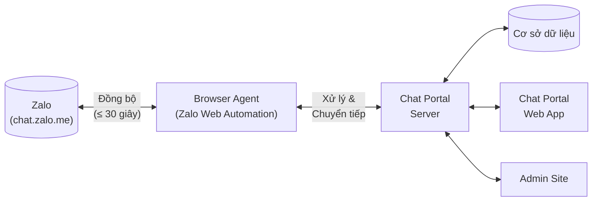
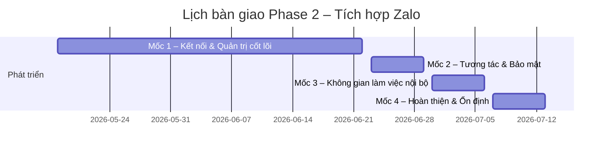

# PHỤ LỤC HỢP ĐỒNG
## Số: 02/PLHD

---

**Căn cứ Hợp đồng Kinh tế số:** 02/HDKT  
**Phiên bản tài liệu:** V1.0.0  
**Ngày ký kết dự kiến:** 14/05/2026

---

**BÊN A (Khách hàng):** Dương Chấn Lâm  
**BÊN B (Đơn vị phát triển):** Trương Gia Hồng

Hai bên thống nhất bổ sung phạm vi công việc cho dự án **QuocNam Web AI – Chat Portal** theo các điều khoản dưới đây.

---

## 1. BỐI CẢNH

### 1.1 Phase trước đã thực hiện

Phase đầu tiên của dự án đã thiết lập nền tảng vận hành nội bộ bao gồm:

- **Chat nội bộ** giữa các phòng ban và nhóm trong công ty.
- **Quản lý công việc** theo Loại việc đã được khởi tạo: tạo, giao và theo dõi tiến độ.
- **Giao việc và xử lý việc** dành cho Leader và Staff trên cả nền tảng Web và Mobile.
- **Nhật ký công việc** và quản lý tập tin đính kèm (Ảnh, Video, Tài liệu).

### 1.2 Nhu cầu nghiệp vụ dẫn đến Phase này

Trong hoạt động thực tế, một số nhân viên được chỉ định làm đầu mối liên hệ với nhà cung cấp (NCC/vendor) thông qua các nhóm chat Zalo cá nhân. Cấu trúc nhóm chat thường bao gồm: NCC, Tài khoản Zalo đại diện và Tài khoản Zalo admin.

Yêu cầu đặt ra:
- **Phía khách hàng:** nhiều nhân viên có thể cùng điều phối và phản hồi NCC thông qua một tài khoản Zalo đại diện duy nhất.
- **Phía NCC:** chỉ thấy danh tính của tài khoản Zalo đại diện, đảm bảo tính nhất quán và bảo mật nội bộ.

Việc tích hợp Zalo cá nhân vào Chat Portal giúp tập trung toàn bộ luồng trao đổi với NCC vào một nền tảng, đồng bộ dữ liệu, phân quyền linh hoạt và dễ dàng kiểm soát.

---

## 2. MỤC TIÊU

| Mục tiêu | Mô tả |
|-----------|-------|
| Đồng bộ tin nhắn | Đồng bộ toàn bộ tin nhắn và nhóm chat vendor từ Zalo về Chat Portal, lưu vào cơ sở dữ liệu theo cấu trúc hệ thống |
| Điều phối nhân viên | Phân quyền linh hoạt: nhân viên nào được đại diện tài khoản Zalo nào, vào nhóm chat nào |
| Kiểm soát nội dung | Watermark hình ảnh, phân quyền tải tập tin, cho phép admin xem tin nhắn đã thu hồi |
| Không gian làm việc | Giao việc nội bộ và ghi chú không hiển thị trên Zalo, chỉ hiển thị trong hệ thống nội bộ |

**Quy mô đội nhóm vendor:** 5–10 người dùng.
**Số tài khoản Zalo tích hợp:** Không giới hạn — Admin có thể liên kết thêm tài khoản Zalo cá nhân theo nhu cầu thực tế của doanh nghiệp.

---

## 3. PHẠM VI CÔNG VIỆC

### 3.1 Sơ đồ kiến trúc tổng quan

> **Giải thích:** Browser Agent chạy nền, đăng nhập vào `chat.zalo.me` bằng mã QR do Bên A cung cấp. Tin nhắn từ Zalo được đồng bộ về hệ thống trong vòng dưới 30 giây và ngược lại.

---

### 3.2 Danh sách chức năng

#### 3.2.1 Kết nối và đồng bộ Zalo

| # | Chức năng | Mô tả chi tiết |
|---|-----------|----------------|
| 1 | Kết nối tài khoản Zalo cá nhân | Admin quét mã QR từ `chat.zalo.me` để liên kết tài khoản Zalo vào hệ thống |
| 2 | Đồng bộ nhóm chat vendor | Tự động kéo về danh sách nhóm chat hiện có của tài khoản Zalo đã kết nối |
| 3 | Đồng bộ tin nhắn gần thực | Tin nhắn mới từ Zalo được cập nhật vào Chat Portal **thường trong vài giây, cam kết tối đa 30 giây** |
| 4 | Đồng bộ lịch sử chat | Đồng bộ toàn bộ lịch sử tin nhắn hiện có trong các nhóm chat tại thời điểm kết nối, bao gồm cả tin nhắn cũ trước ngày kết nối (trong phạm vi dữ liệu Zalo hiển thị trên giao diện web) |
| 27 | Kết nối lại và thử lại kết nối | Hệ thống tự động kết nối lại khi phát hiện mất kết nối (không cần thao tác thủ công). Khi tự động thất bại, cả **Staff và Admin** đều có thể nhấn nút "Thử lại kết nối" ngay trên Chat Portal mà không cần quét mã QR. Trường hợp phiên Zalo thực sự hết hạn, hệ thống thông báo rõ lý do và chỉ Admin mới có thể quét QR để khôi phục trong Admin Site |

> *Thời gian đồng bộ thực tế thường dưới 10 giây; 30 giây là ngưỡng cam kết tối đa trong điều kiện tải bình thường.*

---

#### 3.2.2 Nhắn tin và tương tác

| # | Chức năng | Mô tả chi tiết | Hiển thị trên Zalo |
|---|-----------|----------------|-------------------|
| 5 | Gửi/nhận tin nhắn văn bản | Nhân viên gửi tin từ Chat Portal, hiển thị dưới danh tính tài khoản Zalo đại diện | ✅ Có |
| 6 | Gửi/nhận hình ảnh, tập tin và video | Hỗ trợ hình ảnh, tài liệu và video không giới hạn kích thước. Thời gian đồng bộ video phụ thuộc vào kích thước file, có thể lâu hơn cam kết 30 giây của tin nhắn thông thường. File video vượt **300MB** sẽ kèm thông báo cảnh báo trong cửa sổ chat (chỉ hiển thị nội bộ) để admin theo dõi | ✅ Có |
| 7 | Reply tin nhắn | Trích dẫn và trả lời một tin nhắn cụ thể trong luồng hội thoại | ✅ Có |
| 8 | Thả cảm xúc (Like, Tim) | Tương tác cảm xúc trên tin nhắn, đồng bộ lên Zalo | ✅ Có |
| 9 | Thu hồi tin nhắn | Nhân viên có thể thu hồi tin nhắn đã gửi; Admin hệ thống vẫn thấy nội dung bị thu hồi | ✅ Có |
| 10 | Ghim tin nhắn | Ghim tin nhắn trong nhóm, đồng bộ thao tác ghim lên Zalo | ✅ Có |
| 11 | Forward tin nhắn đến Admin | Chuyển tiếp nội dung tin nhắn đến tài khoản admin trong hệ thống | ❌ Không |
| 25 | Đánh dấu tin nhắn | Nhân viên đánh dấu tin nhắn quan trọng để theo dõi. Chỉ hiển thị nội bộ trong Chat Portal, không đồng bộ lên Zalo | ❌ Không |

---

#### 3.2.3 Quản lý hội thoại

| # | Chức năng | Mô tả chi tiết |
|---|-----------|----------------|
| 12 | Ghim hội thoại | Nhân viên có thể ghim nhóm chat vendor lên đầu danh sách |
| 13 | Watermark hình ảnh | Hình ảnh được gắn watermark tự động khi xem ở chế độ preview trong hệ thống |
| 14 | Phân quyền tải tập tin | Admin cấu hình quyền tải tập tin (hình ảnh, tài liệu, video) theo từng nhóm chat. Không giới hạn kích thước tải xuống; file video vượt **300MB** hiển thị cảnh báo kèm thông tin dung lượng trước khi tải |
| 26 | Đặt tên hiển thị nhóm chat | Admin đặt lại tên hiển thị cho nhóm chat trong Chat Portal hoặc Admin Site. Tên gốc trên Zalo giữ nguyên, không đồng bộ thay đổi này lên Zalo |
| 28 | Ẩn số điện thoại trong hội thoại NCC | Admin bật/tắt tính năng ẩn số điện thoại theo từng nhóm NCC (**Admin Site** — trang Quản lý nhóm NCC). Khi bật: mọi số điện thoại Việt Nam xuất hiện trong tin nhắn của nhóm đó đều tự động bị che (hiển thị 2 chữ số đầu + dấu sao). Staff thấy số bị ẩn có thể nhấn icon mắt ngay trong cửa sổ chat để gửi yêu cầu xem số thật; hệ thống tạo system message ghi nhận yêu cầu. Admin vẫn thấy số thật kèm nhãn "Đang ẩn với nhóm" (**Chat Portal**) |
| 31 | Lọc hội thoại NCC theo thẻ phân loại | Nút **Phân loại** trong sidebar danh sách hội thoại (tab NCC) trên **Chat Portal**: chọn thẻ để lọc danh sách hội thoại NCC; có link nhanh "Quản lý thẻ phân loại" để mở modal. Bộ lọc tương tự cũng có trên trang Quản lý nhóm NCC (**Admin Site**): filter chips hiển thị tên và màu thẻ, nhấn để lọc bảng danh sách nhóm |

---

#### 3.2.4 Phân quyền người dùng

| # | Chức năng | Mô tả chi tiết |
|---|-----------|----------------|
| 15 | Phân quyền tài khoản Zalo | Admin phân quyền nhân viên nào được đại diện tài khoản Zalo nào (nhiều nhân viên có thể dùng chung một tài khoản Zalo) |
| 16 | Phân quyền nhóm chat | Admin chỉ định nhân viên nào được truy cập nhóm chat cụ thể |
| 17 | Cấu trúc vai trò trong nhóm | Chỉ có 3 vai trò: **Admin**, **Staff** (nhân viên nội bộ) và **Vendor** (NCC). Không phân biệt Leader/Trưởng phòng trong nhóm Zalo |

---

#### 3.2.5 Công việc nội bộ (không hiển thị trên Zalo)

| # | Chức năng | Mô tả chi tiết |
|---|-----------|----------------|
| 18 | Giao việc nội bộ trong nhóm | Nhân viên và Admin đều có thể tạo và giao việc cho bất kỳ thành viên nào trong nhóm chat. Không hiển thị lên Zalo |
| 19 | Nhật ký công việc | Ghi chú theo từng công việc, hỗ trợ theo dõi tiến độ và trao đổi nội bộ. Không hiển thị lên Zalo |

---

#### 3.2.6 Admin Site — Bổ sung chức năng quản trị

**Cấu trúc điều hướng:** Menu sidebar bổ sung mục **Nhà cung cấp** (gồm 2 tab: Liên kết tài khoản và Đồng bộ dữ liệu) và mục **Quản lý nhóm NCC** là mục riêng biệt trong sidebar.

| # | Chức năng | Mô tả chi tiết |
|---|-----------|----------------|
| 20 | Liên kết tài khoản Zalo *(Tab — menu Nhà cung cấp)* | Admin quét mã QR từ `chat.zalo.me` để thêm tài khoản Zalo cá nhân vào hệ thống. Với mỗi tài khoản đã liên kết, admin gán danh sách nhân viên được phép đại diện tài khoản đó. Admin có thể ngắt kết nối tài khoản khi cần |
| 21 | Đồng bộ dữ liệu *(Tab — menu Nhà cung cấp)* | Admin kích hoạt đồng bộ thủ công: kéo về danh sách nhóm chat và lịch sử tin nhắn cũ từ tài khoản Zalo đã liên kết. Dùng cho lần đầu liên kết hoặc sau thời gian dài hệ thống không hoạt động. Sau khi hoàn tất, hệ thống hiển thị báo cáo tóm tắt: tổng số tin nhắn, hình ảnh, tài liệu, video đã đồng bộ; tổng dung lượng ước tính; số lượng file video vượt ngưỡng 300MB. Tin nhắn mới thường xuyên được hệ thống tự động đồng bộ |
| 22 | Quản lý nhóm NCC *(Mục riêng trong sidebar)* | Hiển thị danh sách nhóm chat đã được đồng bộ từ các tài khoản Zalo liên kết. Admin thêm hoặc xóa nhân viên khỏi từng nhóm |
| 23 | Cập nhật quyền tải xuống theo nhóm chat | Trong form "Chỉnh sửa quyền tải xuống" của nhân viên: khi quyền tải xuống được **Bật**, hiển thị thêm danh sách các nhóm chat Zalo mà nhân viên đó đang được assign. Admin có thể Bật/Tắt quyền tải xuống riêng cho từng nhóm |
| 24 | Theo dõi file lớn *(Tab — menu Nhà cung cấp hoặc mục Quản lý nhóm NCC)* | Hiển thị danh sách các file video vượt ngưỡng 300MB đã được đồng bộ vào hệ thống, bao gồm: tên file, dung lượng, nhóm chat, thời điểm nhận. Giúp admin theo dõi xu hướng sử dụng và chủ động quản lý dung lượng server |
| 29 | Duyệt yêu cầu xem số điện thoại *(Trang Yêu cầu xem SDT — Admin Site)* | Hiển thị danh sách toàn bộ yêu cầu xem số điện thoại từ Staff. Admin duyệt hoặc từ chối từng yêu cầu; có thể thu hồi quyền đã cấp sau này. Khi duyệt: Staff thấy số thật với highlight cam; khi từ chối hoặc thu hồi: số bị ẩn lại. Hệ thống tạo system message ghi nhận từng thao tác duyệt/từ chối/thu hồi để phục vụ audit trail |
| 30 | Quản lý thẻ phân loại nhóm NCC *(Trang Quản lý nhóm NCC — Admin Site)* | Admin tạo, sửa, xóa và sắp xếp thứ tự thẻ phân loại qua modal quản lý; mỗi thẻ có tên và màu sắc (8 màu). Admin gắn thẻ cho từng nhóm NCC (single-select: mỗi nhóm chỉ gắn được 1 thẻ tại một thời điểm; click lại thẻ đang gắn để bỏ). Khi xóa thẻ, hệ thống tự động gỡ thẻ đó khỏi tất cả nhóm đang gắn. Hệ thống có sẵn 5 thẻ mặc định: Nhà sản xuất, Nhà phân phối, Nhà nhập khẩu, Dịch vụ, Thiết yếu |

---

### 3.3 Phạm vi loại trừ (Out of Scope)

Các hạng mục sau **không thuộc phạm vi** của phụ lục này:

| Hạng mục | Ghi chú |
|----------|---------|
| Zalo Official Account (OA) | Chỉ tích hợp Zalo cá nhân |
| Ứng dụng Mobile | Chỉ hỗ trợ nền tảng Web |
| Tích hợp CRM / ERP bên ngoài | Không kết nối hệ thống bên thứ ba |
| Cung cấp API cho bên thứ ba | Không mở API tích hợp ra ngoài |

---

## 4. YÊU CẦU PHI CHỨC NĂNG

| Yêu cầu | Thông số |
|---------|---------|
| Tần suất đồng bộ | Tin nhắn mới cập nhật trong vòng **≤ 30 giây** |
| Nền tảng hỗ trợ | Web (trình duyệt máy tính). Không hỗ trợ Mobile |
| Bảo mật nội dung hình ảnh | Watermark tự động trên hình ảnh khi xem preview |
| Kiểm soát nội dung thu hồi | Admin có thể xem lại nội dung tin nhắn đã thu hồi |
| Phương thức xác thực Zalo | Đăng nhập bằng mã QR từ `chat.zalo.me` do Bên A cung cấp |

---

## 5. LỊCH BÀN GIAO VÀ TIÊU CHÍ NGHIỆM THU

**Thời gian thực hiện:** 18/05/2026 – 16/07/2026 (8 tuần)

| Mốc | Giai đoạn | Thời gian thực hiện | Ngày bàn giao |
|-----|-----------|---------------------|---------------|
| **Mốc 1** | Kết nối & Quản trị cốt lõi | 18/05 – 22/06/2026 (5 tuần) | **22/06/2026** |
| **Mốc 2** | Tương tác & Bảo mật | 23/06 – 29/06/2026 (1 tuần) | **29/06/2026** |
| **Mốc 3** | Không gian làm việc nội bộ | 30/06 – 06/07/2026 (1 tuần) | **06/07/2026** |
| **Mốc 4** | Hoàn thiện & Ổn định | 07/07 – 13/07/2026 (1 tuần) | **13/07/2026** |

---

### Mốc 1 — 22/06/2026: Kết nối & Quản trị cốt lõi

**Tiêu chí nghiệm thu:** Bên B bàn giao và Bên A xác nhận hoàn thành toàn bộ các chức năng sau trên môi trường staging trước ngày nghiệm thu:

**Kết nối và đồng bộ Zalo**
- [#1] Kết nối tài khoản Zalo cá nhân thành công bằng mã QR
- [#2] Danh sách nhóm chat vendor từ Zalo được đồng bộ đầy đủ về Chat Portal
- [#3] Tin nhắn mới từ Zalo cập nhật lên Chat Portal trong vòng ≤ 30 giây
- [#4] Lịch sử tin nhắn cũ trước ngày kết nối được đồng bộ và hiển thị đúng theo từng nhóm chat

**Nhắn tin cơ bản**
- [#5] Gửi và nhận tin nhắn văn bản qua Chat Portal; tin hiển thị đúng danh tính tài khoản Zalo đại diện trên Zalo
- [#6] Gửi và nhận hình ảnh, tập tin và video hai chiều; file video vượt 300MB hiển thị cảnh báo nội bộ trong cửa sổ chat

**Phân quyền và vai trò**
- [#15] Nhiều nhân viên cùng đại diện một tài khoản Zalo; phân quyền hoạt động chính xác theo từng người
- [#16] Admin gán và thu hồi quyền truy cập nhóm chat theo từng nhân viên
- [#17] Hệ thống phân biệt đúng 3 vai trò: Admin, Staff, Vendor

**Admin Site — Quản trị Nhà cung cấp**
- [#20] Liên kết tài khoản Zalo: Admin quét mã QR thêm tài khoản, gán nhân viên đại diện và ngắt kết nối hoạt động đúng
- [#21] Đồng bộ dữ liệu thủ công: Admin kích hoạt đồng bộ; hệ thống kéo về đầy đủ danh sách nhóm chat và lịch sử tin nhắn cũ; báo cáo tóm tắt sau đồng bộ hiển thị đúng (số lượng, dung lượng, file video > 300MB)
- [#22] Quản lý nhóm NCC: Danh sách nhóm đã đồng bộ hiển thị đúng; thao tác thêm và xóa nhân viên khỏi nhóm hoạt động chính xác

**Kết nối và khôi phục**
- [#27] Hệ thống tự động kết nối lại khi mất kết nối; nút "Thử lại kết nối" hoạt động cho cả Staff và Admin trên Chat Portal; thông báo rõ lý do khi cần quét QR mới

---

### Mốc 2 — 29/06/2026: Tương tác & Bảo mật

**Tiêu chí nghiệm thu:** Bên B bàn giao và Bên A xác nhận hoàn thành toàn bộ các chức năng sau:

**Tương tác tin nhắn nâng cao**
- [#7] Reply tin nhắn: trích dẫn và phản hồi đúng luồng, đồng bộ lên Zalo
- [#8] Thả cảm xúc (Like, Tim) đồng bộ lên Zalo, hiển thị đúng trên Chat Portal
- [#9] Thu hồi tin nhắn: nhân viên thu hồi được; Admin xem lại được nội dung đã thu hồi
- [#10] Ghim tin nhắn trong nhóm và đồng bộ thao tác ghim lên Zalo

**Quản lý hội thoại và bảo mật nội dung**
- [#12] Ghim hội thoại: nhân viên ghim nhóm chat vendor lên đầu danh sách
- [#13] Watermark tự động được gắn lên hình ảnh khi xem ở chế độ preview trong hệ thống
- [#14] Phân quyền tải tập tin theo nhóm chat (hình ảnh, tài liệu, video); file video > 300MB hiển thị cảnh báo kèm dung lượng trước khi tải
- [#26] Đặt tên hiển thị nhóm chat: Admin đổi tên thành công trong Chat Portal và Admin Site; tên gốc trên Zalo không thay đổi

**Admin Site — Quyền tải xuống và theo dõi file lớn**
- [#23] Form "Chỉnh sửa quyền tải xuống": khi quyền tải xuống được Bật, hiển thị danh sách nhóm chat Zalo của nhân viên; Admin Bật/Tắt quyền tải xuống riêng cho từng nhóm
- [#24] Danh sách file video vượt 300MB hiển thị đúng (tên file, dung lượng, nhóm chat, thời điểm nhận); Admin theo dõi và quản lý được

---

### Mốc 3 — 06/07/2026: Không gian làm việc nội bộ

**Tiêu chí nghiệm thu:** Bên B bàn giao và Bên A xác nhận hoàn thành toàn bộ các chức năng sau:

- [#11] Forward tin nhắn đến Admin: nội dung chuyển tiếp chính xác, không hiển thị trên Zalo
- [#18] Giao việc nội bộ trong nhóm chat: nhân viên và Admin tạo và giao việc cho bất kỳ thành viên nào trong nhóm, không hiển thị trên Zalo
- [#19] Nhật ký công việc: ghi chú gắn đúng với từng công việc, hỗ trợ theo dõi tiến độ nội bộ
- [#25] Đánh dấu tin nhắn: nhân viên đánh dấu và xem lại tin nhắn quan trọng; chỉ hiển thị nội bộ, không lên Zalo

---

### Mốc 4 — 13/07/2026: Hoàn thiện & Bàn giao chính thức

**Tiêu chí nghiệm thu:**

- Toàn bộ 27 chức năng từ Mốc 1 đến Mốc 3 hoạt động ổn định trên môi trường production
- Không còn lỗi nghiêm trọng (Critical) hoặc lỗi cao (High) chưa được xử lý
- Bàn giao đầy đủ: tài liệu hướng dẫn sử dụng dành cho nhân viên và Admin; thông tin thiết lập, cấu hình và truy cập hệ thống

---

## 6. SẢN PHẨM BÀN GIAO

| Hạng mục | Mô tả |
|----------|-------|
| Mã nguồn | Source code phần tích hợp Zalo tích hợp vào hệ thống hiện có |
| Tài liệu hướng dẫn sử dụng | Hướng dẫn dành cho nhân viên và admin |
| Thông tin thiết lập hệ thống | Hướng dẫn cài đặt, cấu hình và thông tin truy cập |

---

## 7. LƯU Ý KỸ THUẬT VỀ PHƯƠNG THỨC TÍCH HỢP

Hệ thống tích hợp với Zalo thông qua giao diện web `chat.zalo.me`, sử dụng phiên đăng nhập do **Bên A** thiết lập bằng mã QR. Phương thức này phản ánh đúng hành vi sử dụng thông thường của người dùng — không gửi tin hàng loạt, không thu thập dữ liệu ngoài phạm vi nhóm chat được chỉ định, và chỉ tương tác với các tài khoản trong danh sách đã kết nối.

### Các tình huống mất kết nối và cách xử lý

| Tình huống | Cần quét QR? | Ai xử lý? | Mô tả |
|------------|:------------:|-----------|-------|
| Mạng bị gián đoạn tạm thời | ❌ Không | Hệ thống tự xử lý | Tự động kết nối lại khi mạng ổn định |
| Browser Agent bị gián đoạn | ❌ Không | Hệ thống tự xử lý | Khôi phục phiên tự động nếu session còn hạn |
| Kết nối không ổn định | ❌ Không | Staff hoặc Admin | Nhấn nút "Thử lại kết nối" trên Chat Portal |
| Phiên Zalo hết hạn (thường sau 30 ngày không hoạt động) | ✅ Cần QR | Chỉ Admin | Admin quét QR mới trong Admin Site; hệ thống thông báo rõ lý do |
| Ai đó đăng nhập Zalo trên thiết bị khác làm hết phiên | ✅ Cần QR | Chỉ Admin | Tương tự trên; khuyến nghị không đăng nhập Zalo đại diện trên thiết bị cá nhân |

> *Phần lớn tình huống mất kết nối trong thực tế không yêu cầu quét QR lại. Việc quét QR chỉ cần thiết khi phiên Zalo thực sự hết hạn — trường hợp này xảy ra không thường xuyên nếu hệ thống hoạt động liên tục.*

Trong trường hợp Zalo cập nhật giao diện kỹ thuật dẫn đến gián đoạn, **Bên B cam kết** điều chỉnh hệ thống để khôi phục hoạt động ổn định trong phạm vi bảo hành theo Hợp đồng Kinh tế số 02/HDKT.

Bằng việc ký kết phụ lục này, **Bên A xác nhận** đã được thông báo về phương thức tích hợp và đồng ý triển khai theo hướng tiếp cận kỹ thuật nêu trên.

---

## 8. QUY ĐỊNH CHUNG

- Các điều khoản về chi phí, thanh toán, bảo hành và trách nhiệm các bên được quy định tại **Hợp đồng Kinh tế số 02/HDKT** và có hiệu lực áp dụng cho phụ lục này.
- Mọi thay đổi về phạm vi ngoài tài liệu này cần lập **Biên bản thay đổi yêu cầu (Change Request)** được hai bên ký xác nhận trước khi thực hiện.
- Phụ lục này có hiệu lực kể từ ngày ký và là một phần không tách rời của Hợp đồng Kinh tế số 02/HDKT.

---

## 9. KÝ KẾT

*Phụ lục này được lập thành 02 bản có giá trị pháp lý như nhau, mỗi bên giữ 01 bản.*

&nbsp;

| **BÊN A** | **BÊN B** |
|-----------|-----------|
| *(Khách hàng)* | *(Đơn vị phát triển)* |
| &nbsp; | &nbsp; |
| &nbsp; | &nbsp; |
| &nbsp; | &nbsp; |
| **Dương Chấn Lâm** | **Trương Gia Hồng** |
| Ngày: &nbsp;&nbsp;&nbsp;&nbsp; / &nbsp;&nbsp;&nbsp;&nbsp; / 2026 | Ngày: &nbsp;&nbsp;&nbsp;&nbsp; / &nbsp;&nbsp;&nbsp;&nbsp; / 2026 |

---

*Tài liệu phiên bản V1.1.0 — Cập nhật lần cuối: 13/05/2026*
