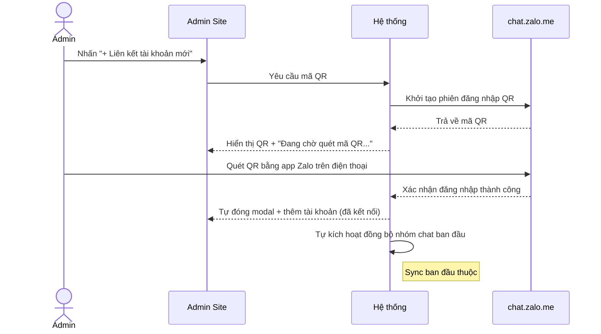
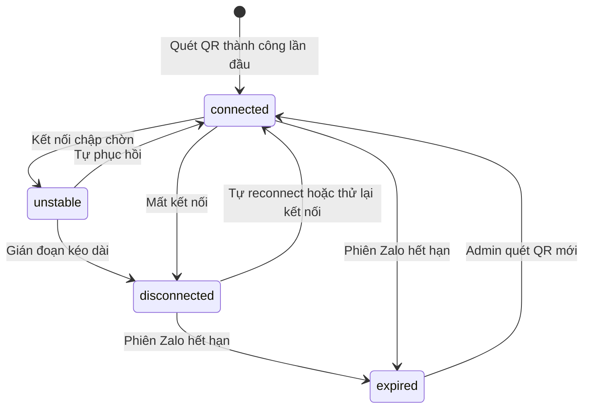

# #1 — Kết Nối Tài Khoản Zalo Cá Nhân (Admin Site)

> **Trạng thái:** draft
> **Nguồn:** [`../scope-and-features.md § A` (#1)](../scope-and-features.md) (canonical) · [`../FSD-Admin-Site.md § 2.2`](../FSD-Admin-Site.md) (phần kết nối QR)
> **Liên quan:** [`#20 — Liên kết & quản lý danh sách tài khoản`](../FSD-Admin-Site.md) · [`#15 — Gán nhân viên đại diện`](../FSD-Admin-Site.md) · [`#21 — Đồng bộ dữ liệu`](../FSD-Admin-Site.md) · [`#27 — Kết nối lại & thử lại kết nối`](../FSD-Admin-Site.md)

---

## 📌 Tóm tắt 1 dòng

Quản trị viên quét mã QR từ `chat.zalo.me` trên Admin Site để liên kết một tài khoản Zalo cá nhân vào hệ thống, biến nó thành danh tính đại diện công ty trong các nhóm chat nhà cung cấp.

---

## 🎯 Giá trị nghiệp vụ

Trong vận hành thực tế, nhân viên liên hệ với nhà cung cấp (NCC) qua các nhóm chat Zalo cá nhân. Để đưa toàn bộ các nhóm này vào Chat Portal — đồng bộ tin nhắn, phân quyền, kiểm soát nội dung tập trung — trước hết hệ thống cần "mượn" được danh tính của một tài khoản Zalo cá nhân làm đại diện công ty.

Tính năng này là **cửa ngõ đầu tiên** của toàn bộ Phase 2: chưa có tài khoản Zalo nào được liên kết thì không có nhóm chat nào để đồng bộ, không có gì để phân quyền. Quản trị viên mở một mã QR ngay trên Admin Site, dùng app Zalo trên điện thoại quét như đăng nhập Zalo Web thông thường; sau khi quét thành công, hệ thống tự động kéo về danh sách nhóm chat và lịch sử tin nhắn cũ.

Việc liên kết được giới hạn ở **Quản trị viên** và chỉ thực hiện trên **Admin Site** — nhân viên không tự ý gắn tài khoản, đảm bảo kiểm soát tập trung danh tính đại diện.

**Lợi ích:**

- Mở khoá toàn bộ luồng đồng bộ Zalo chỉ bằng một thao tác quét QR quen thuộc.
- Quản trị viên kiểm soát tập trung những tài khoản Zalo nào được đưa vào hệ thống.
- Không cần lưu mật khẩu Zalo — dùng cơ chế phiên đăng nhập qua QR như Zalo Web.

---

## 👥 Vai trò liên quan

| Vai trò | Trách nhiệm |
| --- | --- |
| **Quản trị (Admin)** | Người duy nhất được liên kết tài khoản. Mở modal QR, dùng điện thoại quét, xác nhận liên kết. Cũng là người duy nhất được quét QR mới khi phiên hết hạn. |
| **Nhân viên (Staff)** | **Không** có quyền truy cập thao tác này. Chỉ làm việc trên Chat Portal sau khi tài khoản đã được liên kết. |
| **Hệ thống** | Sinh mã QR · Lắng nghe sự kiện quét thành công từ `chat.zalo.me` · Tự đóng modal và tạo bản ghi tài khoản (trạng thái đã kết nối) · Tự kích hoạt đồng bộ nhóm chat ban đầu · Quản lý vòng đời trạng thái kết nối của phiên. |

---

## 🔄 Dòng chảy nghiệp vụ

### Luồng liên kết tài khoản qua QR



### Vòng đời trạng thái kết nối



> Việc tự reconnect và nút "Thử lại kết nối" thuộc tính năng [#27](../FSD-Admin-Site.md). Sơ đồ trên chỉ minh hoạ tài khoản vừa liên kết ở #1 sẽ đi qua những trạng thái nào, và khi `expired` thì phải quét QR mới (dùng lại đúng modal của #1).

---

## ✅ Kịch bản chấp nhận

```gherkin
# language: vi
Tính năng: Quản trị viên liên kết tài khoản Zalo cá nhân bằng mã QR

  Bối cảnh:
    Biết Quản trị viên đã đăng nhập Admin Site
    Và đang ở trang "Nhà Cung Cấp" tab "Liên kết tài khoản"

  # =====================================================
  # Mở modal QR
  # =====================================================

  Tình huống: Mở modal liên kết tài khoản mới
    Khi Quản trị viên nhấn "+ Liên kết tài khoản mới"
    Thì hệ thống mở modal "Liên kết tài khoản Zalo mới"
    Và modal hiển thị hướng dẫn "Mở ứng dụng Zalo trên điện thoại, chọn Quét mã QR và hướng camera vào mã bên dưới"
    Và modal hiển thị khu vực mã QR
    Và modal hiển thị trạng thái "Đang chờ quét mã QR..." kèm icon loading
    Và modal có nút "Huỷ"

  Tình huống: Huỷ modal trước khi quét
    Biết modal "Liên kết tài khoản Zalo mới" đang mở
    Khi Quản trị viên nhấn "Huỷ"
    Thì modal đóng lại
    Và không có tài khoản mới nào được thêm vào danh sách

  # =====================================================
  # Quét QR thành công
  # =====================================================

  Tình huống: Quét QR thành công thì tài khoản được liên kết
    Biết modal QR đang mở và hiển thị "Đang chờ quét mã QR..."
    Khi tài khoản Zalo được quét và xác nhận thành công ở chat.zalo.me
    Thì modal tự động đóng
    Và một dòng tài khoản mới xuất hiện trong bảng với trạng thái "connected" (đã kết nối)
    Và dòng hiển thị avatar, tên hiển thị, số điện thoại (nếu có), và thời điểm liên kết

  Tình huống: Hệ thống tự đồng bộ nhóm chat ngay sau khi liên kết
    Biết một tài khoản vừa được liên kết thành công
    Khi quá trình liên kết hoàn tất
    Thì hệ thống tự kích hoạt đồng bộ nhóm chat ban đầu cho tài khoản đó
    Và Quản trị viên không cần nhấn "Đồng bộ ngay" thủ công cho lần đầu

  # =====================================================
  # Badge trạng thái kết nối
  # =====================================================

  Khung tình huống: Badge trạng thái hiển thị đúng màu theo từng trạng thái
    Biết một tài khoản có trạng thái "<trang_thai>"
    Thì badge trạng thái hiển thị nhãn "<nhan>" với màu "<mau>"

    Dữ liệu:
      | trang_thai   | nhan            | mau                  |
      | connected    | Đã kết nối      | xanh                 |
      | unstable     | Không ổn định   | vàng/hổ phách        |
      | disconnected | Mất kết nối     | đỏ                   |
      | expired      | Hết hạn phiên   | đỏ kèm icon khoá     |

  # =====================================================
  # Kết nối lại bằng QR (tài khoản lỗi/hết hạn)
  # =====================================================

  Tình huống: Tài khoản hết hạn phiên thì hiển thị nút Kết nối lại
    Biết một tài khoản đang ở trạng thái "expired" (hết hạn phiên)
    Thì dòng tài khoản đó hiển thị nút "Kết nối lại" thay cho nút "Ngắt kết nối"

  Tình huống: Quét QR mới để kết nối lại tài khoản đã hết hạn
    Biết một tài khoản đang ở trạng thái "expired"
    Khi Quản trị viên nhấn "Kết nối lại" trên dòng đó
    Thì hệ thống mở modal QR giống luồng liên kết mới nhưng đã điền sẵn thông tin tài khoản cũ
    Khi tài khoản được quét và xác nhận thành công ở chat.zalo.me
    Thì trạng thái tài khoản trở về "connected"

  # =====================================================
  # Phân quyền
  # =====================================================

  Tình huống: Nhân viên không có quyền liên kết tài khoản
    Biết người dùng đăng nhập với vai trò Nhân viên
    Thì người dùng không truy cập được trang "Nhà Cung Cấp" trên Admin Site
    Và không thấy nút "+ Liên kết tài khoản mới"

  # =====================================================
  # Trường hợp đặc biệt
  # =====================================================

  Tình huống: Tài khoản hết hạn ngay khi modal QR đang mở
    Biết modal QR đang mở để liên kết hoặc kết nối lại
    Khi phiên Zalo hết hạn trước khi Quản trị viên quét xong
    Thì hệ thống hiển thị thông báo lỗi ngay trong modal
    Và vẫn cho phép quét lại mã QR

  Tình huống: Chưa có tài khoản Zalo nào được liên kết
    Biết hệ thống chưa có tài khoản Zalo nào
    Khi Quản trị viên mở tab "Liên kết tài khoản"
    Thì tab hiển thị trạng thái rỗng với nút kêu gọi "Liên kết tài khoản Zalo đầu tiên"
```

---

## 🎨 Mô tả giao diện

### Vị trí

Admin Site → menu **"Quản Lý NCC"** → trang **"Nhà Cung Cấp"** → **Tab 1: Liên kết tài khoản**. Nút **"+ Liên kết tài khoản mới"** nằm ở góc trên phải của tab.

### Modal "Liên kết tài khoản Zalo mới"

```
┌──────────────────────────────────────────────┐
│  Liên kết tài khoản Zalo mới             [ × ] │
├──────────────────────────────────────────────┤
│  Mở ứng dụng Zalo trên điện thoại, chọn       │
│  Quét mã QR và hướng camera vào mã bên dưới.  │
│                                                │
│            ┌────────────────┐                  │
│            │                │                  │
│            │    [ QR code ]  │                 │
│            │                │                  │
│            └────────────────┘                  │
│                                                │
│         ⟳  Đang chờ quét mã QR...              │
│                                                │
│                              [ Huỷ ]           │
└──────────────────────────────────────────────┘
```

| Thành phần | Nội dung | Ghi chú |
| --- | --- | --- |
| Tiêu đề | "Liên kết tài khoản Zalo mới" | |
| Hướng dẫn | Văn bản 1 dòng hướng dẫn quét QR bằng app Zalo | |
| Khu vực QR | Mã QR do hệ thống sinh | Cần cơ chế làm mới khi hết hạn — xem Q&A |
| Trạng thái | "Đang chờ quét mã QR..." + icon loading | Đổi sang thông báo lỗi inline nếu phiên lỗi |
| Nút Huỷ | Đóng modal, không tạo tài khoản | |

### Dòng tài khoản trong bảng (sau khi liên kết)

| Cột | Nội dung |
| --- | --- |
| Avatar + Tên hiển thị | Lấy từ tài khoản Zalo vừa liên kết |
| Số điện thoại | Hiển thị nếu Zalo trả về (xem Q&A) |
| Thời điểm liên kết | Mốc thời gian quét thành công |
| Trạng thái | Badge `connected` / `unstable` / `disconnected` / `expired` (xem bảng "Badge trạng thái" trong Kịch bản chấp nhận) |
| Thao tác | `connected`/`unstable` → "Ngắt kết nối"; `disconnected`/`expired` → "Kết nối lại" |

> Cột "Nhân viên đại diện" và thao tác gán nhân viên thuộc tính năng [#15](../FSD-Admin-Site.md), không mô tả tại đây.

### Mockup tham chiếu

> ✅ **Đã có:**
> - Modal "Liên kết tài khoản Zalo mới" với khu vực QR + trạng thái "Đang chờ quét...".
> - Bảng danh sách tài khoản đã liên kết với badge trạng thái.
>
> ⏳ **Cần BA bổ sung:**
> - Trạng thái lỗi inline trong modal khi phiên hết hạn / QR hết hạn.
> - Trạng thái rỗng "Liên kết tài khoản Zalo đầu tiên".
> - Modal QR ở chế độ "Kết nối lại" (đã điền sẵn thông tin tài khoản cũ).

---

## 🔗 Tham chiếu & Q&A

### Liên quan các phần khác

- [`#20 Liên kết & danh sách tài khoản (Admin Site)`](../FSD-Admin-Site.md): bảng danh sách tài khoản đã liên kết, các cột và thao tác trên row. Tính năng #1 chỉ là **hành vi quét QR để thêm/kết nối lại** một dòng vào bảng đó.
- [`#15 Gán nhân viên đại diện`](../FSD-Admin-Site.md): sau khi liên kết, Quản trị viên gán danh sách nhân viên được phép đại diện tài khoản. Không thuộc #1.
- [`#21 Đồng bộ dữ liệu`](../FSD-Admin-Site.md): sync nhóm chat + lịch sử tin nhắn — được #1 tự kích hoạt lần đầu sau khi liên kết, sau đó chạy thủ công ở tab này.
- [`#27 Kết nối lại & thử lại kết nối`](../FSD-Admin-Site.md): luồng tự reconnect và nút "Thử lại kết nối" (cả trên Chat Portal). #1 chỉ phụ trách phần **quét QR mới** khi phiên thực sự hết hạn.

### ⚠️ Q&A cần BA / PO làm rõ

1. **Mã QR có thời hạn (TTL) không? Khi QR hết hạn mà Admin chưa quét thì xử lý ra sao?**
   - Tài liệu nguồn chỉ mô tả "đang chờ quét" và lỗi "phiên hết hạn", chưa nói rõ QR có tự làm mới sau N giây hay không.
   - Phương án A: QR tự làm mới định kỳ (ví dụ mỗi 60–120s) khi Admin chưa quét.
   - Phương án B: QR đứng yên đến khi lỗi rồi yêu cầu Admin bấm "Tạo mã mới".
   - **Pilot hiện đang theo:** chưa quyết. Cần BA/PO xác nhận hành vi làm mới QR.

2. **Số điện thoại của tài khoản Zalo — khi nào có, khi nào không?**
   - Bảng tài khoản hiển thị "số điện thoại (nếu có)". Cần làm rõ điều kiện Zalo trả về số (tuỳ cấu hình quyền riêng tư của tài khoản đó).
   - **Pilot hiện đang theo:** hiển thị nếu có, để trống nếu không. Cần BA xác nhận có cần bắt buộc không.

3. **Có chặn liên kết trùng một tài khoản Zalo đã được liên kết trước đó không?**
   - Nếu Admin quét QR bằng một tài khoản Zalo đã tồn tại trong hệ thống → nên coi là "kết nối lại" tài khoản cũ hay tạo bản ghi mới?
   - Liên quan dedupe nhóm chat tại [`scope-and-features.md § D.4`](../scope-and-features.md) (nhiều account cùng nhóm), nhưng việc trùng **chính tài khoản** chưa được spec.
   - **Pilot hiện đang theo:** chưa quyết. Cần BA/PO xác nhận cách xử lý quét trùng tài khoản.

4. **Ranh giới #1 vs #27 cho luồng "Kết nối lại".**
   - Nút "Kết nối lại" mở lại đúng modal QR của #1, nhưng bản thân việc phát hiện `expired`/`disconnected` và nút "Thử lại kết nối" lại thuộc #27.
   - **Pilot hiện đang theo:** FSD này mô tả phần **quét QR mới**; mọi logic auto-retry / banner trạng thái để ở #27. Cần BA xác nhận cách tách tài liệu này có hợp lý không.

5. **Link "(Demo) Giả lập quét QR thành công" — xác nhận loại bỏ khỏi production.**
   - Bản demo có link bypass quét QR thật. Tài liệu nguồn đã ghi rõ "không đưa vào production".
   - **Pilot hiện đang theo:** loại bỏ hoàn toàn ở production. Ghi nhận để QC kiểm tra link này không xuất hiện.
