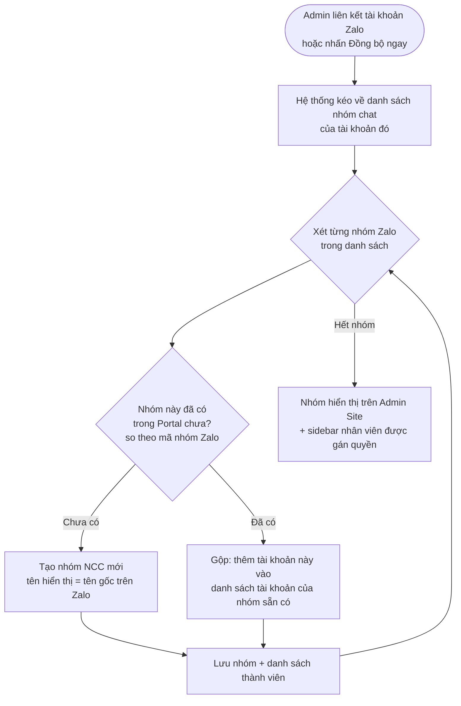

# #2 — Đồng Bộ Nhóm Chat Vendor

> **Trạng thái:** draft
> **Nguồn:** [`../scope-and-features.md § A.2`](../scope-and-features.md) (canonical) · [`../FSD-Admin-Site.md § 2.3`](../FSD-Admin-Site.md) · [`../FSD-Chat-Portal.md § 2`](../FSD-Chat-Portal.md)
> **Liên quan:** [`#1 — Kết nối tài khoản Zalo`](01-ket-noi-tai-khoan-zalo.md) · Multi-account (D.4) · #22 Quản lý nhóm NCC · #26 Đổi tên hiển thị nhóm

---

## 📌 Tóm tắt 1 dòng

Khi Admin liên kết hoặc đồng bộ một tài khoản Zalo, hệ thống tự động kéo toàn bộ danh sách nhóm chat của tài khoản đó về Portal — gộp các nhóm trùng (cùng một nhóm Zalo do nhiều tài khoản cùng tham gia) thành một nhóm NCC duy nhất.

---

## 🎯 Giá trị nghiệp vụ

Trong vận hành thực tế, các nhóm chat với nhà cung cấp (NCC) nằm rải rác trong nhiều tài khoản Zalo cá nhân của công ty. Một NCC thường được điều phối qua một hoặc vài tài khoản Zalo đại diện, và **cùng một nhóm chat Zalo có thể có mặt cả hai tài khoản đại diện** trong đó. Nếu kéo dữ liệu một cách máy móc, cùng một nhóm sẽ bị nhân đôi trong Portal — gây rối, trùng hội thoại, khó quản lý.

Tính năng này tự động hóa việc đưa nhóm chat NCC vào Portal: chỉ cần Admin liên kết tài khoản (hoặc bấm đồng bộ thủ công), hệ thống lấy về toàn bộ danh sách nhóm hiện có. Quan trọng nhất, hệ thống **nhận biết khi nhiều tài khoản cùng tham gia một nhóm Zalo và gộp chúng lại thành một nhóm NCC duy nhất** — thay vì tạo nhiều bản trùng. Nhờ đó mọi nhân viên đại diện đều làm việc trên cùng một cửa sổ hội thoại nhất quán.

**Lợi ích:**

- Không phải thêm nhóm thủ công — danh sách nhóm tự xuất hiện sau khi liên kết tài khoản.
- Không có nhóm trùng: một nhóm Zalo luôn ứng với đúng một nhóm NCC trong Portal, dù có bao nhiêu tài khoản cùng tham gia.
- Là nền tảng cho mọi tính năng phía sau (nhắn tin, phân quyền, ẩn SĐT…) — tất cả đều thao tác trên nhóm NCC đã đồng bộ.

---

## 👥 Vai trò liên quan

| Vai trò | Trách nhiệm |
| --- | --- |
| **Quản trị (Admin)** | Kích hoạt đồng bộ: liên kết tài khoản mới (tự động chạy lần đầu) hoặc bấm "Đồng bộ ngay" trên Admin Site. Xem danh sách nhóm đã đồng bộ trên trang Quản lý nhóm NCC. |
| **Nhân viên (Staff)** | Không kích hoạt đồng bộ. Sau khi nhóm được đồng bộ và được Admin gán quyền, nhóm xuất hiện trong sidebar NCC của nhân viên. |
| **Nhà cung cấp (Vendor)** | Không liên quan — chỉ tồn tại trong nhóm chat trên Zalo, không biết tới việc đồng bộ. |
| **Hệ thống** | Kéo danh sách nhóm + danh sách thành viên của từng nhóm về từ Zalo · Nhận biết và gộp các nhóm trùng (cùng một nhóm Zalo) · Lưu trữ và hiển thị kết quả lên Admin Site và sidebar nhân viên. |

---

## 🔄 Dòng chảy nghiệp vụ



---

## ✅ Kịch bản chấp nhận

```gherkin
# language: vi
Tính năng: Đồng bộ danh sách nhóm chat vendor từ tài khoản Zalo về Portal

  Bối cảnh:
    Biết Admin đã liên kết ít nhất một tài khoản Zalo (xem #1)
    Và tài khoản đó đang ở trạng thái kết nối "connected" (đã kết nối)

  # =====================================================
  # Kích hoạt đồng bộ
  # =====================================================

  Tình huống: Tự động đồng bộ ngay sau khi liên kết tài khoản mới
    Biết Admin vừa quét QR liên kết một tài khoản Zalo mới thành công
    Khi việc liên kết hoàn tất
    Thì hệ thống tự kích hoạt đồng bộ danh sách nhóm chat của tài khoản đó
    Và Admin không cần thao tác gì thêm để khởi động lần đồng bộ đầu tiên

  Tình huống: Admin đồng bộ thủ công từ tab Đồng bộ dữ liệu
    Biết Admin đang ở tab "Đồng bộ dữ liệu" trên trang Nhà Cung Cấp
    Khi Admin nhấn "Đồng bộ ngay" trên card của một tài khoản
    Thì hệ thống kéo lại danh sách nhóm chat của tài khoản đó
    Và sau khi hoàn tất hiển thị thông báo tóm tắt số nhóm và số tin đã đồng bộ

  Tình huống: Không cho đồng bộ khi tài khoản đang mất kết nối
    Biết một tài khoản Zalo đang ở trạng thái "disconnected" (mất kết nối) hoặc "expired" (hết phiên)
    Khi Admin xem card của tài khoản đó
    Thì nút "Đồng bộ ngay" bị vô hiệu hoá
    Và khi rê chuột vào nút, tooltip giải thích lý do không đồng bộ được

  # =====================================================
  # Kết quả đồng bộ
  # =====================================================

  Tình huống: Nhóm mới xuất hiện trên Admin Site sau khi đồng bộ
    Biết tài khoản Zalo có một nhóm chat chưa từng được đồng bộ
    Khi lần đồng bộ hoàn tất
    Thì nhóm đó xuất hiện trong bảng "Quản lý nhóm NCC"
    Và tên hiển thị của nhóm mặc định bằng tên gốc trên Zalo
    Và cột "Tài khoản" hiển thị tài khoản vừa đồng bộ nhóm này

  Tình huống: Nhân viên được gán quyền thấy nhóm trong sidebar
    Biết một nhóm NCC vừa được đồng bộ
    Và Admin đã gán nhân viên "Tăng Thị Huyền" vào nhóm đó (xem #16)
    Khi nhân viên "Tăng Thị Huyền" mở Chat Portal
    Thì nhóm đó xuất hiện trong sidebar tab NCC của nhân viên

  Tình huống: Nhân viên chưa được gán quyền không thấy nhóm
    Biết một nhóm NCC vừa được đồng bộ
    Và nhân viên "Lê Diễm Chi" chưa được gán vào nhóm đó
    Khi nhân viên "Lê Diễm Chi" mở Chat Portal
    Thì nhóm đó không xuất hiện trong sidebar của nhân viên

  Tình huống: Danh sách thành viên của nhóm được đồng bộ kèm theo
    Biết một nhóm Zalo có các thành viên là vendor và tài khoản đại diện
    Khi nhóm được đồng bộ về Portal
    Thì danh sách thành viên của nhóm được lưu lại
    Và danh sách này dùng làm nguồn cho picker @mention trong nhóm (xem [EXTRA] mention)

  # =====================================================
  # Gộp nhóm trùng (dedupe) khi nhiều tài khoản cùng một nhóm
  # =====================================================

  Tình huống: Hai tài khoản cùng một nhóm Zalo được gộp thành một nhóm NCC
    Biết tài khoản "Quốc Nam - Vận Hành" và tài khoản "Quốc Nam - Kho Hàng" cùng có mặt trong nhóm Zalo "Vận Chuyển Phương Nam"
    Và cả hai tài khoản đều đã được liên kết và đồng bộ
    Khi hệ thống đồng bộ xong cả hai tài khoản
    Thì trong Portal chỉ có một nhóm NCC "Vận Chuyển Phương Nam"
    Và cột "Tài khoản" của nhóm đó hiển thị cả hai tài khoản

  Tình huống: Đồng bộ tài khoản thứ hai không tạo nhóm trùng
    Biết nhóm NCC "Vận Chuyển Phương Nam" đã tồn tại trong Portal qua tài khoản "Quốc Nam - Vận Hành"
    Khi Admin liên kết và đồng bộ tài khoản "Quốc Nam - Kho Hàng" cũng nằm trong nhóm Zalo đó
    Thì hệ thống không tạo nhóm NCC mới
    Và tài khoản "Quốc Nam - Kho Hàng" được thêm vào danh sách tài khoản của nhóm sẵn có

  Tình huống: Tin nhắn không bị nhân đôi khi hai tài khoản cùng kéo một nhóm
    Biết một nhóm Zalo được đồng bộ bởi hai tài khoản đã liên kết
    Khi cùng một tin nhắn được kéo về từ cả hai tài khoản
    Thì trong Portal tin đó chỉ hiển thị một lần (không trùng lặp)

  Khung tình huống: Cột "Tài khoản" hiển thị badge theo số lượng tài khoản đang đồng bộ
    Biết một nhóm NCC có "<so_tai_khoan>" tài khoản đang đồng bộ
    Thì cột "Tài khoản" của nhóm đó "<cach_hien_thi>"

    Dữ liệu:
      | so_tai_khoan | cach_hien_thi                                                  |
      | 1            | hiện đầy đủ tên tài khoản                                       |
      | 2            | hiện đầy đủ cả hai tài khoản                                    |
      | 3 trở lên    | hiện 2 tài khoản đầu + chip "+N" có tooltip liệt kê phần còn lại |

  # =====================================================
  # Phạm vi đồng bộ
  # =====================================================

  Tình huống: Đồng bộ nhóm là bước riêng, không thay thế đồng bộ tin nhắn
    Biết một nhóm vừa được đồng bộ danh sách về Portal
    Khi Admin mở nhóm đó lần đầu
    Thì nhóm hiển thị trong danh sách dù nội dung tin nhắn cũ có thể đang được kéo dần (xem #3, #4)

  # =====================================================
  # Trường hợp đặc biệt
  # =====================================================

  Tình huống: Tài khoản không có nhóm chat nào
    Biết một tài khoản Zalo vừa liên kết nhưng không tham gia nhóm chat nào
    Khi đồng bộ hoàn tất
    Thì không có nhóm NCC nào được tạo từ tài khoản đó
    Và thông báo tóm tắt ghi nhận "0 nhóm" cho tài khoản đó

  Tình huống: Đồng bộ thất bại giữa chừng
    Biết Admin đang đồng bộ một tài khoản
    Khi quá trình đồng bộ bị gián đoạn (mất mạng hoặc Zalo chặn)
    Thì hệ thống hiển thị thông báo "Đồng bộ thất bại" kèm lý do và nút "Thử lại"
    Và các nhóm đã kéo về thành công trước khi lỗi vẫn được giữ lại

  Tình huống: Nhóm chưa có tin nhắn nào
    Biết một nhóm Zalo tồn tại nhưng chưa có tin nhắn
    Khi nhóm được đồng bộ
    Thì nhóm vẫn xuất hiện trong danh sách với cửa sổ chat ở trạng thái rỗng

  Tình huống: Tài khoản bị gỡ khỏi một nhóm trên Zalo
    Biết nhóm NCC "Vận Chuyển Phương Nam" đang được đồng bộ bởi hai tài khoản
    Khi một trong hai tài khoản bị gỡ khỏi nhóm đó trên Zalo
    Thì ở lần đồng bộ kế tiếp, tài khoản đó bị bỏ khỏi cột "Tài khoản" của nhóm
    Và nhóm vẫn tồn tại nếu còn ít nhất một tài khoản đang tham gia
```

---

## 🎨 Mô tả giao diện

> Tính năng #2 chủ yếu là hành vi nền (do hệ thống kéo dữ liệu). Phần giao diện hiển thị **kết quả** đồng bộ ở 3 nơi: tab Đồng bộ dữ liệu (Admin Site), bảng Quản lý nhóm NCC (Admin Site), và sidebar NCC (Chat Portal). Chi tiết từng trang đó nằm ở FSD riêng — dưới đây chỉ mô tả phần thuộc về kết quả đồng bộ.

### Nơi hiển thị kết quả đồng bộ

```
Admin Site
 ├─ Nhà Cung Cấp → tab "Đồng bộ dữ liệu"
 │    └─ Nút "Đồng bộ ngay" → khi xong: toast "Đồng bộ xong: X tin nhắn từ Y nhóm"
 └─ Quản lý nhóm NCC
      └─ Bảng danh sách nhóm đã đồng bộ (cột "Tên nhóm", "Tài khoản"…)

Chat Portal
 └─ Sidebar tab NCC → nhóm xuất hiện sau khi nhân viên được gán quyền
```

### Cột "Tài khoản" trên bảng Quản lý nhóm NCC

| Số tài khoản đang đồng bộ | Hiển thị |
| --- | --- |
| 1–2 | Hiện đầy đủ badge từng tài khoản |
| ≥ 3 | Hiện 2 badge đầu + chip `+N` (tooltip liệt kê các tài khoản còn lại) |

### Thông báo sau đồng bộ

| Bối cảnh | Thông báo |
| --- | --- |
| Đồng bộ thành công | Toast "Đồng bộ xong: X tin nhắn từ Y nhóm" |
| Tài khoản không có nhóm | Ghi nhận "0 nhóm" trong báo cáo tóm tắt |
| Đồng bộ thất bại | Banner đỏ "Đồng bộ thất bại — [lý do]" + nút "Thử lại" |

### Mockup tham chiếu

> ✅ **Đã có:**
> - Bảng "Quản lý nhóm NCC" với cột "Tài khoản" hiển thị badge các tài khoản đang đồng bộ.
> - Card đồng bộ per-tài-khoản (tab Đồng bộ dữ liệu) với nút "Đồng bộ ngay" + stats grid.
>
> ⏳ **Cần BA bổ sung:**
> - Trạng thái khi đang đồng bộ (progress bar) và trạng thái lỗi + nút "Thử lại".
> - Empty state khi tài khoản không có nhóm chat nào.
> - Tooltip của chip `+N` ở cột "Tài khoản" (liệt kê tài khoản còn lại).

---

## 🔗 Tham chiếu & Q&A

### Liên quan các phần khác

- [`#1 Kết nối tài khoản Zalo`](01-ket-noi-tai-khoan-zalo.md): việc liên kết tài khoản là điều kiện tiên quyết và tự kích hoạt lần đồng bộ đầu tiên.
- **#21 Đồng bộ dữ liệu (Admin Site):** [`../FSD-Admin-Site.md § 2.3`](../FSD-Admin-Site.md) — nút "Đồng bộ ngay", báo cáo tóm tắt, lịch sử đồng bộ. #21 là nơi Admin **trigger** #2 (cùng với #3, #4).
- **#3 Đồng bộ tin nhắn gần thực · #4 Đồng bộ lịch sử chat:** kéo **nội dung tin nhắn** của các nhóm (#2 chỉ kéo **danh sách nhóm** + danh sách thành viên).
- **Multi-account (D.4):** quy tắc gộp nhóm trùng, hiển thị badge tài khoản, và resolve tài khoản đại diện khi gửi tin đều dựa trên kết quả dedupe của #2. Xem [`../scope-and-features.md § D.4`](../scope-and-features.md).
- **#22 Quản lý nhóm NCC:** [`../FSD-Admin-Site.md § 3`](../FSD-Admin-Site.md) — bảng liệt kê toàn bộ nhóm đã đồng bộ.
- **#26 Đổi tên hiển thị nhóm:** sau khi đồng bộ, tên mặc định = tên gốc Zalo; Admin có thể đặt tên hiển thị nội bộ khác.
- **[EXTRA] @mention:** [`../FSD-Chat-Portal.md § 3.10`](../FSD-Chat-Portal.md) — picker mention dùng snapshot danh sách thành viên do #2 đồng bộ về.

### ⚠️ Q&A cần BA / PO làm rõ

1. **Làm sao hệ thống biết nhóm nào là "nhóm NCC" để đồng bộ?**
   - `scope-and-features.md § A.2 (#2)` nói: *"Tự động kéo về **danh sách nhóm chat hiện có**"* (ngụ ý lấy hết).
   - Nhưng `scope-and-features.md § 8 Out of Scope` nói: *"Sync nhóm chat KHÔNG phải NCC từ Zalo cá nhân — **chỉ sync các nhóm được đánh dấu/cấu hình là vendor group**"*.
   - → **Mâu thuẫn.** Hai cách hiểu:
     - **Phương án A:** Hệ thống kéo **tất cả** nhóm của tài khoản; Admin **đánh dấu/chọn** nhóm nào là NCC sau khi đồng bộ (nhóm không đánh dấu bị ẩn hoặc không tạo).
     - **Phương án B:** Hệ thống chỉ kéo nhóm đã được đánh dấu trước — nhưng đánh dấu **ở đâu** (trên Zalo? trong một bước cấu hình riêng?) cần định nghĩa.
   - **Pilot hiện đang theo:** chưa rõ — demo dùng mock data nên không bộc lộ cơ chế lọc. **Cần BA/PO xác nhận** cơ chế xác định nhóm NCC trước khi implement.

2. **Chat 1-1 với vendor trên Zalo (không phải nhóm) có được đồng bộ không?**
   - Scope chỉ nói "nhóm chat vendor". Một số NCC có thể nhắn 1-1 trực tiếp với tài khoản đại diện thay vì lập nhóm.
   - **Pilot hiện đang theo:** chỉ đồng bộ **nhóm** (group), bỏ qua chat 1-1. Cần BA xác nhận có nằm trong phạm vi Phase 2 hay không.

3. **Ranh giới #2 (danh sách nhóm) vs #3/#4 (tin nhắn):** FSD này giả định #2 chỉ kéo **metadata nhóm** (tên, danh sách thành viên) và việc kéo **tin nhắn** thuộc #3 (real-time) + #4 (lịch sử). Cần BA xác nhận cách phân chia này đúng với kỳ vọng nghiệm thu Mốc 1 (#2 và #4 nghiệm thu riêng).

4. **Khi nhóm biến mất khỏi mọi tài khoản (bị xóa trên Zalo, hoặc tài khoản cuối cùng rời nhóm):** nhóm NCC trong Portal xử lý thế nào — giữ lại ở chế độ chỉ-đọc để tra cứu lịch sử, lưu trữ (archive), hay ẩn khỏi danh sách? Cần BA quyết định để không mất dữ liệu hội thoại cũ.
