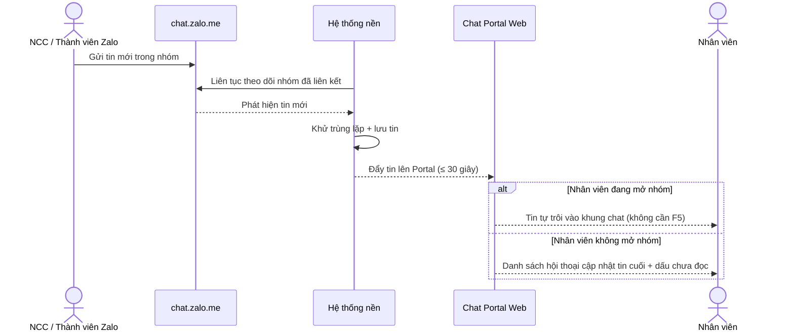

# #3 — Đồng Bộ Tin Nhắn Gần Thực (Zalo → Portal)

> **Trạng thái:** draft
> **Nguồn:** [`../scope-and-features.md § A` (#3)](../scope-and-features.md) (canonical) · [`../scope-and-features.md § 7` (yêu cầu phi chức năng)](../scope-and-features.md) · [`../FSD-Admin-Site.md § 2.3` (tab Đồng bộ dữ liệu, #21)](../FSD-Admin-Site.md) · [`../FSD-Chat-Portal.md § 2` (Portal chỉ hiển thị kết quả)](../FSD-Chat-Portal.md)
> **Liên quan:** [`#2 — Đồng bộ nhóm chat vendor`](../FSD-Admin-Site.md) · [`#4 — Đồng bộ lịch sử chat`](../FSD-Admin-Site.md) · [`#21 — Đồng bộ dữ liệu (sync thủ công)`](../FSD-Admin-Site.md) · [`#27 — Kết nối lại & thử lại kết nối`](../FSD-Admin-Site.md)

---

## 📌 Tóm tắt 1 dòng

Mọi tin nhắn mới phát sinh trong nhóm chat Zalo (từ nhà cung cấp và từ các thành viên Zalo khác) tự động xuất hiện trên Chat Portal trong vòng **≤ 30 giây** (thường chỉ vài giây) mà nhân viên không cần làm mới trang.

---

## 🎯 Giá trị nghiệp vụ

Nhân viên làm việc trong Chat Portal, nhưng nhà cung cấp (NCC) vẫn nhắn tin bằng app Zalo như thường lệ. Nếu tin nhắn từ Zalo không kịp về Portal, nhân viên sẽ trả lời trễ, bỏ sót yêu cầu của NCC, hoặc tệ hơn là tưởng rằng "không có tin mới" trong khi NCC đang chờ.

Tính năng này giữ cho Chat Portal **luôn phản ánh đúng những gì đang diễn ra trên Zalo gần như tức thì**. Một tác nhân đồng bộ nền (Browser Agent) liên tục theo dõi các nhóm chat Zalo đã liên kết; ngay khi có tin mới — dù là tin của NCC hay của bất kỳ thành viên Zalo nào khác trong nhóm — tin đó được kéo về và hiển thị trên Portal trong vòng tối đa 30 giây. Nhân viên đang mở nhóm sẽ thấy tin tự trôi vào khung chat; nhân viên không mở nhóm sẽ thấy danh sách hội thoại cập nhật tin mới nhất kèm dấu chưa đọc.

Đây là **hành vi nền xuyên suốt toàn Phase 2**: tính năng này không có màn hình riêng để thao tác, nhưng là điều kiện để mọi nghiệp vụ chat (trả lời, reply, react, giao việc theo tin…) hoạt động trên dữ liệu mới nhất. Khác với [#4 đồng bộ lịch sử](../FSD-Admin-Site.md) (kéo tin **cũ** một lần khi liên kết / sync thủ công), tính năng #3 phụ trách dòng tin **mới phát sinh liên tục**.

**Lợi ích:**

- Nhân viên không bỏ sót tin của NCC — phản hồi kịp thời, không phải mở app Zalo song song.
- Không cần bấm làm mới (F5) — tin mới tự xuất hiện.
- Mọi tính năng chat khác đều chạy trên dữ liệu cập nhật, giảm sai sót do xem nhầm tin cũ.

---

## 👥 Vai trò liên quan

| Vai trò | Trách nhiệm |
| --- | --- |
| **Nhà cung cấp (Vendor)** | Gửi tin trong nhóm chat Zalo bằng app Zalo. Là nguồn tin chính cần đồng bộ. Không truy cập Portal. |
| **Thành viên Zalo khác** | Các thành viên khác trong nhóm Zalo (không phải NCC, không phải tài khoản đại diện công ty). Tin của họ **cũng** được đồng bộ về Portal. |
| **Nhân viên / Quản trị (Staff / Admin)** | Người xem kết quả đồng bộ trên Portal. Thấy tin mới tự xuất hiện trong khung chat hoặc dấu chưa đọc ở danh sách hội thoại. Không cần thao tác gì để kích hoạt. |
| **Hệ thống nền (Browser Agent)** | Liên tục theo dõi các nhóm chat Zalo đã liên kết · Phát hiện tin mới · Kéo về và đẩy lên Portal ≤ 30 giây · Khử trùng lặp khi một tin được nhiều tài khoản cùng đồng bộ · Bù phần tin bị thiếu khi kết nối khôi phục. |

---

## 🔄 Dòng chảy nghiệp vụ

### Luồng đồng bộ một tin mới từ Zalo về Portal



> Sơ đồ minh hoạ chiều **Zalo → Portal** (tin mới đến). Chiều ngược lại (nhân viên gửi tin từ Portal lên Zalo) thuộc [#5](../FSD-Chat-Portal.md) / [#6](../FSD-Chat-Portal.md). Khi tài khoản đại diện mất kết nối, dòng chảy này tạm dừng và được nối lại bằng cơ chế bù tin của [#27](../FSD-Admin-Site.md).

---

## ✅ Kịch bản chấp nhận

```gherkin
# language: vi
Tính năng: Đồng bộ tin nhắn mới từ Zalo về Chat Portal gần thời gian thực

  Bối cảnh:
    Biết một nhóm chat vendor đã được đồng bộ vào Portal
    Và tài khoản Zalo đại diện cho nhóm đang ở trạng thái "connected" (đã kết nối)

  # =====================================================
  # Đồng bộ tin mới — happy path
  # =====================================================

  Tình huống: Tin mới của NCC xuất hiện trên Portal khi nhân viên đang mở nhóm
    Biết nhân viên đang mở cửa sổ chat của nhóm đó trên Portal
    Khi NCC gửi một tin nhắn mới trong nhóm Zalo
    Thì tin nhắn đó xuất hiện trong khung chat trên Portal trong vòng tối đa 30 giây
    Và nhân viên không cần làm mới trang (F5)

  Tình huống: Tin mới đến khi nhân viên không mở nhóm
    Biết nhân viên đang ở một nhóm khác hoặc không mở nhóm nào
    Khi NCC gửi một tin nhắn mới trong nhóm Zalo
    Thì nhóm đó trong danh sách hội thoại cập nhật nội dung tin cuối cùng
    Và nhóm hiển thị dấu hiệu chưa đọc cho tin mới

  Tình huống: Tin từ thành viên Zalo khác cũng được đồng bộ
    Biết trong nhóm Zalo có thành viên không phải NCC và không phải tài khoản đại diện công ty
    Khi thành viên đó gửi một tin nhắn mới
    Thì tin nhắn đó cũng được đồng bộ và hiển thị trên Portal trong vòng tối đa 30 giây

  Tình huống: Giữ đúng thứ tự tin theo thời điểm gửi trên Zalo
    Biết nhiều tin nhắn mới được gửi liên tiếp trong nhóm Zalo
    Khi các tin được đồng bộ về Portal
    Thì các tin hiển thị theo đúng thứ tự thời gian gửi trên Zalo

  # =====================================================
  # Thời gian đồng bộ theo loại nội dung
  # =====================================================

  Khung tình huống: Thời gian đồng bộ tối đa theo loại nội dung
    Biết nhân viên đang mở nhóm chat trên Portal
    Khi một tin nhắn loại "<loai_noi_dung>" được gửi trong nhóm Zalo
    Thì tin đó xuất hiện trên Portal trong khoảng "<thoi_gian>"

    Dữ liệu:
      | loai_noi_dung      | thoi_gian                          |
      | văn bản            | ≤ 30 giây (thường vài giây)        |
      | hình ảnh           | ≤ 30 giây                          |
      | tài liệu           | ≤ 30 giây                          |
      | video ≤ 300MB      | ≤ 30 giây                          |
      | video > 300MB      | có thể lâu hơn 30 giây (tuỳ kích thước) |

  Tình huống: Video lớn đồng bộ chậm hơn vẫn được chấp nhận
    Biết NCC gửi một video lớn hơn 300MB
    Khi video đang được đồng bộ về Portal
    Thì thời gian đồng bộ có thể vượt quá 30 giây tuỳ kích thước
    Và tin video hiển thị cảnh báo nội bộ về dung lượng lớn (xem #6)

  # =====================================================
  # Trạng thái kết nối ảnh hưởng đồng bộ
  # =====================================================

  Tình huống: Kết nối không ổn định thì tin có thể đến trễ
    Biết tài khoản Zalo đại diện đang ở trạng thái "unstable" (không ổn định)
    Khi NCC gửi tin nhắn mới
    Thì tin vẫn được đồng bộ nhưng có thể trễ hơn bình thường
    Và Portal hiển thị banner cảnh báo kết nối không ổn định (xem #27)

  Tình huống: Mất kết nối thì dừng đồng bộ tin mới
    Biết tài khoản Zalo đại diện đang ở trạng thái "disconnected" (mất kết nối)
    Khi NCC gửi tin nhắn mới trong khoảng thời gian mất kết nối
    Thì tin mới chưa được đồng bộ về Portal
    Và Portal hiển thị banner mất kết nối (xem #27)

  Tình huống: Bù tin bị thiếu sau khi kết nối khôi phục
    Biết tài khoản Zalo từng mất kết nối và đã có tin nhắn mới phát sinh trong lúc đó
    Khi kết nối khôi phục về "connected"
    Thì các tin nhắn phát sinh trong thời gian mất kết nối được kéo về và hiển thị đầy đủ
    Và giữ đúng thứ tự thời gian gửi

  # =====================================================
  # Trường hợp đặc biệt
  # =====================================================

  Tình huống: Một tin chỉ hiển thị một lần khi nhóm có nhiều tài khoản đại diện
    Biết một nhóm Zalo đang được đồng bộ bởi từ hai tài khoản đã liên kết trở lên
    Khi một tin nhắn mới phát sinh trong nhóm
    Thì tin đó chỉ xuất hiện đúng một lần trên Portal
    Nhưng không bị nhân đôi theo số tài khoản đang đồng bộ

  Tình huống: Nhiều tin đến gần như đồng thời
    Biết nhân viên đang mở nhóm chat trên Portal
    Khi nhiều tin nhắn được gửi gần như cùng lúc trong nhóm Zalo
    Thì tất cả các tin đều xuất hiện trên Portal
    Và không có tin nào bị mất
```

---

## 🎨 Mô tả giao diện

> **Lưu ý:** Tính năng #3 là **hành vi nền, không có màn hình hay nút bấm riêng**. Phần dưới mô tả các **bề mặt quan sát được** kết quả đồng bộ — bản thân cách hiển thị tin nhắn / danh sách hội thoại do Chat Portal phụ trách (xem [`../FSD-Chat-Portal.md § 2` và § 3](../FSD-Chat-Portal.md)). Việc kích hoạt sync **thủ công** và báo cáo kết quả nằm ở tab "Đồng bộ dữ liệu" trên Admin Site ([#21](../FSD-Admin-Site.md)).

### Bề mặt quan sát kết quả đồng bộ

| Bề mặt | Hành vi khi có tin mới | Thuộc tài liệu |
| --- | --- | --- |
| Khung chat (nhóm đang mở) | Tin mới tự trôi vào cuối danh sách tin, không cần F5 | [`FSD-Chat-Portal.md` § 3](../FSD-Chat-Portal.md) |
| Danh sách hội thoại NCC (sidebar) | Cập nhật tin cuối cùng + dấu chưa đọc cho nhóm có tin mới | [`FSD-Chat-Portal.md` § 3](../FSD-Chat-Portal.md) |
| Banner trạng thái kết nối | Khi `unstable` / `disconnected` → cảnh báo tin có thể trễ / dừng đồng bộ | [`FSD-Chat-Portal.md` § 2.1](../FSD-Chat-Portal.md) (#27) |
| Tab "Đồng bộ dữ liệu" (Admin Site) | Báo cáo tổng số tin đã sync sau mỗi lần sync thủ công | [`FSD-Admin-Site.md` § 2.3](../FSD-Admin-Site.md) (#21) |

### Mockup tham chiếu

> ✅ **Đã có:**
> - Khung chat hiển thị tin nhắn theo dòng thời gian (Chat Portal).
> - Danh sách hội thoại với dấu chưa đọc (Chat Portal).
>
> ⏳ **Cần BA bổ sung:**
> - Không có mockup riêng cho #3 (hành vi nền). Mọi mô tả giao diện dựa trên bề mặt của Chat Portal / Admin Site đã liệt kê ở trên.

---

## 🔗 Tham chiếu & Q&A

### Liên quan các phần khác

- [`#2 Đồng bộ nhóm chat vendor`](../FSD-Admin-Site.md): kéo về **danh sách nhóm** đã có. #3 phụ trách dòng **tin mới** trong các nhóm đó.
- [`#4 Đồng bộ lịch sử chat`](../FSD-Admin-Site.md): kéo về **tin cũ** một lần khi liên kết / sync thủ công. #3 chỉ phụ trách **tin mới phát sinh liên tục**.
- [`#21 Đồng bộ dữ liệu`](../FSD-Admin-Site.md): màn hình cho Admin **kích hoạt sync thủ công** + xem báo cáo. #3 là sync **tự động nền**, không cần Admin bấm.
- [`#27 Kết nối lại & thử lại kết nối`](../FSD-Admin-Site.md): khi mất kết nối, dòng đồng bộ #3 tạm dừng; #27 phụ trách khôi phục kết nối và bù phần tin bị thiếu.
- [`#6 Gửi/nhận IMG/FILE/VID`](../FSD-Chat-Portal.md): cảnh báo nội bộ cho video > 300MB hiển thị trong khung chat.

### ⚠️ Q&A cần BA / PO làm rõ

1. **Ranh giới giữa #3, #4 và "bù tin" của #27 khi kết nối khôi phục.**
   - Tin phát sinh trong lúc tài khoản `disconnected` rồi được kéo về khi kết nối lại — nên tính là #3 (tin mới, bù trễ), #4 (lịch sử), hay là một phần của #27 (gap-fill khi reconnect)?
   - `scope-and-features.md § A (#27)` có nhắc cơ chế bù tin khi reconnect; `FSD-Chat-Portal.md § 2.2 FR (luồng #27)` ghi "tin nhắn bị miss trong thời gian mất kết nối được sync về (backend xử lý gap-fill)".
   - **Pilot hiện đang theo:** mô tả cơ chế bù tin trong FSD này (mục "Bù tin bị thiếu sau khi kết nối khôi phục") nhưng coi logic reconnect là của #27. Cần BA/PO xác nhận cách tách tài liệu.

2. **Mốc đo "≤ 30 giây" tính từ thời điểm nào đến thời điểm nào?**
   - Để QC đo nhất quán: tính từ lúc Zalo ghi nhận tin → đến lúc tin hiển thị trên Portal? Hay đến lúc tin được lưu ở máy chủ?
   - Nguồn chỉ ghi "Tin nhắn mới từ Zalo cập nhật lên Portal ≤ 30 giây" (`scope § A #3` và `§ 7`), chưa định nghĩa rõ 2 mốc.
   - **Pilot hiện đang theo:** chưa quyết. Cần BA/PO chốt định nghĩa mốc đo để viết tiêu chí nghiệm thu.

3. **SLA ≤ 30 giây có áp dụng cho các sự kiện ngoài "tin nhắn mới" không?**
   - Scope #3 chỉ nói "tin nhắn mới". Các sự kiện như thả cảm xúc ([#8](../FSD-Chat-Portal.md)), thu hồi tin ([#9](../FSD-Chat-Portal.md)), ghim tin ([#10](../FSD-Chat-Portal.md)), chỉnh sửa tin — phát sinh từ phía Zalo — có chịu cùng ràng buộc ≤ 30 giây như tin mới không?
   - **Pilot hiện đang theo:** FSD này chỉ cam kết SLA cho **tin nhắn mới**; các sự kiện khác để ở tài liệu tính năng tương ứng. Cần BA/PO xác nhận có cần gộp SLA chung không.

4. **Hiển thị tên người gửi cho tin từ "thành viên Zalo khác" trong nhóm.**
   - #3 đồng bộ cả tin của thành viên Zalo không phải NCC và không phải tài khoản đại diện công ty. Nhưng ma trận hiển thị tên ở `scope-and-features.md § 6` chỉ liệt kê vendor / staff đại diện / admin — chưa nêu cách hiển thị cho nhóm "thành viên Zalo khác".
   - **Pilot hiện đang theo:** chưa quyết — tạm hiển thị theo Zalo display name của thành viên đó. Cần BA/PO xác nhận quy tắc hiển thị (và có gắn nhãn phân biệt với NCC không).
