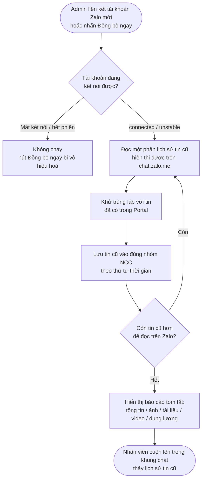

# #4 — Đồng Bộ Lịch Sử Chat (Zalo → Portal)

> **Trạng thái:** draft
> **Nguồn:** [`../scope-and-features.md § A` (#4)](../scope-and-features.md) (canonical) · [`../scope-and-features.md § 9` (Mốc 1 — tiêu chí nghiệm thu #4)](../scope-and-features.md) · [`../FSD-Admin-Site.md § 2.3` (tab Đồng bộ dữ liệu, #21)](../FSD-Admin-Site.md)
> **Liên quan:** [`#1 — Kết nối tài khoản Zalo`](01-ket-noi-tai-khoan-zalo.md) · [`#2 — Đồng bộ nhóm chat vendor`](02-dong-bo-nhom-chat-vendor.md) · [`#3 — Đồng bộ tin nhắn gần thực`](03-dong-bo-tin-nhan-gan-thuc.md) · [`#21 — Đồng bộ dữ liệu (sync thủ công)`](../FSD-Admin-Site.md) · [`#27 — Kết nối lại & thử lại kết nối`](../FSD-Admin-Site.md)

---

## 📌 Tóm tắt 1 dòng

Khi Admin liên kết một tài khoản Zalo mới (hoặc bấm đồng bộ thủ công), hệ thống tự động kéo về **toàn bộ lịch sử tin nhắn cũ** đang hiển thị được trên `chat.zalo.me` và đưa vào đúng từng nhóm NCC trên Portal, theo đúng thứ tự thời gian.

---

## 🎯 Giá trị nghiệp vụ

Khi một tài khoản Zalo được đưa vào Portal lần đầu, nhóm chat NCC thường đã có sẵn cả một chiều dài hội thoại trước đó — báo giá, thoả thuận, lịch giao hàng, khiếu nại cũ. Nếu Portal chỉ hiển thị tin **mới phát sinh sau ngày kết nối**, nhân viên sẽ mất toàn bộ ngữ cảnh quá khứ và phải mở app Zalo song song để tra cứu — đúng vấn đề mà Phase 2 muốn loại bỏ.

Tính năng này đảm bảo Portal **không bắt đầu từ con số 0**: ngay khi liên kết tài khoản (hoặc khi Admin chạy đồng bộ thủ công), hệ thống đọc lại lịch sử tin nhắn cũ hiển thị được trên `chat.zalo.me`, đưa từng tin về đúng nhóm NCC tương ứng và giữ đúng trình tự thời gian. Khi nhân viên mở một nhóm và cuộn lên, các tin cũ hiện ra như đang xem trực tiếp trên Zalo. Đây là thao tác **một lần cho mỗi lần đồng bộ** (khác với [#3](03-dong-bo-tin-nhan-gan-thuc.md) phụ trách dòng tin **mới phát sinh liên tục**).

Sau khi kéo xong, Admin nhận một **báo cáo tóm tắt** (tổng số tin, số ảnh / tài liệu / video, dung lượng ước tính, số file video > 300MB) để nắm được khối lượng dữ liệu đã đưa về.

**Lợi ích:**

- Nhân viên có đầy đủ ngữ cảnh lịch sử ngay từ lần đầu mở nhóm — không phải mở Zalo song song để tra cứu.
- Toàn bộ hội thoại cũ được lưu tập trung trong Portal, phục vụ tra cứu và kiểm soát nội dung về sau.
- Admin biết rõ khối lượng dữ liệu đã đồng bộ qua báo cáo tóm tắt sau mỗi lần chạy.

---

## 👥 Vai trò liên quan

| Vai trò | Trách nhiệm |
| --- | --- |
| **Quản trị (Admin)** | Kích hoạt đồng bộ lịch sử: liên kết tài khoản mới (tự chạy lần đầu) hoặc bấm "Đồng bộ ngay" trên Admin Site. Xem báo cáo tóm tắt và lịch sử các lần đồng bộ. |
| **Nhân viên (Staff)** | Không kích hoạt đồng bộ. Sau khi lịch sử được kéo về và được Admin gán quyền nhóm, nhân viên cuộn lên trong khung chat để xem tin cũ. |
| **Nhà cung cấp (Vendor)** | Không liên quan — chỉ tồn tại trong nhóm chat trên Zalo, không biết tới việc đồng bộ. |
| **Hệ thống nền (Browser Agent)** | Đọc lại lịch sử tin cũ hiển thị được trên `chat.zalo.me` · Khử trùng lặp với tin đã có · Lưu tin vào đúng nhóm NCC theo đúng thứ tự thời gian · Tổng hợp báo cáo sau khi hoàn tất. |

---

## 🔄 Dòng chảy nghiệp vụ



---

## ✅ Kịch bản chấp nhận

```gherkin
# language: vi
Tính năng: Đồng bộ lịch sử tin nhắn cũ từ Zalo về Chat Portal

  Bối cảnh:
    Biết một nhóm chat vendor đã được đồng bộ vào Portal (xem #2)
    Và tài khoản Zalo đại diện cho nhóm đang ở trạng thái "connected" (đã kết nối)

  # =====================================================
  # Kích hoạt đồng bộ lịch sử
  # =====================================================

  Tình huống: Tự động đồng bộ lịch sử ngay sau khi liên kết tài khoản mới
    Biết Admin vừa quét QR liên kết một tài khoản Zalo mới thành công (xem #1)
    Khi việc liên kết hoàn tất
    Thì hệ thống tự kích hoạt đồng bộ lịch sử tin nhắn cũ của các nhóm thuộc tài khoản đó
    Và Admin không cần thao tác gì thêm để khởi động lần đồng bộ đầu tiên

  Tình huống: Admin đồng bộ lịch sử thủ công từ tab Đồng bộ dữ liệu
    Biết Admin đang ở tab "Đồng bộ dữ liệu" trên trang Nhà Cung Cấp
    Khi Admin nhấn "Đồng bộ ngay" trên card của một tài khoản
    Thì hệ thống đọc lại lịch sử tin nhắn cũ của các nhóm thuộc tài khoản đó
    Và sau khi hoàn tất hiển thị báo cáo tóm tắt khối lượng đã đồng bộ

  Tình huống: Không cho đồng bộ khi tài khoản đang mất kết nối hoặc hết phiên
    Biết một tài khoản Zalo đang ở trạng thái "disconnected" (mất kết nối) hoặc "expired" (hết phiên)
    Khi Admin xem card của tài khoản đó
    Thì nút "Đồng bộ ngay" bị vô hiệu hoá
    Và khi rê chuột vào nút, tooltip giải thích lý do không đồng bộ được

  # =====================================================
  # Kết quả — hiển thị lịch sử trên Portal
  # =====================================================

  Tình huống: Tin cũ hiển thị khi nhân viên cuộn lên trong khung chat
    Biết một nhóm NCC vừa được đồng bộ lịch sử
    Và nhân viên đã được Admin gán quyền truy cập nhóm đó (xem #16)
    Khi nhân viên mở nhóm và cuộn lên đầu cuộc hội thoại
    Thì các tin nhắn cũ trước ngày kết nối hiển thị trong khung chat

  Tình huống: Lịch sử được đưa về đúng nhóm NCC tương ứng
    Biết tài khoản Zalo có nhiều nhóm chat khác nhau
    Khi đồng bộ lịch sử hoàn tất
    Thì tin cũ của mỗi nhóm Zalo nằm đúng trong nhóm NCC tương ứng trên Portal
    Và không có tin nào bị đưa nhầm sang nhóm khác

  Tình huống: Giữ đúng thứ tự thời gian của tin cũ
    Biết một nhóm có nhiều tin nhắn cũ ở các thời điểm khác nhau
    Khi lịch sử được đồng bộ về Portal
    Thì các tin hiển thị theo đúng thứ tự thời gian gửi trên Zalo, từ cũ đến mới

  Tình huống: Lịch sử media được kéo về cùng với tin văn bản
    Biết lịch sử nhóm có chứa hình ảnh, tài liệu và video cũ
    Khi đồng bộ lịch sử hoàn tất
    Thì các tin chứa hình ảnh, tài liệu và video cũ cũng hiển thị trong khung chat
    Và mỗi tin media giữ đúng vị trí theo thứ tự thời gian

  # =====================================================
  # Phạm vi đồng bộ
  # =====================================================

  Tình huống: Chỉ đồng bộ phần lịch sử hiển thị được trên chat.zalo.me
    Biết một nhóm có lịch sử rất dài trên Zalo
    Khi hệ thống đồng bộ lịch sử
    Thì hệ thống kéo về phần lịch sử mà chat.zalo.me còn hiển thị được
    Và phần lịch sử nằm ngoài khả năng hiển thị của chat.zalo.me không được đồng bộ

  # =====================================================
  # Báo cáo sau đồng bộ
  # =====================================================

  Tình huống: Báo cáo tóm tắt hiển thị đầy đủ các chỉ số sau khi đồng bộ
    Biết Admin vừa hoàn tất một lần đồng bộ của một tài khoản
    Khi quá trình đồng bộ kết thúc
    Thì hệ thống hiển thị báo cáo tóm tắt gồm các chỉ số sau:
      | tổng số tin nhắn đã đồng bộ |
      | số hình ảnh                 |
      | số tài liệu                 |
      | số video                    |
      | tổng dung lượng ước tính    |
      | số file video > 300MB       |
    Và số file video > 300MB là liên kết điều hướng sang trang Theo dõi file lớn (xem #24)

  Tình huống: Mỗi lần đồng bộ được ghi vào lịch sử đồng bộ
    Biết Admin vừa hoàn tất một lần đồng bộ
    Khi báo cáo tóm tắt hiển thị xong
    Thì một dòng mới được thêm vào khu vực "Lịch sử đồng bộ" của tài khoản đó
    Và dòng đó ghi thời điểm bắt đầu, thời điểm kết thúc, tổng số tin và kết quả

  # =====================================================
  # Khử trùng lặp & chạy lại
  # =====================================================

  Tình huống: Tin cũ không bị nhân đôi khi hai tài khoản cùng đồng bộ một nhóm
    Biết một nhóm Zalo đang được đồng bộ bởi từ hai tài khoản đã liên kết trở lên
    Khi cùng một tin nhắn cũ được đọc về từ cả hai tài khoản
    Thì tin đó chỉ hiển thị đúng một lần trên Portal
    Nhưng không bị nhân đôi theo số tài khoản đang đồng bộ

  Tình huống: Chạy đồng bộ lại không tạo bản trùng cho tin đã có
    Biết một nhóm đã được đồng bộ lịch sử trước đó
    Khi Admin nhấn "Đồng bộ ngay" lần nữa cho tài khoản đó
    Thì các tin cũ đã có sẵn không bị tạo thành bản trùng
    Và chỉ phần lịch sử chưa từng được đồng bộ mới được bổ sung

  # =====================================================
  # Trạng thái đang chạy
  # =====================================================

  Tình huống: Hiển thị tiến trình trong khi đang đồng bộ
    Biết Admin vừa nhấn "Đồng bộ ngay" cho một tài khoản
    Khi quá trình đồng bộ đang chạy
    Thì nút "Đồng bộ ngay" biến thành thanh tiến trình với nhãn trạng thái
    Và Admin thấy được rằng tài khoản này đang trong quá trình đồng bộ

  Tình huống: Không cho hai lần đồng bộ chồng nhau trên cùng tài khoản
    Biết một tài khoản đang trong quá trình đồng bộ
    Khi Admin xem card của tài khoản đó
    Thì nút "Đồng bộ ngay" bị vô hiệu hoá cho đến khi lần đồng bộ hiện tại kết thúc

  # =====================================================
  # Trường hợp đặc biệt
  # =====================================================

  Tình huống: Nhóm chưa có tin nhắn nào trong lịch sử
    Biết một nhóm Zalo tồn tại nhưng chưa có tin nhắn nào
    Khi đồng bộ lịch sử hoàn tất
    Thì nhóm vẫn hiển thị trong danh sách với khung chat ở trạng thái rỗng
    Và báo cáo tóm tắt ghi nhận 0 tin cho nhóm đó

  Tình huống: Đồng bộ lịch sử thất bại giữa chừng
    Biết Admin đang đồng bộ lịch sử một tài khoản
    Khi quá trình bị gián đoạn (mất mạng hoặc Zalo chặn)
    Thì hệ thống hiển thị thông báo "Đồng bộ thất bại" kèm lý do và nút "Thử lại"
    Và phần lịch sử đã kéo về thành công trước khi lỗi vẫn được giữ lại

  Tình huống: Đồng bộ tài khoản đang ở trạng thái không ổn định
    Biết một tài khoản Zalo đang ở trạng thái "unstable" (không ổn định)
    Khi Admin nhấn "Đồng bộ ngay"
    Thì hệ thống vẫn cho phép chạy đồng bộ
    Nhưng cảnh báo rằng kết nối không ổn định, đồng bộ có thể chậm hoặc thất bại từng phần

  Tình huống: Lịch sử có video lớn hơn 300MB
    Biết lịch sử nhóm chứa một video lớn hơn 300MB
    Khi tin video đó được đồng bộ về Portal
    Thì thời gian đồng bộ video đó có thể lâu hơn bình thường tuỳ kích thước
    Và tin video hiển thị cảnh báo nội bộ về dung lượng lớn trong khung chat (xem #6)
    Và file đó được tính vào chỉ số "số file video > 300MB" của báo cáo
```

---

## 🎨 Mô tả giao diện

> **Lưu ý:** Tính năng #4 là **hành vi nền, không có màn hình thao tác riêng**. Người dùng quan sát kết quả qua 2 bề mặt: khung chat trên Chat Portal (cuộn lên thấy tin cũ) và tab "Đồng bộ dữ liệu" trên Admin Site (kích hoạt + báo cáo). Bản thân màn hình kích hoạt và báo cáo thuộc về [#21](../FSD-Admin-Site.md) — dưới đây chỉ mô tả phần liên quan tới kết quả đồng bộ lịch sử.

### Bề mặt quan sát kết quả đồng bộ

| Bề mặt | Hành vi liên quan lịch sử | Thuộc tài liệu |
| --- | --- | --- |
| Khung chat (nhóm đang mở) | Cuộn lên đầu hội thoại → tin cũ trước ngày kết nối hiển thị theo thứ tự thời gian | [`FSD-Chat-Portal.md` § 3](../FSD-Chat-Portal.md) |
| Tab "Đồng bộ dữ liệu" (Admin Site) | Nút "Đồng bộ ngay" → thanh tiến trình khi chạy → báo cáo tóm tắt khi xong | [`FSD-Admin-Site.md` § 2.3](../FSD-Admin-Site.md) (#21) |
| Khu vực "Lịch sử đồng bộ" (Admin Site) | Mỗi lần đồng bộ ghi 1 dòng: thời điểm bắt đầu / kết thúc / tổng tin / kết quả | [`FSD-Admin-Site.md` § 2.3](../FSD-Admin-Site.md) (#21) |

### Báo cáo tóm tắt sau đồng bộ (stats grid 6 ô)

| # | Chỉ số | Ghi chú |
| - | --- | --- |
| 1 | Tổng số tin nhắn đã đồng bộ | Gộp văn bản + media |
| 2 | Số hình ảnh | |
| 3 | Số tài liệu | |
| 4 | Số video | |
| 5 | Tổng dung lượng ước tính | |
| 6 | Số file video > 300MB | **Link** → điều hướng sang trang Theo dõi file lớn ([#24](../FSD-Admin-Site.md)) với filter theo tài khoản này |

### Trạng thái UI khi đồng bộ

| Bối cảnh | Hiển thị |
| --- | --- |
| Đang đồng bộ | Nút "Đồng bộ ngay" → thanh tiến trình "Đang đồng bộ… X%" |
| Đồng bộ thành công | Toast "Đồng bộ xong: X tin nhắn từ Y nhóm" + cập nhật stats grid |
| Đồng bộ thất bại | Banner đỏ "Đồng bộ thất bại — [lý do]" + nút "Thử lại"; dòng lịch sử ghi `failed` |
| Tài khoản `unstable` | Vẫn cho đồng bộ + cảnh báo "Kết nối không ổn định — đồng bộ có thể chậm hoặc thất bại từng phần" |

### Mockup tham chiếu

> ✅ **Đã có:**
> - Card đồng bộ per-tài-khoản (tab Đồng bộ dữ liệu) với nút "Đồng bộ ngay" + stats grid 6 ô + lịch sử đồng bộ (xem [#21](../FSD-Admin-Site.md)).
> - Khung chat hiển thị tin nhắn theo dòng thời gian (Chat Portal).
>
> ⏳ **Cần BA bổ sung:**
> - Không có mockup riêng cho #4 (hành vi nền). Trạng thái đang đồng bộ (progress bar) và trạng thái lỗi + nút "Thử lại" dùng chung với #21.
> - Biểu thị (nếu có) ranh giới giữa tin lịch sử cũ và tin mới phát sinh sau ngày kết nối trong khung chat — hiện chưa có yêu cầu rõ.

---

## 🔗 Tham chiếu & Q&A

### Liên quan các phần khác

- [`#1 Kết nối tài khoản Zalo`](01-ket-noi-tai-khoan-zalo.md): liên kết tài khoản là điều kiện tiên quyết và tự kích hoạt lần đồng bộ lịch sử đầu tiên.
- [`#2 Đồng bộ nhóm chat vendor`](02-dong-bo-nhom-chat-vendor.md): kéo về **danh sách nhóm** + danh sách thành viên. #4 kéo **nội dung tin nhắn cũ** của các nhóm đó.
- [`#3 Đồng bộ tin nhắn gần thực`](03-dong-bo-tin-nhan-gan-thuc.md): phụ trách dòng **tin mới phát sinh liên tục** (≤ 30 giây). #4 chỉ phụ trách **tin cũ**, kéo một lần khi liên kết / đồng bộ thủ công.
- [`#21 Đồng bộ dữ liệu`](../FSD-Admin-Site.md): màn hình cho Admin **kích hoạt** đồng bộ thủ công + xem báo cáo + lịch sử. #21 trigger đồng thời #2 + #3 + #4.
- [`#24 Theo dõi file lớn`](../FSD-Admin-Site.md): chỉ số "số file video > 300MB" trong báo cáo là link sang trang này.
- [`#27 Kết nối lại & thử lại kết nối`](../FSD-Admin-Site.md): phụ trách bù phần tin bị thiếu khi kết nối khôi phục — khác với #4 (kéo lịch sử lần đầu).

### ⚠️ Q&A cần BA / PO làm rõ

1. **"Toàn bộ lịch sử cũ hiển thị được trên `chat.zalo.me`" thực tế là bao xa?**
   - Nguồn `scope-and-features.md § A (#4)` ghi *"đồng bộ toàn bộ lịch sử tin nhắn cũ hiển thị được trên chat.zalo.me"*; tiêu chí nghiệm thu Mốc 1 ghi *"lịch sử tin nhắn cũ trước ngày kết nối"*.
   - Trên thực tế giao diện `chat.zalo.me` thường **không cuộn lịch sử vô hạn** (giới hạn theo thời gian hoặc số tin Zalo còn giữ). Vậy "toàn bộ" cần hiểu là toàn bộ phần Zalo Web còn cho phép cuộn, hay có một mốc cam kết cụ thể (ví dụ N tháng gần nhất / N tin gần nhất)?
   - **Pilot hiện đang theo:** kéo phần lịch sử mà `chat.zalo.me` còn hiển thị được, không cam kết mốc số tin/thời gian cụ thể. **Cần BA/PO chốt mốc** để viết tiêu chí nghiệm thu đo được.

2. **Khi liên kết tài khoản THỨ HAI vào một nhóm đã có lịch sử.**
   - Một nhóm Zalo có thể được đồng bộ bởi nhiều tài khoản (xem [D.4](../scope-and-features.md)). Mỗi tài khoản có thể "nhìn thấy" lịch sử khác nhau (ví dụ tài khoản vào nhóm sớm hơn thấy lịch sử xa hơn).
   - Khi đồng bộ tài khoản thứ hai: hệ thống chỉ khử trùng lặp các tin đã có, hay còn **kéo bù** phần lịch sử mà tài khoản thứ hai thấy được nhưng tài khoản đầu tiên đã bỏ sót?
   - **Pilot hiện đang theo:** chưa quyết — tạm thời khử trùng lặp theo từng tin; chưa định nghĩa rõ cơ chế kéo bù phần lịch sử chênh lệch giữa hai tài khoản. Cần BA/PO xác nhận.

3. **Media cũ: tải toàn bộ ngay khi đồng bộ hay tải khi xem?**
   - Báo cáo tóm tắt thống kê số ảnh / tài liệu / video + dung lượng, ngụ ý media lịch sử được nhận diện khi đồng bộ. Nhưng với khối lượng lớn (nhất là video), tải toàn bộ tệp ngay có thể tốn dung lượng và kéo dài thời gian đồng bộ.
   - **Pilot hiện đang theo:** chưa quyết giữa (a) tải toàn bộ tệp ngay khi đồng bộ và (b) chỉ ghi nhận metadata, tải tệp khi nhân viên mở xem. Cần BA/PO chốt để cân đối dung lượng và thời gian đồng bộ.

4. **Ranh giới #4 (lịch sử lần đầu) vs bù-tin của #27 khi reconnect.**
   - Tin phát sinh trong lúc tài khoản `disconnected` rồi được kéo về khi kết nối lại nên tính là một phần của #4 (lịch sử) hay của [#27](../FSD-Admin-Site.md) (gap-fill khi reconnect)? Cùng câu hỏi đã được flag ở [#3 Q&A mục 1](03-dong-bo-tin-nhan-gan-thuc.md).
   - **Pilot hiện đang theo:** coi #4 là kéo lịch sử **lần đầu khi liên kết / đồng bộ thủ công**; phần bù tin sau mất kết nối thuộc cơ chế reconnect của #27. Cần BA/PO xác nhận cách tách tài liệu để nghiệm thu #4 và #27 riêng.

5. **Hiển thị tên người gửi cho tin lịch sử của nhân viên đã rời công ty.**
   - Lịch sử cũ có thể chứa tin do tài khoản đại diện gửi bởi một nhân viên đã rời công ty. Quy tắc hiển thị tên đã được nêu ở [`scope-and-features.md § 6.5`](../scope-and-features.md) (`Z.displayName (StaffName — đã rời)`).
   - **Pilot hiện đang theo:** áp dụng quy tắc § 6.5 cho tin lịch sử. Ghi chú lại đây để DEV không bỏ sót khi render tin cũ; không phải điểm mâu thuẫn.
