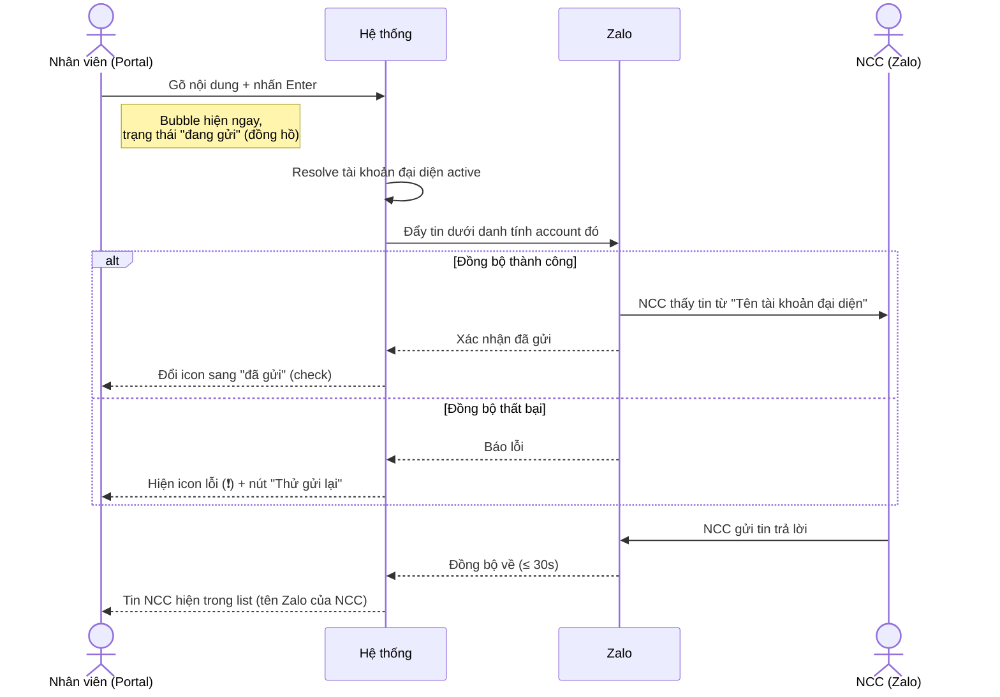

# #5 — Gửi/nhận tin nhắn văn bản (TXT)

> **Trạng thái:** draft
> **Nguồn:** [`../scope-and-features.md § B.5`](../scope-and-features.md) (canonical) · [`../FSD-Chat-Portal.md § 3.2`](../FSD-Chat-Portal.md) · cấu trúc bubble chung [`../FSD-Chat-Portal.md § 3.1`](../FSD-Chat-Portal.md)
> **Liên quan:** banner trạng thái kết nối ([`#27`](27-ket-noi-lai-va-thu-lai.md)) · banner đại diện & resolve tài khoản (D.4) · quy tắc hiển thị tên ([`../scope-and-features.md § 6`](../scope-and-features.md))

---

## 📌 Tóm tắt 1 dòng

Nhân viên gõ và gửi tin nhắn văn bản từ Chat Portal vào nhóm chat NCC; tin xuất hiện trên Zalo dưới danh tính tài khoản Zalo đại diện, đồng thời nhận lại tin của NCC và các thành viên Zalo khác trong nhóm.

---

## 🎯 Giá trị nghiệp vụ

Đây là thao tác cốt lõi của toàn bộ hệ thống: trao đổi tin nhắn văn bản với nhà cung cấp (NCC). Trước Phase 2, mỗi nhân viên phải dùng Zalo cá nhân riêng để chat với NCC — danh tính lộn xộn, không kiểm soát được nội dung, không lưu vết tập trung.

Với tính năng này, nhiều nhân viên có thể cùng trò chuyện với một NCC thông qua **một tài khoản Zalo đại diện duy nhất** ngay trong Chat Portal. Phía NCC chỉ thấy một danh tính nhất quán (tên tài khoản đại diện) — bảo mật nội bộ và chuyên nghiệp. Phía nội bộ, hệ thống vẫn ghi rõ nhân viên nào thực sự gửi tin, phục vụ truy vết và quy trách nhiệm.

Tin nhắn được gửi đi và nhận về gần như tức thì (đồng bộ ≤ 30 giây, xem [`#3`](03-dong-bo-tin-nhan-gan-thuc.md)), giúp nhân viên làm việc liền mạch mà không cần rời Portal.

**Lợi ích:**

- Nhiều nhân viên phục vụ chung một NCC qua một danh tính thống nhất — NCC không bị rối.
- Mọi tin nhắn lưu tập trung, có lịch sử, dễ tra cứu và bàn giao.
- Nhân viên luôn biết tin mình gửi sẽ hiện dưới danh tính nào (banner đại diện), tránh gửi nhầm.

---

## 👥 Vai trò liên quan

| Vai trò | Trách nhiệm |
| --- | --- |
| **Nhân viên (Staff)** | Mở nhóm NCC được phân quyền → gõ và gửi tin văn bản; tin gửi dưới danh tính tài khoản Zalo mà mình đang đại diện. Nhận tin của NCC và thành viên nhóm. |
| **Quản trị (Admin)** | Gửi/nhận tin trong nhóm như Nhân viên (cũng đại diện qua một tài khoản Zalo). Có toàn quyền truy cập mọi nhóm NCC. |
| **NCC (Vendor)** | Chỉ tương tác qua Zalo. Nhận tin từ Nhân viên dưới tên tài khoản đại diện; gửi tin về để Nhân viên thấy trên Portal. |
| **Hệ thống** | Xác định tài khoản đại diện đang active, gắn danh tính vào tin và đẩy lên Zalo · Cập nhật trạng thái gửi (đang gửi / đã gửi / lỗi) · Đồng bộ tin nhận về real-time · Lưu draft theo từng nhóm trong phiên làm việc. |

---

## 🔄 Dòng chảy nghiệp vụ



---

## ✅ Kịch bản chấp nhận

```gherkin
# language: vi
Tính năng: Gửi và nhận tin nhắn văn bản trong nhóm NCC

  Bối cảnh:
    Biết Nhân viên đã đăng nhập Chat Portal
    Và Nhân viên được phân quyền đại diện ít nhất một tài khoản Zalo trong nhóm "NCC Vận Chuyển Phương Nam"
    Và Nhân viên đang mở nhóm "NCC Vận Chuyển Phương Nam"
    Và tài khoản đại diện cho nhóm đang ở trạng thái kết nối bình thường

  # =====================================================
  # Gửi tin — happy path
  # =====================================================

  Tình huống: Gửi tin bằng phím Enter
    Biết Nhân viên đã gõ nội dung "Báo giá lô hàng tháng 7 giúp em nhé" vào ô soạn tin
    Khi Nhân viên nhấn phím Enter
    Thì tin xuất hiện ngay trong khung chat với trạng thái "đang gửi" (icon đồng hồ)
    Và ô soạn tin được xoá trống
    Và khi hệ thống xác nhận đồng bộ xong, icon đổi sang "đã gửi" (dấu check)

  Tình huống: Gửi tin bằng nút Gửi
    Biết Nhân viên đã gõ nội dung vào ô soạn tin
    Khi Nhân viên nhấn nút Gửi (biểu tượng máy bay giấy)
    Thì tin được gửi đi giống như nhấn Enter

  Tình huống: Xuống dòng trong tin mà không gửi
    Biết Nhân viên đang gõ nội dung vào ô soạn tin
    Khi Nhân viên nhấn Shift+Enter
    Thì con trỏ xuống dòng mới trong ô soạn tin
    Và tin chưa được gửi đi

  Tình huống: Tin gửi từ Nhân viên hiển thị đúng danh tính ở hai phía
    Biết Nhân viên "Huyền" đang đại diện tài khoản Zalo "Công ty ABC"
    Khi Nhân viên gửi một tin văn bản
    Thì trên Chat Portal, tin hiển thị tên người gửi là "Công ty ABC (Huyền)"
    Và trên Zalo, NCC và các thành viên khác chỉ thấy tên người gửi là "Công ty ABC"

  # =====================================================
  # Gửi tin — ràng buộc nội dung
  # =====================================================

  Tình huống: Không cho gửi tin rỗng
    Biết ô soạn tin đang trống
    Thì nút Gửi bị vô hiệu hoá

  Tình huống: Không cho gửi tin chỉ chứa khoảng trắng
    Biết ô soạn tin chỉ chứa các ký tự khoảng trắng
    Thì nút Gửi bị vô hiệu hoá

  Tình huống: Ô soạn tin không hỗ trợ định dạng chữ (in đậm, in nghiêng)
    Biết Nhân viên đang soạn tin
    Thì ô soạn tin chỉ nhận văn bản thuần và emoji có sẵn của hệ điều hành
    Và không có thanh công cụ định dạng (bold, italic) trong giai đoạn này

  Tình huống: Tin quá dài vẫn gửi được
    Biết Nhân viên gõ một tin rất dài
    Khi Nhân viên nhấn Enter
    Thì Portal không chặn theo số ký tự
    Nhưng nếu Zalo từ chối vì vượt giới hạn của Zalo thì tin chuyển sang trạng thái gửi lỗi

  # =====================================================
  # Gửi tin — lỗi & thử lại
  # =====================================================

  Tình huống: Gửi tin thất bại hiển thị nút thử lại
    Biết Nhân viên vừa gửi một tin
    Khi hệ thống đồng bộ tin lên Zalo thất bại
    Thì tin hiển thị icon lỗi "❗" kèm nút "Thử gửi lại"
    Và hệ thống không tự động gửi lại lặp vô hạn

  Tình huống: Thử gửi lại một tin lỗi
    Biết một tin đang ở trạng thái gửi lỗi
    Khi Nhân viên nhấn "Thử gửi lại"
    Thì tin chuyển lại trạng thái "đang gửi"
    Và khi đồng bộ thành công thì chuyển sang "đã gửi"

  # =====================================================
  # Nháp (draft) theo từng nhóm
  # =====================================================

  Tình huống: Nội dung nháp được giữ khi chuyển nhóm rồi quay lại
    Biết Nhân viên đã gõ dở "Em xác nhận lại số lượng" nhưng chưa gửi
    Khi Nhân viên chuyển sang nhóm khác rồi quay lại nhóm này
    Thì ô soạn tin vẫn còn nội dung "Em xác nhận lại số lượng"

  Tình huống: Nội dung nháp mất khi tải lại trang
    Biết Nhân viên đã gõ dở một tin nhưng chưa gửi
    Khi Nhân viên tải lại (reload) trang
    Thì ô soạn tin trống — nháp không được lưu lên máy chủ

  # =====================================================
  # Mention
  # =====================================================

  Tình huống: Gõ ký tự @ mở danh sách chọn thành viên
    Biết Nhân viên đang soạn tin
    Khi Nhân viên gõ ký tự "@"
    Thì hệ thống mở danh sách chọn thành viên để gắn thẻ (mention)

  # =====================================================
  # Nhận tin
  # =====================================================

  Tình huống: Nhận tin từ NCC
    Khi NCC gửi một tin văn bản trong nhóm trên Zalo
    Thì tin xuất hiện trong khung chat của Nhân viên trong vòng tối đa 30 giây
    Và tên người gửi hiển thị là tên Zalo của NCC

  Tình huống: Nhận tin từ thành viên Zalo khác trong nhóm
    Khi một thành viên Zalo khác (không phải NCC, không phải tài khoản đại diện) gửi tin
    Thì tin được đồng bộ về và hiển thị với tên Zalo của thành viên đó

  Tình huống: Tin mới cập nhật không cần làm mới trang
    Biết Nhân viên đang mở nhóm
    Khi có tin mới được đồng bộ từ Zalo về
    Thì danh sách tin tự cập nhật mà Nhân viên không cần tải lại trang

  # =====================================================
  # Ảnh hưởng của trạng thái kết nối lên việc gửi
  # =====================================================

  Khung tình huống: Khả năng gửi tin theo trạng thái kết nối của tài khoản đại diện
    Biết tài khoản đại diện cho nhóm đang ở trạng thái "<trang_thai>"
    Thì ô soạn tin "<kha_nang>"

    Dữ liệu:
      | trang_thai    | kha_nang                                                   |
      | connected     | cho gõ và gửi bình thường                                  |
      | unstable      | vẫn cho gõ và gửi, tin có thể ở trạng thái "đang gửi" lâu hơn |
      | disconnected  | bị vô hiệu hoá, kèm tooltip giải thích lý do               |
      | expired       | bị vô hiệu hoá, kèm hướng dẫn liên hệ Admin                |

  # =====================================================
  # Trường hợp đặc biệt
  # =====================================================

  Tình huống: Nhân viên không được gán tài khoản nào trong nhóm chỉ xem được
    Biết Nhân viên có quyền truy cập nhóm nhưng không được gán đại diện tài khoản Zalo nào trong nhóm
    Khi Nhân viên mở nhóm
    Thì ô soạn tin bị vô hiệu hoá
    Và tooltip hiển thị "Bạn không được phép gửi tin trong nhóm này. Liên hệ Admin."

  Tình huống: Nhóm không được phân quyền thì không xuất hiện
    Biết Nhân viên không được phân quyền đại diện bất kỳ tài khoản Zalo nào trong một nhóm
    Thì nhóm đó không hiển thị trong danh sách hội thoại NCC của Nhân viên
```

---

## 🎨 Mô tả giao diện

### Cấu trúc khung chat

```
┌─────────────────────────────────────────────────────────────┐
│ 🟢 Đang đại diện tài khoản: Công ty ABC      (banner đại diện)│
├─────────────────────────────────────────────────────────────┤
│                                                             │
│  [NCC] Phương Nam                                           │
│  Bên em gửi lại bảng giá nhé                    09:12       │
│                                                             │
│                    Báo giá lô hàng tháng 7 giúp em  09:15 ✓ │
│                    Công ty ABC (Huyền)                      │
│                                                             │
├─────────────────────────────────────────────────────────────┤
│ [📎]  Nhập tin nhắn...                              [➤ Gửi] │
└─────────────────────────────────────────────────────────────┘
```

> Banner đại diện (ZaloIdentityBar) và banner trạng thái kết nối là tính năng riêng (D.4 / [`#27`](27-ket-noi-lai-va-thu-lai.md)) — ở đây chỉ mô tả ảnh hưởng của chúng lên việc gửi TXT.

### Hành vi ô soạn tin

| Hành vi | Mô tả |
| --- | --- |
| **Enter** | Gửi tin |
| **Shift+Enter** | Xuống dòng, không gửi |
| **Nút Gửi (➤)** | Gửi tin; vô hiệu hoá khi ô trống hoặc chỉ có khoảng trắng |
| **Nội dung** | Văn bản thuần + emoji native OS. Không rich text trong giai đoạn này |
| **Gõ `@`** | Mở danh sách chọn thành viên (mention — tính năng riêng) |
| **Nháp** | Giữ theo từng nhóm trong phiên; mất khi reload trang |

### Trạng thái một tin gửi đi

| Trạng thái | Hiển thị |
| --- | --- |
| **Đang gửi** | Icon đồng hồ cạnh tin |
| **Đã gửi** | Icon dấu check |
| **Gửi lỗi** | Icon "❗" + nút "Thử gửi lại" |

### Hiển thị tên người gửi (theo [`§ 6`](../scope-and-features.md))

| Nguồn tin | Trên Portal (nội bộ) | Trên Zalo (NCC thấy) |
| --- | --- | --- |
| Nhân viên gửi (đại diện account `Z`) | `Z.displayName (Tên nhân viên)` | `Z.displayName` |
| Admin gửi (đại diện account `Z`) | `Z.displayName (Tên admin)` + badge vai trò | `Z.displayName` |
| NCC gửi | Tên Zalo của NCC | (chính họ) |
| Thành viên Zalo khác | Tên Zalo của thành viên đó | (chính họ) |

### Mockup tham chiếu

> ⏳ **Cần BA bổ sung:**
> - Ô soạn tin ở chân khung chat (trạng thái thường).
> - Tin gửi đi ở 3 trạng thái: đang gửi · đã gửi · gửi lỗi (nút Thử gửi lại).
> - Bubble tin so sánh 3 nguồn: NCC / Nhân viên / Admin (để thấy author label khác nhau).
> - Ô soạn tin bị vô hiệu hoá khi mất kết nối / không có quyền gửi (kèm tooltip).

---

## 🔗 Tham chiếu & Q&A

### Liên quan các phần khác

- [`Cấu trúc message bubble chung`](../FSD-Chat-Portal.md) (`§ 3.1`): khung bubble, origin badge, hover menu — nền tảng cho #5–#11, #25, mention.
- [`#3 Đồng bộ tin nhắn gần thực`](03-dong-bo-tin-nhan-gan-thuc.md): cơ chế nhận tin về ≤ 30s (áp dụng cho phần "nhận" của #5).
- [`#6 Gửi/nhận hình ảnh, tập tin, video`](../FSD-Chat-Portal.md) (`§ 3.3`, chưa tách): mở rộng việc gửi sang media.
- [`#7 Reply`](../FSD-Chat-Portal.md) (`§ 3.4`) · [`#8 Thả cảm xúc`](../FSD-Chat-Portal.md) (`§ 3.5`) — chưa tách: thao tác bổ sung trên một tin TXT.
- **Banner đại diện & resolve tài khoản (D.4):** [`../FSD-Chat-Portal.md § 5.2 / § 5.3`](../FSD-Chat-Portal.md) — xác định Nhân viên đang gửi dưới danh tính account nào và khi nào input bị khoá (read-only).
- **Trạng thái kết nối Zalo:** [`../FSD-Chat-Portal.md § 2.1`](../FSD-Chat-Portal.md) + [`#27`](27-ket-noi-lai-va-thu-lai.md).
- **Quy tắc hiển thị tên người gửi:** [`../scope-and-features.md § 6`](../scope-and-features.md).

### ⚠️ Q&A cần BA / PO làm rõ

1. **Có hiển thị trạng thái "NCC đã xem" (seen) cho tin gửi đi không?**
   - Hiện chỉ định nghĩa 3 trạng thái: đang gửi / đã gửi / gửi lỗi. Không có trạng thái "đã xem".
   - **Pilot hiện đang theo:** chỉ 3 trạng thái, không có "đã xem". Cần BA/PO xác nhận có cần thêm "đã xem" (nếu Zalo cung cấp tín hiệu này) hay không.

2. **Có cảnh báo trước khi tin vượt giới hạn ký tự của Zalo không?**
   - Portal không giới hạn ký tự; chỉ khi Zalo từ chối thì tin báo lỗi (xem Tình huống "Tin quá dài vẫn gửi được").
   - **Pilot hiện đang theo:** không cảnh báo trước, để tin báo lỗi sau khi Zalo từ chối. Cần BA xác nhận có cần hiển thị bộ đếm/cảnh báo chủ động không.

3. **Nháp (draft) có cần lưu bền vững qua reload / qua thiết bị khác không?**
   - Hiện nháp chỉ giữ trong phiên, mất khi reload trang (`FR-5.4`).
   - **Pilot hiện đang theo:** chỉ giữ trong phiên. Cần xác nhận đây là kỳ vọng cuối cùng hay cần persist.

4. **Khi gửi nhiều tin liên tiếp lúc kết nối `unstable`: thứ tự hiển thị có đảm bảo đúng thứ tự gửi không?**
   - Nguồn chưa quy định rõ hành vi sắp xếp khi nhiều tin cùng "đang gửi" và đồng bộ xong không theo thứ tự.
   - **Pilot hiện đang theo:** chưa quyết. Cần BA/PO làm rõ kỳ vọng (giữ thứ tự thao tác hay theo thời điểm Zalo xác nhận).
