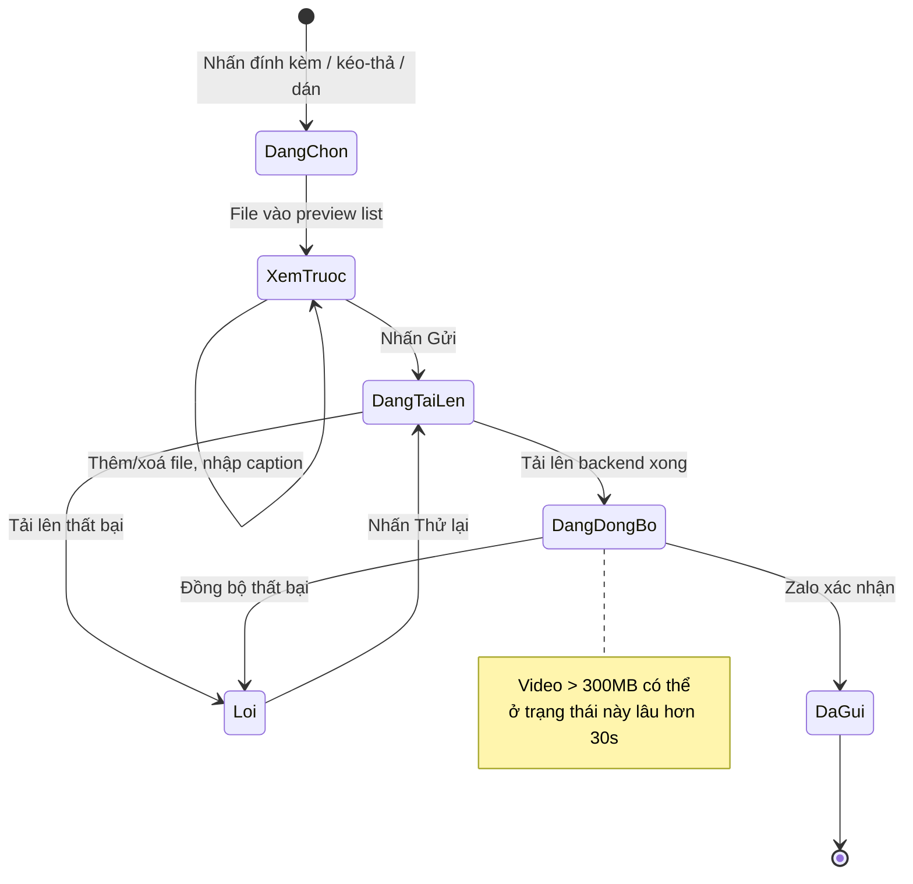

# #6 — Gửi/nhận hình ảnh, tập tin, video

> **Trạng thái:** draft
> **Nguồn:** [`../scope-and-features.md § B.6`](../scope-and-features.md) (canonical) · [`../FSD-Chat-Portal.md § 3.3`](../FSD-Chat-Portal.md) · cấu trúc bubble chung [`../FSD-Chat-Portal.md § 3.1`](../FSD-Chat-Portal.md)
> **Liên quan:** gửi/nhận TXT ([`#5`](05-gui-nhan-tin-nhan-van-ban.md)) · watermark hình ảnh (#13) · phân quyền tải tập tin (#14) · theo dõi file lớn (#24) · banner trạng thái kết nối ([`#27`](27-ket-noi-lai-va-thu-lai.md))

---

## 📌 Tóm tắt 1 dòng

Nhân viên đính kèm và gửi hình ảnh, tài liệu, video từ Chat Portal vào nhóm chat NCC — không giới hạn kích thước — đồng thời nhận lại media của NCC; video lớn hơn 300MB được gắn cảnh báo nội bộ để theo dõi.

---

## 🎯 Giá trị nghiệp vụ

Trao đổi với NCC không chỉ là chữ: bảng giá dạng ảnh, hợp đồng PDF, video tình trạng hàng hóa… đều là nội dung công việc hằng ngày. Trước Phase 2, các tập tin này nằm rải rác trong Zalo cá nhân của từng nhân viên, không lưu vết tập trung và khó kiểm soát ai được tải về.

Tính năng này đưa toàn bộ luồng gửi/nhận media vào Chat Portal: nhân viên đính kèm file ngay trong khung chat, xem trước rồi gửi; tin xuất hiện trên Zalo dưới danh tính tài khoản đại diện giống như tin văn bản. Mọi tập tin được lưu tập trung, gắn với đúng nhóm NCC, phục vụ tra cứu và bàn giao.

Hệ thống không chặn kích thước file để không cản trở công việc, nhưng đánh dấu **video lớn hơn 300MB** bằng cảnh báo nội bộ — vừa nhắc người dùng rằng loại tin này có thể đồng bộ chậm hơn, vừa giúp quản trị theo dõi dung lượng phát sinh (xem [#24](#)).

**Lợi ích:**

- Trao đổi mọi loại tập tin với NCC ngay trong Portal, không phải chuyển qua Zalo cá nhân.
- Tập tin lưu tập trung theo nhóm — dễ tra cứu, dễ bàn giao, kiểm soát được quyền tải.
- Video dung lượng lớn được nhận diện sớm, tránh hiểu nhầm là lỗi khi đồng bộ lâu.

---

## 👥 Vai trò liên quan

| Vai trò | Trách nhiệm |
| --- | --- |
| **Nhân viên (Staff)** | Đính kèm và gửi hình ảnh / tài liệu / video vào nhóm NCC được phân quyền; xem và tải media nhận về (theo quyền tải của mình trong nhóm — xem #14). |
| **Quản trị (Admin)** | Gửi/nhận media như Nhân viên; luôn có quyền tải mọi loại file ở mọi nhóm. Theo dõi danh sách video lớn (#24). |
| **NCC (Vendor)** | Gửi và nhận media qua Zalo dưới danh tính của chính mình. Không thấy các cảnh báo/badge nội bộ trong Portal. |
| **Hệ thống** | Tải tập tin lên, đồng bộ hai chiều với Zalo, tạo thumbnail/preview · Cập nhật trạng thái (đang tải lên / đang đồng bộ / đã gửi / lỗi) · Phát hiện video > 300MB và gắn cảnh báo nội bộ. |

---

## 🔄 Dòng chảy nghiệp vụ



---

## ✅ Kịch bản chấp nhận

```gherkin
# language: vi
Tính năng: Gửi và nhận hình ảnh, tập tin, video trong nhóm NCC

  Bối cảnh:
    Biết Nhân viên đã đăng nhập Chat Portal
    Và Nhân viên được phân quyền đại diện một tài khoản Zalo trong nhóm "NCC Vận Chuyển Phương Nam"
    Và Nhân viên đang mở nhóm "NCC Vận Chuyển Phương Nam"
    Và tài khoản đại diện cho nhóm đang ở trạng thái kết nối bình thường

  # =====================================================
  # Đính kèm & xem trước
  # =====================================================

  Tình huống: Đính kèm file bằng nút đính kèm
    Khi Nhân viên nhấn nút đính kèm và chọn một hình ảnh từ máy
    Thì hình ảnh xuất hiện trong danh sách xem trước phía trên ô soạn tin
    Và Nhân viên có thể nhập chú thích (caption) kèm theo trước khi gửi

  Tình huống: Kéo-thả file vào cửa sổ chat
    Khi Nhân viên kéo một tập tin từ máy và thả vào vùng cửa sổ chat
    Thì tập tin được đưa vào danh sách xem trước giống như chọn từ nút đính kèm

  Tình huống: Dán hình ảnh từ clipboard
    Biết Nhân viên vừa copy một hình ảnh (ví dụ ảnh chụp màn hình)
    Khi Nhân viên dán (Ctrl+V) vào ô soạn tin
    Thì hình ảnh được đính kèm như một tập tin trong danh sách xem trước

  Tình huống: Bỏ một file khỏi danh sách xem trước trước khi gửi
    Biết danh sách xem trước đang có 3 tập tin
    Khi Nhân viên nhấn nút xoá trên một tập tin
    Thì tập tin đó bị gỡ khỏi danh sách xem trước
    Và 2 tập tin còn lại vẫn được giữ

  # =====================================================
  # Gửi media — happy path
  # =====================================================

  Tình huống: Gửi một hình ảnh
    Biết Nhân viên đã đính kèm một hình ảnh trong danh sách xem trước
    Khi Nhân viên nhấn Gửi
    Thì tin hình ảnh xuất hiện trong khung chat với trạng thái "đang tải lên"
    Và sau khi đồng bộ xong, tin chuyển sang trạng thái "đã gửi"
    Và trên Zalo, NCC nhận được hình ảnh dưới danh tính tài khoản đại diện

  Tình huống: Gửi nhiều file cùng lúc tách thành nhiều tin riêng
    Biết Nhân viên đã đính kèm 3 tập tin trong danh sách xem trước
    Khi Nhân viên nhấn Gửi
    Thì mỗi tập tin trở thành một tin riêng trong khung chat
    Và các tin được gửi tuần tự mà không chặn thao tác của Nhân viên

  Tình huống: Tiếp tục soạn tin khác trong khi file đang tải lên nền
    Biết một tập tin đang ở trạng thái "đang tải lên"
    Khi Nhân viên gõ và gửi một tin văn bản khác
    Thì tin văn bản được gửi bình thường
    Và việc tải tập tin nền không bị gián đoạn

  Tình huống: Hiển thị tiến trình khi đang tải file lên
    Biết Nhân viên vừa nhấn Gửi một tập tin
    Khi tập tin đang được tải lên
    Thì bubble tin hiển thị tiến trình tải lên (phần trăm)

  # =====================================================
  # Hiển thị theo loại media
  # =====================================================

  Khung tình huống: Cách hiển thị một tin media theo loại
    Biết trong nhóm có một tin chứa "<loai>"
    Thì bubble tin hiển thị "<hien_thi>"

    Dữ liệu:
      | loai      | hien_thi                                                              |
      | hình ảnh  | thumbnail; nhấn vào mở trình xem ảnh toàn màn hình                    |
      | tài liệu  | thẻ file gồm tên file, dung lượng, icon loại file và nút Tải xuống     |
      | video     | thumbnail kèm nút phát; nhấn vào mở trình phát                        |

  Tình huống: Mở hình ảnh trong trình xem toàn màn hình
    Biết trong nhóm có một tin hình ảnh
    Khi Nhân viên nhấn vào thumbnail
    Thì hình ảnh mở ra ở trình xem toàn màn hình
    # Watermark khi xem là tính năng riêng — xem #13

  # =====================================================
  # Video lớn hơn 300MB
  # =====================================================

  Tình huống: Video lớn hơn 300MB được gắn cảnh báo nội bộ
    Biết NCC gửi một video dung lượng 450MB vào nhóm
    Khi tin video xuất hiện trong khung chat trên Portal
    Thì cạnh tin có badge cảnh báo "Video lớn (>300MB)"
    Và badge có chú giải "Video lớn, có thể đồng bộ chậm hơn 30 giây"

  Tình huống: Vendor không thấy cảnh báo nội bộ
    Biết một video lớn hơn 300MB vừa được gửi
    Khi NCC xem tin video đó trên Zalo
    Thì NCC chỉ thấy tin video bình thường, không thấy badge cảnh báo

  Tình huống: Video lớn đồng bộ lâu không làm treo ô soạn tin
    Biết Nhân viên vừa gửi một video lớn hơn 300MB
    Khi video đang ở trạng thái "đang đồng bộ"
    Thì Nhân viên vẫn gõ và gửi được các tin khác trong nhóm

  # =====================================================
  # Nhận media
  # =====================================================

  Tình huống: Nhận media từ NCC
    Khi NCC gửi một hình ảnh trong nhóm trên Zalo
    Thì tin hình ảnh xuất hiện trong khung chat của Nhân viên
    Và tên người gửi hiển thị là tên Zalo của NCC

  # =====================================================
  # Tải xuống (tham chiếu #14)
  # =====================================================

  Tình huống: Tải một tập tin về máy
    Biết Nhân viên có quyền tải loại tập tin này trong nhóm
    Khi Nhân viên nhấn nút Tải xuống trên thẻ file
    Thì tập tin được tải về máy của Nhân viên

  Tình huống: Cảnh báo dung lượng trước khi tải video lớn hơn 300MB
    Biết Nhân viên có quyền tải video trong nhóm
    Và một tin video có dung lượng 450MB
    Khi Nhân viên nhấn Tải xuống
    Thì hệ thống hiện hộp thoại xác nhận "File này nặng 450MB, tiếp tục tải?"
    Và chỉ khi Nhân viên xác nhận thì việc tải mới bắt đầu

  Tình huống: Không có quyền tải thì không thấy nút Tải xuống
    Biết Nhân viên không được cấp quyền tải loại tập tin này trong nhóm
    Khi Nhân viên xem một tin chứa loại tập tin đó
    Thì nút Tải xuống không hiển thị trên thẻ file
    # Chi tiết enforce quyền tải — xem #14

  # =====================================================
  # Trường hợp đặc biệt
  # =====================================================

  Tình huống: Tải file lên thất bại hiển thị nút thử lại
    Biết Nhân viên vừa gửi một tập tin
    Khi việc tải lên hoặc đồng bộ thất bại
    Thì bubble tin hiển thị icon lỗi "❗" kèm nút "Thử lại"
    Và hệ thống không tự động thử lại lặp vô hạn

  Tình huống: Thử lại một tin media bị lỗi
    Biết một tin media đang ở trạng thái lỗi
    Khi Nhân viên nhấn "Thử lại"
    Thì tin chuyển lại trạng thái "đang tải lên"

  Tình huống: Hình ảnh không tải được hiển thị placeholder
    Biết một tin hình ảnh không tải được nội dung
    Thì bubble hiển thị placeholder "Không tải được hình" kèm nút Tải lại

  Tình huống: Không gửi được media khi mất kết nối
    Biết tài khoản đại diện cho nhóm đang ở trạng thái "disconnected"
    Khi Nhân viên mở nhóm
    Thì ô soạn tin và nút đính kèm bị vô hiệu hoá, kèm tooltip giải thích lý do
```

---

## 🎨 Mô tả giao diện

### Cấu trúc khung chat (vùng media)

```
┌─────────────────────────────────────────────────────────────┐
│  [NCC] Phương Nam                                           │
│  ┌───────────┐                                              │
│  │ [ảnh] 🖼  │  bảng giá tháng 7              09:12         │
│  └───────────┘                                              │
│                                                             │
│  ┌──────────────────────────────┐                          │
│  │ 📄 HopDong_2026.pdf  · 2.4MB  │  [⬇ Tải xuống]   09:15  │
│  └──────────────────────────────┘                          │
│                                                             │
│  ┌───────────┐                                              │
│  │ [video] ▶ │  ⚠ Video lớn (>300MB)          09:20        │
│  └───────────┘                                              │
├─────────────────────────────────────────────────────────────┤
│ ┌── Xem trước ────────────────────────────┐                 │
│ │ [🖼 ✕] [📄 ✕]   Caption (tuỳ chọn)...    │                 │
│ └──────────────────────────────────────────┘                │
│ [📎]  Nhập tin nhắn...                              [➤ Gửi] │
└─────────────────────────────────────────────────────────────┘
```

### Cách đính kèm

| Cách | Mô tả |
| --- | --- |
| **Nút đính kèm (📎)** | Mở hộp chọn file từ máy; chọn 1 hoặc nhiều file |
| **Kéo-thả** | Kéo file thả vào vùng cửa sổ chat → vào danh sách xem trước |
| **Dán clipboard** | Dán (Ctrl+V) hình ảnh đã copy → đính kèm như file |
| **Caption** | Nhập chú thích tuỳ chọn trong danh sách xem trước trước khi gửi |

### Hiển thị bubble theo loại media

| Loại | Hiển thị trong bubble | Thao tác |
| --- | --- | --- |
| **Hình ảnh** | Thumbnail trong bubble | Nhấn → mở trình xem toàn màn hình (watermark theo #13) |
| **Tài liệu** | Thẻ file: tên + dung lượng + icon loại file | Nút **Tải xuống** (enforce theo #14) |
| **Video** | Thumbnail + nút phát | Nhấn → mở trình phát. Video > 300MB: badge cảnh báo nội bộ cạnh tin |

### Trạng thái một tin media gửi đi

| Trạng thái | Hiển thị |
| --- | --- |
| **Đang tải lên** | Tiến trình phần trăm (%) trong bubble |
| **Đang đồng bộ** | Nhãn "đang đồng bộ" (video lớn có thể giữ lâu hơn 30s) |
| **Đã gửi** | Icon dấu check |
| **Lỗi** | Icon "❗" + nút "Thử lại" |

### Badge cảnh báo video lớn

- Áp dụng cho **video > 300MB** (gửi đi lẫn nhận về).
- Nhãn: **"Video lớn (>300MB)"**, chú giải khi hover: "Video lớn, có thể đồng bộ chậm hơn 30 giây".
- **Chỉ hiển thị nội bộ trong Portal** — NCC trên Zalo không thấy badge này.

### Mockup tham chiếu

> ⏳ **Cần BA bổ sung:**
> - Danh sách xem trước khi đính kèm nhiều file (mỗi file có nút xoá) + ô caption.
> - Bubble hình ảnh (thumbnail) · bubble tài liệu (thẻ file + Tải xuống) · bubble video (thumbnail + nút phát).
> - Bubble video > 300MB với badge cảnh báo + tooltip.
> - Tin media ở 4 trạng thái: đang tải lên (%) · đang đồng bộ · đã gửi · lỗi (nút Thử lại).
> - Hộp thoại xác nhận "File này nặng X MB, tiếp tục tải?" cho video lớn.

---

## 🔗 Tham chiếu & Q&A

### Liên quan các phần khác

- [`Cấu trúc message bubble chung`](../FSD-Chat-Portal.md) (`§ 3.1`): khung bubble, author label, origin badge, hover menu — nền tảng cho mọi tin media.
- [`#5 Gửi/nhận TXT`](05-gui-nhan-tin-nhan-van-ban.md): cùng ô soạn tin, cùng cơ chế danh tính đại diện và trạng thái kết nối; #6 mở rộng phần đính kèm media.
- **#13 Watermark hình ảnh** (`../FSD-Chat-Portal.md § 4.2`, chưa tách): overlay watermark khi mở ảnh trong trình xem toàn màn hình. #6 chỉ mô tả việc mở viewer, không lặp logic watermark.
- **#14 Phân quyền tải tập tin** (`../FSD-Chat-Portal.md § 4.3`, chưa tách): quyết định nút Tải xuống hiện/ẩn theo (staff × nhóm × loại file) và enforce ở backend. #6 chỉ tham chiếu, không lặp logic phân quyền.
- **#24 Theo dõi file lớn** (`../FSD-Admin-Site.md`, chưa tách): danh sách video > 300MB phía Admin Site — đối ứng với cảnh báo nội bộ ở #6.
- **#7 Reply** / **#9 Thu hồi** / **#10 Ghim** (chưa tách): thao tác trên một tin media (quote hiện thumbnail/tên file; tin media thu hồi hiện placeholder; ghim hiện thumbnail).
- **Trạng thái kết nối Zalo:** [`../FSD-Chat-Portal.md § 2.1`](../FSD-Chat-Portal.md) + [`#27`](27-ket-noi-lai-va-thu-lai.md).

### ⚠️ Q&A cần BA / PO làm rõ

1. **Badge cảnh báo "Video lớn (>300MB)" hiển thị cho Staff hay chỉ cho Admin?**
   - `scope-and-features.md § B.6` ghi cảnh báo "để admin theo dõi" — gợi ý hướng tới Admin.
   - `FSD-Chat-Portal.md FR-6.2` ghi "bubble hiển thị badge cảnh báo nội bộ (vendor không thấy)" — không phân biệt Staff/Admin, hàm ý cả hai vai trò nội bộ đều thấy.
   - **Pilot hiện đang theo:** cả Staff và Admin (vai trò nội bộ) đều thấy badge; chỉ NCC không thấy. Cần BA/PO xác nhận.

2. **Khi đính kèm nhiều file kèm một caption thì caption áp dụng cho file nào?**
   - Mỗi file tách thành một tin riêng (xác định rõ), nhưng nguồn không nói caption gắn vào tin nào khi có nhiều file.
   - Phương án A: caption gắn vào tin của file đầu tiên.
   - Phương án B: caption gửi thành một tin văn bản riêng trước/sau loạt media.
   - Phương án C: mỗi file có ô caption riêng.
   - **Pilot hiện đang theo:** chưa quyết. Cần BA/PO làm rõ.

3. **Có giới hạn số lượng file đính kèm trong một lần gửi không?**
   - Nguồn nói "không giới hạn kích thước" nhưng không nói giới hạn số lượng file/lần.
   - **Pilot hiện đang theo:** chưa đặt giới hạn cứng. Cần BA xác nhận có cần chặn số lượng để tránh nghẽn upload không.

4. **Ngưỡng cảnh báo 300MB có áp dụng cho hình ảnh/tài liệu lớn không, hay chỉ video?**
   - Nguồn chỉ nêu ngưỡng 300MB cho **video** (badge nội bộ + confirm khi tải + trang theo dõi #24). Không đề cập ảnh/tài liệu dung lượng lớn.
   - **Pilot hiện đang theo:** ngưỡng 300MB chỉ áp dụng cho video. Ảnh/tài liệu không có cảnh báo dung lượng. Cần BA xác nhận.

5. **"Không giới hạn kích thước phía Portal" — backend/Zalo có ngưỡng thực tế nào không?**
   - `FR-6.1` ghi giới hạn (nếu có) là do Zalo. Khi Zalo từ chối file quá lớn, hành vi hiển thị cho người dùng chưa được mô tả.
   - **Pilot hiện đang theo:** khi Zalo từ chối → tin chuyển trạng thái lỗi + nút Thử lại (suy ra từ luồng lỗi chung). Cần BA xác nhận có cần thông báo lý do cụ thể (ví dụ "Zalo từ chối file quá lớn") thay vì lỗi chung không.
