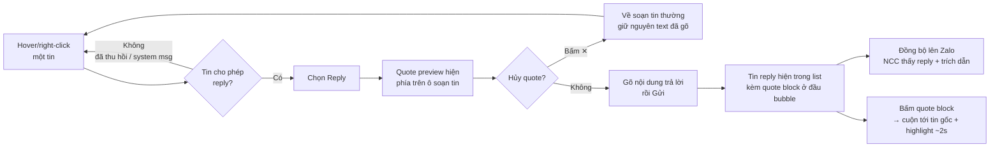

# #7 — Reply (trích dẫn tin nhắn)

> **Trạng thái:** draft
> **Nguồn:** [`../scope-and-features.md § B.7`](../scope-and-features.md) (canonical) · [`../FSD-Chat-Portal.md § 3.4`](../FSD-Chat-Portal.md) · cấu trúc bubble & hover menu chung [`../FSD-Chat-Portal.md § 3.1`](../FSD-Chat-Portal.md)
> **Liên quan:** quy tắc hiển thị tên ([`../scope-and-features.md § 6`](../scope-and-features.md)) · thu hồi tin (#9) · mask SĐT trong nhóm (#28) · gửi/nhận TXT ([`#5`](05-gui-nhan-tin-nhan-van-ban.md)) · gửi/nhận media ([`#6`](06-gui-nhan-media-va-file.md))

---

## 📌 Tóm tắt 1 dòng

Nhân viên trích dẫn một tin cụ thể trong nhóm NCC rồi trả lời, giúp giữ đúng ngữ cảnh khi nhóm có nhiều luồng trao đổi song song — phần trích dẫn lẫn câu trả lời đều đồng bộ lên Zalo.

---

## 🎯 Giá trị nghiệp vụ

Trong một nhóm NCC bận rộn, nhiều chủ đề chen nhau trong cùng một dòng tin: báo giá, tình trạng đơn, lịch giao hàng… Khi nhân viên gõ một câu trả lời trống không, NCC dễ không biết đang nói về tin nào, dẫn tới hiểu nhầm hoặc phải hỏi lại.

Tính năng Reply cho phép chọn đúng tin cần phản hồi và đính kèm một đoạn trích dẫn ngắn ngay đầu câu trả lời. Người đọc — cả nhân viên lẫn NCC trên Zalo — nhìn vào là biết câu trả lời gắn với tin nào. Trên Portal, mỗi đoạn trích dẫn còn là một "đường nhảy": bấm vào sẽ cuộn thẳng tới tin gốc và làm nổi nó lên, kể cả khi tin gốc nằm rất xa phía trên.

Vì phần trích dẫn được giữ nguyên khi đồng bộ lên Zalo, trải nghiệm trên Portal và trên Zalo nhất quán — không phát sinh tình trạng "bên thấy trích dẫn, bên không".

**Lợi ích:**

- Giữ đúng ngữ cảnh hội thoại, giảm hiểu nhầm khi nhóm có nhiều luồng cùng lúc.
- Một cú bấm để nhảy về đúng tin gốc, không phải cuộn tìm thủ công.
- Trích dẫn đồng bộ hai chiều với Zalo nên NCC cũng thấy được tin đang được trả lời.

---

## 👥 Vai trò liên quan

| Vai trò | Trách nhiệm |
| --- | --- |
| **Nhân viên (Staff)** | Trích dẫn và trả lời tin của NCC hoặc tin nội bộ trong nhóm được phân quyền; bấm trích dẫn để nhảy về tin gốc. |
| **Quản trị (Admin)** | Reply như Nhân viên. Đối với tin gốc đã thu hồi, vẫn thấy nội dung gốc trong đoạn trích dẫn (theo quy tắc thu hồi #9). |
| **NCC (Vendor)** | Nhận câu trả lời kèm phần trích dẫn trên Zalo dưới luồng reply gốc của Zalo. Không thao tác trên Portal. |
| **Hệ thống** | Dựng đoạn trích dẫn (tên người gửi gốc + đoạn nội dung + thumbnail/tên file) · đồng bộ tin reply lên Zalo · xử lý nhảy-về tin gốc kể cả khi cần tải thêm lịch sử · cập nhật lại đoạn trích dẫn khi tin gốc bị thu hồi. |

---

## 🔄 Dòng chảy nghiệp vụ



---

## ✅ Kịch bản chấp nhận

```gherkin
# language: vi
Tính năng: Trích dẫn và trả lời một tin trong nhóm NCC

  Bối cảnh:
    Biết Nhân viên đã đăng nhập Chat Portal
    Và Nhân viên được phân quyền đại diện một tài khoản Zalo trong nhóm "NCC Phương Nam"
    Và Nhân viên đang mở nhóm "NCC Phương Nam"
    Và tài khoản đại diện cho nhóm đang ở trạng thái kết nối bình thường

  # =====================================================
  # Mở trích dẫn & xem trước
  # =====================================================

  Tình huống: Mở reply từ hover menu của một tin
    Biết trong nhóm có một tin văn bản của NCC
    Khi Nhân viên hover vào tin đó và chọn "Reply"
    Thì phía trên ô soạn tin xuất hiện khung trích dẫn (quote preview)
    Và khung trích dẫn hiển thị tên người gửi gốc và một đoạn nội dung tin gốc

  Tình huống: Đoạn nội dung trích dẫn dài bị rút gọn
    Biết tin gốc có nội dung dài hơn 120 ký tự
    Khi Nhân viên mở reply cho tin đó
    Thì đoạn nội dung trong khung trích dẫn chỉ hiển thị tối đa khoảng 120 ký tự đầu

  Khung tình huống: Nội dung khung trích dẫn theo loại tin gốc
    Biết tin gốc thuộc loại "<loai>"
    Khi Nhân viên mở reply cho tin đó
    Thì khung trích dẫn hiển thị "<hien_thi>"

    Dữ liệu:
      | loai      | hien_thi                                            |
      | văn bản   | tên người gửi gốc + đoạn nội dung (tối đa ~120 ký tự) |
      | hình ảnh  | tên người gửi gốc + thumbnail ảnh                    |
      | tài liệu  | tên người gửi gốc + tên file                         |
      | video     | tên người gửi gốc + thumbnail video                  |

  Tình huống: Hủy trích dẫn vẫn giữ nội dung đã gõ
    Biết Nhân viên đã mở reply và đã gõ dở "đồng ý giá này" trong ô soạn tin
    Khi Nhân viên bấm nút ✕ trên khung trích dẫn
    Thì khung trích dẫn biến mất, ô soạn tin quay về chế độ soạn thường
    Và nội dung "đồng ý giá này" vẫn còn nguyên trong ô soạn tin

  # =====================================================
  # Gửi tin reply — happy path
  # =====================================================

  Tình huống: Gửi một tin reply
    Biết Nhân viên đã mở reply cho một tin của NCC
    Và Nhân viên đã gõ nội dung trả lời
    Khi Nhân viên nhấn Gửi
    Thì tin trả lời xuất hiện trong khung chat với một quote block ở đầu bubble
    Và quote block hiển thị tên người gửi gốc và đoạn trích dẫn của tin gốc

  Tình huống: Tin reply đồng bộ lên Zalo kèm phần trích dẫn
    Biết Nhân viên vừa gửi một tin reply trích dẫn tin của NCC
    Khi tin đồng bộ xong lên Zalo
    Thì NCC thấy trên Zalo cả nội dung trả lời lẫn phần trích dẫn tin gốc

  Tình huống: Reply tin của chính mình
    Biết trong nhóm có một tin do chính Nhân viên gửi trước đó
    Khi Nhân viên hover vào tin đó và chọn "Reply"
    Thì khung trích dẫn mở ra bình thường cho phép trả lời

  Tình huống: Tên người trong trích dẫn theo quy tắc hiển thị tên
    Biết tin gốc là tin ZALO do một nhân viên khác gửi qua tài khoản đại diện "Z"
    Khi Nhân viên mở reply cho tin đó
    Thì tên trong khung trích dẫn hiển thị theo dạng "Z (Tên nhân viên)" giống như trong khung chat

  # =====================================================
  # Nhảy về tin gốc
  # =====================================================

  Tình huống: Bấm quote block để nhảy về tin gốc
    Biết trong nhóm có một tin reply trích dẫn một tin còn hiển thị trong list
    Khi Nhân viên bấm vào quote block ở đầu bubble reply
    Thì khung chat cuộn tới đúng tin gốc
    Và tin gốc được làm nổi (highlight) tạm thời khoảng 2 giây

  Tình huống: Nhảy về tin gốc nằm rất xa phía trên
    Biết tin gốc đã không còn nằm trong phần list đang tải
    Khi Nhân viên bấm vào quote block của tin reply
    Thì hệ thống tải thêm lịch sử để tìm tin gốc rồi cuộn tới và làm nổi nó

  # =====================================================
  # Tương tác với thu hồi (#9)
  # =====================================================

  Tình huống: Không cho reply một tin đã thu hồi
    Biết trong nhóm có một tin đã bị thu hồi
    Khi Nhân viên hover vào tin đã thu hồi đó
    Thì hover menu không hiển thị mục "Reply"

  Tình huống: Tin gốc bị thu hồi sau khi đã có tin reply — Staff
    Biết một tin reply đang trích dẫn tin gốc "T"
    Và Nhân viên đang xem với vai trò Staff
    Khi tin gốc "T" bị thu hồi
    Thì quote block trong tin reply tự cập nhật thành "Tin nhắn đã thu hồi"

  Tình huống: Tin gốc bị thu hồi sau khi đã có tin reply — Admin
    Biết một tin reply đang trích dẫn tin gốc "T"
    Và người xem đang ở vai trò Admin
    Khi tin gốc "T" bị thu hồi
    Thì quote block trong tin reply vẫn hiển thị nội dung gốc của "T" cho Admin

  # =====================================================
  # Mask số điện thoại trong trích dẫn (#28)
  # =====================================================

  Tình huống: Trích dẫn tin chứa số điện thoại trong nhóm đang ẩn số
    Biết nhóm đang bật chế độ ẩn số điện thoại
    Và tin gốc chứa một số điện thoại
    Khi Nhân viên (vai trò Staff) mở reply hoặc xem quote block của tin đó
    Thì số điện thoại trong đoạn trích dẫn cũng bị che giống như trong khung chat

  # =====================================================
  # Trường hợp đặc biệt
  # =====================================================

  Tình huống: Không reply được tin hệ thống
    Biết trong nhóm có một tin hệ thống (ví dụ thông báo công việc hoặc yêu cầu xem SĐT)
    Khi Nhân viên hover vào tin hệ thống đó
    Thì không có hover menu nên không có mục "Reply"

  Tình huống: Trích dẫn tin của một NCC đã rời nhóm
    Biết tin gốc do một thành viên NCC đã rời nhóm gửi trước đó
    Khi Nhân viên mở reply cho tin đó
    Thì khung trích dẫn vẫn hiển thị tên cũ và đoạn nội dung của thành viên đã rời nhóm
```

---

## 🎨 Mô tả giao diện

### Khung trích dẫn (quote preview) trên ô soạn tin

```
┌─────────────────────────────────────────────────────────────┐
│ ┌─ Đang trả lời ─────────────────────────────────────┐  [✕] │
│ │ ▍ Phương Nam (NCC)                                  │      │
│ │ ▍ Báo giá tháng 7: thùng 20kg là 185k, thùng 10k…   │      │
│ └─────────────────────────────────────────────────────┘      │
│ [📎]  Nhập tin nhắn...                              [➤ Gửi]  │
└─────────────────────────────────────────────────────────────┘
```

- Khung trích dẫn nằm **ngay trên ô soạn tin**, có viền nhấn (thanh dọc trái) để phân biệt với nội dung sẽ gõ.
- Có nút **✕** để hủy trích dẫn — bấm vào quay về soạn tin thường, **giữ nguyên** nội dung text đã gõ.

### Bubble tin reply trong khung chat

```
┌─────────────────────────────────────────────────┐
│  ▍ Phương Nam (NCC)                              │
│  ▍ Báo giá tháng 7: thùng 20kg là 185k…   ⟶ jump │
│  ─────────────────────────────────────────────   │
│  Ok bên mình chốt thùng 20kg nhé.        09:24   │
└─────────────────────────────────────────────────┘
```

- **Quote block** nằm ở đầu bubble, phía trên nội dung trả lời.
- Bấm vào quote block → **cuộn tới tin gốc + highlight ~2s**. Nếu tin gốc nằm xa ngoài vùng đang tải → hệ thống tải thêm lịch sử rồi mới nhảy tới.

### Nội dung trích dẫn theo loại tin gốc

| Loại tin gốc | Hiển thị trong trích dẫn |
| --- | --- |
| **Văn bản** | Tên người gửi gốc + đoạn nội dung (tối đa ~120 ký tự đầu) |
| **Hình ảnh** | Tên người gửi gốc + thumbnail ảnh |
| **Tài liệu** | Tên người gửi gốc + tên file |
| **Video** | Tên người gửi gốc + thumbnail video |

### Quy tắc hiển thị tên trong trích dẫn

- Tên người gửi gốc tuân theo **quy tắc hiển thị tên chung** (xem [`../scope-and-features.md § 6`](../scope-and-features.md)): tin ZALO của nhân viên hiện dạng `Z.displayName (Tên nhân viên)`, tin của NCC hiện tên Zalo của NCC, v.v.
- Khi nhóm **đang bật ẩn số điện thoại** (#28): số trong đoạn trích dẫn cũng bị che theo trạng thái hiện tại của nhóm — giống hệt trong khung chat.

### Khi tin gốc bị thu hồi sau khi đã reply

| Vai trò | Quote block hiển thị |
| --- | --- |
| **Staff** | "Tin nhắn đã thu hồi" (placeholder, không còn nội dung) |
| **Admin** | Vẫn thấy nội dung gốc của tin trong trích dẫn |

### Mockup tham chiếu

> ⏳ **Cần BA bổ sung:**
> - Khung trích dẫn (quote preview) trên ô soạn tin — có nút ✕.
> - Bubble tin reply với quote block ở đầu (loại văn bản, ảnh, file, video).
> - Quote block khi tin gốc đã bị thu hồi sau khi reply — bản Staff vs bản Admin.
> - Hiệu ứng nhảy-về + highlight tin gốc ~2s khi bấm quote block.

---

## 🔗 Tham chiếu & Q&A

### Liên quan các phần khác

- [`Cấu trúc message bubble & hover menu chung`](../FSD-Chat-Portal.md) (`§ 3.1`): hover menu chứa mục Reply; tin hệ thống không có hover menu nên không reply được — #7 dựa trên nền tảng này.
- [`Quy tắc hiển thị tên`](../scope-and-features.md) (`§ 6`): tên người gửi gốc trong đoạn trích dẫn áp dụng cùng quy tắc với khung chat (`§ 6.1`); trạng thái thu hồi áp dụng `§ 6.2`.
- **#9 Thu hồi tin nhắn** (`../FSD-Chat-Portal.md § 3.6`, chưa tách): tin đã thu hồi ẩn mục Reply; tin gốc thu hồi sau khi đã reply → quote block cập nhật theo vai trò. #7 chỉ tham chiếu, không lặp logic thu hồi.
- **#28 Mask SĐT** (`../FSD-Chat-Portal.md § C.28` + `FR-28.10`, chưa tách): số trong đoạn trích dẫn bị che theo trạng thái nhóm. #7 chỉ tham chiếu, không lặp logic mask.
- [`#5 Gửi/nhận TXT`](05-gui-nhan-tin-nhan-van-ban.md) · [`#6 Gửi/nhận media`](06-gui-nhan-media-va-file.md): cùng ô soạn tin và cơ chế đồng bộ lên Zalo; tin reply là một biến thể của tin văn bản/media kèm tham chiếu tin gốc.

### ⚠️ Q&A cần BA / PO làm rõ

1. **Có cho phép reply tin nội bộ (INTERNAL) ngoài tin ZALO không?**
   - `FSD-Chat-Portal.md § 3.4` ghi Actor "Admin (reply tin của vendor **hoặc tin nội bộ**)" — hàm ý reply được tin nội bộ.
   - Nhưng `FR-19.10` (Nhật ký công việc) ghi "Quote/Reply không hỗ trợ trong Mốc 3 — có thể defer", và một số tin nội bộ (TASK, PHONE_REVEAL_*) là tin hệ thống không có hover menu nên chắc chắn không reply được.
   - **Pilot hiện đang theo:** reply áp dụng cho tin ZALO và tin nội bộ **có hover menu**; tin hệ thống (TASK, PHONE_REVEAL_*) và tin trong Nhật ký công việc thì không. Cần BA/PO xác nhận phạm vi tin nội bộ được reply.

2. **Độ dài snippet trích dẫn ~120 ký tự là cứng hay co theo giao diện?**
   - Nguồn ghi "~120 ký tự" (xấp xỉ). Chưa rõ là ngưỡng cắt cứng hay rút gọn theo bề rộng khung.
   - **Pilot hiện đang theo:** cắt mềm khoảng 120 ký tự đầu rồi thêm dấu "…". Cần BA xác nhận con số chính xác để QC kiểm thử.

3. **Khi reply một tin reply (trích dẫn lồng nhau) thì hiển thị thế nào?**
   - Nguồn không đề cập trường hợp tin gốc bản thân nó cũng là một tin reply.
   - Phương án A: chỉ trích dẫn lớp ngoài cùng (nội dung trả lời của tin gốc), không lồng nhiều lớp.
   - Phương án B: hiển thị lồng đầy đủ nhiều lớp trích dẫn.
   - **Pilot hiện đang theo:** chưa quyết — nghiêng về Phương án A (1 lớp). Cần BA/PO xác nhận.

4. **Khi NCC reply từ Zalo, Portal có dựng lại quote block tương ứng không?**
   - Nguồn nhấn mạnh chiều Portal → Zalo (tin reply gửi đi giữ trích dẫn). Chưa mô tả rõ chiều Zalo → Portal khi NCC dùng tính năng reply gốc của Zalo.
   - **Pilot hiện đang theo:** giả định khi đồng bộ về, nếu tin của NCC có tham chiếu reply thì Portal dựng lại quote block tương ứng. Cần BA xác nhận có trong phạm vi Phase 2 không.
