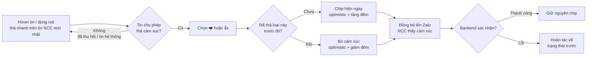

# #8 — Thả cảm xúc (react emoji)

> **Trạng thái:** draft
> **Nguồn:** [`../scope-and-features.md § B.8`](../scope-and-features.md) (canonical) · [`../FSD-Chat-Portal.md § 3.5`](../FSD-Chat-Portal.md) · cấu trúc bubble & hover menu chung [`../FSD-Chat-Portal.md § 3.1`](../FSD-Chat-Portal.md)
> **Liên quan:** quy tắc hiển thị tên ([`../scope-and-features.md § 6`](../scope-and-features.md)) · thu hồi tin ([`#9`](09-thu-hoi-tin-nhan.md)) · gửi/nhận TXT ([`#5`](05-gui-nhan-tin-nhan-van-ban.md)) · trạng thái kết nối & read-only ([`../FSD-Chat-Portal.md § 2.1`](../FSD-Chat-Portal.md))

---

## 📌 Tóm tắt 1 dòng

Nhân viên (và NCC qua Zalo) thả nhanh một trong hai cảm xúc ❤️ hoặc 👍 lên một tin trong nhóm NCC để phản hồi mà không cần gõ tin trả lời, và cảm xúc đồng bộ hai chiều với Zalo.

---

## 🎯 Giá trị nghiệp vụ

Trong trao đổi với NCC, rất nhiều phản hồi chỉ là xác nhận ngắn: "ok", "đã nhận", "đồng ý". Nếu lần nào cũng gõ một câu, dòng tin bị loãng và NCC khó phân biệt đâu là xác nhận đâu là yêu cầu mới.

Thả cảm xúc cho phép đáp lại đúng một tin chỉ bằng một cú bấm: chọn ❤️ hoặc 👍, biểu tượng hiện ngay dưới tin đó. Cảm xúc được đồng bộ hai chiều với Zalo nên khi nhân viên thả từ Portal, NCC thấy trên Zalo; ngược lại khi NCC thả từ Zalo, nhân viên thấy trên Portal. Trải nghiệm nhất quán giữa hai phía, không phát sinh tình trạng "một bên thấy cảm xúc, một bên không".

Để thao tác nhanh hơn nữa, tin mới nhất của NCC luôn hiện sẵn hai biểu tượng ❤️ 👍 ngay dưới bóng tin — nhân viên xác nhận chỉ bằng một cú bấm, không cần rê chuột mở menu.

**Lợi ích:**

- Phản hồi xác nhận tức thì, giảm tin "ok/đồng ý" làm loãng hội thoại.
- Cảm xúc đồng bộ hai chiều với Zalo nên cả nhân viên lẫn NCC đều thấy nhất quán.
- Tin mới nhất của NCC có sẵn nút thả nhanh, giảm thao tác cho nhân viên.

---

## 👥 Vai trò liên quan

| Vai trò | Trách nhiệm |
| --- | --- |
| **Nhân viên (Staff)** | Thả/bỏ cảm xúc ❤️ hoặc 👍 lên tin trong nhóm được phân quyền. Thả được kể cả khi nhóm đang ở trạng thái chỉ-xem (không gửi được tin mới). |
| **Quản trị (Admin)** | Thả/bỏ cảm xúc như Nhân viên trong các nhóm truy cập được. |
| **NCC (Vendor)** | Thả cảm xúc từ Zalo bằng tính năng gốc của Zalo; cảm xúc đồng bộ về Portal kèm đúng danh tính NCC. Không thao tác trên Portal. |
| **Hệ thống** | Hiển thị chip cảm xúc + bộ đếm dưới bóng tin · cập nhật lạc quan (optimistic) rồi đồng bộ hai chiều với Zalo · gom danh sách "ai đã thả" cho tooltip theo quy tắc hiển thị tên · ẩn thao tác thả với tin đã thu hồi và tin hệ thống. |

---

## 🔄 Dòng chảy nghiệp vụ



---

## ✅ Kịch bản chấp nhận

```gherkin
# language: vi
Tính năng: Thả cảm xúc ❤️ hoặc 👍 lên một tin trong nhóm NCC

  Bối cảnh:
    Biết Nhân viên đã đăng nhập Chat Portal
    Và Nhân viên được phân quyền truy cập nhóm "NCC Phương Nam"
    Và Nhân viên đang mở nhóm "NCC Phương Nam"

  # =====================================================
  # Thả & bỏ cảm xúc — happy path
  # =====================================================

  Tình huống: Thả cảm xúc ❤️ từ hover menu
    Biết trong nhóm có một tin văn bản của NCC chưa có cảm xúc nào
    Khi Nhân viên hover vào tin đó và chọn biểu tượng "❤️"
    Thì dưới bóng tin xuất hiện chip "❤️ 1"

  Tình huống: Thả cảm xúc 👍 từ hover menu
    Biết trong nhóm có một tin văn bản của NCC chưa có cảm xúc nào
    Khi Nhân viên hover vào tin đó và chọn biểu tượng "👍"
    Thì dưới bóng tin xuất hiện chip "👍 1"

  Tình huống: Bỏ cảm xúc bằng cách bấm lại biểu tượng đã thả
    Biết Nhân viên đã thả "❤️" lên một tin
    Khi Nhân viên bấm lại biểu tượng "❤️" trong hover menu của tin đó
    Thì cảm xúc của Nhân viên bị gỡ và bộ đếm "❤️" giảm đi 1

  Tình huống: Bỏ cảm xúc bằng cách bấm vào chip mình đã thả
    Biết Nhân viên là người duy nhất đã thả "👍" lên một tin
    Khi Nhân viên bấm vào chip "👍 1" dưới bóng tin
    Thì cảm xúc bị gỡ và chip "👍" biến mất khỏi bóng tin

  Tình huống: Thả được cả hai loại cảm xúc lên cùng một tin
    Biết Nhân viên đã thả "❤️" lên một tin
    Khi Nhân viên thả thêm "👍" lên chính tin đó
    Thì dưới bóng tin hiển thị cả "❤️ 1" và "👍 1"

  # =====================================================
  # Ràng buộc loại & số lượng cảm xúc
  # =====================================================

  Tình huống: Chỉ có đúng hai biểu tượng để chọn
    Khi Nhân viên hover vào một tin của NCC
    Thì menu thả cảm xúc chỉ hiển thị hai biểu tượng "❤️" và "👍"
    Và không có lựa chọn biểu tượng cảm xúc nào khác

  Tình huống: Mỗi người chỉ thả tối đa một cảm xúc mỗi loại cho cùng một tin
    Biết Nhân viên đã thả "❤️" lên một tin
    Khi Nhân viên bấm lại biểu tượng "❤️" trên tin đó
    Thì hệ thống không cộng thêm mà chuyển thành bỏ cảm xúc "❤️" (toggle)

  Tình huống: Bộ đếm cộng dồn cảm xúc của nhiều người
    Biết một tin đã có "❤️" do một nhân viên khác thả
    Khi Nhân viên cũng thả "❤️" lên tin đó
    Thì chip hiển thị "❤️ 2"

  # =====================================================
  # Tooltip "ai đã thả"
  # =====================================================

  Tình huống: Hover chip để xem ai đã thả cảm xúc
    Biết một tin có chip "❤️ 2" do hai người thả
    Khi Nhân viên hover vào chip "❤️ 2"
    Thì hệ thống hiển thị tooltip liệt kê tên những người đã thả "❤️"

  Tình huống: Tên trong tooltip theo quy tắc hiển thị tên
    Biết một tin ZALO được một nhân viên khác thả "👍" qua tài khoản đại diện "Z"
    Khi Nhân viên hover vào chip "👍"
    Thì tên người thả trong tooltip hiển thị theo dạng "Z (Tên nhân viên)" giống như trong khung chat

  # =====================================================
  # Thanh thả nhanh trên tin NCC mới nhất (FR-8.5)
  # =====================================================

  Tình huống: Tin mới nhất của NCC hiện sẵn nút thả nhanh
    Biết tin mới nhất trong khung chat là một tin của NCC
    Khi Nhân viên nhìn vào tin đó mà không cần hover
    Thì ngay dưới bóng tin có sẵn hai biểu tượng "❤️" và "👍" để bấm thả nhanh

  Tình huống: Thả nhanh trên tin NCC mới nhất không cần mở menu
    Biết tin mới nhất của NCC đang hiện sẵn hai biểu tượng thả nhanh
    Khi Nhân viên bấm trực tiếp biểu tượng "👍" dưới bóng tin đó
    Thì chip "👍 1" xuất hiện ngay mà không cần mở hover menu

  # =====================================================
  # Đồng bộ hai chiều với Zalo
  # =====================================================

  Tình huống: Cảm xúc thả từ Portal đồng bộ lên Zalo
    Biết Nhân viên vừa thả "❤️" lên một tin của NCC
    Khi cảm xúc đồng bộ xong lên Zalo
    Thì NCC thấy cảm xúc "❤️" trên tin tương ứng trong nhóm chat Zalo

  Tình huống: Cảm xúc NCC thả từ Zalo đồng bộ về Portal
    Biết NCC vừa thả "👍" lên một tin bằng tính năng cảm xúc gốc của Zalo
    Khi cảm xúc đồng bộ về Portal
    Thì dưới bóng tin trên Portal xuất hiện chip "👍" ghi nhận đúng tác giả là NCC

  Tình huống: Bỏ cảm xúc cũng đồng bộ lên Zalo
    Biết Nhân viên đã thả "❤️" và cảm xúc đã đồng bộ lên Zalo
    Khi Nhân viên bỏ cảm xúc "❤️"
    Thì cảm xúc "❤️" cũng bị gỡ trên Zalo

  # =====================================================
  # Cập nhật lạc quan & lỗi đồng bộ
  # =====================================================

  Tình huống: Hiển thị lạc quan khi thả cảm xúc
    Khi Nhân viên thả "❤️" lên một tin
    Thì chip cảm xúc hiện ngay trên giao diện trước khi backend xác nhận

  Tình huống: Hoàn tác khi đồng bộ thất bại
    Biết Nhân viên vừa thả "❤️" và chip đã hiện lạc quan
    Khi backend báo lỗi đồng bộ
    Thì chip "❤️" được hoàn tác về trạng thái trước khi thả

  # =====================================================
  # Quyền hạn & trạng thái kết nối
  # =====================================================

  Tình huống: Nhân viên chỉ-xem vẫn thả được cảm xúc
    Biết Nhân viên đang ở nhóm mà ô soạn tin bị khóa (chỉ-xem, không gửi được tin mới)
    Khi Nhân viên hover vào một tin của NCC
    Thì Nhân viên vẫn thả được cảm xúc "❤️" hoặc "👍"

  # =====================================================
  # Trường hợp đặc biệt
  # =====================================================

  Tình huống: Không thả được cảm xúc lên tin đã thu hồi
    Biết trong nhóm có một tin đã bị thu hồi
    Khi Nhân viên hover vào tin đã thu hồi đó
    Thì hover menu không hiển thị biểu tượng thả cảm xúc

  Tình huống: Không thả được cảm xúc lên tin hệ thống
    Biết trong nhóm có một tin hệ thống (ví dụ thông báo công việc hoặc yêu cầu xem SĐT)
    Khi Nhân viên hover vào tin hệ thống đó
    Thì không có hover menu nên không có biểu tượng thả cảm xúc
```

---

## 🎨 Mô tả giao diện

### Chip cảm xúc dưới bóng tin

```
┌─────────────────────────────────────────────────┐
│  Phương Nam (NCC)                        09:24   │
│  Báo giá tháng 7 gửi anh xem nhé.                │
│  ┌──────────┐ ┌──────────┐                       │
│  │  ❤️ 2    │ │  👍 1    │                        │
│  └──────────┘ └──────────┘                       │
└─────────────────────────────────────────────────┘
```

- Chip cảm xúc nằm **ngay dưới nội dung tin**, mỗi loại một chip kèm **bộ đếm tổng** số người đã thả.
- **Hover vào chip** → tooltip liệt kê tên những người đã thả loại cảm xúc đó (theo quy tắc hiển thị tên ở [`../scope-and-features.md § 6`](../scope-and-features.md)).
- **Bấm vào chip mình đã thả** → bỏ cảm xúc (toggle off). Chip mất khi bộ đếm về 0.

### Menu thả cảm xúc (hover / right-click)

```
        ┌──────────────────────────────┐
        │  ❤️   👍   ↩   📌   ➤   ☆     │   ← hover menu chung (§ 3.1)
        └──────────────────────────────┘
```

- Menu thả cảm xúc chỉ gồm **đúng hai biểu tượng ❤️ và 👍** — không có biểu tượng nào khác.
- Biểu tượng đang được chính người dùng thả được làm nổi (active) để phân biệt với chưa thả.
- Đây là một phần của hover menu chung của bóng tin (Reply · React · Thu hồi · Ghim · Forward · Bookmark — xem [`../FSD-Chat-Portal.md § 3.1`](../FSD-Chat-Portal.md)). Tin hệ thống không có hover menu.

### Thanh thả nhanh trên tin NCC mới nhất

```
┌─────────────────────────────────────────────────┐
│  Phương Nam (NCC)                        09:31   │
│  Bên em chốt đơn nhé anh.                        │
│  ─────────────────────────────────────────────   │
│   ❤️    👍       ← luôn hiện sẵn, không cần hover │
└─────────────────────────────────────────────────┘
```

- Tin **mới nhất của NCC** trong khung chat luôn hiển thị sẵn hai biểu tượng ❤️ 👍 ngay dưới bóng tin, không cần rê chuột.
- Bấm trực tiếp để thả nhanh; sau khi thả, chip cảm xúc + bộ đếm hiện như mục trên.

### Trạng thái cảm xúc

| Trạng thái | Hiển thị |
| --- | --- |
| **Chưa thả** | Không có chip dưới bóng tin; biểu tượng trong menu ở dạng thường |
| **Đã thả (của chính mình)** | Chip hiện kèm bộ đếm; biểu tượng tương ứng trong menu được làm nổi |
| **Đang đồng bộ (optimistic)** | Chip hiện ngay; ngầm chờ backend xác nhận |
| **Lỗi đồng bộ** | Chip hoàn tác về trạng thái trước khi thả |

### Mockup tham chiếu

> ⏳ **Cần BA bổ sung:**
> - Bóng tin có chip cảm xúc `❤️ 2 · 👍 1` dưới nội dung.
> - Tooltip "ai đã thả" khi hover chip (gồm tên nhân viên theo quy tắc § 6 và tên NCC).
> - Hover menu hiện hai biểu tượng ❤️ 👍, có trạng thái active khi chính mình đã thả.
> - Thanh thả nhanh ❤️ 👍 luôn hiện trên tin NCC mới nhất.

---

## 🔗 Tham chiếu & Q&A

### Liên quan các phần khác

- [`Cấu trúc message bubble & hover menu chung`](../FSD-Chat-Portal.md) (`§ 3.1`): hover menu chứa mục React; tin hệ thống (TASK, PHONE_REVEAL_*) không có hover menu nên không thả cảm xúc được — #8 dựa trên nền tảng này.
- [`Quy tắc hiển thị tên`](../scope-and-features.md) (`§ 6`): danh sách "ai đã thả" trong tooltip áp dụng cùng quy tắc hiển thị tên với khung chat (tin ZALO của nhân viên hiện `Z (Tên nhân viên)`, tin của NCC hiện tên Zalo).
- **#9 Thu hồi tin nhắn** (`../FSD-Chat-Portal.md § 3.6`, chưa tách): tin đã thu hồi ẩn biểu tượng thả cảm xúc trong hover menu. #8 chỉ tham chiếu, không lặp logic thu hồi.
- **Trạng thái kết nối & chỉ-xem** (`../FSD-Chat-Portal.md § 2.1` + đoạn read-only): nhân viên trong nhóm chỉ-xem vẫn thả cảm xúc được — chỉ bị chặn gửi tin mới, reply, mention.
- [`#5 Gửi/nhận TXT`](05-gui-nhan-tin-nhan-van-ban.md): cùng cơ chế đồng bộ hai chiều với Zalo; cảm xúc là một dạng tương tác trên tin đã có thay vì tạo tin mới.

### ⚠️ Q&A cần BA / PO làm rõ

1. **Nhãn "❤️ Like, 👍 Tim" trong tiêu chí Mốc 2 có bị đảo không?**
   - [`scope-and-features.md`](../scope-and-features.md) tại tiêu chí Mốc 2 ghi: "Thả cảm xúc (❤️ Like, 👍 Tim)" — gán ❤️ ↔ "Like" và 👍 ↔ "Tim", trong khi thông thường ❤️ là "Tim"/"Thả tim" và 👍 là "Like".
   - Phần § B.8 và § 3.5 chỉ nói "2 emoji ❤️ và 👍", không gán nhãn chữ.
   - **Pilot hiện đang theo:** dùng đúng biểu tượng ❤️ và 👍, không gắn nhãn chữ "Like/Tim" trên UI. Cần BA/PO xác nhận để tránh nhầm khi viết tooltip/label.

2. **Tin đã có sẵn cảm xúc rồi mới bị thu hồi thì các chip cảm xúc cũ có còn hiển thị không?**
   - Nguồn chỉ nói **không cho thả mới** lên tin đã thu hồi (ẩn biểu tượng trong menu), chưa nói rõ số phận các cảm xúc đã thả trước đó.
   - Phương án A: ẩn luôn chip cảm xúc cũ cùng nội dung khi tin bị thu hồi (đồng nhất với placeholder "Tin nhắn đã thu hồi").
   - Phương án B: giữ chip cảm xúc cũ nhưng không cho thay đổi.
   - **Pilot hiện đang theo:** chưa quyết — nghiêng về Phương án A (ẩn cùng nội dung). Cần BA/PO xác nhận, đặc biệt khác biệt giữa vai trò Staff và Admin (Admin còn thấy nội dung gốc theo #9).

3. **"Tin mới nhất của NCC" hiện nút thả nhanh — tính theo tin NCC cuối cùng hay tin cuối cùng trong khung chat?**
   - [`§ 3.5 FR-8.5`](../FSD-Chat-Portal.md) ghi rõ "tin nhắn **cuối cùng của vendor**" — tức tin NCC gần nhất, kể cả khi sau đó nhân viên đã gửi thêm tin.
   - Chưa rõ khi nhân viên gửi tin mới hơn thì thanh thả nhanh có còn neo ở tin NCC cũ hay biến mất.
   - **Pilot hiện đang theo:** thanh thả nhanh neo ở **tin NCC gần nhất** và giữ nguyên kể cả khi có tin nhân viên mới hơn. Cần BA xác nhận.

4. **Có thả cảm xúc trong DM Staff ↔ Admin (kênh Forward) không?**
   - § B.8 và § 3.5 mô tả cảm xúc trong phạm vi **vendor group** (tin ZALO). DM nội bộ (Forward #11) và Nhật Ký công việc (`FR-19.8` ghi rõ tin log không có reaction) nằm ngoài.
   - **Pilot hiện đang theo:** thả cảm xúc chỉ áp dụng cho tin ZALO trong vendor group; DM và Nhật Ký công việc không hỗ trợ. Cần BA/PO xác nhận có cần mở rộng sang DM không.

5. **Tooltip "ai đã thả" hiển thị tên NCC như thế nào khi nhiều thành viên NCC cùng thả?**
   - Nguồn nói tooltip liệt kê người đã thả theo quy tắc § 6, nhưng một nhóm Zalo có thể có nhiều thành viên NCC.
   - **Pilot hiện đang theo:** liệt kê đầy đủ tên Zalo của từng người đã thả (gồm cả NCC và nhân viên), giới hạn độ dài bằng "+N người khác" nếu quá dài. Cần BA xác nhận ngưỡng rút gọn.
