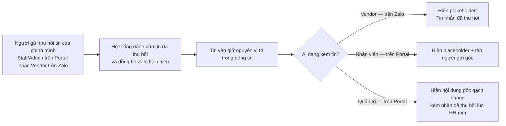

# #9 — Thu hồi tin nhắn

> **Trạng thái:** draft
> **Nguồn:** [`../scope-and-features.md § B.9`](../scope-and-features.md) (canonical) · [`../FSD-Chat-Portal.md § 3.6`](../FSD-Chat-Portal.md) · [`../FSD-Chat-Portal.md § 6.2`](../FSD-Chat-Portal.md)
> **Liên quan:** [`#7 Reply`](07-reply-trich-dan-tin-nhan.md) · #10 Ghim · #11 Forward đến Admin · #25 Đánh dấu (xem [`../FSD-Chat-Portal.md`](../FSD-Chat-Portal.md))

---

## 📌 Tóm tắt 1 dòng

Người gửi (Nhân viên, Quản trị hoặc Vendor) rút lại tin đã gửi nhầm; Nhân viên và Vendor chỉ còn thấy "Tin nhắn đã thu hồi", riêng Quản trị vẫn xem được nội dung gốc kèm gạch ngang để phục vụ truy vết.

---

## 🎯 Giá trị nghiệp vụ

Khi nhắn tin với khách hàng (vendor), nhân viên đôi khi gửi nhầm nội dung — sai số, sai khách, gửi nhầm nhóm. Zalo cho phép thu hồi tin đã gửi, và Portal cần phản ánh đúng hành vi đó để nhân viên tự xử lý mà không phải nhờ ai.

Tuy nhiên, nếu tin thu hồi biến mất hoàn toàn thì công ty mất khả năng kiểm soát: một nhân viên có thể gửi nội dung sai phạm rồi thu hồi để "xoá dấu vết". Vì vậy tính năng này tách rõ hai góc nhìn — **Nhân viên và Vendor thấy tin đã được rút lại**, nhưng **Quản trị luôn xem lại được nội dung gốc** (kèm gạch ngang và thời điểm thu hồi) để quy trách nhiệm khi cần.

Tin đã thu hồi vẫn nằm nguyên vị trí trong dòng tin (không bị xoá khỏi danh sách), giúp mạch hội thoại không bị đứt quãng.

**Lợi ích:**

- Nhân viên tự sửa sai khi gửi nhầm, không cần can thiệp thủ công.
- Công ty giữ được khả năng audit: mọi nội dung đã gửi đều truy lại được qua góc nhìn Quản trị.
- Vendor có trải nghiệm nhất quán với Zalo (thấy "Tin nhắn đã thu hồi").

---

## 👥 Vai trò liên quan

| Vai trò | Trách nhiệm |
| --- | --- |
| **Nhân viên (Staff)** | Thu hồi tin do **chính mình** gửi. Sau khi thu hồi chỉ còn thấy placeholder — không xem lại được nội dung gốc của bất kỳ tin thu hồi nào (kể cả tin của chính mình). |
| **Quản trị (Admin)** | Thu hồi tin do chính mình gửi. **Luôn** xem lại được nội dung gốc của **mọi** tin đã thu hồi (của Vendor, của Nhân viên khác) để phục vụ audit / quy trách nhiệm. |
| **Vendor (NCC)** | Thu hồi tin của họ từ phía Zalo. Chỉ thấy placeholder "Tin nhắn đã thu hồi". |
| **Hệ thống** | Đánh dấu tin đã thu hồi, đồng bộ hai chiều với Zalo, và hiển thị tin theo đúng vai trò người xem. Lưu log thu hồi ở backend phục vụ audit. |

---

## 🔄 Dòng chảy nghiệp vụ



---

## ✅ Kịch bản chấp nhận

```gherkin
# language: vi
Tính năng: Thu hồi tin nhắn đã gửi trong nhóm NCC

  Bối cảnh:
    Biết nhóm chat NCC đang đồng bộ hai chiều với Zalo
    Và dòng tin chứa các tin nhắn do Nhân viên, Quản trị và Vendor gửi

  # =====================================================
  # Thu hồi tin (happy path)
  # =====================================================

  Tình huống: Người gửi thu hồi tin của chính mình — không cần xác nhận
    Biết Nhân viên "Tăng Thị Huyền" vừa gửi một tin nhắn văn bản trong nhóm
    Khi "Tăng Thị Huyền" rê chuột lên tin đó và chọn "Thu hồi"
    Thì hệ thống thu hồi tin ngay lập tức, không hiển thị hộp thoại xác nhận
    Và trạng thái thu hồi được đồng bộ sang Zalo
    Và tin vẫn giữ nguyên vị trí trong dòng tin, không bị xoá khỏi danh sách

  # =====================================================
  # Chỉ thu hồi được tin của chính mình (FR-9.1)
  # =====================================================

  Tình huống: Hover menu hiện "Thu hồi" trên tin do chính người dùng gửi
    Biết trong nhóm có một tin do "Tăng Thị Huyền" gửi
    Khi "Tăng Thị Huyền" rê chuột lên tin của chính mình
    Thì hover menu hiển thị mục "Thu hồi"

  Tình huống: Không thể thu hồi tin của người khác
    Biết trong nhóm có một tin do Vendor gửi
    Khi Nhân viên "Tăng Thị Huyền" rê chuột lên tin của Vendor
    Thì hover menu không hiển thị mục "Thu hồi"

  # =====================================================
  # Hiển thị theo vai trò người xem
  # =====================================================

  Khung tình huống: Tin đã thu hồi hiển thị khác nhau tuỳ vai trò người xem
    Biết một tin nhắn trong nhóm đã bị thu hồi
    Khi người dùng vai trò "<vai_tro>" xem tin đó "<noi_xem>"
    Thì tin hiển thị "<hien_thi>"

    Dữ liệu:
      | vai_tro            | noi_xem    | hien_thi                                                              |
      | Vendor (NCC)       | trên Zalo  | placeholder "Tin nhắn đã thu hồi"                                     |
      | Nhân viên (Staff)  | trên Portal| placeholder "Tin nhắn đã thu hồi" kèm tên người gửi gốc              |
      | Quản trị (Admin)   | trên Portal| nội dung gốc đầy đủ, gạch ngang, kèm nhãn "(đã thu hồi lúc HH:mm)"   |

  # =====================================================
  # Quản trị luôn xem lại được nội dung gốc (FR-9.2)
  # =====================================================

  Tình huống: Quản trị xem lại nội dung gốc của tin do Vendor thu hồi từ Zalo
    Biết Vendor đã thu hồi một tin nhắn từ phía Zalo
    Và trạng thái thu hồi đã đồng bộ về Portal
    Khi Quản trị xem tin đó trên Portal
    Thì Quản trị thấy nội dung gốc đầy đủ với định dạng gạch ngang
    Và thấy nhãn thời điểm thu hồi

  Tình huống: Quản trị xem lại nội dung gốc của tin do Nhân viên khác thu hồi
    Biết Nhân viên "Tăng Thị Huyền" đã thu hồi một tin của mình
    Khi Quản trị xem tin đó trên Portal
    Thì Quản trị thấy nội dung gốc đầy đủ, gạch ngang, kèm nhãn thời điểm thu hồi

  # =====================================================
  # Nhân viên không bao giờ thấy nội dung gốc (FR-9.3)
  # =====================================================

  Tình huống: Nhân viên không thấy lại nội dung gốc tin mình vừa thu hồi
    Biết Nhân viên "Tăng Thị Huyền" vừa thu hồi tin của chính mình
    Khi "Tăng Thị Huyền" xem lại tin đó
    Thì chỉ thấy placeholder "Tin nhắn đã thu hồi"
    Và không thấy lại nội dung gốc

  # =====================================================
  # Tin đã thu hồi không cho tương tác (FR-9.4)
  # =====================================================

  Khung tình huống: Tin đã thu hồi ẩn hoặc vô hiệu hoá các thao tác tương tác
    Biết một tin đã bị thu hồi
    Khi Nhân viên hoặc Quản trị rê chuột lên tin đó
    Thì hover menu không cho thực hiện thao tác "<thao_tac>"

    Dữ liệu:
      | thao_tac             |
      | Thả cảm xúc (React)  |
      | Trả lời (Reply)      |
      | Forward đến Admin    |
      | Đánh dấu (Bookmark)  |
      | Ghim (Pin)           |

  # =====================================================
  # Không giới hạn thời gian phía Portal (FR-9.5)
  # =====================================================

  Tình huống: Portal không áp đặt thời hạn thu hồi riêng
    Biết Nhân viên đã gửi một tin từ lâu
    Và Zalo vẫn cho phép thu hồi tin đó
    Khi "Tăng Thị Huyền" chọn "Thu hồi" trên tin đó
    Thì hệ thống vẫn cho phép thu hồi, không chặn vì lý do thời gian từ phía Portal

  # =====================================================
  # Trường hợp đặc biệt
  # =====================================================

  Tình huống: Quản trị thu hồi tin của chính mình vẫn xem lại được nội dung gốc
    Biết Quản trị vừa thu hồi một tin do chính mình gửi
    Khi Quản trị xem lại tin đó
    Thì vẫn thấy nội dung gốc đầy đủ, gạch ngang, kèm nhãn thời điểm thu hồi

  Tình huống: Ảnh trong tin đã thu hồi không mở được trình xem ảnh với Nhân viên
    Biết một tin chứa hình ảnh đã bị thu hồi
    Khi Nhân viên xem tin đó
    Thì chỉ thấy placeholder, không thấy ảnh thu nhỏ và không mở được trình xem ảnh

  Tình huống: Quản trị vẫn mở được trình xem ảnh của tin đã thu hồi
    Biết một tin chứa hình ảnh đã bị thu hồi
    Khi Quản trị nhấn vào ảnh thu nhỏ trong tin đó
    Thì trình xem ảnh mở ra hiển thị ảnh gốc
    Và watermark động vẫn được áp dụng

  Tình huống: Tập tin trong tin đã thu hồi — Nhân viên không tải được
    Biết một tin chứa tập tin đã bị thu hồi
    Khi Nhân viên xem tin đó
    Thì chỉ thấy placeholder và không có tập tin để tải

  Tình huống: Quản trị vẫn tải được tập tin của tin đã thu hồi
    Biết một tin chứa tập tin đã bị thu hồi
    Khi Quản trị xem tin đó
    Thì Quản trị thấy nội dung gốc và tải được tập tin

  Tình huống: Tin đã forward đến DM Quản trị rồi mới thu hồi ở nhóm
    Biết một tin đã được forward đến DM Quản trị (xem #11)
    Và sau đó tin gốc trong nhóm bị thu hồi
    Khi Quản trị mở DM
    Thì bản forward vẫn giữ nội dung tại thời điểm forward (ảnh chụp trạng thái)

  Tình huống: Trích dẫn (quote) tự cập nhật khi tin gốc bị thu hồi sau khi đã trả lời
    Biết tin B trả lời (quote) tin A
    Khi tin A bị thu hồi sau đó
    Thì Nhân viên thấy phần quote trong tin B hiển thị "Tin nhắn đã thu hồi"
    Và Quản trị vẫn thấy nội dung gốc của tin A trong phần quote

  Tình huống: Tin đang được ghim sau đó bị thu hồi
    Biết một tin đang được ghim trong nhóm
    Khi tin đó bị thu hồi
    Thì thanh ghim vẫn giữ tin nhưng hiển thị placeholder "Tin nhắn đã thu hồi" với Nhân viên
    Và Quản trị vẫn thấy nội dung gốc gạch ngang trong thanh ghim

  Tình huống: Tin đã đánh dấu (bookmark) sau đó bị thu hồi
    Biết Nhân viên đã đánh dấu một tin
    Khi tin đó bị thu hồi
    Thì mục đã đánh dấu vẫn còn trong danh sách nhưng hiển thị placeholder "Tin nhắn đã thu hồi"
    Và Nhân viên vẫn có thể bỏ đánh dấu mục đó
```

---

## 🎨 Mô tả giao diện

### Bong bóng tin đã thu hồi — góc nhìn Nhân viên / Vendor

```
┌──────────────────────────────────────┐
│ 🚫 Tin nhắn đã thu hồi                │   ← placeholder, không có nội dung
│    — Tăng Thị Huyền                    │   ← tên người gửi gốc (chỉ Nhân viên thấy)
└──────────────────────────────────────┘
```

### Bong bóng tin đã thu hồi — góc nhìn Quản trị

```
┌──────────────────────────────────────┐
│  S̶ố̶ ̶k̶h̶á̶c̶h̶ ̶l̶à̶ ̶0̶9̶1̶2̶ ̶3̶4̶5̶ ̶6̶7̶8̶          │   ← nội dung gốc, gạch ngang
│  (đã thu hồi lúc 14:05)                │   ← nhãn thời điểm thu hồi
└──────────────────────────────────────┘
```

### Quy tắc hiển thị theo vai trò người xem

| Vai trò người xem | Nội dung | Định dạng | Tên / tác giả |
| --- | --- | --- | --- |
| **Vendor (trên Zalo)** | Không có | Placeholder "Tin nhắn đã thu hồi" | Theo cơ chế Zalo |
| **Nhân viên (trên Portal)** | Không có | Placeholder "Tin nhắn đã thu hồi" | Kèm tên người gửi gốc (dạng đơn giản, xem Q&A) |
| **Quản trị (trên Portal)** | Nội dung gốc đầy đủ | Gạch ngang (strikethrough) + nhãn "(đã thu hồi lúc HH:mm)" | Theo quy tắc tác giả thông thường ([`§ 6.1`](../FSD-Chat-Portal.md)) |

### Thao tác bị ẩn / vô hiệu hoá trên tin đã thu hồi

| Thao tác | Trạng thái trên tin đã thu hồi |
| --- | --- |
| Thả cảm xúc (React) | Ẩn khỏi hover menu |
| Trả lời (Reply) | Ẩn khỏi hover menu |
| Forward đến Admin | Ẩn khỏi hover menu |
| Đánh dấu (Bookmark) | Ẩn khỏi hover menu |
| Ghim (Pin) | Vô hiệu hoá |
| Thu hồi | Không còn (tin đã ở trạng thái thu hồi) |

### Hành vi với từng loại nội dung

| Loại tin | Nhân viên thấy | Quản trị thấy |
| --- | --- | --- |
| Văn bản | Placeholder | Nội dung gốc gạch ngang + nhãn thời điểm |
| Hình ảnh | Placeholder, không có ảnh thu nhỏ, không mở được trình xem | Ảnh thu nhỏ + caption gạch ngang; mở được trình xem (watermark vẫn áp dụng) |
| Tập tin | Placeholder, không tải được | Nội dung gốc + tải được tập tin |

### Mockup tham chiếu

> ⏳ **Cần BA bổ sung:**
> - Tin đã thu hồi — góc nhìn Nhân viên (placeholder + tên người gửi gốc).
> - Tin đã thu hồi — góc nhìn Quản trị (nội dung gốc + gạch ngang + nhãn thời điểm thu hồi).
> - Tin media (ảnh / tập tin) đã thu hồi ở cả hai góc nhìn.

---

## 🔗 Tham chiếu & Q&A

### Liên quan các phần khác

- [`#7 Reply (trích dẫn tin nhắn)`](07-reply-trich-dan-tin-nhan.md): tin đã thu hồi không cho trả lời; nếu tin gốc bị thu hồi **sau** khi đã có tin reply trích dẫn nó → quote tự cập nhật theo quy tắc #9 (Nhân viên thấy placeholder, Quản trị thấy nội dung gốc).
- **#10 Ghim tin nhắn** ([`../FSD-Chat-Portal.md § 3.7`](../FSD-Chat-Portal.md)): tin đã thu hồi không cho ghim; tin đã ghim rồi mới thu hồi vẫn giữ trong thanh ghim nhưng hiển thị placeholder (Quản trị vẫn thấy nội dung gốc).
- **#11 Forward đến Admin** ([`../FSD-Chat-Portal.md § 3.8`](../FSD-Chat-Portal.md)): tin đã thu hồi vẫn forward được; bản trong DM ghi nhận trạng thái tại thời điểm forward (ảnh chụp — vẫn còn nội dung).
- **#25 Đánh dấu (Bookmark)** ([`../FSD-Chat-Portal.md § 3.x`](../FSD-Chat-Portal.md)): tin đã đánh dấu rồi thu hồi vẫn giữ entry với placeholder; Nhân viên có thể bỏ đánh dấu.
- **#28 / #29 Ẩn SĐT**: với tin chứa số bị ẩn mà đã thu hồi — Nhân viên thấy placeholder (không có icon mắt); Quản trị luôn thấy nội dung gốc kèm số thật và định dạng gạch ngang.
- **Quy tắc tác giả tin nhắn** ([`../FSD-Chat-Portal.md § 6.1 – 6.2`](../FSD-Chat-Portal.md)): cách hiển thị tên người gửi cho tin thường vs tin đã thu hồi.

### ⚠️ Q&A cần BA / PO làm rõ

1. **Placeholder phía Nhân viên hiển thị tên người gửi gốc ở dạng nào?**
   - Hai nguồn có khác biệt nhỏ: [`§ 3.6`](../FSD-Chat-Portal.md) nói placeholder Nhân viên **"kèm tên người đã gửi tin gốc"**, trong khi [`§ 6.2`](../FSD-Chat-Portal.md) nói **"không có format author detail"**.
   - Phương án A: Nhân viên thấy **tên người gửi đơn giản** (ví dụ "Tăng Thị Huyền") cạnh placeholder, nhưng **không** dùng định dạng acting-as đầy đủ `Z.displayName (StaffName)`.
   - Phương án B: Nhân viên **không thấy bất kỳ thông tin tác giả nào** — chỉ placeholder trơn.
   - **Pilot hiện đang theo:** Phương án A (placeholder + tên người gửi đơn giản). Cần BA/PO xác nhận, vì hai mục nguồn diễn đạt khác nhau.

2. **Có cần xác nhận trước khi thu hồi không?**
   - Nguồn [`§ 3.6`](../FSD-Chat-Portal.md) ghi rõ **không có hộp thoại xác nhận** (thực hiện ngay). Đây là điểm khác với thao tác Thu hồi quyền xem SĐT (#29) vốn **có** xác nhận.
   - **Pilot hiện đang theo:** Thu hồi tin nhắn **không** cần xác nhận. Cần BA/PO xác nhận đây là chủ đích (tránh thu hồi nhầm khi click vội).
```
