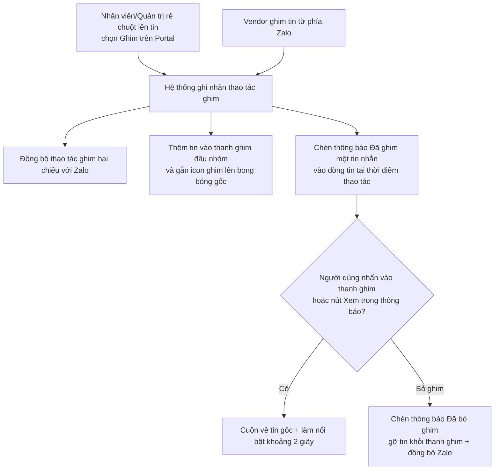

# #10 — Ghim tin nhắn

> **Trạng thái:** draft
> **Nguồn:** [`../scope-and-features.md § B.10`](../scope-and-features.md) (canonical) · [`../scope-and-features.md § G.2`](../scope-and-features.md) · [`../FSD-Chat-Portal.md § 3.7`](../FSD-Chat-Portal.md) · [`../FSD-Chat-Portal.md § 7.1 (G.2)`](../FSD-Chat-Portal.md)
> **Liên quan:** [`#9 Thu hồi tin nhắn`](09-thu-hoi-tin-nhan.md) · #7 Reply · #11 Forward đến Admin · #25 Đánh dấu (xem [`../FSD-Chat-Portal.md`](../FSD-Chat-Portal.md))

---

## 📌 Tóm tắt 1 dòng

Nhân viên hoặc Quản trị ghim những tin quan trọng lên thanh ghim đầu nhóm để mọi thành viên (cả Portal lẫn Zalo) tra cứu nhanh; mỗi lần ghim/bỏ ghim sinh một thông báo nhỏ trong dòng tin và đồng bộ thao tác lên Zalo.

---

## 🎯 Giá trị nghiệp vụ

Trong một nhóm chat với khách hàng (vendor), những tin quan trọng — yêu cầu báo giá, deadline, thông tin liên hệ, chốt đơn — dễ bị trôi mất khi hội thoại dài. Người dùng phải cuộn ngược lên rất xa để tìm lại, mất thời gian và dễ bỏ sót.

Tính năng Ghim tin nhắn cho phép Nhân viên hoặc Quản trị "đính" những tin đó lên **thanh ghim** ở đầu nhóm. Vì thao tác ghim được đồng bộ hai chiều với Zalo, chính khách hàng (vendor) cũng thấy tin được ghim trong nhóm Zalo của họ — hai bên cùng nhìn một danh sách tin quan trọng giống nhau, giảm hiểu lầm.

Mỗi lần ghim hoặc bỏ ghim, hệ thống chèn thêm một **thông báo nhỏ** vào đúng vị trí trong dòng tin ("[Tên người] đã ghim một tin nhắn"). Thông báo này vừa cho mọi người biết ai vừa thao tác, vừa là một dấu vết audit tự nhiên, vừa là lối tắt để nhảy nhanh về tin gốc.

**Lợi ích:**

- Tin quan trọng luôn ở trên cùng, tra cứu trong 1 cú nhấp thay vì cuộn tìm thủ công.
- Khách hàng và nội bộ cùng thấy chung danh sách tin được ghim (đồng bộ Zalo hai chiều).
- Mọi thao tác ghim/bỏ ghim đều để lại dấu vết ai làm, lúc nào — phục vụ truy vết.

---

## 👥 Vai trò liên quan

| Vai trò | Trách nhiệm |
| --- | --- |
| **Nhân viên (Staff)** | Ghim / bỏ ghim tin trong các nhóm được phép truy cập. Thấy thanh ghim, thông báo ghim/bỏ ghim và nút bỏ ghim. |
| **Quản trị (Admin)** | Tương tự Nhân viên trong các nhóm truy cập được. Là vai trò luôn xem được nội dung gốc của tin đã thu hồi nếu tin đó nằm trong thanh ghim. |
| **Vendor (NCC)** | Ghim / bỏ ghim từ phía **Zalo**. Thao tác này đồng bộ ngược về Portal. Vendor thấy danh sách tin ghim và thông báo ghim/bỏ ghim trong nhóm Zalo. |
| **Hệ thống** | Đồng bộ thao tác ghim hai chiều với Zalo, cập nhật thanh ghim, chèn thông báo ghim/bỏ ghim vào dòng tin, và hiển thị tin trong thanh ghim theo đúng vai trò người xem. |

---

## 🔄 Dòng chảy nghiệp vụ



---

## ✅ Kịch bản chấp nhận

```gherkin
# language: vi
Tính năng: Ghim và bỏ ghim tin nhắn trong nhóm NCC

  Bối cảnh:
    Biết nhóm chat NCC đang đồng bộ hai chiều với Zalo
    Và Nhân viên và Quản trị có quyền ghim tin trong nhóm họ truy cập được

  # =====================================================
  # Ghim tin (happy path)
  # =====================================================

  Tình huống: Ghim một tin thường trong nhóm
    Biết trong nhóm có một tin nhắn chưa được ghim
    Khi Nhân viên rê chuột lên tin đó và chọn "Ghim"
    Thì tin được thêm vào thanh ghim ở đầu danh sách tin
    Và bong bóng tin gốc xuất hiện icon ghim 📌 ở góc
    Và thao tác ghim được đồng bộ sang Zalo

  Tình huống: Ghim sinh thông báo trong dòng tin
    Biết trong nhóm có một tin nhắn chưa được ghim
    Khi Nhân viên "Tăng Thị Huyền" chọn "Ghim" trên tin đó
    Thì một thông báo "Tăng Thị Huyền đã ghim một tin nhắn" được chèn vào dòng tin tại thời điểm thao tác
    Và thông báo này hiển thị căn giữa, dạng pill bo tròn, không phải bong bóng tin thường

  Tình huống: Menu đổi nhãn khi tin đã được ghim
    Biết một tin đã được ghim
    Khi người dùng rê chuột lên tin đó
    Thì menu hiển thị mục "Bỏ ghim" thay cho "Ghim"

  # =====================================================
  # Bỏ ghim (FR-10.4, FR-G.2)
  # =====================================================

  Tình huống: Bỏ ghim một tin từ hover menu
    Biết một tin đang được ghim
    Khi Nhân viên rê chuột lên tin đó và chọn "Bỏ ghim"
    Thì tin được gỡ khỏi thanh ghim
    Và một thông báo "đã bỏ ghim một tin nhắn" được chèn vào dòng tin
    Và thao tác bỏ ghim được đồng bộ sang Zalo

  Tình huống: Bỏ ghim không xoá thông báo ghim cũ
    Biết một tin đã từng sinh thông báo "đã ghim một tin nhắn" trong dòng tin
    Khi tin đó bị bỏ ghim
    Thì thông báo ghim cũ vẫn giữ nguyên trong dòng tin
    Và một thông báo bỏ ghim mới được chèn thêm phía dưới

  Tình huống: Chỉ Nhân viên và Quản trị thấy nút bỏ ghim trong thanh ghim
    Biết thanh ghim đang hiển thị các tin đã ghim
    Khi Nhân viên hoặc Quản trị xem một mục trong thanh ghim
    Thì mục đó có nút bỏ ghim

  # =====================================================
  # Thanh ghim & điều hướng (FR-10.1, FR-10.2)
  # =====================================================

  Tình huống: Thanh ghim đầy thì có nút "Xem tất cả"
    Biết số tin được ghim vượt quá số lượng Zalo cho phép hiển thị trên thanh ghim
    Khi người dùng nhìn thanh ghim
    Thì thanh ghim chỉ hiển thị các tin ghim gần nhất trong giới hạn
    Và có nút "Xem tất cả" mở popup liệt kê đầy đủ tin đã ghim

  Tình huống: Nhấn một mục trong thanh ghim để nhảy về tin gốc
    Biết thanh ghim đang hiển thị một tin đã ghim
    Khi người dùng nhấn vào mục đó
    Thì màn hình cuộn tới tin gốc trong danh sách tin
    Và tin gốc được làm nổi bật trong khoảng 2 giây

  Khung tình huống: Mỗi mục trong thanh ghim hiển thị đủ thông tin nhận diện
    Biết một tin "<loai_tin>" đang được ghim
    Khi người dùng xem mục đó trên thanh ghim
    Thì mục hiển thị "<thanh_phan>"

    Dữ liệu:
      | loai_tin   | thanh_phan                                              |
      | văn bản    | tên người gửi gốc + đoạn trích nội dung + nút bỏ ghim   |
      | có media   | tên người gửi gốc + đoạn trích + ảnh thu nhỏ + nút bỏ ghim |

  # =====================================================
  # Thông báo ghim/bỏ ghim — điều hướng (FR-G.5)
  # =====================================================

  Tình huống: Nhấn "Xem" trong thông báo để nhảy về tin gốc
    Biết dòng tin có một thông báo "đã ghim một tin nhắn"
    Khi người dùng nhấn nút "Xem" trong thông báo đó
    Thì màn hình cuộn tới tin gốc và làm nổi bật khoảng 2 giây

  Tình huống: Tin gốc đã được gỡ khỏi vùng hiển thị vẫn nhảy về được
    Biết tin gốc đã được gỡ tạm khỏi danh sách hiển thị do cuộn xa
    Khi người dùng nhấn "Xem" trong thông báo ghim
    Thì hệ thống tải lại tin gốc rồi cuộn tới đúng vị trí

  Tình huống: Thông báo ghim/bỏ ghim không có hover menu
    Biết dòng tin có một thông báo ghim/bỏ ghim
    Khi người dùng rê chuột lên thông báo đó
    Thì không có hover menu
    Và không thể trả lời, thả cảm xúc, forward, đánh dấu hay ghim chính thông báo này

  # =====================================================
  # Đồng bộ hai chiều với Zalo (FR-10.5, FR-G.3)
  # =====================================================

  Tình huống: Vendor ghim tin từ Zalo đồng bộ về Portal
    Biết Vendor ghim một tin trong nhóm từ phía Zalo
    Khi thao tác đồng bộ về Portal
    Thì Portal cập nhật thanh ghim với tin đó
    Và chèn thông báo ghim tương ứng vào dòng tin

  Tình huống: Vendor ghim tin của Nhân viên hiển thị tên Zalo của Vendor
    Biết một tin do Nhân viên gửi đang hiển thị trong nhóm
    Khi Vendor ghim tin đó từ phía Zalo
    Thì thông báo ghim hiển thị tên tài khoản Zalo của Vendor là người thực hiện

  # =====================================================
  # Tương tác với tin đã thu hồi (FR-10.6, FR-G.6)
  # =====================================================

  Tình huống: Không thể ghim tin đã thu hồi
    Biết một tin đã bị thu hồi (xem #9)
    Khi người dùng rê chuột lên tin đó
    Thì mục "Ghim" bị vô hiệu hoá

  Tình huống: Tin đang ghim sau đó bị thu hồi vẫn nằm trong thanh ghim
    Biết một tin đang được ghim
    Khi tin đó bị thu hồi
    Thì tin vẫn giữ trong thanh ghim
    Và hiển thị placeholder "Tin nhắn đã thu hồi" với Nhân viên
    Nhưng Quản trị vẫn thấy nội dung gốc

  Tình huống: Thông báo ghim của tin đã thu hồi vẫn giữ trong dòng tin
    Biết một tin đã ghim rồi sau đó bị thu hồi
    Khi người dùng xem dòng tin
    Thì thông báo "đã ghim một tin nhắn" vẫn hiển thị bình thường như một bản ghi lịch sử
    Và nhấn "Xem" vẫn cuộn tới vị trí tin gốc

  # =====================================================
  # Trường hợp đặc biệt
  # =====================================================

  Tình huống: Ghim rồi bỏ ghim cùng một tin nhiều lần
    Biết một tin được ghim và bỏ ghim liên tiếp nhiều lần
    Khi người dùng xem dòng tin
    Thì mỗi thao tác sinh một thông báo riêng, xen kẽ ghim / bỏ ghim
    Và các thông báo không bị gộp hay đè lên nhau

  Tình huống: Nhiều người ghim/bỏ ghim liên tiếp
    Biết nhiều người dùng cùng thao tác ghim/bỏ ghim trong thời gian ngắn
    Khi các thao tác được xử lý
    Thì mỗi thao tác tạo một thông báo riêng, không gộp

  Tình huống: Tin gốc đã bị xoá hoàn toàn
    Biết tin gốc của một thông báo ghim đã bị xoá hoàn toàn (không phải thu hồi)
    Khi người dùng nhấn "Xem" trong thông báo đó
    Thì hệ thống hiển thị thông báo nhanh "Tin nhắn không còn tồn tại"
    Và thông báo ghim vẫn giữ trong dòng tin

  Tình huống: Đồng bộ Zalo thất bại sau khi ghim
    Biết người dùng vừa ghim một tin và thông báo đã hiển thị ngay trên Portal
    Khi đồng bộ thao tác sang Zalo thất bại
    Thì hệ thống hoàn tác thao tác ghim
    Và thông báo ghim biến mất kèm một thông báo lỗi
```

---

## 🎨 Mô tả giao diện

### Cấu trúc trang

```
┌─────────────────────────────────────────────┐
│ 📌 Tin ghim (2)                  [Xem tất cả]│  ← thanh ghim (top bar)
│  • Tăng Thị Huyền — "Báo giá lô…"      [✕]   │
│  • NCC An Phát — "Deadline 20/6…"  🖼  [✕]   │
├─────────────────────────────────────────────┤
│                                             │
│   (… các bong bóng tin thường …)            │
│   ┌───────────────────────────┐ 📌          │  ← bong bóng gốc có icon ghim
│   │ Báo giá lô hàng tháng 6…  │             │
│   └───────────────────────────┘             │
│                                             │
│      ─ 📌 Tăng Thị Huyền đã ghim một tin ─   │  ← thông báo ghim (căn giữa)
│           một tin nhắn        [ Xem ]        │
│                                             │
└─────────────────────────────────────────────┘
```

### Thanh ghim (top bar)

| Thành phần | Nội dung | Ghi chú |
| --- | --- | --- |
| Tiêu đề | Icon 📌 + số tin đang ghim | Luôn hiển thị khi nhóm có ≥ 1 tin ghim |
| Danh sách tin | Mỗi dòng: tên người gửi gốc + đoạn trích nội dung + ảnh thu nhỏ (nếu media) + nút bỏ ghim | Hiển thị tối đa số tin Zalo cho phép (cấu hình hệ thống) |
| Nút "Xem tất cả" | Mở popup liệt kê đầy đủ tin đã ghim | Chỉ hiện khi số tin ghim vượt giới hạn thanh |
| Nút bỏ ghim (✕) | Bỏ ghim tin tương ứng | Chỉ Nhân viên / Quản trị thấy |

### Bong bóng tin được ghim

- Bong bóng tin gốc trong danh sách có **icon 📌 nhỏ ở góc** để nhận biết tin đang được ghim.
- Nhấn vào một mục trong thanh ghim → cuộn tới bong bóng gốc + làm nổi bật ~2 giây.

### Thông báo ghim / bỏ ghim (trong dòng tin)

| Thuộc tính | Mô tả |
| --- | --- |
| Vị trí | Chèn vào dòng tin tại đúng thời điểm thao tác; **căn giữa** (không lệch trái/phải như bong bóng thường) |
| Hình dạng | Pill bo tròn, nền xám nhạt, viền xám nhạt; cỡ chữ nhỏ hơn tin thường |
| Nội dung | Icon ghim màu cam (có fill) + "[Tên người] đã ghim / đã bỏ ghim một tin nhắn" |
| Nút "Xem" | Liên kết nhỏ màu thương hiệu, cuối pill; nhấn → cuộn về tin gốc + làm nổi bật ~2 giây |
| Hover menu | **Không có** — đây là tin hệ thống, không trả lời / thả cảm xúc / forward / đánh dấu / ghim được |

> **Quy tắc hiển thị tên người ghim:** theo quy tắc tên người gửi cross-cutting ([`../scope-and-features.md § 6`](../scope-and-features.md)). Ví dụ: Nhân viên ghim trong vendor group → Vendor thấy tên tài khoản Zalo, nội bộ thấy `ZaloAccount.displayName (StaffName)`.

### Mockup tham chiếu

> ⏳ **Cần BA bổ sung:**
> - Thanh ghim trên đầu danh sách tin (1–3 tin).
> - Bong bóng tin gốc có icon 📌.
> - Thông báo ghim / bỏ ghim trong dòng tin (căn giữa, có nút "Xem").
> - Popup "Xem tất cả tin đã ghim".
> - Trạng thái hover nút "Xem" (gạch chân) và animation cuộn-tới + làm nổi bật tin gốc.

---

## 🔗 Tham chiếu & Q&A

### Liên quan các phần khác

- [`#9 Thu hồi tin nhắn`](09-thu-hoi-tin-nhan.md): tin đã thu hồi **không cho ghim** (menu vô hiệu); tin đã ghim rồi mới thu hồi vẫn giữ trong thanh ghim với placeholder (Quản trị vẫn thấy nội dung gốc).
- **#7 Reply / #11 Forward / #8 React / #25 Đánh dấu** ([`../FSD-Chat-Portal.md § 3.1`](../FSD-Chat-Portal.md)): cùng nằm trong hover menu của bong bóng tin; thông báo ghim/bỏ ghim là **tin hệ thống** nên không có các thao tác này.
- **Tin hệ thống PIN_NOTIFICATION** ([`../scope-and-features.md § G.2`](../scope-and-features.md)): thông báo ghim/bỏ ghim mô tả trong file này chính là tin hệ thống `PIN_NOTIFICATION`. Tin này áp dụng cho **cả nhóm chat nội bộ thường lẫn vendor group**; ở vendor group nó được đồng bộ lên Zalo cùng thao tác ghim.
- **Quy tắc tên người gửi (cross-cutting)** ([`../scope-and-features.md § 6`](../scope-and-features.md)): cách hiển thị tên người ghim trong thông báo.

### ⚠️ Q&A cần BA / PO làm rõ

1. **Số lượng tin tối đa trên thanh ghim là bao nhiêu?**
   - Nguồn ([`§ 3.7 FR-10.1`](../FSD-Chat-Portal.md)) ghi "tối đa số tin Zalo cho phép" — là cấu hình hệ thống, cần cập nhật nếu Zalo đổi chính sách.
   - **Cần BA/PO xác nhận:** con số cụ thể tại thời điểm pilot, và cơ chế cập nhật khi Zalo thay đổi.

2. **Style cuối cùng của thông báo ghim/bỏ ghim (PinNotificationBubble) lấy từ đâu?**
   - File này mô tả **hành vi** của thông báo ghim/bỏ ghim. Nguồn ([`§ 7.1`](../FSD-Chat-Portal.md)) ghi rõ **style chi tiết cuối cùng** (font, padding, palette cố định) do `FSD-Admin-Site.md` giữ làm cross-cutting style spec.
   - **Pilot hiện đang theo:** mô tả style rút gọn trong section 🎨 ở trên (pill xám nhạt, căn giữa, icon ghim cam, nút "Xem"). Cần đối chiếu với spec chính thức bên Admin Site khi có.

3. **Có bật/tắt được việc đồng bộ thông báo ghim/bỏ ghim lên Zalo ở cấp hệ thống không?**
   - Nguồn ([`../FSD-Chat-Portal.md` mục "Không thuộc tài liệu này"](../FSD-Chat-Portal.md)) gợi ý có thể có cấu hình bật/tắt sync system message PIN/UNPIN sang Zalo ở cấp hệ thống, nhưng để bên Admin Site quy định.
   - **Pilot hiện đang theo:** mặc định **luôn** đồng bộ thông báo ghim/bỏ ghim lên Zalo cùng thao tác ghim (FR-G.3). Cần BA/PO xác nhận có cần công tắc cấu hình hay không.

4. **Tách riêng tin hệ thống PIN_NOTIFICATION thành file shared, hay giữ trong #10?**
   - `PIN_NOTIFICATION` (G.2) là cross-cutting (category G, áp dụng cả nhóm nội bộ thường), nhưng về nghiệp vụ nó chỉ phát sinh từ thao tác ghim/bỏ ghim của #10.
   - **Pilot hiện đang theo:** gộp hành vi vào file #10 này (vì không có ý nghĩa độc lập); nếu sau này nhóm chat nội bộ thường cũng dùng ghim, BA cân nhắc tách `shared/pin-notification-bubble.md`.
