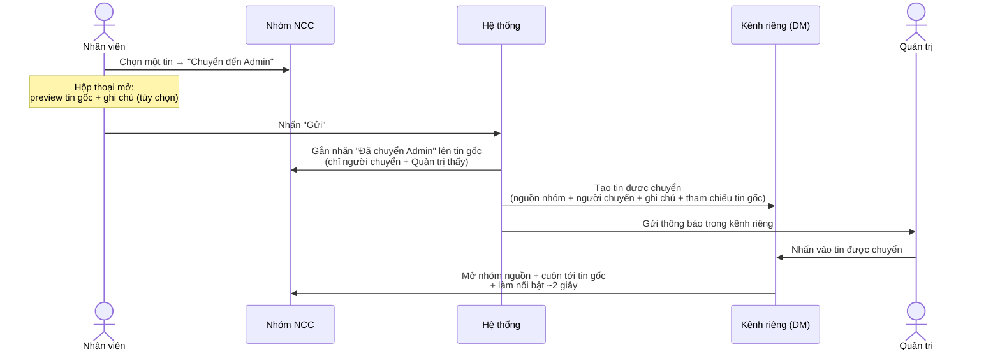

# #11 — Forward tin nhắn đến Admin

> **Trạng thái:** draft
> **Nguồn:** [`../scope-and-features.md § B.11`](../scope-and-features.md) (canonical) · [`../FSD-Chat-Portal.md § 3.8`](../FSD-Chat-Portal.md)
> **Liên quan:** [`#9 Thu hồi tin nhắn`](09-thu-hoi-tin-nhan.md) · [`#10 Ghim tin nhắn`](10-ghim-tin-nhan.md) · #14 Phân quyền tải file · #25 Đánh dấu (xem [`../FSD-Chat-Portal.md`](../FSD-Chat-Portal.md))

---

## 📌 Tóm tắt 1 dòng

Nhân viên (hoặc Quản trị) chuyển một tin từ nhóm NCC sang kênh nhắn riêng (DM) 1-1 với Quản trị — kèm ghi chú nếu cần — để xin ý kiến/báo cáo mà khách hàng và đồng nghiệp khác không thấy; Quản trị nhấn vào tin được chuyển sẽ nhảy thẳng về đúng tin gốc trong nhóm.

---

## 🎯 Giá trị nghiệp vụ

Trong vận hành, Nhân viên thường gặp tình huống cần hỏi ý kiến Quản trị về một tin cụ thể của khách hàng (vendor) — ví dụ một yêu cầu báo giá bất thường, một khiếu nại, hay một cam kết cần xác nhận. Nếu chụp màn hình gửi qua kênh khác (Zalo cá nhân, email) thì mất ngữ cảnh, không truy ngược được về tin gốc, và rời khỏi hệ thống nên không có dấu vết.

Tính năng Forward đến Admin cho phép Nhân viên "đẩy" thẳng một tin từ nhóm NCC vào **kênh nhắn riêng 1-1 với Quản trị** ngay trong Portal, kèm một ghi chú tùy chọn để giải thích. Tin được chuyển mang theo đầy đủ ngữ cảnh: tin gốc, tên nhóm nguồn, ai chuyển. Quan trọng nhất, tin trong kênh riêng **bấm vào được** — Quản trị nhấn một cái là nhảy về đúng tin gốc trong nhóm NCC và tin đó được làm nổi bật, không phải đi tìm thủ công.

Vì đây là kênh nội bộ, khách hàng (vendor) và các Nhân viên khác trong nhóm hoàn toàn không thấy việc chuyển tin này — đảm bảo trao đổi nội bộ kín đáo và không gây hiểu lầm với đối tác.

**Lợi ích:**

- Xin ý kiến / báo cáo Quản trị về một tin cụ thể mà không rời khỏi hệ thống, giữ nguyên ngữ cảnh.
- Quản trị bấm một lần là về đúng tin gốc trong nhóm — không phải dò tìm.
- Trao đổi kín đáo: vendor và đồng nghiệp khác không thấy việc chuyển tin.
- Mọi tin đã chuyển được gom lại ở đầu kênh riêng để Quản trị duyệt nhanh các vấn đề gần đây.

---

## 👥 Vai trò liên quan

| Vai trò | Trách nhiệm |
| --- | --- |
| **Nhân viên (Staff)** | Chọn một tin trong nhóm NCC → mở hộp thoại "Chuyển đến Admin" → nhập ghi chú (tùy chọn) → gửi. Thấy nhãn "Đã chuyển Admin" trên tin mình đã chuyển. |
| **Quản trị (Admin)** | Cũng có thể chuyển tin. Là người **nhận** tin được chuyển trong kênh riêng 1-1. Nhấn tin được chuyển để nhảy về tin gốc; luôn xem được nội dung gốc kể cả khi tin đã bị thu hồi. |
| **Vendor (NCC)** | **Không** thấy việc chuyển tin, không thấy nhãn "Đã chuyển Admin", không thấy tin trong kênh riêng. Tin được chuyển không đồng bộ lên Zalo. |
| **Hệ thống** | Tạo bản tin được chuyển trong kênh riêng (tham chiếu về tin gốc, không nhân đôi file), gắn nhãn "Đã chuyển Admin" lên tin gốc, gửi thông báo cho Quản trị, xử lý điều hướng nhảy-về-tin-gốc, và tự tạo kênh riêng nếu chưa có. |

---

## 🔄 Dòng chảy nghiệp vụ



---

## ✅ Kịch bản chấp nhận

```gherkin
# language: vi
Tính năng: Chuyển tiếp một tin từ nhóm NCC đến Quản trị qua kênh nhắn riêng

  Bối cảnh:
    Biết Nhân viên đang mở một nhóm NCC được phép truy cập
    Và mỗi cặp Nhân viên – Quản trị có một kênh nhắn riêng 1-1 trong Portal
    Và tin được chuyển là tin nội bộ, không đồng bộ lên Zalo

  # =====================================================
  # Mở hộp thoại & gửi (happy path) — FR-11.1, FR-11.2
  # =====================================================

  Tình huống: Mở hộp thoại chuyển tin từ menu của một tin Zalo
    Biết một tin nhắn thường (đồng bộ Zalo) trong nhóm
    Khi Nhân viên rê chuột lên tin đó và chọn "Chuyển đến Admin"
    Thì hộp thoại "Chuyển đến Admin" mở ra
    Và hộp thoại hiển thị bản xem trước tin gốc
    Và có ô nhập "Ghi chú kèm theo (không bắt buộc)"

  Tình huống: Chuyển tin có kèm ghi chú
    Biết hộp thoại "Chuyển đến Admin" đang mở
    Khi Nhân viên nhập ghi chú và nhấn "Gửi"
    Thì một tin được chuyển xuất hiện trong kênh riêng với Quản trị
    Và tin đó kèm theo ghi chú vừa nhập

  Tình huống: Chuyển tin không nhập ghi chú
    Biết hộp thoại "Chuyển đến Admin" đang mở
    Khi Nhân viên nhấn "Gửi" mà không nhập gì
    Thì tin vẫn được chuyển vào kênh riêng với Quản trị
    Và phần ghi chú để trống

  Tình huống: Huỷ hộp thoại chuyển tin
    Biết hộp thoại "Chuyển đến Admin" đang mở
    Khi Nhân viên nhấn "Huỷ"
    Thì hộp thoại đóng lại
    Và không có tin nào được chuyển

  Tình huống: Không thể chuyển tin hệ thống
    Biết một tin hệ thống (giao việc hoặc thông báo xem số điện thoại) trong nhóm
    Khi Nhân viên rê chuột lên tin hệ thống đó
    Thì không có menu thao tác
    Và không có lựa chọn "Chuyển đến Admin"

  # =====================================================
  # Nhãn "Đã chuyển Admin" trên tin gốc — FR-11.4
  # =====================================================

  Tình huống: Người chuyển thấy nhãn trên tin gốc
    Biết Nhân viên vừa chuyển một tin đến Quản trị
    Khi Nhân viên xem lại tin gốc trong nhóm
    Thì tin gốc hiển thị nhãn "Đã chuyển Admin"

  Khung tình huống: Ai thấy nhãn "Đã chuyển Admin" trên tin gốc
    Biết một tin đã được Nhân viên chuyển đến Quản trị
    Khi "<nguoi_xem>" xem tin gốc trong nhóm
    Thì người đó "<ket_qua>" nhãn "Đã chuyển Admin"

    Dữ liệu:
      | nguoi_xem              | ket_qua   |
      | Người đã chuyển tin     | thấy      |
      | Quản trị                | thấy      |
      | Nhân viên khác trong nhóm | không thấy |
      | Vendor (trên Zalo)      | không thấy |

  # =====================================================
  # Tin trong kênh riêng & thông báo — FR-11.3, FR-11.5
  # =====================================================

  Tình huống: Tin được chuyển mang đủ ngữ cảnh
    Biết Nhân viên vừa chuyển một tin đến Quản trị
    Khi Quản trị mở kênh riêng với Nhân viên đó
    Thì tin được chuyển hiển thị tên nhóm nguồn
    Và hiển thị tên người chuyển
    Và hiển thị ghi chú kèm theo (nếu có)
    Và hiển thị bản xem trước tin gốc

  Tình huống: Tin được chuyển không lên Zalo
    Biết Nhân viên vừa chuyển một tin đến Quản trị
    Khi hệ thống xử lý việc chuyển tin
    Thì tin trong kênh riêng không đồng bộ lên Zalo
    Và Vendor không thấy tin này

  Tình huống: Quản trị nhận thông báo khi có tin được chuyển
    Biết Quản trị đang trực tuyến trên Portal
    Khi Nhân viên chuyển một tin đến Quản trị
    Thì kênh riêng với Nhân viên đó hiện dấu chưa đọc
    Và Quản trị nhận thông báo nổi

  Tình huống: Một tin được nhiều người chuyển độc lập
    Biết một tin trong nhóm đã được Nhân viên A chuyển đến Quản trị
    Khi Nhân viên B cũng chuyển chính tin đó đến Quản trị
    Thì kênh riêng giữa A và Quản trị có một mục chuyển tin
    Và kênh riêng giữa B và Quản trị có một mục chuyển tin riêng

  # =====================================================
  # Nhảy về tin gốc — FR-11.6
  # =====================================================

  Tình huống: Nhấn tin được chuyển để nhảy về tin gốc
    Biết Quản trị đang xem một tin được chuyển trong kênh riêng
    Khi Quản trị nhấn vào tin được chuyển
    Thì hệ thống mở nhóm NCC nguồn
    Và cuộn tới đúng tin gốc trong danh sách tin
    Và làm nổi bật tin gốc khoảng 2 giây

  Tình huống: Nhảy về tin gốc đã bị thu hồi
    Biết một tin đã được chuyển đến Quản trị
    Và sau đó tin gốc bị thu hồi trong nhóm
    Khi Quản trị nhấn tin được chuyển để nhảy về tin gốc
    Thì hệ thống cuộn tới đúng vị trí tin gốc
    Và Quản trị vẫn thấy nội dung gốc của tin đã thu hồi
    Và tin gốc được làm nổi bật khoảng 2 giây

  # =====================================================
  # Thanh tóm tắt tin đã chuyển trong kênh riêng — FR-11.7
  # =====================================================

  Tình huống: Thanh tóm tắt gom các tin đã chuyển gần đây
    Biết kênh riêng với Quản trị có nhiều tin đã được chuyển
    Khi Quản trị mở kênh riêng đó
    Thì đầu kênh hiển thị thanh tóm tắt các tin đã chuyển gần nhất
    Và mỗi mục hiển thị tên nhóm nguồn, người chuyển, đoạn trích và thời điểm

  Tình huống: Nhấn mục trong thanh tóm tắt để nhảy về tin gốc
    Biết thanh tóm tắt đang liệt kê một tin đã chuyển
    Khi Quản trị nhấn vào mục đó
    Thì hệ thống nhảy về tin gốc và làm nổi bật giống khi nhấn trực tiếp tin được chuyển

  Tình huống: Xem tất cả tin đã chuyển khi vượt giới hạn thanh tóm tắt
    Biết số tin đã chuyển vượt quá số lượng thanh tóm tắt hiển thị
    Khi Quản trị nhìn thanh tóm tắt
    Thì thanh chỉ hiển thị các tin đã chuyển gần nhất trong giới hạn
    Và có nút "Xem tất cả" mở danh sách đầy đủ

  # =====================================================
  # Tin có media & quyền tải — FR-11 edge, FR-14.7
  # =====================================================

  Tình huống: Chuyển tin chứa tập tin không nhân đôi file
    Biết một tin trong nhóm chứa hình ảnh hoặc tập tin
    Khi Nhân viên chuyển tin đó đến Quản trị
    Thì tin trong kênh riêng hiển thị ảnh thu nhỏ hoặc tên tập tin
    Và liên kết tải trỏ về tập tin gốc, không tạo bản sao tập tin mới

  Tình huống: Quản trị luôn tải được tập tin trong tin đã chuyển
    Biết một tin chứa tập tin đã được chuyển vào kênh riêng
    Khi Quản trị mở tin được chuyển
    Thì Quản trị tải được tập tin đó vì có quyền tải mọi loại file ở mọi nhóm

  # =====================================================
  # Trường hợp đặc biệt
  # =====================================================

  Tình huống: Chuyển một tin đã thu hồi giữ bản chụp tại thời điểm chuyển
    Biết một tin đã bị thu hồi trong nhóm
    Khi Nhân viên chuyển tin đã thu hồi đó đến Quản trị
    Thì tin vẫn được chuyển vào kênh riêng
    Và bản trong kênh riêng ghi nhận trạng thái thu hồi tại thời điểm chuyển

  Tình huống: Chuyển chính tin của mình
    Biết một tin do chính Nhân viên gửi trong nhóm
    Khi Nhân viên chọn "Chuyển đến Admin" trên tin đó
    Thì việc chuyển vẫn được phép

  Tình huống: Chuyển tin khi chưa từng có kênh riêng với Quản trị
    Biết Nhân viên chưa từng nhắn riêng với Quản trị nào
    Khi Nhân viên chuyển một tin đến Quản trị
    Thì hệ thống tự tạo kênh riêng mới và đặt tin được chuyển vào đó

  Tình huống: Tên nhóm nguồn cập nhật theo tên hiển thị hiện tại
    Biết một tin đã được chuyển vào kênh riêng từ một nhóm NCC
    Và sau đó Quản trị đổi tên hiển thị của nhóm đó
    Khi Quản trị xem thanh tóm tắt tin đã chuyển
    Thì tên nhóm nguồn hiển thị theo tên mới nhất, không phải tên cũ
```

---

## 🎨 Mô tả giao diện

### Cấu trúc — phía nhóm NCC (nơi bắt đầu chuyển)

```
┌─────────────────────────────────────────────┐
│  (nhóm NCC — danh sách tin)                  │
│                                             │
│   ┌───────────────────────────┐             │
│   │ NCC An Phát:              │ ⟳ ❤ ↩ 📌 ➦ ⭐│ ← hover menu, ➦ = Chuyển đến Admin
│   │ "Báo giá lô hàng tháng 6" │             │
│   └───────────────────────────┘             │
│     🏷 Đã chuyển Admin    ← nhãn (chỉ người chuyển + Quản trị thấy)
│                                             │
└─────────────────────────────────────────────┘

        ↓ chọn "Chuyển đến Admin"

   ┌──────────── Chuyển đến Admin ────────────┐
   │  Tin gốc:                                │
   │  ┌────────────────────────────────────┐  │
   │  │ NCC An Phát — "Báo giá lô hàng…"   │  │ ← preview tin gốc
   │  └────────────────────────────────────┘  │
   │                                          │
   │  Ghi chú kèm theo (không bắt buộc):      │
   │  ┌────────────────────────────────────┐  │
   │  │                                    │  │ ← textarea
   │  └────────────────────────────────────┘  │
   │                       [ Huỷ ]  [ Gửi ]   │
   └──────────────────────────────────────────┘
```

### Cấu trúc — phía kênh riêng với Quản trị (nơi nhận)

```
┌─────────────────────────────────────────────┐
│ 📨 Tin đã chuyển gần đây (3)     [Xem tất cả]│ ← thanh tóm tắt (đầu kênh)
│  • NCC An Phát · Huyền · "Báo giá…" · 10:23  │
│  • NCC Phương Nam · Dũng · "Lịch giao…" · 9:10│
├─────────────────────────────────────────────┤
│  ┌─────────────────────────────────────────┐│
│  │ ➦ Từ nhóm: NCC An Phát · do Huyền chuyển ││ ← thanh metadata
│  │ Ghi chú: "Anh xem giúp em mức giá này"   ││
│  │ ┌─────────────────────────────────────┐ ││
│  │ │ NCC An Phát — "Báo giá lô hàng…"    │ ││ ← preview tin gốc (bấm được)
│  │ └─────────────────────────────────────┘ ││
│  └─────────────────────────────────────────┘│
└─────────────────────────────────────────────┘
```

### Hộp thoại "Chuyển đến Admin"

| Thành phần | Nội dung | Ghi chú |
| --- | --- | --- |
| Tiêu đề | "Chuyển đến Admin" | |
| Bản xem trước tin gốc | Hiển thị tin gốc giống bong bóng đang xem (tên người gửi + nội dung/đoạn trích) | Tin media: ảnh thu nhỏ / tên file |
| Ô ghi chú | Textarea, nhãn "Ghi chú kèm theo (không bắt buộc)" | Bỏ trống vẫn gửi được |
| Nút hành động | "Huỷ" / "Gửi" | |

### Tin được chuyển trong kênh riêng

| Thành phần | Nội dung | Ghi chú |
| --- | --- | --- |
| Thanh metadata | "Từ nhóm: [tên nhóm nguồn] · do [tên người chuyển]" + ghi chú (nếu có) | Tên nhóm nguồn dùng tên hiển thị hiện tại |
| Bản xem trước tin gốc | Nội dung/đoạn trích/ảnh thu nhỏ của tin gốc | **Bấm được** → nhảy về tin gốc |
| Hành vi nhấn | Mở nhóm nguồn + cuộn tới tin gốc + làm nổi bật ~2 giây | Giống flow nhảy-về của #10 |

### Thanh tóm tắt tin đã chuyển (đầu kênh riêng)

| Thuộc tính | Mô tả |
| --- | --- |
| Vị trí | Trên đầu kênh riêng với Quản trị |
| Mỗi mục | Tên nhóm nguồn + người chuyển + đoạn trích + thời điểm |
| Số lượng hiển thị | Tối đa N tin gần nhất (xem Q&A — demo dùng 5) |
| Hành vi nhấn | Nhảy về tin gốc giống khi nhấn trực tiếp tin được chuyển |
| Nút "Xem tất cả" | Mở danh sách đầy đủ tin đã chuyển | 

### Nhãn "Đã chuyển Admin" (trên tin gốc trong nhóm NCC)

- Nhãn nhỏ gắn cạnh/dưới bong bóng tin gốc đã được chuyển.
- **Chỉ hiển thị cho:** người đã chuyển tin và mọi Quản trị.
- **Không hiển thị cho:** Nhân viên khác trong nhóm, và Vendor (trên Zalo).

### Mockup tham chiếu

> ⏳ **Cần BA bổ sung:**
> - Hộp thoại "Chuyển đến Admin" (preview tin gốc + ô ghi chú).
> - Nhãn "Đã chuyển Admin" trên bong bóng trong nhóm NCC (góc nhìn người chuyển).
> - Tin được chuyển trong kênh riêng với Quản trị (thanh metadata + preview tin gốc).
> - Thanh tóm tắt tin đã chuyển ở đầu kênh riêng.
> - Trạng thái làm nổi bật ~2 giây sau khi nhảy về tin gốc.

---

## 🔗 Tham chiếu & Q&A

### Liên quan các phần khác

- [`#9 Thu hồi tin nhắn`](09-thu-hoi-tin-nhan.md): Quản trị luôn xem được nội dung gốc của tin đã thu hồi → khi nhảy về tin gốc đã thu hồi, Quản trị vẫn thấy nội dung. Bản tin trong kênh riêng là **bản chụp tại thời điểm chuyển** (ghi nhận trạng thái thu hồi lúc đó).
- [`#10 Ghim tin nhắn`](10-ghim-tin-nhan.md): dùng chung cơ chế **nhảy-về-tin-gốc + làm nổi bật ~2 giây**.
- **Tin hệ thống (giao việc, thông báo xem số điện thoại)** ([`../scope-and-features.md § 4 — Internal Type`](../scope-and-features.md)): không có menu thao tác nên **không chuyển được**. Tin được chuyển (FORWARD) chỉ xuất hiện trong kênh riêng 1-1, **không** xuất hiện trong nhóm NCC.
- **#14 Phân quyền tải tập tin** ([`../FSD-Chat-Portal.md § 4.3 FR-14.7`](../FSD-Chat-Portal.md)): tập tin trong tin được chuyển — Quản trị trong kênh riêng **luôn có quyền tải** (vai trò Quản trị).
- **#26 Tên hiển thị nhóm chat** ([`../FSD-Chat-Portal.md § 4.4`](../FSD-Chat-Portal.md)): "tên nhóm nguồn" trong thanh metadata/thanh tóm tắt dùng **tên hiển thị hiện tại** của nhóm, không snapshot tên cũ.
- **Quy tắc tên người gửi (cross-cutting)** ([`../scope-and-features.md § 6.1`](../scope-and-features.md)): với tin Zalo của Nhân viên, định dạng `Tên tài khoản Zalo (Tên nhân viên)` được **giữ nguyên** trong bản xem trước ở kênh riêng.

### ⚠️ Q&A cần BA / PO làm rõ

1. **"Admin" nhận tin được chuyển là ai khi có nhiều Quản trị?**
   - Tin được chuyển vào "kênh riêng 1-1 giữa người chuyển và Quản trị". Nhưng khi hệ thống có **nhiều** tài khoản Quản trị, chưa rõ tin đi tới ai.
   - Phương án A: chuyển tới **một Quản trị mặc định** (cấu hình hệ thống).
   - Phương án B: chuyển tới **tất cả Quản trị** (mỗi Quản trị có một kênh riêng + một bản tin được chuyển).
   - Phương án C: người chuyển **chọn Quản trị đích** ngay trong hộp thoại.
   - **Pilot hiện đang theo:** chưa quyết — nguồn ([`../FSD-Chat-Portal.md § 3.8 edge case`](../FSD-Chat-Portal.md)) ghi "tự tạo DM với Admin mặc định (hoặc tất cả Admin nếu spec yêu cầu) — BA xác nhận trong Mốc 3". Cần BA/PO chốt A/B/C.

2. **Số lượng tin tối đa (N) trên thanh tóm tắt tin đã chuyển?**
   - Nguồn ([`../FSD-Chat-Portal.md § 3.8 FR-11.7`](../FSD-Chat-Portal.md)) ghi "tối đa N tin forward gần nhất; demo dùng 5".
   - **Pilot hiện đang theo:** N = 5 (theo demo). Cần BA/PO xác nhận con số chính thức.

3. **Tin được chuyển trong kênh riêng có cho thao tác tiếp (trả lời, đánh dấu) không?**
   - Theo phân loại tin nội bộ, tin được chuyển (FORWARD) nằm trong **bối cảnh kênh riêng** và **có** menu thao tác (khác với tin hệ thống trong nhóm NCC). Nguồn ([`../FSD-Chat-Portal.md § 3.9`](../FSD-Chat-Portal.md)) gợi ý tin FORWARD trong DM **có thể đánh dấu (bookmark)**.
   - **Pilot hiện đang theo:** tin được chuyển trong kênh riêng cho phép thao tác cơ bản của bối cảnh DM (tối thiểu: bấm nhảy-về-tin-gốc, đánh dấu). Cần BA/PO xác nhận tập thao tác đầy đủ trong kênh riêng (trả lời? thả cảm xúc? chuyển tiếp tiếp?).

4. **Quản trị nhảy về tin gốc thuộc nhóm mà... — có ngoại lệ quyền không?**
   - Nguồn ([`../FSD-Chat-Portal.md § 3.8 FR-11.6`](../FSD-Chat-Portal.md)) ghi: Quản trị toàn quyền nên luôn mở được nhóm nguồn; chỉ "fallback toast lỗi" nếu vì lý do nào đó không truy cập được.
   - **Pilot hiện đang theo:** Quản trị luôn mở được nhóm nguồn (đúng với quyền tối đa của Quản trị). Cần BA xác nhận có kịch bản Quản trị **không** truy cập được một nhóm hay không (hiện giả định là không).
