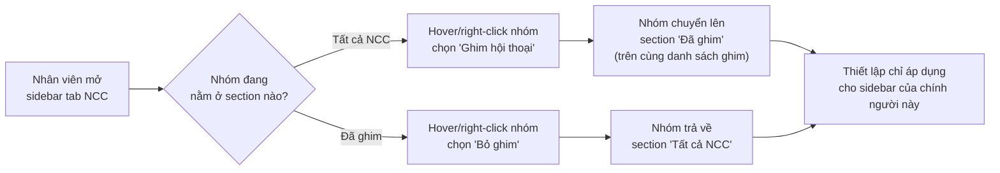

# #12 — Ghim hội thoại

> **Trạng thái:** draft
> **Nguồn:** [`../scope-and-features.md § C (#12)`](../scope-and-features.md) (canonical) · [`../FSD-Chat-Portal.md § 4.1`](../FSD-Chat-Portal.md)
> **Liên quan:** [`#10 Ghim tin nhắn`](../FSD-Chat-Portal.md) · [`#31 Lọc hội thoại NCC theo thẻ phân loại`](../FSD-Chat-Portal.md) · [`#16 Phân quyền truy cập nhóm`](../FSD-Admin-Site.md)

---

## 📌 Tóm tắt 1 dòng

Mỗi Nhân viên tự ghim các nhóm NCC quan trọng lên đầu sidebar danh sách hội thoại của riêng mình để truy cập nhanh, không ảnh hưởng tới sidebar của người khác.

---

## 🎯 Giá trị nghiệp vụ

Một Nhân viên có thể phụ trách hàng chục, thậm chí hàng trăm nhóm NCC. Khi danh sách dài, việc cuộn tìm đúng nhóm đang cần xử lý gấp rất mất thời gian, đặc biệt với những nhóm mà Nhân viên trao đổi liên tục trong ngày.

Ghim hội thoại cho phép mỗi người tự đẩy các nhóm hay dùng lên một khu vực **"Đã ghim"** cố định ở đầu sidebar. Đây là thiết lập **riêng tư theo từng người dùng**: Nhân viên A ghim một nhóm thì chỉ sidebar của A thay đổi — Nhân viên B và Quản trị viên vẫn thấy nhóm đó nằm ở danh sách thường của họ. Không có thao tác nào đồng bộ ra ngoài (Vendor phía Zalo hoàn toàn không liên quan).

Cần phân biệt rõ tính năng này với [`#10 Ghim tin nhắn`](../FSD-Chat-Portal.md): #10 ghim **một tin nhắn cụ thể** lên đỉnh nhóm cho mọi thành viên thấy (có đồng bộ Zalo), còn #12 ghim **cả hội thoại** trong sidebar và chỉ ảnh hưởng tới chính người ghim.

**Lợi ích:**

- Nhân viên truy cập các nhóm trọng tâm chỉ bằng một cú liếc, không phải cuộn cả danh sách dài.
- Mỗi người tự sắp xếp không gian làm việc theo nhu cầu, không giẫm chân nhau.
- Không phát sinh thông báo hay thay đổi nào với Vendor — đây là tiện ích cá nhân thuần nội bộ.

---

## 👥 Vai trò liên quan

| Vai trò | Trách nhiệm |
| --- | --- |
| **Nhân viên (Staff)** | Ghim / bỏ ghim các nhóm NCC trong sidebar của riêng mình. Thiết lập chỉ áp dụng cho tài khoản của chính mình. |
| **Quản trị (Admin)** | Có cùng khả năng ghim / bỏ ghim cho sidebar cá nhân của mình (mỗi người tự ghim, không thay người khác). |
| **Hệ thống** | Lưu danh sách nhóm đã ghim riêng cho từng người dùng · Hiển thị 2 section "Đã ghim" và "Tất cả NCC" · Xoá nhóm khỏi sidebar (kèm trạng thái ghim) khi người dùng mất quyền truy cập nhóm. |

---

## 🔄 Dòng chảy nghiệp vụ



---

## ✅ Kịch bản chấp nhận

```gherkin
# language: vi
Tính năng: Nhân viên ghim hội thoại NCC lên đầu sidebar của riêng mình

  Bối cảnh:
    Biết Nhân viên "Lê Diễm Chi" đã đăng nhập Chat Portal
    Và đang mở sidebar danh sách hội thoại ở tab "NCC"

  # =====================================================
  # Ghim một hội thoại
  # =====================================================

  Tình huống: Ghim một nhóm từ menu kebab khi hover
    Biết nhóm "NCC Vận Chuyển Phương Nam" đang nằm trong section "Tất cả NCC"
    Khi Nhân viên hover vào nhóm đó và chọn "Ghim hội thoại" trong menu kebab (⋯)
    Thì nhóm chuyển lên section "Đã ghim" ở đầu sidebar
    Và nhóm không còn xuất hiện trong section "Tất cả NCC"

  Tình huống: Ghim một nhóm bằng menu chuột phải
    Biết nhóm "NCC Hải Sản Miền Trung" đang nằm trong section "Tất cả NCC"
    Khi Nhân viên click chuột phải vào nhóm đó và chọn "Ghim hội thoại"
    Thì nhóm chuyển lên section "Đã ghim" ở đầu sidebar

  # FR-12.2: section "Đã ghim" chỉ hiện khi có ≥ 1 nhóm ghim
  Tình huống: Section "Đã ghim" xuất hiện khi có nhóm ghim đầu tiên
    Biết Nhân viên chưa ghim nhóm nào nên sidebar chỉ có section "Tất cả NCC"
    Khi Nhân viên ghim nhóm đầu tiên
    Thì section "Đã ghim" hiện ra ở phía trên section "Tất cả NCC"

  # =====================================================
  # Tính riêng tư per-user (FR-12.1)
  # =====================================================

  Tình huống: Ghim của một người không ảnh hưởng sidebar người khác
    Biết Nhân viên "Lê Diễm Chi" vừa ghim nhóm "NCC Vận Chuyển Phương Nam"
    Khi Nhân viên "Tăng Thị Huyền" mở sidebar tab "NCC" của mình
    Thì nhóm "NCC Vận Chuyển Phương Nam" vẫn nằm trong section "Tất cả NCC" của "Tăng Thị Huyền"
    Và sidebar của "Tăng Thị Huyền" không có nhóm đó trong section "Đã ghim"

  # FR-12.4: không sync lên Zalo
  Tình huống: Thao tác ghim không phát ra ngoài Zalo
    Khi Nhân viên ghim hoặc bỏ ghim một nhóm NCC
    Thì Vendor phía Zalo không nhận được bất kỳ thông báo hay thay đổi nào
    Và không có tin hệ thống nào được tạo trong nhóm

  # =====================================================
  # Thứ tự sắp xếp giữa các nhóm đã ghim (FR-12.3)
  # =====================================================

  Tình huống: Nhóm ghim mới nhất nằm trên cùng section "Đã ghim"
    Biết section "Đã ghim" đang có nhóm "NCC Vận Chuyển Phương Nam"
    Khi Nhân viên ghim thêm nhóm "NCC Hải Sản Miền Trung"
    Thì "NCC Hải Sản Miền Trung" hiển thị ở trên cùng section "Đã ghim"
    Và "NCC Vận Chuyển Phương Nam" nằm ngay bên dưới

  # FR-12.5: không giới hạn số nhóm ghim
  Tình huống: Ghim được nhiều nhóm mà không bị chặn
    Biết Nhân viên đã ghim 20 nhóm trong section "Đã ghim"
    Khi Nhân viên ghim thêm một nhóm nữa
    Thì hệ thống vẫn cho ghim và đẩy nhóm mới lên trên cùng
    Và không hiển thị thông báo giới hạn

  # =====================================================
  # Bỏ ghim
  # =====================================================

  Tình huống: Bỏ ghim một nhóm
    Biết nhóm "NCC Vận Chuyển Phương Nam" đang nằm trong section "Đã ghim"
    Khi Nhân viên hover vào nhóm đó và chọn "Bỏ ghim" trong menu kebab
    Thì nhóm trả về section "Tất cả NCC"
    Và nhóm biến mất khỏi section "Đã ghim"

  Tình huống: Section "Đã ghim" ẩn đi khi bỏ ghim nhóm cuối cùng
    Biết section "Đã ghim" chỉ còn đúng 1 nhóm
    Khi Nhân viên bỏ ghim nhóm đó
    Thì section "Đã ghim" không còn hiển thị trên sidebar
    Và sidebar chỉ còn section "Tất cả NCC"

  # =====================================================
  # Hội thoại đã ghim khi có tin mới
  # =====================================================

  Tình huống: Nhóm đã ghim có tin mới vẫn giữ nguyên vị trí trong section "Đã ghim"
    Biết nhóm "NCC Vận Chuyển Phương Nam" đang nằm trong section "Đã ghim"
    Khi nhóm đó nhận một tin nhắn mới
    Thì nhóm vẫn ở trong section "Đã ghim"
    Và hiển thị badge số tin chưa đọc như bình thường

  # =====================================================
  # Trường hợp đặc biệt
  # =====================================================

  # FR-12.2 + trạng thái rỗng: chưa ghim gì
  Tình huống: Sidebar chưa có nhóm ghim nào
    Biết Nhân viên chưa ghim bất kỳ nhóm NCC nào
    Khi Nhân viên mở sidebar tab "NCC"
    Thì sidebar không hiển thị section "Đã ghim"
    Và toàn bộ nhóm nằm trong section "Tất cả NCC"

  # Edge: tìm kiếm trong sidebar áp dụng cho cả 2 section
  Tình huống: Tìm kiếm lọc đồng thời cả nhóm đã ghim lẫn nhóm thường
    Biết section "Đã ghim" có nhóm "NCC Vận Chuyển Phương Nam"
    Và section "Tất cả NCC" có nhóm "NCC Hải Sản Miền Trung"
    Khi Nhân viên gõ "Phương Nam" vào ô tìm kiếm sidebar
    Thì section "Đã ghim" chỉ còn "NCC Vận Chuyển Phương Nam" và vẫn nằm ở trên
    Và section "Tất cả NCC" ẩn hết các nhóm không khớp

  # Edge: lọc theo thẻ phân loại (#31) áp dụng cho cả 2 section
  Tình huống: Lọc theo thẻ phân loại có thể ẩn cả nhóm đã ghim
    Biết section "Đã ghim" có nhóm "NCC Vận Chuyển Phương Nam" không gắn thẻ "Ưu tiên"
    Khi Nhân viên lọc danh sách theo thẻ "Ưu tiên"
    Thì "NCC Vận Chuyển Phương Nam" bị ẩn khỏi section "Đã ghim" dù đang được ghim

  # Edge: vai trò sai / mất quyền truy cập (FR-12.6)
  Tình huống: Nhóm biến mất khỏi sidebar khi Nhân viên bị thu hồi quyền truy cập
    Biết nhóm "NCC Vận Chuyển Phương Nam" đang nằm trong section "Đã ghim" của Nhân viên
    Khi Quản trị viên thu hồi quyền truy cập nhóm đó của Nhân viên
    Thì nhóm biến mất khỏi sidebar (cả section "Đã ghim" lẫn "Tất cả NCC")
    Và thiết lập ghim nhóm đó cho Nhân viên cũng bị xoá

  # Edge: nhóm bị remove khi đang mở
  Tình huống: Nhóm đang mở bị Quản trị viên gỡ khỏi sidebar
    Biết Nhân viên đang mở cửa sổ chat của nhóm "NCC Vận Chuyển Phương Nam" (đã ghim)
    Khi Quản trị viên thu hồi quyền truy cập nhóm đó
    Thì cửa sổ chat chuyển sang trạng thái rỗng
    Và sidebar cập nhật, nhóm biến mất khỏi cả 2 section
```

---

## 🎨 Mô tả giao diện

### Cấu trúc sidebar NCC

```
┌─────────────────────────────────────┐
│ [ Tìm kiếm hội thoại...          🔍 ]│
│ [ Phân loại ▾ ]   (filter thẻ #31)  │
├─────────────────────────────────────┤
│ ── Đã ghim ──────────  (chỉ hiện    │
│                         khi ≥ 1 nhóm)│
│  📌 NCC Hải Sản Miền Trung    (3)   │  ← mới ghim nhất ở trên
│  📌 NCC Vận Chuyển Phương Nam       │
├─────────────────────────────────────┤
│ ── Tất cả NCC ──────────────────────│
│  NCC Nông Sản Đồng Tháp        (1)  │
│  NCC Bao Bì Sài Gòn                 │
│  NCC Thực Phẩm Sạch ABC             │
│   ...                               │
└─────────────────────────────────────┘
```

### Hai section của sidebar

| Section | Khi nào hiển thị | Nội dung |
| --- | --- | --- |
| **Đã ghim** | Chỉ khi người dùng có ≥ 1 nhóm ghim | Danh sách nhóm đã ghim, nhóm ghim mới nhất ở trên cùng |
| **Tất cả NCC** | Luôn hiển thị | Danh sách các nhóm chưa ghim |

### Menu thao tác trên item sidebar

| Thành phần | Mô tả |
| --- | --- |
| **Kích hoạt menu** | Hover vào nhóm → hiện nút kebab (⋯); hoặc click chuột phải vào nhóm |
| **Mục menu — nhóm chưa ghim** | "Ghim hội thoại" |
| **Mục menu — nhóm đã ghim** | "Bỏ ghim" |
| **Badge chưa đọc** | Hiển thị bình thường ở cả 2 section, không bị ảnh hưởng bởi việc ghim |

### Tương tác với tìm kiếm & lọc thẻ

- **Tìm kiếm:** Lọc đồng thời cả 2 section; section "Đã ghim" vẫn ở trên nếu còn nhóm khớp.
- **Lọc theo thẻ phân loại (#31):** Áp dụng cho cả 2 section — nhóm đã ghim nhưng không khớp thẻ filter cũng bị ẩn.

### Mockup tham chiếu

> ⏳ **Cần BA bổ sung:**
> - Sidebar NCC tab với 2 section "Đã ghim" + "Tất cả NCC".
> - Menu kebab trên item sidebar (Ghim / Bỏ ghim).
> - Trạng thái section "Đã ghim" rỗng (chưa ghim gì) vs có nhóm.
> - Biểu tượng đánh dấu nhóm đã ghim trên item sidebar (ví dụ icon 📌) — cần BA xác nhận có hiển thị icon hay không.

---

## 🔗 Tham chiếu & Q&A

### Liên quan các phần khác

- [`#10 Ghim tin nhắn`](../FSD-Chat-Portal.md § 3.7): ghim một **tin nhắn** trong nhóm cho mọi thành viên (có đồng bộ Zalo) — KHÁC với #12 ghim cả **hội thoại** trong sidebar (per-user, không đồng bộ Zalo). Tránh nhầm 2 tính năng.
- [`#31 Lọc hội thoại NCC theo thẻ phân loại`](../FSD-Chat-Portal.md § 4.6): filter thẻ áp dụng cho cả section "Đã ghim".
- [`#16 Phân quyền truy cập nhóm`](../FSD-Admin-Site.md): khi Nhân viên bị thu hồi quyền truy cập nhóm thì thiết lập ghim của nhóm đó cũng bị xoá.

### ⚠️ Q&A cần BA / PO làm rõ

1. **Có cho phép kéo-thả (drag-and-drop) để sắp xếp lại thứ tự các nhóm trong section "Đã ghim" không?**
   - Phương án A: Chỉ sắp theo "mới ghim nhất ở trên cùng", không cho người dùng sắp lại.
   - Phương án B: Cho phép kéo-thả để tự sắp thứ tự.
   - **Pilot hiện đang theo:** A. Nguồn [`FSD-Chat-Portal.md § 4.1 FR-12.3`](../FSD-Chat-Portal.md) ghi drag-and-drop là **optional, BA xác nhận trong Mốc 2**. Cần BA/PO xác nhận có làm ở Phase 2 hay không.

2. **Có cần đặt giới hạn cứng số lượng nhóm được ghim không?**
   - Phương án A: Không giới hạn (mặc định hiện tại).
   - Phương án B: Giới hạn N nhóm để tránh section "Đã ghim" quá dài, mất ý nghĩa "truy cập nhanh".
   - **Pilot hiện đang theo:** A. Nguồn [`FSD-Chat-Portal.md § 4.1 FR-12.5`](../FSD-Chat-Portal.md) ghi không giới hạn cứng, nhưng để ngỏ "nếu cần giới hạn cho UX thì BA xác nhận". Cần BA/PO quyết.

3. **Nhóm đã ghim có hiển thị dấu hiệu trực quan riêng (icon 📌) trên item sidebar không, hay chỉ phân biệt bằng việc nằm trong section "Đã ghim"?**
   - Nguồn cũ chưa mô tả rõ chỉ báo này. Cần BA cung cấp mockup để chốt.
   - **Pilot hiện đang theo:** chưa quyết — ASCII sketch ở phần 🎨 tạm vẽ icon 📌 minh hoạ, cần BA xác nhận.
