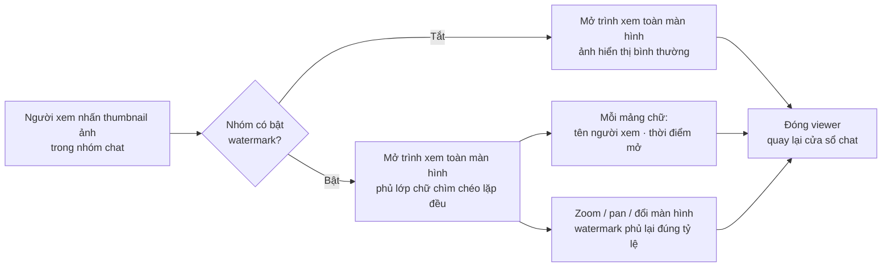

# #13 — Watermark hình ảnh

> **Trạng thái:** draft
> **Nguồn:** [`../scope-and-features.md § C`](../scope-and-features.md) (mục #13, canonical) · [`../FSD-Chat-Portal.md § 4.2`](../FSD-Chat-Portal.md) (FR-13.1 → FR-13.7 + edge cases)
> **Liên quan:** [`#6 Gửi/nhận media & file`](06-gui-nhan-media-va-file.md) · [`#14 Phân quyền tải tập tin`](../FSD-Chat-Portal.md) · [`#9 Thu hồi tin nhắn`](09-thu-hoi-tin-nhan.md) · cấu hình bật/tắt watermark theo nhóm: Admin Site — trang Quản lý nhóm NCC ([`../FSD-Admin-Site.md`](../FSD-Admin-Site.md))

---

## 📌 Tóm tắt 1 dòng

Khi Nhân viên hoặc Quản trị mở ảnh ở trình xem toàn màn hình trong nhóm có bật watermark, hệ thống phủ lớp chữ chìm "tên người xem + thời điểm" lên ảnh để hạn chế chụp màn hình / chia sẻ trái phép — không hề chỉnh sửa file gốc.

---

## 🎯 Giá trị nghiệp vụ

Hình ảnh vendor gửi trong nhóm chat có thể chứa thông tin nhạy cảm (báo giá, mẫu hàng, chứng từ). Khi một nhân viên chụp màn hình rồi chia sẻ ra ngoài, công ty rất khó truy ra ai là nguồn rò rỉ — bản chụp là một ảnh trơn, không mang dấu vết.

Watermark giải quyết bằng cách phủ một lớp chữ chìm lặp đều khắp ảnh **ngay tại lúc người dùng xem ở trình xem toàn màn hình**. Mỗi mảng chữ ghi rõ tên tài khoản người đang xem và thời điểm mở ảnh, nên bất kỳ ảnh chụp màn hình nào lưu lại cũng tự "tố cáo" ai đã chụp và lúc nào. Watermark chỉ là lớp phủ hiển thị phía Portal — file gốc trong hệ thống vẫn nguyên vẹn, vendor phía Zalo cũng không thấy lớp phủ này.

Vì rủi ro rò rỉ khác nhau giữa các nhóm khách, Quản trị có thể bật/tắt watermark theo từng nhóm. Nhóm nào bật thì mọi ảnh trong nhóm đó đều được phủ khi xem; nhóm tắt thì xem ảnh bình thường.

**Lợi ích:**

- Răn đe việc chụp màn hình / phát tán ảnh trái phép — mỗi bản chụp đều gắn danh tính người xem.
- Truy vết được nguồn rò rỉ qua tên + thời điểm in trên ảnh chụp.
- Không phá huỷ dữ liệu gốc: file lưu trữ và file gửi lên Zalo không bị can thiệp.
- Linh hoạt theo từng nhóm khách — chỉ bật nơi thực sự cần.

---

## 👥 Vai trò liên quan

| Vai trò | Trách nhiệm |
| --- | --- |
| **Nhân viên (Staff)** | Mở ảnh ở trình xem toàn màn hình. Nếu nhóm bật watermark, thấy lớp chữ chìm in tên mình + thời điểm phủ khắp ảnh. |
| **Quản trị (Admin)** | Vừa là người xem (cũng thấy watermark với tên mình khi mở viewer), vừa là người cấu hình bật/tắt watermark cho từng nhóm trên Admin Site. |
| **Hệ thống** | Phủ lớp watermark khi mở viewer trong nhóm đang bật cấu hình · Lấy tên người xem + thời điểm để dựng nội dung chữ chìm · Phủ lại khi người dùng zoom/pan/đổi màn hình · Không chỉnh sửa file gốc, không lưu bản có watermark, không đẩy watermark lên Zalo. |
| **Vendor (NCC, phía Zalo)** | Không liên quan — không nhìn thấy watermark; ảnh phía Zalo giữ nguyên. |

---

## 🔄 Dòng chảy nghiệp vụ



---

## ✅ Kịch bản chấp nhận

```gherkin
# language: vi
Tính năng: Phủ watermark lên ảnh khi xem ở trình xem toàn màn hình

  Bối cảnh:
    Biết Nhân viên "Tăng Thị Huyền" đã đăng nhập Chat Portal
    Và đang mở cửa sổ chat của nhóm "NCC Vận Chuyển Phương Nam"

  # =====================================================
  # Bật/tắt theo cấu hình nhóm (FR-13.1)
  # =====================================================

  Tình huống: Nhóm bật watermark — viewer phủ lớp chữ chìm
    Biết nhóm "NCC Vận Chuyển Phương Nam" có cấu hình watermark = bật
    Khi Nhân viên nhấn thumbnail một ảnh trong nhóm
    Thì trình xem toàn màn hình mở ra
    Và lớp chữ chìm phủ đều khắp vùng ảnh

  Tình huống: Nhóm tắt watermark — viewer hiển thị ảnh bình thường
    Biết nhóm có cấu hình watermark = tắt
    Khi Nhân viên nhấn thumbnail một ảnh trong nhóm
    Thì trình xem toàn màn hình mở ra
    Nhưng không có lớp chữ chìm nào phủ lên ảnh

  # =====================================================
  # Nội dung & kiểu phủ của watermark (FR-13.2, FR-13.4)
  # =====================================================

  Tình huống: Mỗi mảng chữ chìm ghi tên người xem và thời điểm mở
    Biết nhóm đang bật watermark
    Khi Nhân viên "Tăng Thị Huyền" mở một ảnh lúc 15:08 ngày 19/06/2026
    Thì mỗi mảng chữ chìm hiển thị nội dung "Tăng Thị Huyền · 15:08 19/06/2026"
    Và tên dùng là tên hiển thị nội bộ của chính người đang xem

  Tình huống: Watermark phủ kiểu chéo, lặp đều khắp ảnh
    Biết nhóm đang bật watermark
    Khi viewer mở
    Thì các mảng chữ chìm xếp chéo, lặp đều phủ kín toàn bộ vùng ảnh
    Và độ mờ thấp để không che mất nội dung chính của ảnh

  Tình huống: Hai người xem cùng một ảnh thấy tên khác nhau
    Biết nhóm đang bật watermark
    Và Nhân viên "Tăng Thị Huyền" và Quản trị "Diệp Nguyên" cùng có quyền xem ảnh
    Khi mỗi người tự mở ảnh ở máy của mình
    Thì watermark trên màn hình của "Tăng Thị Huyền" in tên "Tăng Thị Huyền"
    Và watermark trên màn hình của "Diệp Nguyên" in tên "Diệp Nguyên"

  # =====================================================
  # Không can thiệp file gốc (FR-13.3)
  # =====================================================

  Tình huống: Watermark là lớp phủ hiển thị, không sửa file gốc
    Biết nhóm đang bật watermark
    Khi viewer phủ lớp chữ chìm lên ảnh
    Thì hệ thống không tạo hay lưu bản ảnh có watermark
    Và file gốc lưu trong hệ thống vẫn nguyên vẹn

  Tình huống: Vendor phía Zalo không thấy watermark
    Khi một ảnh trong nhóm được phủ watermark phía Portal
    Thì lớp chữ chìm chỉ hiển thị trong trình xem của Portal
    Và ảnh đồng bộ phía Zalo không có lớp watermark

  # =====================================================
  # Phạm vi áp dụng (FR-13.5, FR-13.7)
  # =====================================================

  Tình huống: Thumbnail trong bubble không phủ watermark
    Biết nhóm đang bật watermark
    Khi Nhân viên nhìn ảnh ở dạng thumbnail nhỏ trong bóng tin nhắn
    Thì thumbnail hiển thị bình thường, không có lớp chữ chìm
    # Watermark chỉ áp dụng cho trình xem toàn màn hình

  Tình huống: Một tin nhiều ảnh — từng ảnh phủ watermark độc lập khi mở
    Biết nhóm đang bật watermark
    Và một lượt gửi gồm nhiều ảnh (mỗi ảnh là một tin riêng)
    Khi Nhân viên mở lần lượt từng ảnh ở trình xem toàn màn hình
    Thì mỗi ảnh khi mở đều được phủ watermark độc lập với tên + thời điểm của lần mở đó

  # =====================================================
  # Hành vi khi tương tác trong viewer (edge: zoom/pan/đa màn hình)
  # =====================================================

  Tình huống: Zoom hoặc pan trong viewer — watermark phủ lại đúng vùng nhìn
    Biết nhóm đang bật watermark và Nhân viên đang mở một ảnh
    Khi Nhân viên phóng to hoặc kéo (pan) ảnh trong viewer
    Thì lớp chữ chìm phủ lại theo, vẫn bao phủ toàn bộ vùng đang nhìn thấy

  Tình huống: Kéo viewer sang màn hình khác — watermark dựng lại đúng tỷ lệ
    Biết nhóm đang bật watermark và viewer đang mở
    Khi Nhân viên kéo cửa sổ viewer sang màn hình thứ hai
    Thì lớp chữ chìm được dựng lại đúng tỷ lệ trên màn hình mới

  Tình huống: Ảnh độ phân giải rất cao — watermark phủ cả vùng đang phóng to
    Biết nhóm đang bật watermark và Nhân viên mở một ảnh độ phân giải cao
    Khi Nhân viên phóng to vào một góc nhỏ của ảnh
    Thì lớp chữ chìm vẫn phủ vùng đang nhìn, không chỉ phủ ở mức hiển thị vừa khít

  # =====================================================
  # Trường hợp đặc biệt
  # =====================================================

  Tình huống: Cấu hình đổi bật/tắt khi đang mở viewer — không áp lại ngay
    Biết Nhân viên đang mở một ảnh ở trình xem toàn màn hình
    Khi Quản trị đổi cấu hình watermark của nhóm (bật ↔ tắt) trong lúc viewer đang mở
    Thì viewer hiện tại giữ nguyên trạng thái lúc mở
    Và lần mở ảnh kế tiếp mới áp dụng cấu hình mới

  Tình huống: Ảnh trong tin đã thu hồi — Nhân viên không mở được viewer
    Biết một ảnh nằm trong tin đã bị thu hồi (xem #9 Thu hồi tin nhắn)
    Khi Nhân viên xem tin đó
    Thì Nhân viên chỉ thấy ô giữ chỗ "tin đã thu hồi", không mở được trình xem
    Và do không mở được viewer nên không phát sinh watermark

  Tình huống: Ảnh trong tin đã thu hồi — Quản trị vẫn mở được và vẫn phủ watermark
    Biết một ảnh nằm trong tin đã bị thu hồi và nhóm đang bật watermark
    Khi Quản trị mở ảnh đó ở trình xem toàn màn hình
    Thì Quản trị thấy ảnh gốc
    Và lớp chữ chìm vẫn phủ lên ảnh như bình thường

  Tình huống: Ảnh lỗi không tải được — không phủ watermark lên vùng trống
    Biết nhóm đang bật watermark
    Khi Nhân viên mở một ảnh nhưng ảnh không tải được (lỗi mạng hoặc file hỏng)
    Thì viewer hiển thị trạng thái lỗi tải ảnh
    Và không phủ lớp chữ chìm lên vùng ảnh trống
```

---

## 🎨 Mô tả giao diện

### Vị trí áp dụng

Watermark **chỉ** xuất hiện trong **trình xem ảnh toàn màn hình** (image viewer dạng modal) — mở khi người dùng nhấn thumbnail ảnh trong bóng tin nhắn. Thumbnail trong bóng tin, danh sách hội thoại, và mọi nơi hiển thị ảnh thu nhỏ khác **không** phủ watermark.

### Trình xem toàn màn hình — khi nhóm bật watermark

```
┌───────────────────────────────────────────────────────────┐
│  ✕                                                   ⤓ Tải │
│                                                             │
│   Tăng Thị Huyền       Tăng Thị Huyền       Tăng Thị Huyền  │
│       · 15:08 19/06         · 15:08 19/06         · 15:08    │
│            ╲                    ╲                    ╲       │
│   [           ẢNH GỐC HIỂN THỊ ĐẦY ĐỦ Ở GIỮA            ]   │
│       Tăng Thị Huyền       Tăng Thị Huyền       Tăng Thị    │
│           · 15:08 19/06         · 15:08 19/06         ·      │
│            ╲                    ╲                    ╲       │
│   Tăng Thị Huyền       Tăng Thị Huyền       Tăng Thị Huyền  │
│       · 15:08 19/06         · 15:08 19/06         · 15:08    │
│                                                             │
│                    [ – ]  100%  [ + ]                       │
└───────────────────────────────────────────────────────────┘
   (Các mảng chữ chìm xếp chéo, lặp đều, độ mờ thấp, phủ kín ảnh)
```

> Nút "⤓ Tải" chỉ hiện khi người xem có quyền tải theo #14; nếu không có quyền thì nút bị vô hiệu hoá kèm tooltip lý do (chi tiết thuộc #14).

### Thành phần lớp watermark

| Thành phần | Mô tả |
| --- | --- |
| **Nội dung mỗi mảng** | "{Tên người đang xem} · {HH:mm DD/MM/YYYY}" — tên hiển thị nội bộ của người xem |
| **Kiểu phủ** | Mảng chữ xếp chéo (diagonal), lặp đều theo dạng lưới/tile, phủ kín toàn bộ vùng ảnh |
| **Độ mờ** | Thấp (opacity nhỏ) — đủ đọc được khi soi nhưng không che mất nội dung chính |
| **Bám theo vùng nhìn** | Khi zoom / pan / đổi màn hình, lớp phủ dựng lại đúng tỷ lệ, luôn bao phủ vùng đang nhìn thấy |

### So sánh bật vs tắt

| Trạng thái nhóm | Trình xem toàn màn hình |
| --- | --- |
| **Watermark bật** | Ảnh gốc + lớp chữ chìm chéo phủ kín |
| **Watermark tắt** | Ảnh gốc, không có lớp phủ |

### Mockup tham chiếu

> ⏳ **Cần BA bổ sung:**
> - Trình xem toàn màn hình với lớp watermark chéo (so sánh ON vs OFF).
> - Cận cảnh nội dung một mảng chữ chìm (tên người xem + thời điểm).
> - Trạng thái lỗi tải ảnh trong viewer (không phủ watermark).
> - Vị trí cấu hình bật/tắt watermark trên Admin Site (trang Quản lý nhóm NCC) — thuộc tài liệu Admin Site.

---

## 🔗 Tham chiếu & Q&A

### Liên quan các phần khác

- [`#6 Gửi/nhận media & file`](06-gui-nhan-media-va-file.md): mô tả việc mở ảnh ở trình xem toàn màn hình; #13 bổ sung riêng phần phủ watermark, không lặp logic mở viewer.
- [`#14 Phân quyền tải tập tin`](../FSD-Chat-Portal.md) (`../FSD-Chat-Portal.md § 4.3`, chưa tách): quyết định nút "Tải" trong viewer hiện/ẩn theo (nhân viên × nhóm × loại file). Liên hệ trực tiếp với Q&A #1 bên dưới.
- [`#9 Thu hồi tin nhắn`](09-thu-hoi-tin-nhan.md): ảnh trong tin đã thu hồi — Nhân viên thấy ô giữ chỗ (không mở viewer), Quản trị vẫn mở được và vẫn phủ watermark.
- **Cấu hình bật/tắt watermark theo nhóm** (Admin Site — trang Quản lý nhóm NCC, [`../FSD-Admin-Site.md`](../FSD-Admin-Site.md)): tiền điều kiện để watermark có hiệu lực. Phía Admin Site là toggle per-group; chi tiết UI cấu hình thuộc tài liệu Admin Site (chưa tách file FSD riêng).

### ⚠️ Q&A cần BA / PO làm rõ

1. **Khi tải ảnh xuống, file tải về có watermark hay là file gốc sạch?**
   - Đây là câu hỏi quan trọng vì nó liên quan tới mục tiêu chống rò rỉ: nếu staff có quyền tải (#14) và file tải về sạch, thì người tải có thể chia sẻ ảnh không dấu vết — watermark chỉ chặn được kênh chụp màn hình, không chặn kênh tải.
   - **Phương án A — File tải về là bản gốc sạch (không watermark):** watermark thuần tuý là lớp phủ của trình xem, không can thiệp file tải. Đây là phương án [`../FSD-Chat-Portal.md § 4.2 FR-13.6`](../FSD-Chat-Portal.md) đang ghi rõ ("file tải về là bản gốc không watermark").
   - **Phương án B — File tải về cũng được nhúng watermark:** mọi đường ra của ảnh (xem lẫn tải) đều mang dấu vết người dùng, khép kín mục tiêu chống rò rỉ — nhưng đòi hỏi xử lý ảnh động phía hệ thống và đi ngược FR-13.3 ("không lưu phiên bản có watermark").
   - **Pilot hiện đang theo:** Phương án A (theo FR-13.6 trong FSD-Chat-Portal). `scope-and-features.md § C` (mục #13) **không nói rõ** về trường hợp tải, nên đây là khoảng trống canonical cần BA/PO chốt chính thức — đặc biệt cân nhắc cùng #14: nhóm vừa bật watermark vừa cho phép staff tải thì rủi ro rò rỉ qua kênh tải vẫn còn nếu chọn A.

2. **Khi nhân viên KHÔNG có quyền tải nhưng nhóm bật watermark — có cho mở viewer không?**
   - **Chốt theo nguồn:** Có cho mở viewer, chỉ vô hiệu nút "Tải"; watermark áp dụng bình thường. Nguồn: [`../FSD-Chat-Portal.md § 4.3`](../FSD-Chat-Portal.md) ("Staff không có quyền tải nhưng có quyền xem ảnh qua viewer + watermark: vẫn cho mở viewer, chỉ disable nút Tải"). Ghi lại ở đây để liên kết #13 ↔ #14; nếu BA muốn đổi (vd không cho xem khi không cho tải) cần flag lại.

3. **Định dạng thời điểm trên watermark cố định "HH:mm DD/MM/YYYY"?**
   - FR-13.2 ghi "{timestamp HH:mm DD/MM/YYYY}". Cần BA xác nhận đây là thời điểm **mở viewer** (như pilot mô tả) chứ không phải thời điểm gửi ảnh, và định dạng có cần kèm giây / múi giờ không.
   - **Pilot hiện đang theo:** thời điểm mở viewer, định dạng "HH:mm DD/MM/YYYY", không kèm giây.
