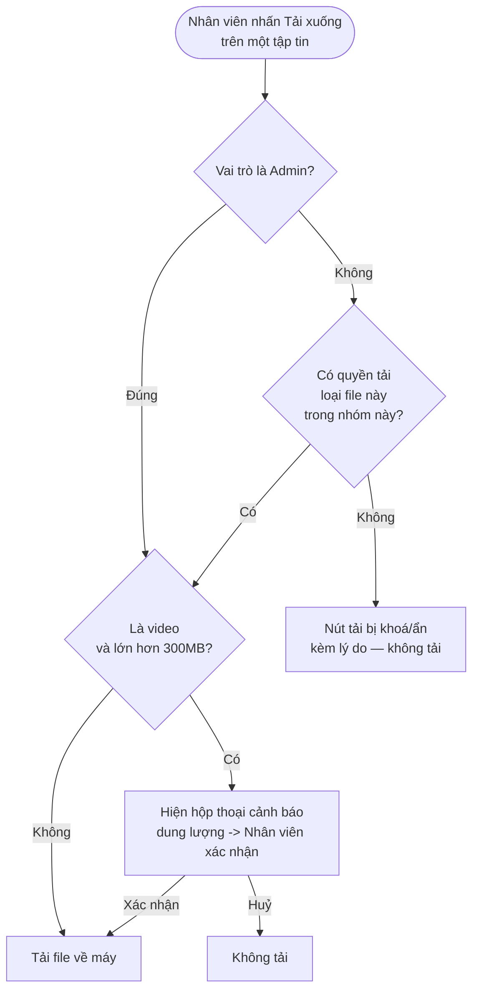

# #14 — Phân quyền tải tập tin (Chat Portal enforce)

> **Trạng thái:** draft
> **Nguồn:** [`../scope-and-features.md § C.14`](../scope-and-features.md) (canonical) · [`../scope-and-features.md § F.23`](../scope-and-features.md) (cấu hình phía Admin) · [`../FSD-Chat-Portal.md § 4.3 #14`](../FSD-Chat-Portal.md) (enforce khi tải) · [`../FSD-Chat-Portal.md § 5.4`](../FSD-Chat-Portal.md) (modal cấu hình quyền) · [`../FSD-Admin-Site.md § (mapping #14/#23)`](../FSD-Admin-Site.md)
> **Liên quan:** [`#6 Gửi/nhận hình ảnh, tập tin, video`](../FSD-Chat-Portal.md) · [`#13 Watermark hình ảnh`](../FSD-Chat-Portal.md) · [`#23 Cấu hình quyền tải xuống theo nhóm chat`](../scope-and-features.md) · [`#24 Theo dõi file lớn`](../FSD-Admin-Site.md)

---

## 📌 Tóm tắt 1 dòng

Khi Nhân viên tải tập tin trong nhóm chat, Chat Portal kiểm tra quyền tải đã cấu hình cho tổ hợp **(nhân viên × nhóm × loại file)** và chặn nút tải nếu quyền tắt, để kiểm soát luồng dữ liệu nhạy cảm ra khỏi hệ thống.

---

## 🎯 Giá trị nghiệp vụ

Trong nhiều nhóm khách (NCC), các tập tin trao đổi — hình ảnh chứng từ, tài liệu hợp đồng, video sản phẩm — là dữ liệu nhạy cảm. Nếu mọi Nhân viên đều tải tự do về máy cá nhân thì rủi ro rò rỉ ra ngoài rất cao, đặc biệt với nhân viên không trực tiếp phụ trách nhóm đó hoặc đã sắp rời công ty.

Tính năng này cho phép Quản trị viên giới hạn quyền tải **đến mức từng tổ hợp**: từng Nhân viên, trong từng nhóm chat, theo từng loại file (hình ảnh / tài liệu / video). Việc cấu hình quyền nằm bên phía quản trị (xem [`#23`](../scope-and-features.md)); tài liệu này mô tả phần **Chat Portal thực thi (enforce)** quyền đó: ẩn/khoá nút tải khi không có quyền, và cập nhật ngay khi quyền thay đổi mà không cần Nhân viên tải lại trang.

Với video dung lượng lớn (trên 300MB), hệ thống **không giới hạn kích thước** nhưng hiển thị cảnh báo dung lượng trước khi tải để Nhân viên chủ động cân nhắc — tránh tải nhầm file nặng làm chậm máy hoặc tốn băng thông. Bước cảnh báo này độc lập với việc kiểm tra quyền.

**Lợi ích:**

- Kiểm soát dữ liệu nhạy cảm rời hệ thống: chỉ Nhân viên được cấp quyền mới tải được loại file tương ứng trong nhóm tương ứng.
- Quyền siết/mở có hiệu lực ngay thời gian thực — không phụ thuộc Nhân viên tải lại trang.
- Cảnh báo dung lượng giúp Nhân viên không tải nhầm video lớn ngoài ý muốn.

---

## 👥 Vai trò liên quan

| Vai trò | Trách nhiệm |
| --- | --- |
| **Nhân viên (Staff)** | Bị thực thi quyền tải theo cấu hình. Khi quyền của loại file đó trong nhóm đó tắt → không tải được; nút tải bị khoá/ẩn kèm lý do. Vẫn xem được nội dung (mở viewer ảnh, xem video) dù không tải được. |
| **Quản trị (Admin)** | **Luôn có quyền tải mọi loại file ở mọi nhóm** — Chat Portal không áp dụng giới hạn cho Admin. (Việc *cấu hình* quyền cho Nhân viên thuộc phạm vi [`#23`](../scope-and-features.md).) |
| **Hệ thống** | Kiểm tra quyền theo tổ hợp (nhân viên × nhóm × loại file) trước khi cho tải · Cập nhật trạng thái nút tải theo thời gian thực khi quyền thay đổi · Hiển thị cảnh báo dung lượng cho video lớn · Chặn ở phía máy chủ nếu có người cố tải vượt quyền (lớp UI chỉ là gợi ý, máy chủ là chốt chặn cuối). |

---

## 🔄 Dòng chảy nghiệp vụ



---

## ✅ Kịch bản chấp nhận

```gherkin
# language: vi
Tính năng: Chat Portal thực thi quyền tải tập tin theo từng nhân viên, nhóm và loại file

  Bối cảnh:
    Biết Nhân viên "Lê Diễm Chi" đã đăng nhập Chat Portal
    Và đang mở nhóm "NCC Vận Chuyển Phương Nam"
    Và quyền tải được cấu hình riêng cho từng tổ hợp (nhân viên × nhóm × loại file: hình ảnh / tài liệu / video)

  # =====================================================
  # Thực thi quyền theo loại file (FR-14.1, FR-14.2)
  # =====================================================

  Tình huống: Có quyền tải loại file thì nút tải hoạt động
    Biết quyền tải "tài liệu" của Nhân viên trong nhóm này đang BẬT
    Khi Nhân viên nhấn nút tải trên một tin chứa tài liệu
    Thì hệ thống cho phép tải file về máy

  Khung tình huống: Tắt quyền một loại file chỉ chặn đúng loại đó
    Biết quyền tải "<loai_file>" của Nhân viên trong nhóm này đang TẮT
    Khi Nhân viên xem một tin chứa file thuộc "<loai_file>"
    Thì nút tải của tin đó không cho tải và hiển thị lý do bị chặn
    Nhưng các loại file khác đang BẬT vẫn tải bình thường

    Dữ liệu:
      | loai_file |
      | hình ảnh  |
      | tài liệu  |
      | video     |

  Tình huống: Tắt quyền tải hình ảnh cũng ẩn nút tải trong trình xem ảnh
    Biết quyền tải "hình ảnh" của Nhân viên trong nhóm này đang TẮT
    Khi Nhân viên mở một ảnh trong trình xem ảnh
    Thì ảnh vẫn xem được kèm watermark như bình thường
    Nhưng nút tải trong trình xem ảnh không cho tải

  # =====================================================
  # Admin luôn có quyền (FR-14.3, FR-14.7)
  # =====================================================

  Tình huống: Admin luôn tải được mọi loại file ở mọi nhóm
    Biết người dùng hiện tại có vai trò Admin
    Khi Admin nhấn tải trên bất kỳ tin chứa file nào
    Thì hệ thống không kiểm tra giới hạn quyền và cho phép tải

  Tình huống: Admin tải file trong tin đã chuyển tiếp về tin nhắn riêng
    Biết một tập tin nằm trong tin đã được chuyển tiếp đến tin nhắn riêng (DM) của Admin
    Khi Admin nhấn tải file đó
    Thì hệ thống cho phép tải vì người tải có vai trò Admin

  # =====================================================
  # Cập nhật quyền theo thời gian thực (FR-14.4)
  # =====================================================

  Tình huống: Quyền vừa được cấp khi Nhân viên đang xem nhóm
    Biết Nhân viên đang mở nhóm và quyền tải "video" đang TẮT
    Khi Quản trị viên bật quyền tải "video" cho Nhân viên trong nhóm này
    Thì nút tải trên các tin video xuất hiện ngay mà không cần tải lại trang

  Tình huống: Quyền vừa bị thu hồi khi Nhân viên đang xem nhóm
    Biết Nhân viên đang mở nhóm và quyền tải "hình ảnh" đang BẬT
    Khi Quản trị viên tắt quyền tải "hình ảnh" cho Nhân viên trong nhóm này
    Thì nút tải trên các tin hình ảnh bị khoá/ẩn ngay mà không cần tải lại trang

  # =====================================================
  # Cảnh báo dung lượng video lớn (FR-6.4, FR-14.6)
  # =====================================================

  Tình huống: Cảnh báo trước khi tải video lớn hơn 300MB
    Biết một tin chứa video dung lượng 480MB và Nhân viên có quyền tải video
    Khi Nhân viên nhấn tải video đó
    Thì hệ thống hiện hộp thoại cảnh báo "File này nặng 480MB, tiếp tục tải?"
    Và chỉ tải khi Nhân viên xác nhận

  Tình huống: Huỷ hộp thoại cảnh báo thì không tải
    Biết hộp thoại cảnh báo dung lượng video lớn đang mở
    Khi Nhân viên nhấn "Huỷ"
    Thì hệ thống không tải file
    Và không có thay đổi nào khác

  Tình huống: Cảnh báo dung lượng hiện cả với Admin
    Biết người dùng hiện tại là Admin và một tin chứa video lớn hơn 300MB
    Khi Admin nhấn tải video đó
    Thì hệ thống vẫn hiện hộp thoại cảnh báo dung lượng trước khi tải

  # =====================================================
  # Trường hợp đặc biệt
  # =====================================================

  Tình huống: Quyền bị tắt giữa chừng đúng lúc Nhân viên vừa bấm tải
    Biết Nhân viên đang xem trình xem ảnh và quá trình tải một ảnh vừa bắt đầu
    Khi Quản trị viên tắt quyền tải "hình ảnh" cho Nhân viên ngay lúc đó
    Thì nút tải trong trình xem ảnh biến mất ngay
    Nhưng lần tải đang chạy dở không bị huỷ giữa chừng

  Tình huống: Video đúng 300MB không kích hoạt cảnh báo dung lượng
    Biết một tin chứa video dung lượng đúng 300MB và Nhân viên có quyền tải video
    Khi Nhân viên nhấn tải video đó
    Thì hệ thống tải ngay, không hiện hộp thoại cảnh báo dung lượng
    # Ngưỡng cảnh báo là LỚN HƠN 300MB (xem Q&A về định nghĩa 300MB)

  Tình huống: Một tin chứa nhiều file được kiểm tra quyền độc lập theo loại
    Biết một tin chứa cả 1 hình ảnh và 1 tài liệu
    Và quyền tải "hình ảnh" đang TẮT còn quyền tải "tài liệu" đang BẬT
    Khi Nhân viên xem tin đó
    Thì nút tải của file hình ảnh bị chặn
    Nhưng nút tải của file tài liệu vẫn cho tải

  Tình huống: Tập tin trong tin đã bị thu hồi không còn để tải
    Biết một tin chứa file đã bị thu hồi (recall) trên Zalo
    Khi Nhân viên xem tin đó
    Thì Nhân viên chỉ thấy placeholder và không có file để tải
    Nhưng Admin vẫn thấy nội dung gốc và tải được

  Tình huống: Loại file không xác định bị chặn tải mặc định
    Biết một tin chứa tập tin không nhận diện được thuộc nhóm hình ảnh / tài liệu / video
    Khi Nhân viên (không phải Admin) nhấn tải file đó
    Thì hệ thống không cho tải và hiển thị lý do bị chặn
    # Phương án xử lý loại file không xác định cần BA chốt — xem Q&A
```

---

## 🎨 Mô tả giao diện

### Vị trí nút tải

Nút **Tải xuống** xuất hiện ở 2 nơi trong Chat Portal:

- Trên **thẻ file (file card)** của mỗi tin nhắn trong cửa sổ chat — áp dụng cho cả hình ảnh, tài liệu, video.
- Trong **trình xem ảnh (image viewer)** khi Nhân viên mở phóng to một hình ảnh (xem [`#13 Watermark`](../FSD-Chat-Portal.md)).

```
Bubble tin có tài liệu (quyền BẬT)          Bubble tin có tài liệu (quyền TẮT)
┌────────────────────────────────┐         ┌────────────────────────────────┐
│ 📄 hop-dong-2026.pdf  1.2 MB    │         │ 📄 hop-dong-2026.pdf  1.2 MB    │
│                      [ ⬇ Tải ] │         │              [ ⬇ Tải ] (mờ) 🔒  │
└────────────────────────────────┘         └────────────────────────────────┘
                                            (rê chuột → tooltip lý do bị chặn)
```

### Trạng thái nút tải theo vai trò × quyền

| Vai trò × Quyền của loại file trong nhóm | Trạng thái nút tải |
| --- | --- |
| Nhân viên × quyền **BẬT** | Nút tải hoạt động bình thường |
| Nhân viên × quyền **TẮT** | Nút tải bị khoá/ẩn kèm lý do (xem Q&A về disabled+tooltip vs ẩn hẳn) |
| Admin × bất kỳ | Nút tải luôn hoạt động (không áp giới hạn) |

### Hộp thoại cảnh báo video lớn

Khi tải video lớn hơn 300MB (kể cả Admin, kể cả khi đã có quyền), hiện hộp thoại xác nhận trước khi tải:

```
┌────────────────────────────────────────────┐
│  Tải video dung lượng lớn                   │
│                                             │
│  File này nặng 480 MB, tiếp tục tải?        │
│                                             │
│              [ Huỷ ]   [ Tiếp tục tải ]     │
└────────────────────────────────────────────┘
```

- Không giới hạn kích thước tối đa — chỉ cảnh báo.
- Bước cảnh báo dung lượng độc lập với bước kiểm tra quyền: chỉ hiện sau khi đã qua kiểm tra quyền (hoặc người tải là Admin).

### Mockup tham chiếu

> ⏳ **Cần BA bổ sung:**
> - Thẻ file có nút tải (quyền BẬT) vs không tải được (quyền TẮT) — chốt rõ kiểu hiển thị disabled+tooltip hay ẩn hẳn.
> - Trình xem ảnh với nút tải bị chặn.
> - Hộp thoại cảnh báo "File này nặng X MB, tiếp tục tải?" cho video lớn hơn 300MB.
> - Nội dung/tooltip lý do khi quyền bị tắt.

---

## 🔗 Tham chiếu & Q&A

### Liên quan các phần khác

- **Ranh giới UI surface:** tài liệu này CHỈ mô tả phần **Chat Portal thực thi (enforce)** quyền tải. Phần **cấu hình quyền** (ai bật/tắt, ở đâu, theo từng loại file ra sao) thuộc về [`#23 Cập nhật quyền tải xuống theo nhóm chat`](../scope-and-features.md) — không lặp lại chi tiết cấu hình ở đây, chỉ tham chiếu.
- [`#6 Gửi/nhận hình ảnh, tập tin, video`](../FSD-Chat-Portal.md): nơi sinh ra các bubble file; cảnh báo nội bộ video lớn hơn 300MB (FR-6.2, FR-6.4).
- [`#13 Watermark hình ảnh`](../FSD-Chat-Portal.md): file tải về là bản gốc **không** watermark; quyền tải hình ảnh và watermark là 2 cơ chế độc lập.
- [`#24 Theo dõi file lớn`](../FSD-Admin-Site.md): bảng quản trị liệt kê file video lớn hơn 300MB (định nghĩa ngưỡng 300MB tham chiếu FR-NCC.14).

### ⚠️ Q&A cần BA / PO làm rõ

1. **Quyền tải được cấu hình theo TỪNG LOẠI FILE hay theo TOÀN BỘ (cả 3 loại cùng lúc)?**
   - Đây là mâu thuẫn giữa các nguồn:
     - **Phương án A — tách theo từng loại file:** [`scope-and-features.md § C.14`](../scope-and-features.md) và [`§ F.23`](../scope-and-features.md) mô tả 3 toggle riêng (Hình ảnh / Tài liệu / Video); [`FSD-Chat-Portal.md § 4.3 FR-14.1`](../FSD-Chat-Portal.md) cũng nói "3 quyền độc lập theo (staff × nhóm × loại file)".
     - **Phương án B — toàn bộ một lần:** [`FSD-Chat-Portal.md § 5.4 FR-D.18`](../FSD-Chat-Portal.md) — kênh cấu hình thực tế (modal "Quản lý thành viên" trên Chat Portal) chỉ có **một** toggle bật/tắt **toàn bộ quyền tải** (Hình ảnh + Tài liệu + Video đồng thời).
   - **Pilot hiện đang theo:** logic *enforce* viết theo **phương án A** (tách loại file) cho khớp canonical scope + FR-14.x. Nếu kênh cấu hình chỉ là toggle toàn bộ (phương án B) thì cả 3 loại sẽ luôn cùng BẬT hoặc cùng TẮT, các tình huống "tắt riêng 1 loại" không bao giờ xảy ra trên thực tế. **Cần BA/PO chốt mô hình cấu hình.**

2. **Quyền cấu hình ở Admin Site hay chỉ ở Chat Portal?**
   - Mâu thuẫn:
     - Đề bài / [`scope-and-features.md § F.23`](../scope-and-features.md): cấu hình trong form "Chỉnh sửa quyền tải xuống" của một staff (truy cập từ trang quản lý user — tức Admin Site).
     - [`FSD-Admin-Site.md (mapping #23)`](../FSD-Admin-Site.md) + [`FSD-Chat-Portal.md § 5.4 FR-D.18`](../FSD-Chat-Portal.md): theo decision 2026-06-11 → **chỉ cấu hình được trên Chat Portal** (modal Quản lý thành viên), **không có UI Admin Site** cho việc này; trang Quản lý User & Phân Quyền không có form đó.
   - **Pilot hiện đang theo:** decision 2026-06-11 (cấu hình **chỉ ở Chat Portal**). Vì vậy tiêu đề tài liệu để là "Chat Portal enforce" và phần cấu hình trỏ về #23 như một cross-ref nghiệp vụ. **Cần BA/PO xác nhận** việc đề bài vẫn ghi "tham chiếu cấu hình Admin Site" có còn đúng không, hay đã bị override.

3. **Khi quyền TẮT: nút tải hiển thị disabled + tooltip, hay ẩn hẳn?**
   - Mâu thuẫn:
     - Đề bài + [`scope-and-features.md § C.14`](../scope-and-features.md): nút download **bị disabled kèm tooltip lý do**.
     - [`FSD-Chat-Portal.md § 4.3 FR-14.2`](../FSD-Chat-Portal.md): nút Tải **không hiển thị** (ẩn hẳn) trên bubble file và trong trình xem ảnh.
   - **Pilot hiện đang theo:** chưa quyết. Tài liệu mô tả trung lập là "nút tải bị khoá/ẩn kèm lý do". **Cần BA/PO chốt 1 trong 2** (ẩn hẳn thì không có chỗ gắn tooltip lý do; disabled+tooltip thì cần định nghĩa nội dung tooltip).

4. **Định nghĩa ngưỡng "300MB" và biên đúng-300MB?**
   - [`FSD-Admin-Site.md FR-NCC.14`](../FSD-Admin-Site.md) định nghĩa 300MB = 300 × 1024 × 1024 bytes, hoặc 300 × 1.000.000 nếu BA thống nhất khác. Cảnh báo dung lượng kích hoạt khi **lớn hơn** 300MB; file đúng 300MB không cảnh báo (đã viết trong tình huống biên). **Cần BA chốt** dùng MiB (1024²) hay MB thập phân để biên 300MB nhất quán giữa #14, #6 và #24.

5. **Loại file không xác định (không thuộc hình ảnh / tài liệu / video) xử lý thế nào?**
   - Không nguồn nào nêu rõ. **Pilot tạm chọn:** chặn tải mặc định với Nhân viên (an toàn dữ liệu), Admin vẫn tải được. **Cần BA chốt** có gom mọi loại lạ vào nhóm "tài liệu" để áp quyền, hay luôn chặn.

6. **Tải nhiều file cùng lúc (tải hàng loạt) có được hỗ trợ không?**
   - Các nguồn chỉ mô tả tải từng file qua nút trên từng bubble. Chưa có UI "chọn nhiều / tải tất cả". **Pilot tạm chọn:** Phase 2 chỉ tải từng file; mỗi file vẫn check quyền độc lập theo loại của nó. Nếu sau này có tải hàng loạt, cần xác định: gặp file không có quyền thì bỏ qua hay chặn cả lô, và video lớn hơn 300MB trong lô có cảnh báo từng file không. **Cần BA xác nhận scope.**
