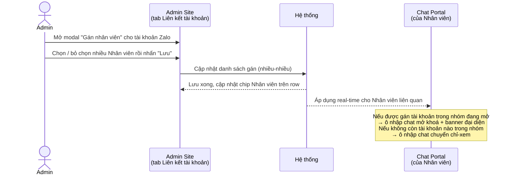

# #15 — Phân quyền tài khoản Zalo

> **Trạng thái:** draft
> **Nguồn:** [`../scope-and-features.md § D.1 (#15)`](../scope-and-features.md) (canonical) · [`../FSD-Admin-Site.md § 2.2 Tab Liên kết tài khoản (FR-NCC.6 / FR-NCC.7)`](../FSD-Admin-Site.md) (UI gán nhân viên) · [`../FSD-Chat-Portal.md § 5.1 (#15)`](../FSD-Chat-Portal.md) (hiệu ứng phía Portal)
> **Liên quan:** [`#16 Phân quyền nhóm chat`](16-phan-quyen-nhom-chat.md) · D.4 Resolver tài khoản đại diện khi gửi tin (per-group override) — [`../scope-and-features.md § D.4`](../scope-and-features.md) · [`../FSD-Chat-Portal.md § 5.2 Banner đại diện (ZaloIdentityBar)`](../FSD-Chat-Portal.md)

---

## 📌 Tóm tắt 1 dòng

Admin gán danh sách Nhân viên được phép "đại diện" cho mỗi tài khoản Zalo đã liên kết (quan hệ nhiều-nhiều), để khi Nhân viên gửi tin trong nhóm NCC, tin xuất hiện trên Zalo dưới danh tính tài khoản công ty thay vì tài khoản cá nhân.

---

## 🎯 Giá trị nghiệp vụ

Các nhóm chat NCC trên Zalo được vận hành dưới danh tính của một vài tài khoản Zalo "đại diện công ty" (ví dụ "Quốc Nam - Vận Hành", "Quốc Nam - Kho Hàng"). Vendor chỉ nhìn thấy các tài khoản này, không thấy từng nhân viên nội bộ. Vì vậy hệ thống cần một cơ chế để Admin kiểm soát: ai trong số nhân viên được phép gửi tin "thay mặt" một tài khoản Zalo nào.

Tính năng này giải quyết phần **gán quyền toàn cục (global assignment)**: với mỗi tài khoản Zalo đã liên kết, Admin chọn ra danh sách Nhân viên được phép đại diện. Quan hệ này là **nhiều-nhiều** — một Nhân viên có thể được gán nhiều tài khoản Zalo, và một tài khoản Zalo có thể được gán cho nhiều Nhân viên (nhiều người cùng dùng chung một danh tính đại diện). Không có giới hạn số lượng ở cả hai chiều.

Việc gán này quyết định Nhân viên có gửi được tin trong một nhóm hay không: nếu Nhân viên không được gán bất kỳ tài khoản nào đang phục vụ nhóm đó, ô nhập chat của họ bị khoá (chỉ xem). Nó là điều kiện đầu vào cho bước **resolver** — chọn cụ thể tài khoản nào sẽ đại diện khi gửi tin trong một nhóm có nhiều tài khoản (thuộc D.4, không mô tả lại ở file này).

**Lợi ích:**

- Admin kiểm soát chặt ai được phát ngôn dưới danh tính công ty trên Zalo, tránh nhân viên không phận sự gửi tin tới vendor.
- Linh hoạt theo thực tế vận hành: chia sẻ một tài khoản đại diện cho nhiều người, hoặc cho một người đại diện nhiều tài khoản.
- Thao tác gán/thu hồi nhanh ngay trên Admin Site, áp dụng theo thời gian thực sang Chat Portal của Nhân viên liên quan.

---

## 👥 Vai trò liên quan

| Vai trò | Trách nhiệm |
| --- | --- |
| **Quản trị (Admin)** | Cấu hình gán quyền tại Admin Site → Nhà cung cấp → tab "Liên kết tài khoản". Với mỗi tài khoản Zalo, mở modal "Gán nhân viên" để chọn/bỏ chọn danh sách Nhân viên đại diện; hoặc xoá nhanh từng Nhân viên qua nút X trên chip khi mở rộng row. Admin luôn có quyền tối đa, không phụ thuộc gán này. |
| **Nhân viên (Staff)** | Là đối tượng được gán. Có thể được đại diện một hoặc nhiều tài khoản Zalo. Hệ quả trên Chat Portal: nếu được gán tài khoản đang phục vụ một nhóm → gửi được tin trong nhóm đó (kèm banner đại diện); nếu không được gán tài khoản nào trong nhóm → ô nhập chat bị khoá (chỉ xem). Nhân viên không tự gán cho mình. |
| **Vendor (NCC)** | Không bị ảnh hưởng trực tiếp và không truy cập Portal. Chỉ thấy tin gửi tới từ Zalo dưới danh tính tài khoản đại diện, không thấy nhân viên nào đứng sau. |
| **Hệ thống** | Lưu danh sách gán nhiều-nhiều giữa Nhân viên và tài khoản Zalo · Cập nhật quyền gửi tin trên Chat Portal theo thời gian thực khi Admin thay đổi gán · Khoá/mở ô nhập chat của Nhân viên theo việc họ có được gán tài khoản trong nhóm hay không. |

---

## 🔄 Dòng chảy nghiệp vụ

Admin gán Nhân viên đại diện cho một tài khoản Zalo, và hiệu ứng lan sang Chat Portal của Nhân viên:



---

## ✅ Kịch bản chấp nhận

```gherkin
# language: vi
Tính năng: Admin gán Nhân viên đại diện cho tài khoản Zalo và hiệu ứng trên Chat Portal

  Bối cảnh:
    Biết Admin "Trần Quản Trị" đã đăng nhập Admin Site
    Và đang ở trang Nhà cung cấp, tab "Liên kết tài khoản"
    Và tài khoản Zalo "Quốc Nam - Vận Hành" đang ở trạng thái connected (đã kết nối)

  # =====================================================
  # Mở modal gán nhân viên (FR-NCC.6)
  # =====================================================

  Tình huống: Admin mở modal gán nhân viên cho một tài khoản
    Biết row tài khoản "Quốc Nam - Vận Hành" hiển thị trong bảng
    Khi Admin nhấn khu vực "Nhân viên đại diện" của row đó
    Thì hệ thống mở modal "Gán nhân viên — Quốc Nam - Vận Hành"
    Và modal có thanh tìm kiếm theo tên, dropdown lọc phòng ban, danh sách nhân viên và footer counter

  Tình huống: Modal đánh dấu sẵn các nhân viên đã được gán trước đó
    Biết tài khoản "Quốc Nam - Vận Hành" đang gán cho "Lê Diễm Chi" và "Tăng Thị Huyền"
    Khi Admin mở modal "Gán nhân viên" của tài khoản đó
    Thì hai nhân viên này hiển thị ở trạng thái đã chọn (checkbox tròn xanh ✓)
    Và footer counter hiển thị "2 nhân viên được chọn"

  Tình huống: Tìm kiếm nhân viên theo tên trong modal
    Biết modal "Gán nhân viên" đang mở với nhiều nhân viên trong danh sách
    Khi Admin gõ "Diễm" vào thanh tìm kiếm
    Thì danh sách chỉ còn các nhân viên có tên khớp "Diễm"

  Tình huống: Lọc nhân viên theo phòng ban trong modal
    Biết modal "Gán nhân viên" đang mở
    Khi Admin chọn phòng "Vận Hành" ở dropdown lọc phòng ban
    Thì danh sách chỉ còn nhân viên thuộc phòng "Vận Hành"

  Tình huống: Counter cập nhật khi chọn thêm nhân viên
    Biết footer đang hiển thị "2 nhân viên được chọn"
    Khi Admin tích chọn thêm một nhân viên
    Thì footer cập nhật thành "3 nhân viên được chọn"

  # =====================================================
  # Lưu / Huỷ thay đổi gán (FR-NCC.6)
  # =====================================================

  Tình huống: Lưu thay đổi gán nhân viên
    Biết Admin đã chọn thêm "Phạm Văn An" trong modal "Gán nhân viên"
    Khi Admin nhấn "Lưu"
    Thì modal đóng lại
    Và danh sách nhân viên đại diện của tài khoản được cập nhật gồm cả "Phạm Văn An"

  Tình huống: Huỷ không làm thay đổi danh sách đã gán
    Biết Admin đã tích chọn thêm vài nhân viên trong modal nhưng chưa lưu
    Khi Admin nhấn "Huỷ"
    Thì modal đóng lại
    Và danh sách nhân viên đại diện của tài khoản giữ nguyên như trước khi mở modal

  # =====================================================
  # Quan hệ nhiều-nhiều (scope D.1)
  # =====================================================

  Tình huống: Một nhân viên được gán cho nhiều tài khoản Zalo
    Biết "Lê Diễm Chi" đã được gán đại diện tài khoản "Quốc Nam - Vận Hành"
    Khi Admin gán thêm "Lê Diễm Chi" đại diện tài khoản "Quốc Nam - Kho Hàng"
    Thì "Lê Diễm Chi" đồng thời đại diện cả hai tài khoản
    Và hệ thống không báo lỗi giới hạn

  Tình huống: Một tài khoản Zalo được gán cho nhiều nhân viên
    Biết tài khoản "Quốc Nam - Vận Hành" đang gán cho "Lê Diễm Chi"
    Khi Admin gán thêm "Tăng Thị Huyền" và "Phạm Văn An" cho cùng tài khoản đó
    Thì cả ba nhân viên cùng được phép đại diện tài khoản này
    Và hệ thống không báo lỗi giới hạn

  # =====================================================
  # Xem & xoá nhanh chip nhân viên (FR-NCC.5, FR-NCC.7)
  # =====================================================

  Tình huống: Danh sách nhân viên đại diện hiển thị dạng chip trên row
    Biết tài khoản "Quốc Nam - Vận Hành" đang gán cho 5 nhân viên
    Khi Admin xem row của tài khoản trong bảng
    Thì row hiển thị 2 chip nhân viên đầu kèm chip "+3" gộp số còn lại

  Tình huống: Xoá nhanh một nhân viên khỏi danh sách đại diện bằng nút X trên chip
    Biết Admin đã mở rộng row tài khoản "Quốc Nam - Vận Hành" và thấy đầy đủ chip nhân viên
    Khi Admin nhấn nút X trên chip "Tăng Thị Huyền"
    Thì "Tăng Thị Huyền" bị gỡ khỏi danh sách đại diện của tài khoản đó
    Và Admin không cần mở modal "Gán nhân viên" đầy đủ

  # =====================================================
  # Hiệu ứng trên Chat Portal — quyền gửi tin (Portal § 5.1 FR-D.5)
  # =====================================================

  Tình huống: Nhân viên được gán tài khoản trong nhóm thì gửi được tin
    Biết nhóm "NCC Vận Chuyển Phương Nam" đang được phục vụ bởi tài khoản "Quốc Nam - Vận Hành"
    Và "Lê Diễm Chi" được gán đại diện tài khoản "Quốc Nam - Vận Hành"
    Khi "Lê Diễm Chi" mở cửa sổ chat của nhóm đó trên Chat Portal
    Thì ô nhập chat ở trạng thái có thể gõ và gửi tin
    Và đầu khung chat hiển thị banner đại diện cho biết đang đại diện tài khoản nào

  Tình huống: Nhân viên không được gán tài khoản nào trong nhóm thì ô nhập bị khoá
    Biết nhóm "NCC Vận Chuyển Phương Nam" chỉ được phục vụ bởi tài khoản "Quốc Nam - Vận Hành"
    Và "Phạm Văn An" không được gán tài khoản "Quốc Nam - Vận Hành"
    Khi "Phạm Văn An" mở cửa sổ chat của nhóm đó
    Thì ô nhập chat ở trạng thái chỉ-xem (bị khoá)
    Và hiển thị tooltip "Bạn không được phép gửi tin trong nhóm này"

  Tình huống: Mở khoá ô nhập real-time khi Admin gán tài khoản
    Biết "Phạm Văn An" đang mở nhóm với ô nhập chat bị khoá vì chưa được gán tài khoản trong nhóm
    Khi Admin gán "Phạm Văn An" đại diện tài khoản "Quốc Nam - Vận Hành" đang phục vụ nhóm đó
    Thì ô nhập chat của "Phạm Văn An" chuyển sang trạng thái gửi được mà không cần tải lại trang
    Và banner đại diện xuất hiện ở đầu khung chat

  Tình huống: Khoá ô nhập real-time khi Admin thu hồi tài khoản
    Biết "Lê Diễm Chi" đang mở nhóm và gửi được tin nhờ được gán tài khoản "Quốc Nam - Vận Hành"
    Và đây là tài khoản duy nhất phục vụ nhóm mà "Lê Diễm Chi" được gán
    Khi Admin xoá "Lê Diễm Chi" khỏi danh sách đại diện của tài khoản đó
    Thì ô nhập chat của "Lê Diễm Chi" chuyển sang chỉ-xem mà không cần tải lại trang

  # =====================================================
  # Trường hợp đặc biệt
  # =====================================================

  Tình huống: Hệ thống chưa có nhân viên nào thì modal hiện empty state
    Biết hệ thống chưa khai báo nhân viên nào ở mục Quản Lý User & Phân Quyền
    Khi Admin mở modal "Gán nhân viên" cho một tài khoản
    Thì modal hiển thị empty state với gợi ý "Thêm nhân viên ở mục Quản Lý User & Phân Quyền trước"
    Và không có nhân viên nào để chọn

  Tình huống: Tài khoản chưa gán nhân viên nào thì row không có chip
    Biết tài khoản "Quốc Nam - Kho Hàng" chưa được gán nhân viên nào
    Khi Admin xem row của tài khoản đó
    Thì khu vực "Nhân viên đại diện" trống, không có chip nào
    Và vẫn có lối mở modal "Gán nhân viên" để bắt đầu gán

  Tình huống: Nhân viên không thấy nhóm khi không được gán nhóm dù được gán tài khoản
    Biết "Lê Diễm Chi" được gán đại diện tài khoản "Quốc Nam - Vận Hành"
    Nhưng "Lê Diễm Chi" không được gán quyền truy cập nhóm "NCC Vận Chuyển Phương Nam" (theo #16)
    Khi "Lê Diễm Chi" xem sidebar NCC trên Chat Portal
    Thì nhóm đó không xuất hiện trong sidebar
    Và việc được gán tài khoản không tự cấp quyền truy cập nhóm
```

---

## 🎨 Mô tả giao diện

Việc gán nằm trên **Admin Site → Nhà cung cấp → tab "Liên kết tài khoản"**. Hiệu ứng quan sát được của Nhân viên nằm trên **Chat Portal** (ô nhập chat + banner đại diện).

### Bảng tài khoản đã liên kết (Admin Site)

Mỗi row là một tài khoản Zalo. Cột "Nhân viên đại diện" là điểm vào của tính năng #15.

```
┌────────────────────────────────────────────────────────────────────────────┐
│ Tài khoản              Trạng thái   Nhân viên đại diện           Thao tác    │
│ ──────────────────────────────────────────────────────────────────────────  │
│ 🟢 Quốc Nam - Vận Hành  connected   [Diễm Chi] [Huyền] [+3]     [⋯]         │
│ 🟢 Quốc Nam - Kho Hàng  connected   (chưa gán — "Gán nhân viên") [⋯]         │
└────────────────────────────────────────────────────────────────────────────┘
            ▲ click row để mở rộng → hiện đầy đủ chip, mỗi chip có nút X
```

| Thành phần trên row | Mô tả |
| --- | --- |
| **Chip nhân viên** | Hiển thị tối đa 2–3 chip (avatar + tên); nhiều hơn gộp thành chip `+N`. |
| **Mở rộng row** | Click row → hiện đầy đủ danh sách chip; mỗi chip có **nút X nhỏ** để xoá nhanh (FR-NCC.7). |
| **Lối vào modal** | Khu vực "Nhân viên đại diện" / nút gán → mở modal "Gán nhân viên". |

### Modal "Gán nhân viên — [Tên tài khoản]"

```
┌──────────────────────────────────────────────────┐
│  Gán nhân viên — Quốc Nam - Vận Hành              │
│ ──────────────────────────────────────────────────│
│  🔍 [ Tìm theo tên nhân viên...        ]           │
│  [ Tất cả phòng ▾ ]                                │
│ ──────────────────────────────────────────────────│
│  👤 Lê Diễm Chi      · Vận Hành             (✓)   │
│  👤 Tăng Thị Huyền   · Vận Hành             (✓)   │
│  👤 Phạm Văn An      · Kho Hàng             ( )    │
│  ...                                              │
│ ──────────────────────────────────────────────────│
│  2 nhân viên được chọn          [ Huỷ ] [ Lưu ]   │
└──────────────────────────────────────────────────┘
```

| Thành phần | Mô tả |
| --- | --- |
| **Thanh tìm kiếm** | Lọc danh sách theo tên nhân viên (FR-NCC.6). |
| **Dropdown lọc phòng** | "Tất cả phòng" + chọn từng phòng ban để thu hẹp danh sách. |
| **Danh sách nhân viên** | Avatar + tên + phòng ban; checkbox tròn xanh ✓ khi chọn. Multi-select. |
| **Footer counter** | "N nhân viên được chọn" — cập nhật theo lựa chọn. |
| **Nút "Huỷ"** | Đóng modal, không thay đổi danh sách đã gán. |
| **Nút "Lưu"** | Lưu danh sách mới, cập nhật chip trên row, áp dụng real-time sang Chat Portal. |

### Hiệu ứng trên Chat Portal (góc nhìn Nhân viên)

| Tình trạng gán | Ô nhập chat | Phần phụ |
| --- | --- | --- |
| Được gán ≥1 tài khoản phục vụ nhóm | Có thể gõ & gửi | Banner đại diện ở đầu khung chat |
| Không được gán tài khoản nào trong nhóm | Chỉ-xem (khoá) | Tooltip "Bạn không được phép gửi tin trong nhóm này" |

> Nhắc lại phạm vi: #15 chỉ quyết định **được phép gửi tin hay không**. Việc chọn **cụ thể tài khoản nào** đại diện khi nhóm có nhiều tài khoản (và banner hiển thị tên gì) thuộc resolver D.4 — xem mục Tham chiếu.

### Mockup tham chiếu

> ✅ **Đã có:** (1) Bảng tài khoản đã liên kết với cột nhân viên đại diện; (2) Modal "Liên kết tài khoản Zalo mới" với QR; (3) Modal "Gán nhân viên — [Tên tài khoản]" với search + filter phòng + checkbox đa chọn + footer counter.
> ⏳ **Cần BA bổ sung:**
> - Row tài khoản ở trạng thái mở rộng với đầy đủ chip + nút X xoá nhanh.
> - Row tài khoản chưa gán nhân viên (empty state cột "Nhân viên đại diện").
> - Modal "Gán nhân viên" ở empty state khi hệ thống chưa có nhân viên nào.
> - Ô nhập chat Chat Portal ở trạng thái chỉ-xem kèm tooltip không có quyền gửi.

---

## 🔗 Tham chiếu & Q&A

### Liên quan các phần khác

- **D.4 Resolver tài khoản đại diện khi gửi tin** — [`../scope-and-features.md § D.4`](../scope-and-features.md): khi một nhóm có nhiều tài khoản Zalo, hệ thống resolve **một** tài khoản đại diện cho mỗi tin gửi theo thứ tự ưu tiên (per-group override → gán toàn cục #15 → fallback). #15 chỉ cung cấp danh sách gán toàn cục làm đầu vào; logic chọn cụ thể **không** mô tả lại ở file này.
- **Banner đại diện (ZaloIdentityBar)** — [`../FSD-Chat-Portal.md § 5.2`](../FSD-Chat-Portal.md): banner xanh ở đầu khung chat cho biết Nhân viên đang đại diện tài khoản nào trong nhóm hiện tại.
- [`#16 Phân quyền nhóm chat`](16-phan-quyen-nhom-chat.md): quyết định Nhân viên **thấy** nhóm nào trong sidebar. Độc lập với #15 — được gán tài khoản không tự cấp quyền truy cập nhóm.
- **Liên kết & ngắt kết nối tài khoản Zalo (#1, #20, #27)** — [`../FSD-Admin-Site.md § 2.2`](../FSD-Admin-Site.md): cùng tab "Liên kết tài khoản"; #15 dùng chung bảng tài khoản nhưng chỉ phụ trách phần gán nhân viên.

### ⚠️ Q&A cần BA / PO làm rõ

1. **Khi Admin ngắt kết nối / tài khoản hết hạn, các gán nhân viên có giữ nguyên không?**
   - Bối cảnh: [`../FSD-Admin-Site.md § 2.2`](../FSD-Admin-Site.md) mô tả luồng ngắt kết nối và kết nối lại (pre-fill tài khoản cũ) nhưng không nói rõ danh sách nhân viên đại diện có bị xoá hay được giữ lại khi tài khoản chuyển `disconnected` / `expired`.
   - **Phương án A:** Giữ nguyên danh sách gán; khi kết nối lại thì khôi phục, chỉ tạm khoá quyền gửi tin trong lúc mất kết nối.
   - **Phương án B:** Xoá gán khi ngắt, Admin phải gán lại sau khi kết nối lại.
   - **Pilot hiện đang theo:** chưa quyết. Cần BA/PO xác nhận (đề xuất Phương án A để Admin đỡ thao tác lại).

2. **Khi gán nhân viên ở #15 mở khoá ô nhập, nhưng nhân viên đó chưa được gán nhóm (#16): có thấy nhóm để gửi không?**
   - #15 chỉ quyết định "được phép gửi tin"; #16 quyết định "thấy nhóm trong sidebar". Hai rule độc lập theo [`../FSD-Chat-Portal.md § 5.1`](../FSD-Chat-Portal.md).
   - **Pilot hiện đang theo:** Nhân viên phải có **cả hai** (được gán nhóm theo #16 để thấy nhóm, và được gán tài khoản theo #15 để gửi tin). Chỉ được gán #15 mà không có #16 → không thấy nhóm nên không gửi được. Cần BA/PO xác nhận đây là hành vi mong muốn (không có lối tắt nào bỏ qua #16).

3. **Có cảnh báo khi xoá nhân viên đại diện cuối cùng của một tài khoản không?**
   - Nguồn không đề cập việc một tài khoản Zalo phải có ≥1 nhân viên đại diện. Khác với ràng buộc "không được remove account cuối cùng khỏi group" ở D.4(c) — đó là ràng buộc tài khoản↔nhóm, không phải nhân viên↔tài khoản.
   - **Pilot hiện đang theo:** Cho phép một tài khoản có 0 nhân viên đại diện (Admin vẫn gửi được nhờ quyền tối đa). Cần BA/PO xác nhận không cần ràng buộc tối thiểu.
