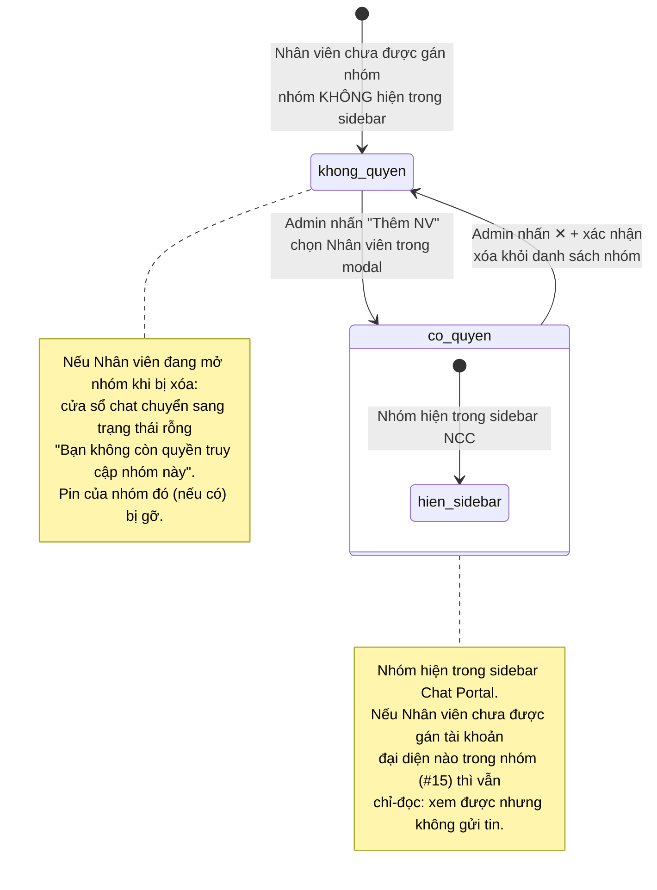

# #16 — Phân quyền nhóm chat

> **Trạng thái:** draft
> **Nguồn:** [`../scope-and-features.md § D.2 (#16)`](../scope-and-features.md) (canonical) · [`../FSD-Admin-Site.md § 3.2 "Bảng nhóm NCC — quản lý thành viên"`](../FSD-Admin-Site.md) (Admin side) · [`../FSD-Chat-Portal.md § 5.1 FR-D.1 / FR-D.5`](../FSD-Chat-Portal.md) (side effect Portal)
> **Liên quan:** [`#15 Phân quyền tài khoản Zalo`](15-phan-quyen-tai-khoan-zalo.md) · [`#17 Cấu trúc vai trò trong nhóm`](17-cau-truc-vai-tro.md) · [`#12 Ghim hội thoại`](12-ghim-hoi-thoai.md)

---

## 📌 Tóm tắt 1 dòng

Admin gán danh sách Nhân viên cho từng nhóm NCC ngay tại Admin Site → Nhân viên trong danh sách mới thấy nhóm đó trong sidebar Chat Portal, còn lại nhóm bị ẩn hoàn toàn — giúp kiểm soát ai được tiếp cận hội thoại của từng nhà cung cấp.

---

## 🎯 Giá trị nghiệp vụ

Mỗi nhóm chat NCC chứa thông tin nhạy cảm về một nhà cung cấp cụ thể: giá, đơn hàng, số điện thoại khách. Không phải Nhân viên nào cũng cần (hoặc nên) thấy mọi nhóm. Nếu mở toàn bộ nhóm cho mọi người, rủi ro rò rỉ thông tin và nhiễu việc tăng cao — nhất là khi công ty có nhiều phòng ban phụ trách nhóm NCC khác nhau.

Tính năng này cho Admin **gán quyền truy cập theo từng nhóm**: chỉ những Nhân viên được thêm vào danh sách của một nhóm mới thấy nhóm đó trong sidebar Chat Portal. Nhân viên không có quyền thì nhóm hoàn toàn vô hình — không xuất hiện trong sidebar, không truy cập được tin, không nhận thông báo. Admin thì luôn thấy mọi nhóm, không cần gán.

Việc thêm/xóa diễn ra ngay trong bảng "Quản lý nhóm NCC" của Admin Site và **có hiệu lực tức thì** trên Chat Portal: thêm Nhân viên → nhóm hiện ra trong sidebar của họ; xóa → nhóm biến mất ngay, kể cả khi họ đang mở nhóm đó.

Cần phân biệt rõ với [`#15`](15-phan-quyen-tai-khoan-zalo.md): #16 quyết định Nhân viên **thấy** nhóm nào (quyền truy cập), còn #15 quyết định Nhân viên **đại diện** tài khoản Zalo nào khi gửi tin (danh tính gửi). Một Nhân viên có thể được gán vào nhóm (#16) nhưng vẫn ở chế độ chỉ-đọc nếu chưa được gán tài khoản đại diện nào trong nhóm đó (#15).

**Lợi ích:**

- Mỗi nhóm NCC chỉ hiển thị cho đúng Nhân viên phụ trách, giảm bề mặt rò rỉ thông tin.
- Admin kiểm soát quyền tập trung tại một bảng, thấy ngay số Nhân viên đang ở mỗi nhóm.
- Thay đổi quyền có hiệu lực ngay, không cần Nhân viên đăng nhập lại.

---

## 👥 Vai trò liên quan

| Vai trò | Trách nhiệm |
| --- | --- |
| **Quản trị (Admin)** | Mở bảng "Quản lý nhóm NCC", expand row một nhóm để xem danh sách Nhân viên đang được gán. Nhấn "Thêm NV" để thêm (chỉ chọn được Nhân viên đủ điều kiện), nhấn icon ✕ để xóa (có hỏi xác nhận). Bản thân Admin luôn truy cập mọi nhóm, không cần tự gán. |
| **Nhân viên (Staff)** | Không thao tác trên màn hình phân quyền. Là đối tượng được gán: chỉ thấy trong sidebar Chat Portal những nhóm đã được Admin gán. Khi được thêm → nhóm xuất hiện; khi bị xóa → nhóm biến mất ngay, kèm pin của nhóm đó (nếu có) bị gỡ. |
| **Vendor (NCC)** | Không bị ảnh hưởng. Việc phân quyền là nội bộ, không hiển thị sang Zalo. |
| **Hệ thống** | Lọc sidebar Chat Portal theo danh sách Nhân viên được gán của từng nhóm · Cập nhật sidebar và cửa sổ chat theo thời gian thực khi quyền thay đổi · Lọc danh sách "đủ điều kiện" trong modal thêm Nhân viên · Khi xóa Nhân viên, gỡ luôn cấu hình đại diện riêng (override) của họ trong nhóm đó. |

---

## 🔄 Dòng chảy nghiệp vụ

Vòng đời quyền truy cập một nhóm của một Nhân viên — từ góc nhìn Admin thao tác và hệ quả trên sidebar Chat Portal:



---

## ✅ Kịch bản chấp nhận

```gherkin
# language: vi
Tính năng: Admin phân quyền truy cập nhóm NCC cho Nhân viên và Nhân viên chỉ thấy nhóm được gán

  Bối cảnh:
    Biết Admin "Nguyễn Quản Trị" đã đăng nhập Admin Site
    Và đang ở bảng "Quản lý nhóm NCC"
    Và nhóm "NCC Vận Chuyển Phương Nam" đang được hệ thống đồng bộ

  # =====================================================
  # Xem danh sách Nhân viên trong nhóm (FR-NHOM.6)
  # =====================================================

  Tình huống: Admin mở danh sách Nhân viên của một nhóm
    Biết Admin đang xem row của nhóm "NCC Vận Chuyển Phương Nam"
    Khi Admin nhấn nút expand ▸ trên row đó
    Thì row mở rộng xuống và hiển thị bảng Nhân viên đang được gán
    Và bảng có các cột "Nhân viên", "Phòng ban", "Đại diện qua" và "Thao tác"

  Tình huống: Nhóm chưa có Nhân viên nào hiển thị danh sách rỗng
    Biết nhóm "NCC Vật Tư Miền Tây" chưa có Nhân viên nào được gán
    Khi Admin expand row của nhóm đó
    Thì bảng Nhân viên hiển thị trống
    Và chỉ Admin truy cập được nhóm này trên Chat Portal

  # =====================================================
  # Thêm Nhân viên vào nhóm (FR-NHOM.7)
  # =====================================================

  Tình huống: Admin mở modal thêm Nhân viên vào nhóm
    Biết Admin đang xem expand row của nhóm "NCC Vận Chuyển Phương Nam"
    Khi Admin nhấn nút "Thêm NV"
    Thì hệ thống mở modal "Thêm nhân viên vào nhóm"
    Và modal chỉ liệt kê các Nhân viên đủ điều kiện
    Và modal không có ô tìm kiếm và không có bộ lọc phòng ban

  Tình huống: Modal chỉ liệt kê Nhân viên đủ điều kiện đại diện cho nhóm
    Biết Nhân viên "Lê Diễm Chi" đã được gán đại diện cho một tài khoản Zalo đang đồng bộ nhóm "NCC Vận Chuyển Phương Nam"
    Và Nhân viên "Trần Văn Bốn" chưa được gán đại diện cho bất kỳ tài khoản nào của nhóm đó
    Khi Admin mở modal "Thêm nhân viên vào nhóm"
    Thì "Lê Diễm Chi" xuất hiện trong danh sách
    Nhưng "Trần Văn Bốn" không xuất hiện trong danh sách

  Tình huống: Click một Nhân viên trong modal là thêm ngay
    Biết modal "Thêm nhân viên vào nhóm" đang mở và có "Lê Diễm Chi" trong danh sách
    Khi Admin click vào row "Lê Diễm Chi"
    Thì "Lê Diễm Chi" được thêm vào nhóm ngay lập tức mà không cần nút xác nhận
    Và số "NV nội bộ" trên row nhóm tăng lên tương ứng

  Tình huống: Modal rỗng khi chưa có Nhân viên nào đủ điều kiện
    Biết chưa có Nhân viên nào được gán đại diện cho tài khoản Zalo đang đồng bộ nhóm
    Khi Admin mở modal "Thêm nhân viên vào nhóm"
    Thì modal hiển thị trạng thái rỗng hướng dẫn Admin gán Nhân viên cho ít nhất một tài khoản Zalo của nhóm trước

  Tình huống: Modal rỗng khi mọi Nhân viên đủ điều kiện đã ở trong nhóm
    Biết tất cả Nhân viên đủ điều kiện đã được thêm vào nhóm "NCC Vận Chuyển Phương Nam"
    Khi Admin mở modal "Thêm nhân viên vào nhóm"
    Thì modal hiển thị trạng thái rỗng "Tất cả nhân viên đủ điều kiện đã được thêm vào nhóm"

  # =====================================================
  # Xóa Nhân viên khỏi nhóm (FR-NHOM.8)
  # =====================================================

  Tình huống: Admin xóa một Nhân viên khỏi nhóm có hỏi xác nhận
    Biết "Lê Diễm Chi" đang trong danh sách Nhân viên của nhóm "NCC Vận Chuyển Phương Nam"
    Khi Admin nhấn icon ✕ ở row của "Lê Diễm Chi"
    Thì hệ thống mở hộp thoại xác nhận nêu rõ Nhân viên sẽ không còn thấy nhóm này trong sidebar Chat Portal
    Và chưa có thay đổi nào cho tới khi Admin xác nhận

  Tình huống: Hủy hộp thoại xác nhận thì không xóa
    Biết hộp thoại xác nhận xóa "Lê Diễm Chi" đang mở
    Khi Admin nhấn "Hủy"
    Thì "Lê Diễm Chi" vẫn còn trong danh sách Nhân viên của nhóm

  Tình huống: Xóa Nhân viên cũng gỡ cấu hình đại diện riêng của họ trong nhóm
    Biết "Lê Diễm Chi" đang được đặt đại diện riêng (override) một tài khoản cụ thể trong nhóm "NCC Vận Chuyển Phương Nam"
    Khi Admin xác nhận xóa "Lê Diễm Chi" khỏi nhóm
    Thì "Lê Diễm Chi" bị xóa khỏi danh sách Nhân viên của nhóm
    Và cấu hình đại diện riêng của "Lê Diễm Chi" trong nhóm đó được gỡ bỏ

  Tình huống: Cho phép xóa Nhân viên cuối cùng khỏi nhóm
    Biết nhóm "NCC Vận Chuyển Phương Nam" chỉ còn đúng một Nhân viên được gán
    Khi Admin xác nhận xóa Nhân viên đó
    Thì nhóm không còn Nhân viên nào được gán
    Và chỉ Admin truy cập được nhóm này

  # =====================================================
  # Số "NV nội bộ" cập nhật theo thời gian thực (FR-NHOM.9)
  # =====================================================

  Tình huống: Số Nhân viên trên row nhóm cập nhật ngay sau khi thêm hoặc xóa
    Biết row nhóm "NCC Vận Chuyển Phương Nam" đang hiển thị 2 Nhân viên nội bộ
    Khi Admin thêm thêm một Nhân viên vào nhóm
    Thì số "NV nội bộ" trên row đổi thành 3 ngay lập tức

  # =====================================================
  # Side effect trên Chat Portal (FR-D.1, FR-D.5)
  # =====================================================

  Tình huống: Nhân viên chỉ thấy nhóm được gán trong sidebar NCC
    Biết Nhân viên "Lê Diễm Chi" được gán nhóm "NCC Vận Chuyển Phương Nam" nhưng không được gán nhóm "NCC Vật Tư Miền Tây"
    Khi "Lê Diễm Chi" mở sidebar NCC trên Chat Portal
    Thì sidebar liệt kê nhóm "NCC Vận Chuyển Phương Nam"
    Nhưng sidebar không liệt kê nhóm "NCC Vật Tư Miền Tây"

  Tình huống: Admin thấy mọi nhóm trong sidebar mà không cần được gán
    Biết Admin "Nguyễn Quản Trị" mở sidebar NCC trên Chat Portal
    Khi sidebar tải xong
    Thì sidebar liệt kê tất cả nhóm NCC đã đồng bộ
    Và Admin truy cập được mọi nhóm dù không có tên trong danh sách gán nào

  Tình huống: Nhóm xuất hiện trong sidebar ngay khi Nhân viên được cấp quyền
    Biết Nhân viên "Lê Diễm Chi" đang mở Chat Portal và chưa thấy nhóm "NCC Vật Tư Miền Tây"
    Khi Admin thêm "Lê Diễm Chi" vào nhóm "NCC Vật Tư Miền Tây"
    Thì nhóm "NCC Vật Tư Miền Tây" xuất hiện trong sidebar của "Lê Diễm Chi" theo thứ tự sắp xếp hiện hành

  Tình huống: Nhóm biến mất khỏi sidebar ngay khi Nhân viên bị mất quyền
    Biết Nhân viên "Lê Diễm Chi" đang thấy nhóm "NCC Vận Chuyển Phương Nam" trong sidebar
    Khi Admin xóa "Lê Diễm Chi" khỏi nhóm đó
    Thì nhóm biến mất khỏi sidebar của "Lê Diễm Chi" ngay lập tức

  Tình huống: Nhân viên đang mở nhóm bị mất quyền thấy trạng thái rỗng
    Biết Nhân viên "Lê Diễm Chi" đang mở cửa sổ chat của nhóm "NCC Vận Chuyển Phương Nam"
    Khi Admin xóa "Lê Diễm Chi" khỏi nhóm đó
    Thì cửa sổ chat chuyển sang trạng thái rỗng "Bạn không còn quyền truy cập nhóm này. Vui lòng liên hệ Admin."
    Và nội dung soạn dở (draft) trong ô nhập bị xóa, không lưu lại

  Tình huống: Mất quyền nhóm thì pin của nhóm đó cũng bị gỡ
    Biết Nhân viên "Lê Diễm Chi" đã ghim nhóm "NCC Vận Chuyển Phương Nam" lên đầu sidebar
    Khi Admin xóa "Lê Diễm Chi" khỏi nhóm đó
    Thì nhóm biến mất khỏi cả mục "Đã ghim" lẫn mục "Tất cả NCC"
    Và pin của nhóm đó cho "Lê Diễm Chi" bị gỡ

  # =====================================================
  # Phân biệt #16 (thấy nhóm) với #15 (quyền đại diện)
  # =====================================================

  Tình huống: Được gán nhóm nhưng không có tài khoản đại diện thì chỉ-đọc
    Biết Nhân viên "Lê Diễm Chi" đã được gán nhóm "NCC Vận Chuyển Phương Nam"
    Nhưng "Lê Diễm Chi" chưa được gán đại diện cho bất kỳ tài khoản Zalo nào trong nhóm đó
    Khi "Lê Diễm Chi" mở nhóm trên Chat Portal
    Thì "Lê Diễm Chi" xem được mọi tin trong nhóm
    Nhưng ô nhập tin bị khóa với chú thích "Bạn không được phép gửi tin trong nhóm này"

  # =====================================================
  # Trường hợp đặc biệt
  # =====================================================

  Tình huống: Admin bị hạ vai trò xuống Nhân viên thì áp quy tắc phân quyền nhóm
    Biết một Admin vừa bị đổi vai trò xuống Nhân viên
    Khi người đó mở sidebar NCC trên Chat Portal
    Thì sidebar rỗng vì chưa được gán nhóm nào theo #16
    Và họ chỉ thấy nhóm sau khi được Admin gán
```

---

## 🎨 Mô tả giao diện

### Bảng "Quản lý nhóm NCC" (Admin Site)

Mỗi nhóm NCC là một row. Row có nút expand ▸ ở đầu; nhấn để mở rộng xuống bảng Nhân viên được gán của nhóm đó. Tại 1 thời điểm chỉ 1 row expand (expand row mới sẽ tự thu row cũ).

```
┌──────────────────────────────────────────────────────────────────┐
│ ▸  NCC Vận Chuyển Phương Nam   [tài khoản]   NV nội bộ: 2   [⋯]    │
├──────────────────────────────────────────────────────────────────┤
│ ▾  NCC Vật Tư Miền Tây         [tài khoản]   NV nội bộ: 0   [⋯]    │
│    ┌────────────────────────────────────────────────────────────┐ │
│    │ Nhân viên   │ Phòng ban │ Đại diện qua    │ Thao tác │ + NV │ │
│    │ (trống — chưa có nhân viên nào được gán)                    │ │
│    └────────────────────────────────────────────────────────────┘ │
└──────────────────────────────────────────────────────────────────┘
```

### Bảng Nhân viên trong expand row

| Cột | Nội dung | Ghi chú |
| --- | --- | --- |
| **Nhân viên** | Avatar + tên Nhân viên | |
| **Phòng ban** | Tên phòng ban | |
| **Đại diện qua** | Dropdown / badge chọn tài khoản đại diện | Thuộc #15 — chi tiết tại [`#15`](15-phan-quyen-tai-khoan-zalo.md); chỉ là cột hiển thị cùng bảng |
| **Thao tác** | Icon ✕ xóa Nhân viên khỏi nhóm | Mở hộp thoại xác nhận trước khi xóa |

Cột Thao tác của chính row nhóm (không phải row Nhân viên) có nút **"Thêm NV"** mở modal thêm.

### Modal "Thêm nhân viên vào nhóm"

```
┌────────────────────────────────────────────┐
│  Thêm nhân viên vào nhóm                    │
│ ──────────────────────────────────────────  │
│  ● [avatar] Lê Diễm Chi      — Vận hành     │  ← click row = thêm ngay
│  ● [avatar] Tăng Thị Huyền   — Kho hàng     │
│  ● [avatar] Phạm Minh Quân   — Vận hành     │
└────────────────────────────────────────────┘
```

| Thành phần | Mô tả |
| --- | --- |
| **Tiêu đề** | "Thêm nhân viên vào nhóm" — không kèm tên nhóm (context đã rõ từ row đang expand) |
| **Danh sách** | Chỉ các Nhân viên đủ điều kiện (đã được gán đại diện cho ít nhất 1 tài khoản Zalo đang đồng bộ nhóm — xem #15) |
| **Mỗi row** | Avatar + tên + phòng ban |
| **Hành vi** | Click row = thêm ngay, không có checkbox, không có nút "Lưu" |
| **Khác biệt** | Không có ô tìm kiếm, không có bộ lọc phòng ban (khác modal "Gán nhân viên" ở tab tài khoản) |

**Trạng thái rỗng của modal:**

| Tình huống | Nội dung trạng thái rỗng |
| --- | --- |
| Chưa có Nhân viên đủ điều kiện | "Không có nhân viên nào đủ điều kiện thêm vào nhóm này. Vui lòng gán staff cho ít nhất một tài khoản Zalo đang sync nhóm trước (trang Nhà Cung Cấp)." |
| Mọi Nhân viên đủ điều kiện đã ở trong nhóm | "Tất cả nhân viên đủ điều kiện đã được thêm vào nhóm." |

### Hộp thoại xác nhận xóa

> "Xóa [Tên Nhân viên] khỏi nhóm [Tên nhóm]? Staff sẽ không còn thấy nhóm này trong sidebar Chat Portal."

Hai nút: **Hủy** (đóng, không xóa) và xác nhận (xóa Nhân viên + gỡ cấu hình đại diện riêng của họ trong nhóm).

### Side effect trên Chat Portal (sidebar NCC)

| Thay đổi của Admin | Hệ quả với Nhân viên |
| --- | --- |
| Thêm Nhân viên vào nhóm | Nhóm xuất hiện trong sidebar (theo thứ tự sắp xếp hiện hành) |
| Xóa Nhân viên khỏi nhóm | Nhóm biến mất khỏi sidebar ngay; nếu đang mở → cửa sổ chat chuyển trạng thái rỗng; pin của nhóm bị gỡ |

> Trạng thái rỗng khi đang mở nhóm bị mất quyền: "Bạn không còn quyền truy cập nhóm này. Vui lòng liên hệ Admin." Nội dung soạn dở trong ô nhập bị xóa, không lưu lại (tránh leak).

### Mockup tham chiếu

> ✅ **Đã có:**
> - Expand row hiển thị bảng Nhân viên trong nhóm.
> - Modal "Thêm nhân viên vào nhóm" — click row để thêm trực tiếp (không search, không checkbox).
>
> ⏳ **Cần BA bổ sung:**
> - Hộp thoại xác nhận xóa Nhân viên khỏi nhóm.
> - Trạng thái rỗng của modal thêm (2 biến thể: chưa có ai đủ điều kiện / tất cả đã được thêm).
> - Sidebar góc nhìn Nhân viên (chỉ thấy nhóm được gán) vs Admin (thấy tất cả).
> - Cửa sổ chat trạng thái rỗng "Bạn không còn quyền truy cập nhóm này".

---

## 🔗 Tham chiếu & Q&A

### Liên quan các phần khác

- [`#15 Phân quyền tài khoản Zalo`](15-phan-quyen-tai-khoan-zalo.md): #15 quyết định Nhân viên **đại diện** tài khoản Zalo nào khi gửi tin (danh tính gửi); #16 quyết định Nhân viên **thấy** nhóm nào (quyền truy cập). Điều kiện "đủ điều kiện" trong modal thêm (#16) phụ thuộc gán đại diện của #15. Một Nhân viên được gán nhóm (#16) nhưng chưa được gán tài khoản đại diện nào trong nhóm (#15) → chỉ-đọc (xem cơ chế resolve tại [`../scope-and-features.md § D.4(a)`](../scope-and-features.md)).
- [`#17 Cấu trúc vai trò trong nhóm`](17-cau-truc-vai-tro.md): 3 vai trò cố định Admin / Staff / Vendor. Admin truy cập mọi nhóm không cần gán #16; Vendor không truy cập Portal.
- [`#12 Ghim hội thoại`](12-ghim-hoi-thoai.md): khi Nhân viên mất quyền nhóm theo #16, pin của nhóm đó bị gỡ (FR-12.6).
- Cấu hình đại diện riêng per-group (override "Đại diện qua") và cơ chế resolve tài khoản: [`../FSD-Admin-Site.md § 3.4`](../FSD-Admin-Site.md) · [`../scope-and-features.md § D.4(a)(b)`](../scope-and-features.md).
- Cập nhật quyền real-time cũng có thể thực hiện từ "Quản lý thành viên" trong Chat Portal: [`../FSD-Chat-Portal.md § 5.4`](../FSD-Chat-Portal.md).

### ⚠️ Q&A cần BA / PO làm rõ

1. **Khi xóa Nhân viên cuối cùng khỏi nhóm: cho phép nhóm "không có Nhân viên nào" không?**
   - **Phương án A — cho phép:** Nhóm có thể không còn Nhân viên nào, chỉ Admin truy cập được. Nguồn: [`../FSD-Admin-Site.md § 3.2 Edge Cases`](../FSD-Admin-Site.md) ("Xóa staff cuối cùng: vẫn cho phép").
   - **Phương án B — chặn:** Yêu cầu mỗi nhóm phải có ≥ 1 Nhân viên.
   - **Pilot hiện đang theo:** Phương án A (cho phép). Gherkin viết theo A. Cần BA/PO xác nhận đây là hành vi mong muốn.

2. **Nguồn dữ liệu "Nhân viên đủ điều kiện" trong modal thêm — chốt theo gán đại diện (#15)?**
   - [`../FSD-Admin-Site.md § 3.2 FR-NHOM.7`](../FSD-Admin-Site.md) và `§ 3.5` định nghĩa: chỉ liệt kê Nhân viên đã được gán đại diện cho ≥ 1 tài khoản Zalo đang đồng bộ nhóm.
   - [`../scope-and-features.md § D.2`](../scope-and-features.md) (canonical) chỉ nói "Admin gán danh sách staff cho mỗi vendor group", **không** nêu ràng buộc "phải eligible đại diện trước". Hai nguồn ở mức chi tiết khác nhau (không mâu thuẫn cứng, nhưng scope doc thiếu ràng buộc này).
   - **Pilot hiện đang theo:** Theo FSD-Admin-Site — chỉ Nhân viên đủ điều kiện đại diện mới thêm được vào nhóm. Hệ quả: không thể gán một Nhân viên thuần chỉ-đọc qua modal này. Cần BA/PO xác nhận và (nếu chốt) bổ sung ràng buộc vào scope doc § D.2.

3. **Cập nhật thời gian thực khi mất quyền: có cho Nhân viên đọc nốt tin đang tải dở không?**
   - [`../FSD-Chat-Portal.md FR-D.5`](../FSD-Chat-Portal.md) nêu cửa sổ chat "chuyển empty state ngay" và "draft text bị mất". Chưa nêu rõ trường hợp đang tải file/media dở (tải xong rồi mới mất quyền vs đang tải).
   - **Pilot hiện đang theo:** Mất quyền → chặn ngay mọi truy cập nội dung nhóm (an toàn dữ liệu). Cần BA/PO xác nhận hành vi với tải dở đang chạy.
