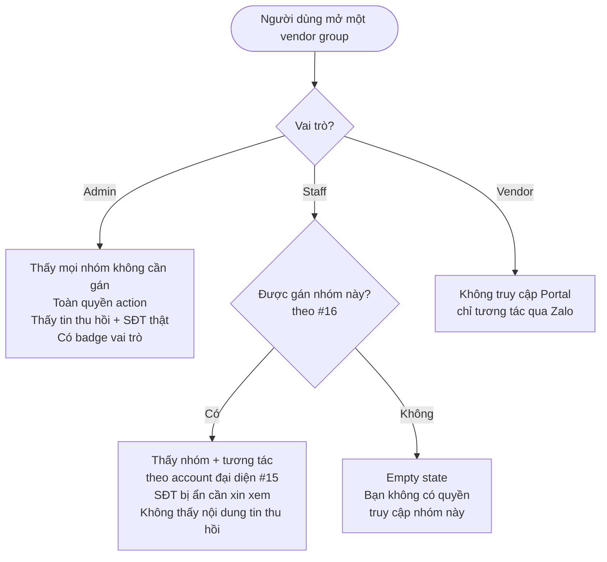

# #17 — Cấu trúc vai trò trong nhóm

> **Trạng thái:** draft
> **Nguồn:** [`../scope-and-features.md § D.3 (#17)`](../scope-and-features.md) (canonical) · [`../scope-and-features.md § 4 Vai trò & Thuật ngữ`](../scope-and-features.md) · [`../scope-and-features.md § 6 Quy tắc hiển thị tên`](../scope-and-features.md) · [`../FSD-Chat-Portal.md § 5.1`](../FSD-Chat-Portal.md) (hiệu ứng phân quyền trên Portal) · [`../FSD-Admin-Site.md § 6.3`](../FSD-Admin-Site.md) (conceptual rule, không UI riêng)
> **Liên quan:** [`#28 Ẩn/hiện số điện thoại (phía Nhân viên)`](28-an-hien-so-dien-thoai-staff.md) · [`#28a Admin duyệt yêu cầu xem SĐT ngay trong nhóm chat`](28a-admin-duyet-yeu-cau-tu-chat.md) · [`#29 Trang Yêu Cầu Xem SĐT`](29-trang-yeu-cau-xem-sdt.md) · [`#09 Thu hồi tin nhắn`](09-thu-hoi-tin-nhan.md) · [`#14 Phân quyền tải tập tin`](14-phan-quyen-tai-tap-tin.md)

---

## 📌 Tóm tắt 1 dòng

Hệ thống chỉ có **3 vai trò cố định** — Admin (quản trị nội bộ, toàn quyền), Staff (nhân viên nội bộ, chỉ thấy nhóm được gán), Vendor (NCC, chỉ qua Zalo) — quy định ai thấy nhóm nào, làm được thao tác gì và hiện thị danh tính ra sao trên Chat Portal lẫn Admin Site, nhằm bảo vệ dữ liệu khách hàng và quy trách nhiệm rõ ràng.

---

## 🎯 Giá trị nghiệp vụ

Các nhóm chat NCC chứa dữ liệu nhạy cảm (số điện thoại khách, thoả thuận giá, tin đã thu hồi). Nếu mọi nhân viên đều thấy mọi nhóm và làm mọi thao tác, rủi ro rò rỉ và sai sót rất cao. Hệ thống cần một bộ quy tắc vai trò **đơn giản, cố định** để mỗi người chỉ thấy và làm đúng phần việc của mình.

Tính năng này chốt **đúng 3 vai trò** cho toàn hệ thống: **Admin**, **Staff**, **Vendor**. Không có vai trò trung gian (Leader / Trưởng phòng) trong ngữ cảnh nhóm NCC, và **không có cơ chế tạo vai trò tùy chỉnh** — đây là quyết định nghiệp vụ để giữ mô hình phân quyền đơn giản, dễ kiểm soát, tránh phình to thành ma trận quyền khó audit.

#17 là một **quy tắc nền tảng (conceptual rule)**, không có một màn hình quản lý vai trò riêng. Thay vào đó, vai trò thể hiện **ngầm qua mọi luồng phân quyền khác**: ai thấy nhóm nào (#16), ai đại diện account nào (#15), ai duyệt yêu cầu xem SĐT (#28 / #28a / #29), ai thấy tin đã thu hồi (#9), ai tải được file (#14). File này gom các quy tắc đó lại thành một bảng quyền hạn duy nhất theo từng vai trò × từng khả năng × từng bề mặt UI (Chat Portal vs Admin Site), để các feature khác tham chiếu thay vì lặp lại.

**Lợi ích:**

- Mô hình phân quyền tối giản (3 vai trò), dễ giải thích cho nhân viên mới và dễ kiểm toán.
- Mỗi vai trò có ranh giới quyền rõ ràng trên từng bề mặt UI — giảm rò rỉ dữ liệu và thao tác nhầm.
- Là nguồn tham chiếu chung cho mọi feature phân quyền, tránh định nghĩa lệch nhau giữa các tài liệu.

---

## 👥 Vai trò liên quan

| Vai trò | Trách nhiệm |
| --- | --- |
| **Admin (Quản trị)** | Toàn quyền nội bộ. Truy cập **mọi** vendor group đã đồng bộ mà **không cần được gán**. Thấy nội dung tin đã thu hồi, thấy số điện thoại thật trong nhóm bật ẩn SĐT, tải mọi loại file ở mọi nhóm. Duyệt / từ chối / thu hồi yêu cầu xem SĐT. Cấu hình phân quyền (gán Staff vào account #15, vào nhóm #16). Truy cập được Admin Site. |
| **Staff (Nhân viên nội bộ)** | Chỉ thấy các vendor group **được Admin gán** (#16). Trong nhóm được gán: gửi/nhận tin, reply, react, ghim, forward, bookmark, mention — dưới danh tính tài khoản Zalo mình đại diện (#15). **Không** thấy nội dung tin đã thu hồi, **không** thấy số bị ẩn (phải gửi yêu cầu xem), **không** duyệt yêu cầu, **không** truy cập Admin Site. |
| **Vendor (NCC)** | Chỉ tương tác qua **Zalo**. Không có tài khoản Portal, không truy cập Chat Portal hay Admin Site. Không nhìn thấy tin nội bộ, badge vai trò, hay các thông báo phân quyền nội bộ. |
| **Hệ thống** | Áp dụng quy tắc vai trò ở mọi nơi: lọc danh sách nhóm theo vai trò, bật/tắt thao tác theo quyền, gắn badge vai trò cạnh tên người gửi, và cập nhật ngay khi Admin thay đổi phân quyền. |

---

## 🔄 Dòng chảy nghiệp vụ

Vai trò quyết định người dùng nhìn thấy gì khi mở một vendor group trên Chat Portal (Vendor không nằm trong luồng Portal — chỉ ở phía Zalo):



---

## ✅ Kịch bản chấp nhận

```gherkin
# language: vi
Tính năng: Hệ thống áp dụng đúng 3 vai trò cố định Admin / Staff / Vendor trên Chat Portal và Admin Site

  Bối cảnh:
    Biết hệ thống chỉ có 3 vai trò: Admin (quản trị nội bộ), Staff (nhân viên nội bộ), Vendor (NCC)
    Và Vendor chỉ tương tác qua Zalo, không có tài khoản truy cập Portal hay Admin Site

  # =====================================================
  # 3 vai trò cố định — không có vai trò tùy chỉnh (§ D.3)
  # =====================================================

  Tình huống: Hệ thống không cung cấp cơ chế tạo vai trò mới
    Biết Admin đang quản trị hệ thống
    Khi Admin tìm chức năng tạo vai trò tùy chỉnh (ví dụ "Leader", "Trưởng phòng")
    Thì hệ thống không có chức năng đó
    Và mỗi người dùng nội bộ chỉ có thể là Admin hoặc Staff
    Và không tồn tại vai trò trung gian nào trong ngữ cảnh nhóm NCC

  # =====================================================
  # Phạm vi thấy nhóm theo vai trò (FR-D.1)
  # =====================================================

  Tình huống: Admin thấy mọi vendor group mà không cần được gán
    Biết có nhiều vendor group đã đồng bộ về hệ thống
    Và Admin chưa được gán riêng vào bất kỳ nhóm nào
    Khi Admin mở danh sách nhóm NCC trên Chat Portal
    Thì sidebar liệt kê toàn bộ vendor group đã đồng bộ

  Tình huống: Staff chỉ thấy các nhóm được gán
    Biết Staff "Lê Diễm Chi" được gán nhóm "NCC Vận Chuyển Phương Nam"
    Và Staff đó không được gán nhóm "NCC Kho Hàng Miền Tây"
    Khi Staff mở danh sách nhóm NCC trên Chat Portal
    Thì sidebar chỉ liệt kê nhóm "NCC Vận Chuyển Phương Nam"
    Và nhóm "NCC Kho Hàng Miền Tây" không xuất hiện

  Tình huống: Staff cố mở nhóm không được gán
    Biết Staff không có quyền truy cập nhóm "NCC Kho Hàng Miền Tây"
    Khi Staff cố mở nhóm đó qua đường dẫn trực tiếp
    Thì cửa sổ chat hiển thị empty state "Bạn không còn quyền truy cập nhóm này. Vui lòng liên hệ Admin."

  # =====================================================
  # Quyền action theo vai trò trên Chat Portal (FR-D.4)
  # =====================================================

  Khung tình huống: Quyền theo vai trò trong một nhóm Staff được phép truy cập
    Biết một nhóm vendor đang mở trên Chat Portal
    Khi "<vai tro>" thực hiện "<kha nang>"
    Thì hệ thống "<ket qua>"

    Dữ liệu:
      | vai tro | kha nang                              | ket qua                                                        |
      | Admin   | xem nội dung tin đã thu hồi           | cho phép, hiện nội dung gốc kèm strikethrough + timestamp      |
      | Staff   | xem nội dung tin đã thu hồi           | không cho phép, chỉ hiện "Tin nhắn đã thu hồi"                 |
      | Admin   | xem số điện thoại trong nhóm bật ẩn   | cho phép, hiện số thật kèm badge "Đang ẩn với nhóm"            |
      | Staff   | xem số điện thoại trong nhóm bật ẩn   | không cho phép, hiện số che và phải gửi yêu cầu xem            |
      | Admin   | duyệt / từ chối / thu hồi yêu cầu SĐT | cho phép                                                       |
      | Staff   | duyệt / từ chối / thu hồi yêu cầu SĐT | không cho phép, chỉ được gửi yêu cầu xem                       |
      | Admin   | tải tập tin ở mọi nhóm                | cho phép không giới hạn                                        |
      | Staff   | tải tập tin                           | chỉ khi được cấp quyền tải trong nhóm đó (#14)                 |

  Tình huống: Admin không bị giới hạn các thao tác chat thông thường
    Biết Admin đang mở một vendor group bất kỳ
    Khi Admin forward, bookmark, ghim, thả cảm xúc, reply hoặc mention
    Thì hệ thống cho phép mọi thao tác mà không chặn theo quyền

  Tình huống: Staff gửi tin theo danh tính tài khoản Zalo được gán đại diện
    Biết Staff được gán đại diện tài khoản Zalo "Quốc Nam - Vận Hành" trong nhóm đang mở
    Khi Staff gửi một tin ZALO trong nhóm đó
    Thì tin hiển thị trên Zalo dưới danh tính "Quốc Nam - Vận Hành"

  Tình huống: Staff không được gán account nào trong nhóm thì chỉ xem
    Biết Staff được phép truy cập nhóm nhưng không được gán đại diện account nào trong nhóm đó
    Khi Staff mở cửa sổ chat của nhóm
    Thì ô nhập tin bị vô hiệu hoá
    Và hệ thống hiển thị tooltip "Bạn không được phép gửi tin trong nhóm này"

  # =====================================================
  # Hiển thị badge vai trò & danh tính (FR-D.3, § 6)
  # =====================================================

  Tình huống: Tin ZALO của Staff hiện thêm tên nội bộ trên Portal
    Biết Staff "Lê Diễm Chi" đại diện account "Quốc Nam - Vận Hành" gửi một tin
    Khi người dùng nội bộ xem tin đó trên Portal
    Thì tên người gửi hiển thị dạng "Quốc Nam - Vận Hành (Lê Diễm Chi)"
    Nhưng trên Zalo vendor chỉ thấy "Quốc Nam - Vận Hành"

  Tình huống: Tin của Admin có thêm badge vai trò trên Portal
    Biết Admin "Nguyễn Văn An" đại diện một account gửi một tin ZALO
    Khi người dùng nội bộ xem tin đó trên Portal
    Thì tên hiển thị kèm một badge nhỏ đánh dấu vai trò Admin

  Tình huống: Badge vai trò xuất hiện ở các nơi cần phân biệt người gửi
    Biết một tin nội bộ do Admin tạo
    Khi người dùng xem mini-profile khi click tên, nhật ký công việc, hoặc tin Forward trong DM
    Thì badge vai trò của người đó hiển thị cạnh tên

  # =====================================================
  # Vendor không nằm trong luồng Portal / Admin Site
  # =====================================================

  Tình huống: Vendor không có lối truy cập vào hệ thống nội bộ
    Biết một Vendor là thành viên của nhóm chat trên Zalo
    Khi xét quyền truy cập của Vendor
    Thì Vendor không có tài khoản Chat Portal hay Admin Site
    Và Vendor không thấy badge vai trò, tin nội bộ, hay thông báo phân quyền nội bộ

  # =====================================================
  # Quyền truy cập Admin Site
  # =====================================================

  Khung tình huống: Chỉ Admin truy cập được Admin Site
    Khi "<vai tro>" cố truy cập Admin Site
    Thì hệ thống "<ket qua>"

    Dữ liệu:
      | vai tro | ket qua                          |
      | Admin   | cho phép truy cập đầy đủ         |
      | Staff   | không cho phép truy cập          |
      | Vendor  | không có tài khoản để truy cập  |

  # =====================================================
  # Cập nhật real-time khi đổi phân quyền (FR-D.5)
  # =====================================================

  Tình huống: Staff đang mở nhóm thì bị Admin thu hồi quyền truy cập
    Biết Staff đang mở cửa sổ chat của một nhóm
    Khi Admin thu hồi quyền truy cập nhóm đó của Staff
    Thì nhóm biến mất khỏi sidebar của Staff ngay
    Và cửa sổ chat đang mở chuyển sang empty state "Bạn không còn quyền truy cập nhóm này. Vui lòng liên hệ Admin."
    Và phần nội dung đang soạn dở (draft) bị xoá

  Tình huống: Staff vừa được cấp quyền một nhóm mới
    Biết Staff chưa được gán nhóm "NCC Kho Hàng Miền Tây"
    Khi Admin cấp quyền truy cập nhóm đó cho Staff
    Thì nhóm xuất hiện trong sidebar của Staff theo thứ tự sắp xếp hiện hành

  # =====================================================
  # Trường hợp đặc biệt
  # =====================================================

  Tình huống: Hạ vai trò Admin xuống Staff thì mất toàn bộ đặc quyền
    Biết một người dùng đang là Admin và thấy mọi nhóm
    Khi người đó bị đổi vai trò xuống Staff
    Thì người đó mất quyền Admin và áp dụng phân quyền theo Staff
    Và sidebar trống cho tới khi được Admin gán nhóm (tương đương Staff chưa được gán nhóm nào)

  Tình huống: Staff đã rời công ty vẫn giữ dấu vết danh tính trên tin cũ
    Biết Staff "Lê Diễm Chi" từng gửi tin rồi rời công ty
    Khi người dùng nội bộ xem lại tin cũ đó
    Thì tên hiển thị dạng "Quốc Nam - Vận Hành (Lê Diễm Chi — đã rời)"
    Và Staff đó không còn đại diện cho bất kỳ account nào cho tin mới
```

---

## 🎨 Mô tả giao diện

> #17 là quy tắc nền tảng — **không có một màn hình quản lý vai trò riêng**. Vai trò thể hiện *ngầm* qua hành vi, badge và phạm vi hiển thị trên hai bề mặt UI. Phần dưới mô tả các điểm chạm đó, không mô tả màn hình không tồn tại.

### Bảng quyền hạn theo vai trò × khả năng × bề mặt UI

| Khả năng | Admin | Staff | Vendor |
| --- | --- | --- | --- |
| **Chat Portal — thấy nhóm** | Mọi vendor group, không cần gán | Chỉ nhóm được gán (#16) | Không truy cập |
| **Chat Portal — gửi tin** | Mọi nhóm | Chỉ nhóm được gán, theo account đại diện (#15) | Qua Zalo (không qua Portal) |
| **Chat Portal — xem tin đã thu hồi** | Thấy nội dung gốc (strikethrough + giờ) | Chỉ thấy "Tin nhắn đã thu hồi" | Chỉ thấy "Tin nhắn đã thu hồi" trên Zalo |
| **Chat Portal — số điện thoại ẩn (#28)** | Thấy số thật + badge "Đang ẩn với nhóm" | Số bị che, phải gửi yêu cầu xem | Không liên quan (không bị che bên Zalo) |
| **Chat Portal — duyệt yêu cầu xem SĐT** | Duyệt / từ chối / thu hồi | Chỉ gửi yêu cầu | — |
| **Chat Portal — tải tập tin (#14)** | Mọi loại, mọi nhóm | Chỉ khi được cấp quyền tải trong nhóm | — |
| **Chat Portal — forward / bookmark / ghim / react / reply / mention** | Không bị chặn | Trong nhóm được gán | — |
| **Admin Site — truy cập** | Toàn quyền | Không truy cập | Không có tài khoản |
| **Admin Site — cấu hình phân quyền (#15, #16)** | Có | — | — |
| **Badge vai trò cạnh tên** | Có | Không có badge riêng (hiện tên nội bộ trong ngoặc) | Không hiển thị nội bộ |

### Cách vai trò thể hiện trên Chat Portal

- **Sidebar NCC:** số lượng nhóm thấy được phụ thuộc vai trò — Admin thấy tất cả; Staff chỉ thấy nhóm được gán. Khi mất quyền, nhóm biến mất real-time; cửa sổ đang mở chuyển empty state.
- **Tên người gửi trong bubble:** tin ZALO của Staff hiện `Z.displayName (StaffName)` trên Portal nhưng chỉ `Z.displayName` trên Zalo. Tin của Admin hiện thêm **badge vai trò** nhỏ cạnh tên.
- **Điểm hiện badge vai trò:** mini-profile popover (click tên trong bubble), nhật ký công việc của task, và tin Forward trong DM Admin.
- **Ô nhập tin:** enable/disable theo việc Staff có account đại diện trong nhóm hay không.

```
Góc nhìn Staff (sidebar)        Góc nhìn Admin (sidebar)
┌─────────────────────┐         ┌─────────────────────┐
│ ▸ NCC Phương Nam    │         │ ▸ NCC Phương Nam    │
│ ▸ NCC Sài Gòn       │         │ ▸ NCC Sài Gòn       │
│                     │         │ ▸ NCC Kho Miền Tây  │
│  (chỉ nhóm được gán)│         │ ▸ NCC Đông Bắc      │
└─────────────────────┘         │  (mọi nhóm đã sync) │
                                └─────────────────────┘
```

### Cách vai trò thể hiện trên Admin Site

- **Lối vào:** chỉ Admin đăng nhập được Admin Site. Staff không có lối vào; Vendor không có tài khoản.
- **Không có màn hình "Quản lý vai trò":** vai trò được chốt cứng ở 3 giá trị. Admin Site chỉ cấu hình *quan hệ gán* (Staff ↔ account #15, Staff ↔ nhóm #16), không tạo/sửa danh sách vai trò.

### Mockup tham chiếu

> ⏳ **Cần BA bổ sung:**
> - Sidebar NCC góc nhìn Staff (chỉ nhóm được gán) so với góc nhìn Admin (mọi nhóm).
> - Cửa sổ chat empty state "Bạn không còn quyền truy cập nhóm này."
> - Badge vai trò cạnh tên trong bubble / mini-profile popover.
> - Tooltip "Bạn không được phép gửi tin trong nhóm này" khi ô nhập bị vô hiệu hoá.

---

## 🔗 Tham chiếu & Q&A

### Liên quan các phần khác

- [`#15 Phân quyền tài khoản Zalo`](../scope-and-features.md): xác định Staff được đại diện account nào (`../scope-and-features.md § D.1`).
- [`#16 Phân quyền nhóm chat`](../scope-and-features.md): xác định Staff thấy nhóm nào (`../scope-and-features.md § D.2`).
- [`#28 Ẩn/hiện số điện thoại (phía Nhân viên)`](28-an-hien-so-dien-thoai-staff.md): hệ quả của ranh giới Admin (thấy số thật) vs Staff (phải xin xem).
- [`#28a`](28a-admin-duyet-yeu-cau-tu-chat.md) · [`#29`](29-trang-yeu-cau-xem-sdt.md): chỉ Admin duyệt/từ chối/thu hồi yêu cầu xem SĐT.
- [`#09 Thu hồi tin nhắn`](09-thu-hoi-tin-nhan.md): Admin thấy nội dung gốc, Staff không.
- [`#14 Phân quyền tải tập tin`](14-phan-quyen-tai-tap-tin.md): Staff chỉ tải khi được cấp quyền trong nhóm.
- Quy tắc hiển thị tên người gửi: `../scope-and-features.md § 6` (ma trận theo vai trò).

### ⚠️ Q&A cần BA / PO làm rõ

1. **Một người dùng nội bộ có thể vừa là Admin ở phạm vi này vừa là Staff ở phạm vi khác không?**
   - Theo [`../scope-and-features.md § D.3`](../scope-and-features.md) và [`../FSD-Admin-Site.md § 6.3`](../FSD-Admin-Site.md), vai trò là thuộc tính **toàn cục của user** (chỉ Admin hoặc Staff), không phải per-group. Việc "hạ Admin xuống Staff" được mô tả như đổi vai trò toàn cục, không phải phân vai trò theo từng nhóm.
   - **Pilot hiện đang theo:** vai trò toàn cục, mỗi user là một trong hai (Admin/Staff). Cần BA/PO xác nhận không có nhu cầu vai trò theo phạm vi nhóm.

2. **Có giới hạn số lượng Admin không, và Admin có thể tự hạ vai trò chính mình không?**
   - Các nguồn không nêu. Kịch bản "hạ Admin xuống Staff" ([`../FSD-Chat-Portal.md § 5.1`](../FSD-Chat-Portal.md)) được mô tả là *hiếm* nhưng không nói ai thực hiện và có chặn việc tự hạ hay hạ Admin cuối cùng không.
   - **Pilot hiện đang theo:** chưa quyết. Cần BA/PO làm rõ ràng buộc "phải còn ít nhất 1 Admin" để tránh khoá hệ thống.

3. **Định nghĩa "tài khoản đại diện công ty" có gắn với một vai trò cụ thể không?**
   - [`../scope-and-features.md § 4`](../scope-and-features.md) định nghĩa Zalo Account là "đại diện công ty"; cả Admin và Staff đều có thể đại diện một account (§ 6 ma trận hiển thị). Vendor thì không.
   - **Pilot hiện đang theo:** cả Admin lẫn Staff đều có thể được gán đại diện account; điểm khác biệt là Admin không cần được gán nhóm trước. Cần BA/PO xác nhận Admin có cần được gán account riêng để gửi tin, hay mặc định đại diện được mọi account.
