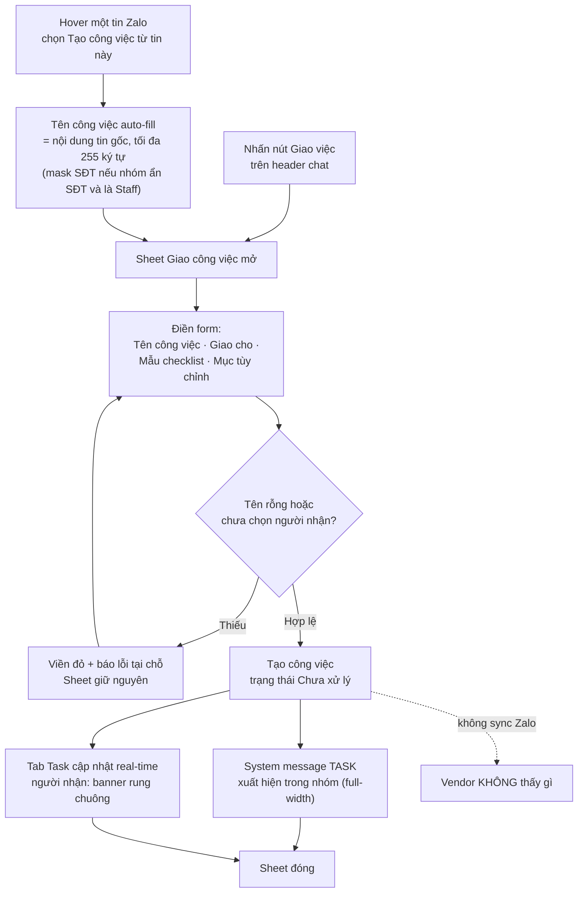

# #18 — Giao việc nội bộ trong nhóm (Chat Portal)

> **Trạng thái:** draft
> **Nguồn:** [`../scope-and-features.md § E.18`](../scope-and-features.md) (canonical) · [`../FSD-Chat-Portal.md § 6.2`](../FSD-Chat-Portal.md) (FR + UI chi tiết) · [`../FSD-Chat-Portal.md § 6.1`](../FSD-Chat-Portal.md) (banner & tab Task — cross-cutting #18/#19)
> **Liên quan:** [`#19 Nhật Ký công việc`](19-nhat-ky-cong-viec.md) · [`#28 Ẩn/hiện SĐT Nhân viên`](28-an-hien-so-dien-thoai-staff.md) · [`#17 Cấu trúc vai trò trong nhóm`](17-cau-truc-vai-tro.md)

---

## 📌 Tóm tắt 1 dòng

Bất kỳ Nhân viên hoặc Quản trị nào trong nhóm vendor đều có thể tạo một công việc và giao cho thành viên nội bộ khác — gắn vào nhóm và (tùy chọn) vào một tin nhắn cụ thể — để điều phối việc nội bộ ngay trong ngữ cảnh chat mà Vendor không nhìn thấy.

---

## 🎯 Giá trị nghiệp vụ

Khi trao đổi với Vendor trong một nhóm chat, đội nội bộ thường phát sinh việc cần làm ngay: "gọi xác nhận đơn này", "kiểm tra hàng theo ảnh khách gửi", "chốt giá rồi báo lại". Nếu phải mở một công cụ quản lý việc riêng, copy nội dung sang, rồi nhớ ai chịu trách nhiệm — thông tin rơi rụng và mất ngữ cảnh tin nhắn gốc.

Tính năng **Giao việc nội bộ** đưa thao tác giao việc vào thẳng cửa sổ chat. Người dùng tạo công việc từ nút trên header hoặc trực tiếp từ một tin nhắn (việc tự gắn vào tin nguồn để sau này bấm vào là nhảy về đúng chỗ). Công việc chỉ tồn tại trong workspace nội bộ của Portal — **không bao giờ đẩy lên Zalo**, nên Vendor hoàn toàn không thấy. Mỗi lần giao việc, cả nhóm nội bộ thấy một thông báo gọn trong nhóm và người được giao nhận tín hiệu ngay.

**Lợi ích:**

- Giao việc tại chỗ, giữ nguyên ngữ cảnh tin nhắn — không nhảy công cụ, không mất dấu vết nguồn.
- Phân định rõ ai làm gì, hạn nào, gồm các bước con (checklist) — giảm việc rơi sót.
- Tách bạch tuyệt đối với Vendor: mọi trao đổi điều phối nội bộ ẩn khỏi Zalo.
- Là điểm khởi đầu cho [Nhật Ký công việc (#19)](19-nhat-ky-cong-viec.md) — mỗi công việc có dòng thời gian thảo luận riêng.

---

## 👥 Vai trò liên quan

| Vai trò | Trách nhiệm |
| --- | --- |
| **Nhân viên (Staff)** | Tạo công việc (từ header hoặc từ một tin nhắn), giao cho chính mình hoặc thành viên nội bộ khác trong nhóm. Thấy thông báo công việc trong nhóm và công việc liên quan trong tab Task. |
| **Quản trị (Admin)** | Mọi quyền như Nhân viên. Có thể tạo/giao việc kể cả khi không thuộc nhóm (quyền xuyên nhóm — xem [#17](17-cau-truc-vai-tro.md)); dropdown người nhận vẫn chỉ gồm thành viên nội bộ của nhóm đó. |
| **Vendor** | **Không** thấy nút giao việc, không thấy thông báo công việc, không xuất hiện trong dropdown người nhận. Toàn bộ tính năng ẩn khỏi phía Zalo. |
| **Hệ thống** | Auto-fill tên công việc từ tin nguồn (mask SĐT nếu cần) · tạo công việc với checklist · phát system message `TASK` vào nhóm · cập nhật banner + tab Task real-time · chặn không cho thông báo `TASK` rò rỉ lên Zalo. |

---

## 🔄 Dòng chảy nghiệp vụ



> Hai điểm khởi tạo (header / từ tin nhắn) hội tụ về cùng một Sheet. Khác biệt duy nhất: tạo từ tin nhắn thì tên công việc được điền sẵn và công việc gắn `tin nguồn` để bấm vào nhảy về sau này.

---

## ✅ Kịch bản chấp nhận

```gherkin
# language: vi
Tính năng: Giao việc nội bộ trong nhóm vendor

  Bối cảnh:
    Biết tôi là thành viên nội bộ (Nhân viên hoặc Quản trị) đang mở một nhóm vendor
    Và nhóm có ít nhất một thành viên nội bộ khác ngoài tôi

  # ===== Tạo công việc từ header =====

  Tình huống: Mở Sheet giao việc từ nút trên header
    Khi tôi nhấn nút "Giao việc" trên header chat
    Thì Sheet "Giao công việc" mở ra
    Và trường "Tên công việc" để trống
    Và trường "Giao cho" mặc định chọn chính tôi kèm nhãn "(Tôi)"

  # ===== Tạo công việc từ một tin nhắn =====

  Tình huống: Tạo công việc từ một tin nhắn văn bản
    Biết có một tin nhắn Zalo dạng văn bản trong nhóm
    Khi tôi hover tin đó và chọn "Tạo công việc từ tin này"
    Thì Sheet "Giao công việc" mở ra
    Và "Tên công việc" được điền sẵn bằng nội dung tin gốc, cắt còn tối đa 255 ký tự
    Và công việc sẽ được gắn với tin nguồn đó

  Tình huống: Tạo công việc từ một tin media không có chú thích
    Biết có một tin nhắn dạng hình/file/video không kèm chú thích
    Khi tôi hover tin đó và chọn "Tạo công việc từ tin này"
    Thì "Tên công việc" để trống để tôi tự nhập
    Và công việc vẫn được gắn với tin media đó làm tin nguồn

  Tình huống: Không thể tạo công việc từ tin thông báo hệ thống
    Biết có một tin thông báo hệ thống (TASK hoặc PHONE_REVEAL) trong nhóm
    Khi tôi đưa chuột lên tin đó
    Thì không có menu hover
    Và không có lựa chọn "Tạo công việc từ tin này"

  # ===== Auto-fill tên công việc khi nhóm ẩn SĐT =====

  Tình huống: Tên công việc auto-fill được che số khi nhóm đang ẩn SĐT
    Biết nhóm đang bật chế độ ẩn số điện thoại (#28)
    Và tôi là Nhân viên chưa được duyệt xem số
    Và tin nguồn chứa một số điện thoại
    Khi tôi tạo công việc từ tin đó
    Thì tên công việc điền sẵn hiển thị số đã được che theo quy tắc ẩn SĐT

  # ===== Người nhận =====

  Tình huống: Dropdown người nhận chỉ chứa thành viên nội bộ
    Khi tôi mở dropdown "Giao cho"
    Thì danh sách chỉ gồm các thành viên nội bộ (Nhân viên + Quản trị) của nhóm
    Và không có bất kỳ tài khoản Vendor nào
    Và mỗi mục hiển thị tên kèm vai trò ("Quản lý" hoặc "Nhân viên")

  # ===== Kiểm tra hợp lệ =====

  Tình huống: Chặn gửi khi thiếu tên công việc
    Biết Sheet "Giao công việc" đang mở
    Và trường "Tên công việc" đang để trống
    Khi tôi nhấn "Giao việc"
    Thì trường "Tên công việc" hiển thị viền đỏ kèm thông báo lỗi tại chỗ
    Và công việc không được tạo

  Tình huống: Chặn gửi khi chưa chọn người nhận
    Biết Sheet "Giao công việc" đang mở với tên công việc đã nhập
    Và chưa chọn người nhận nào
    Khi tôi nhấn "Giao việc"
    Thì hệ thống báo lỗi yêu cầu chọn người nhận
    Và công việc không được tạo

  Tình huống: Chặn xuống dòng và cảnh báo khi chạm giới hạn ký tự
    Biết con trỏ đang trong trường "Tên công việc"
    Khi tôi nhấn Enter
    Thì không có dòng mới nào được thêm
    Và khi độ dài chạm 255 ký tự thì bộ đếm ký tự chuyển sang màu đỏ

  # ===== Checklist =====

  Tình huống: Áp mẫu checklist vào công việc
    Biết Sheet "Giao công việc" đang mở
    Khi tôi chọn một mẫu checklist có sẵn
    Thì các mục của mẫu được nạp vào phần xem trước, mỗi mục ở trạng thái chưa hoàn thành

  Tình huống: Thêm mục checklist tùy chỉnh
    Biết Sheet "Giao công việc" đang mở
    Khi tôi gõ nội dung một mục và nhấn nút "+"
    Thì mục đó được thêm vào danh sách việc con
    Và mỗi mục có nút xóa riêng

  Tình huống: Tạo công việc không có checklist
    Biết tôi chọn "Không có checklist" và không thêm mục tùy chỉnh nào
    Khi tôi giao việc thành công
    Thì công việc được tạo không kèm danh sách việc con
    Và công việc vẫn hợp lệ

  # ===== Submit thành công =====

  Tình huống: Giao việc thành công phát thông báo trong nhóm
    Biết tôi đã nhập tên công việc và chọn người nhận hợp lệ
    Khi tôi nhấn "Giao việc"
    Thì công việc được tạo với trạng thái "Chưa xử lý"
    Và một tin thông báo hệ thống loại TASK xuất hiện trong nhóm dạng full-width không có menu thao tác
    Và nội dung thông báo là "[Tên người tạo] đã giao việc cho [Tên người nhận]: [Tên công việc]"
    Và Sheet đóng lại

  Tình huống: Người nhận đang online nhận tín hiệu ngay
    Biết người nhận đang mở Portal
    Khi tôi giao việc cho người đó
    Thì tab Task của người nhận cập nhật ngay không cần tải lại
    Và biểu tượng chuông trên banner rung để báo có việc mới

  # ===== Tin nguồn =====

  Tình huống: Bấm tiêu đề công việc để nhảy về tin nguồn
    Biết một công việc được tạo từ một tin nhắn nên có gắn tin nguồn
    Khi tôi bấm vào tiêu đề công việc trong tab Task
    Thì danh sách tin nhắn cuộn tới tin nguồn và làm nổi bật tin đó khoảng 2 giây
    Và khi tôi rê chuột lên tiêu đề thì hiện gợi ý "Nhấn để xem tin nhắn gốc"

  # ===== Tách biệt Vendor =====

  Tình huống: Vendor không thấy thông báo công việc trên Zalo
    Khi một công việc được tạo trong nhóm
    Thì thông báo hệ thống TASK chỉ hiển thị trong Portal
    Và thông báo này bị chặn không đẩy lên Zalo nên Vendor không thấy

  # ===== Trường hợp đặc biệt =====

  Tình huống: Quản trị ngoài nhóm vẫn giao được việc
    Biết tôi là Quản trị nhưng không phải thành viên của nhóm
    Khi tôi tạo công việc trong nhóm đó
    Thì dropdown người nhận chỉ gồm thành viên nội bộ của nhóm
    Và tôi có thể tự giao cho mình hoặc cho một Nhân viên thuộc nhóm

  Tình huống: Mất kết nối khi gửi
    Biết tôi đã điền hợp lệ và nhấn "Giao việc"
    Khi mất kết nối mạng lúc gửi
    Thì hệ thống hiển thị thông báo "Tạo task thất bại, vui lòng thử lại"
    Và Sheet giữ nguyên để tôi thử lại

  Tình huống: Chuyển nhóm khác trong khi Sheet đang mở
    Biết Sheet "Giao công việc" đang mở cho nhóm hiện tại
    Khi tôi chuyển sang một nhóm khác nhưng Sheet vẫn mở
    Và tôi nhấn "Giao việc"
    Thì công việc được tạo trong nhóm ban đầu (theo ngữ cảnh lúc mở Sheet)

  Tình huống: Cho phép trùng tên công việc
    Biết trong nhóm đã có một công việc tên "Gọi xác nhận đơn"
    Khi tôi tạo công việc mới cũng tên "Gọi xác nhận đơn"
    Thì hệ thống vẫn tạo công việc bình thường, không chặn trùng tên
```

---

## 🎨 Mô tả giao diện

### Điểm khởi tạo công việc

| Điểm vào | Vị trí | Hành vi |
| --- | --- | --- |
| **Nút "Giao việc"** | Header chat của nhóm vendor | Mở Sheet với form trống, người nhận mặc định = chính tôi |
| **Hover menu → "Tạo công việc từ tin này"** | Trên mọi tin **Zalo** (text/image/file/video) | Mở Sheet, tên công việc auto-fill từ tin, gắn tin nguồn. **Không** có trên tin thông báo hệ thống (TASK / PHONE_REVEAL) |

### Sheet "Giao công việc"

```
┌─────────────────────────────────────────────┐
│  Giao công việc                          [×] │
├─────────────────────────────────────────────┤
│  Tên công việc *                             │
│  ┌─────────────────────────────────────────┐ │
│  │ (textarea 1 dòng, auto-resize)          │ │
│  └─────────────────────────────────────────┘ │
│                                   123 / 255   │
│                                               │
│  Giao cho *                                   │
│  ┌─────────────────────────────────────────┐ │
│  │ ▾  Nguyễn Văn A (Tôi)                    │ │
│  │       Nhân viên                          │ │
│  └─────────────────────────────────────────┘ │
│                                               │
│  Mẫu checklist                                │
│  ┌─────────────────────────────────────────┐ │
│  │ ▾  Liên hệ & Xác nhận                    │ │
│  └─────────────────────────────────────────┘ │
│                                               │
│  Mục checklist tùy chỉnh                      │
│  ┌──────────────────────────────┐  ┌─────┐   │
│  │ Nhập mục việc con...         │  │  +  │   │
│  └──────────────────────────────┘  └─────┘   │
│   • Gọi khách xác nhận            [🗑]        │
│   • Kiểm tra tồn kho              [🗑]        │
│                                               │
│                       [ Hủy ]  [ Giao việc ]  │
└─────────────────────────────────────────────┘
```

### Các trường trong form

| Trường | Bắt buộc | Mô tả |
| --- | :---: | --- |
| **Tên công việc** | ✅ | Textarea auto-resize, tối đa 255 ký tự, chặn xuống dòng (Enter bị chặn). Bộ đếm ký tự góc phải dưới, chuyển đỏ khi đạt 255 |
| **Giao cho** | ✅ | Dropdown chỉ chứa thành viên nội bộ (Vendor bị loại). Mặc định = chính tôi (badge "(Tôi)"). Mỗi mục: tên + vai trò nhỏ phía dưới ("Quản lý" / "Nhân viên") |
| **Mẫu checklist** | ❌ | Dropdown chọn template có sẵn (vd "Liên hệ & Xác nhận", "Kiểm tra hàng hóa", "Không có checklist") → nạp item mặc định vào phần xem trước |
| **Mục checklist tùy chỉnh** | ❌ | Input + nút "+" để thêm mục; mỗi mục có nút xóa. Thứ tự: item mẫu trước, item tùy chỉnh sau |

### Thông báo công việc trong nhóm (system message TASK)

| Thuộc tính | Giá trị |
| --- | --- |
| Kiểu hiển thị | Full-width, căn giữa, **không** có menu hover/thao tác |
| Nội dung | "[Tên người tạo] đã giao việc cho [Tên người nhận]: [Tên công việc]" |
| Phạm vi | Chỉ trong Portal — **không** sync lên Zalo (Browser Agent lọc bỏ trước khi đẩy) |

### Tiêu đề công việc trong tab Task

- Khi công việc có **tin nguồn**: tiêu đề **clickable** → cuộn tới + highlight tin gốc ~2 giây; hover hiện tooltip "Nhấn để xem tin nhắn gốc".
- Khi không có tin nguồn: tiêu đề là text thường, không clickable.

### Mockup tham chiếu

> ⏳ **Cần BA bổ sung:**
> - Hover menu trên một tin → entry "Tạo công việc từ tin này".
> - Sheet "Giao công việc" — 4 vùng: tên công việc / dropdown giao cho (item có badge "Tôi") / dropdown mẫu checklist / preview checklist + input thêm mục.
> - State validation lỗi (tên rỗng / chưa chọn người nhận).
> - System message TASK trong nhóm (full-width, không hover menu).
> - Task card trong right panel với tiêu đề clickable khi có tin nguồn.
> - Tooltip "Nhấn để xem tin nhắn gốc" trên tiêu đề công việc.

---

## 🔗 Tham chiếu & Q&A

### Liên quan các phần khác

- **[#19 Nhật Ký công việc](19-nhat-ky-cong-viec.md)**: mỗi công việc tạo ở đây có một thread nhật ký (timeline comment). Mọi thay đổi trạng thái (Chưa xử lý → Đang xử lý → Hoàn thành) tự sinh entry trong nhật ký. Nguồn: [`../scope-and-features.md § E.19`](../scope-and-features.md) · [`../FSD-Chat-Portal.md § 6.3`](../FSD-Chat-Portal.md).
- **Banner task pending & tab Task** (cross-cutting #18/#19): cấu trúc 2 điểm hiển thị (banner dưới header + tab Task trong right panel), quy tắc đếm và rung chuông. Nguồn: [`../FSD-Chat-Portal.md § 6.1`](../FSD-Chat-Portal.md).
- **[#28 Ẩn/hiện SĐT Nhân viên](28-an-hien-so-dien-thoai-staff.md)**: quy tắc che số (mục 4.5) áp cho tên công việc auto-fill khi nhóm đang ẩn SĐT và người tạo là Nhân viên chưa được duyệt.
- **[#17 Cấu trúc vai trò trong nhóm](17-cau-truc-vai-tro.md)**: định nghĩa "thành viên nội bộ" (Staff/Admin) vs Vendor; quyền xuyên nhóm của Admin.
- **Cấu trúc message bubble** ([`../FSD-Chat-Portal.md § 3.1 FR-B.1`](../FSD-Chat-Portal.md)): quy tắc render system message full-width không có hover menu.

### ⚠️ Q&A cần BA / PO làm rõ

1. **Khi Nhân viên được giao việc bị xóa khỏi nhóm trong lúc công việc còn dở, công việc có tự chuyển về Admin phụ trách không?**
   - Phương án A: Công việc giữ nguyên người nhận cũ; người đó mất quyền truy cập nhóm nên không xử lý được → công việc "treo".
   - Phương án B: Tự động chuyển công việc về Admin của nhóm để đảm bảo được xử lý đến cùng.
   - **Pilot hiện đang theo:** chưa quyết — nguồn [`../FSD-Chat-Portal.md § 6.1 Edge Cases`](../FSD-Chat-Portal.md) đã flag câu hỏi này. Cần BA/PO xác nhận.

2. **Backend có bắt buộc mask SĐT khi lưu tên công việc không, nếu Staff cố tình submit tên chứa số chưa che?**
   - Bối cảnh: auto-fill đã che số phía giao diện, nhưng Staff có thể tự gõ/sửa lại số thật vào tên công việc.
   - **Pilot hiện đang theo:** theo [`../FSD-Chat-Portal.md § 6.2 Edge Cases`](../FSD-Chat-Portal.md), backend **phải** mask khi lưu để Staff khác chưa được duyệt vẫn không thấy số thật. Cần BA/PO xác nhận đây là hành vi chốt (vì nó ảnh hưởng tới việc số gốc có còn truy hồi được sau khi duyệt hay không).

3. **Tên trạng thái hiển thị cho người dùng cuối: "Chưa xử lý / Đang xử lý / Hoàn thành" (theo § 6.x) hay "todo / doing / finished" (theo scope § E.18)?**
   - Hai nguồn dùng cặp tên khác nhau cho cùng 3 trạng thái: scope-and-features.md ghi `todo / doing / finished` (tên kỹ thuật), còn FSD-Chat-Portal.md hiển thị "Chưa xử lý / Đang xử lý / Hoàn thành".
   - **Pilot hiện đang theo:** dùng tên tiếng Việt "Chưa xử lý / Đang xử lý / Hoàn thành" cho giao diện, `todo/doing/finished` là mã nội bộ. Tài liệu này đã theo phương án đó — cần BA/PO xác nhận để thống nhất toàn bộ tài liệu.
