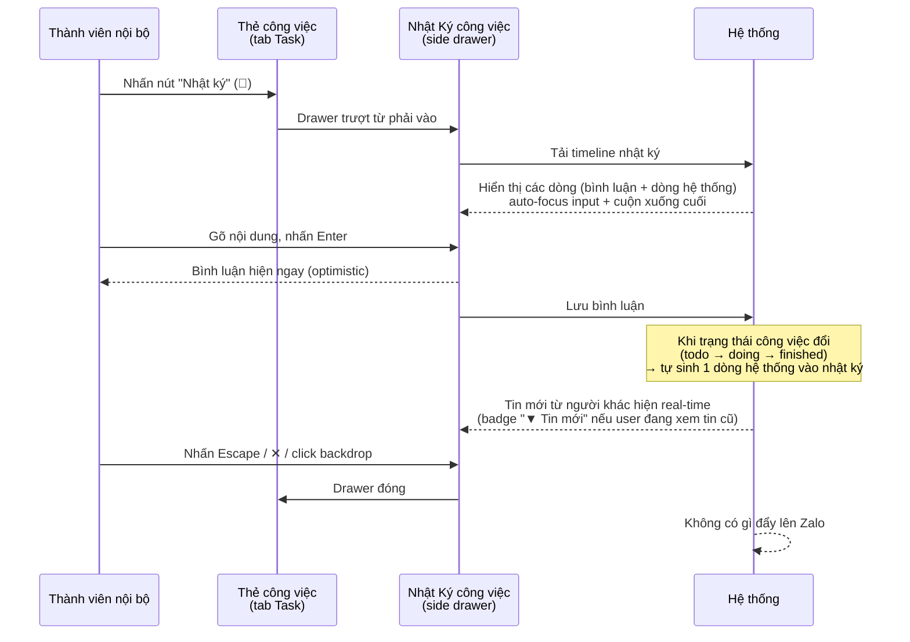

# #19 — Nhật Ký công việc (Chat Portal)

> **Trạng thái:** draft
> **Nguồn:** [`../scope-and-features.md § E.19`](../scope-and-features.md) (canonical) · [`../FSD-Chat-Portal.md § 6.3`](../FSD-Chat-Portal.md) (FR + UI chi tiết) · [`../FSD-Chat-Portal.md § 6.1`](../FSD-Chat-Portal.md) (banner & tab Task — cross-cutting #18/#19)
> **Liên quan:** [`#18 Giao việc nội bộ trong nhóm`](18-giao-viec-noi-bo.md) · [`#17 Cấu trúc vai trò trong nhóm`](17-cau-truc-vai-tro.md)

---

## 📌 Tóm tắt 1 dòng

Mỗi công việc nội bộ có một Nhật Ký riêng dạng dòng thời gian — mọi thành viên nội bộ trong nhóm đọc và bình luận để trao đổi tiến độ, và mỗi lần đổi trạng thái công việc tự ghi một dòng vào nhật ký — tách hẳn khỏi chat với Vendor.

---

## 🎯 Giá trị nghiệp vụ

Sau khi giao việc ([#18](18-giao-viec-noi-bo.md)), đội nội bộ vẫn cần trao đổi để chốt tiến độ: "đã gọi khách chưa?", "ảnh hàng đây", "xong rồi nhé". Nếu trao đổi này diễn ra ngay trong nhóm chat vendor thì làm nhiễu hội thoại với Vendor và lẫn lộn việc nội bộ với việc đối ngoại. Nếu chuyển sang công cụ khác thì lại mất liên kết với công việc.

**Nhật Ký công việc** cho mỗi công việc một thread bình luận riêng dạng dòng thời gian, mở từ thẻ công việc trong tab Task. Mọi thành viên nội bộ trong nhóm — không chỉ người giao hay người nhận — đều đọc và bình luận được, nên ai cũng nắm được bối cảnh. Mỗi lần trạng thái công việc đổi (Chưa xử lý → Đang xử lý → Hoàn thành) hệ thống tự ghi một dòng vào nhật ký, tạo thành lịch sử xử lý đầy đủ. Toàn bộ nhật ký **không bao giờ đẩy lên Zalo** — Vendor không hề biết thread này tồn tại.

**Lợi ích:**

- Trao đổi tiến độ gắn liền với công việc, không nhiễu hội thoại Vendor.
- Lịch sử minh bạch: ai làm gì, đổi trạng thái khi nào — tự ghi nhận, không cần nhập tay.
- Mọi thành viên nội bộ cùng nắm bối cảnh, không phụ thuộc một người.
- Tách biệt tuyệt đối với phía Zalo — an toàn cho thông tin điều phối nội bộ.

---

## 👥 Vai trò liên quan

| Vai trò | Trách nhiệm |
| --- | --- |
| **Nhân viên (Staff)** | Mở Nhật Ký của **bất kỳ** công việc nào trong nhóm; đọc và gửi bình luận — kể cả khi không phải người giao hay người nhận công việc đó. |
| **Quản trị (Admin)** | Mọi quyền như Nhân viên trên Nhật Ký của mọi công việc trong nhóm (gồm cả quyền xuyên nhóm — xem [#17](17-cau-truc-vai-tro.md)). |
| **Vendor** | **Không** thấy nút Nhật Ký, không thấy thread, không nhận bất kỳ thông báo nào về nhật ký. Hoàn toàn ẩn khỏi phía Zalo. |
| **Hệ thống** | Tự ghi dòng nhật ký khi trạng thái công việc đổi (kèm: ai đổi, từ trạng thái nào sang trạng thái nào, thời điểm) · phân biệt dòng hệ thống với bình luận thường · cập nhật real-time cho người đang mở drawer · chặn nhật ký rò rỉ lên Zalo. |

---

## 🔄 Dòng chảy nghiệp vụ



> Lưu ý: **đổi trạng thái công việc** tự ghi dòng nhật ký, nhưng **tích/bỏ tích mục checklist thì không** — tránh làm nhật ký bị nhiễu.

---

## ✅ Kịch bản chấp nhận

```gherkin
# language: vi
Tính năng: Nhật Ký công việc cho task nội bộ

  Bối cảnh:
    Biết tôi là thành viên nội bộ (Nhân viên hoặc Quản trị) của một nhóm vendor
    Và trong nhóm có một công việc hiển thị trong tab Task

  # ===== Mở & đóng drawer =====

  Tình huống: Mở Nhật Ký từ thẻ công việc
    Khi tôi nhấn nút "Nhật ký" trên thẻ công việc
    Thì một drawer "Nhật Ký công việc" trượt từ phải vào
    Và cửa sổ chat phía sau vẫn mở, không bị đóng
    Và header drawer hiển thị tên công việc kèm trạng thái, người giao, người nhận

  Tình huống: Drawer tự focus ô nhập và cuộn xuống tin mới nhất khi mở
    Khi tôi mở Nhật Ký của một công việc đã có nhiều dòng
    Thì ô nhập bình luận được focus sẵn
    Và timeline cuộn xuống dòng mới nhất

  Khung tình huống: Đóng drawer bằng nhiều cách
    Biết drawer Nhật Ký đang mở
    Khi tôi "<thao tác>"
    Thì drawer đóng lại

    Dữ liệu:
      | thao tác              |
      | nhấn nút ✕ ở header    |
      | nhấn phím Escape       |
      | click vùng nền mờ phía ngoài drawer |

  # ===== Quyền đọc & bình luận =====

  Tình huống: Thành viên ngoài cuộc vẫn đọc và bình luận được
    Biết tôi không phải người giao cũng không phải người nhận của công việc
    Khi tôi mở Nhật Ký của công việc đó
    Thì tôi đọc được toàn bộ dòng nhật ký
    Và tôi gửi được bình luận mới

  Tình huống: Gửi một bình luận
    Biết drawer Nhật Ký đang mở
    Khi tôi gõ nội dung và nhấn Enter
    Thì bình luận hiện ngay trong timeline
    Và timeline cuộn xuống cuối

  Tình huống: Xuống dòng trong bình luận không gửi tin
    Biết con trỏ đang ở ô nhập bình luận
    Khi tôi nhấn Shift kèm Enter
    Thì một dòng mới được thêm vào ô nhập
    Và bình luận chưa được gửi

  # ===== Dòng hệ thống do đổi trạng thái =====

  Tình huống: Đổi trạng thái công việc tự sinh dòng nhật ký
    Biết công việc đang ở trạng thái "Chưa xử lý"
    Khi người nhận đổi trạng thái sang "Đang xử lý"
    Thì một dòng hệ thống xuất hiện trong nhật ký ghi rõ ai đổi, từ trạng thái nào sang trạng thái nào, lúc nào
    Và dòng này có kiểu hiển thị khác với bình luận thường

  Tình huống: Tích mục checklist không sinh dòng nhật ký
    Biết công việc có danh sách việc con
    Khi tôi tích hoàn thành một mục checklist
    Thì không có dòng nhật ký nào được sinh ra

  # ===== Real-time =====

  Tình huống: Nhận bình luận mới real-time khi đang ở cuối timeline
    Biết drawer đang mở và tôi đang xem dòng mới nhất
    Khi một thành viên khác gửi bình luận
    Thì bình luận đó hiện ngay
    Và timeline tự cuộn xuống để tôi thấy

  Tình huống: Không tự cuộn khi tôi đang xem tin cũ
    Biết drawer đang mở và tôi đã cuộn lên xem các dòng cũ
    Khi một thành viên khác gửi bình luận mới
    Thì timeline không tự cuộn xuống
    Và một badge "▼ Tin mới" hiện ra để tôi chủ động bấm xuống

  # ===== Tách biệt Vendor & giới hạn tính năng =====

  Tình huống: Nhật ký không xuất hiện trên Zalo
    Khi tôi gửi một bình luận trong Nhật Ký
    Thì bình luận chỉ tồn tại trong Portal
    Và không có thông báo hay tham chiếu nào về nhật ký xuất hiện trong nhóm chat Zalo

  Tình huống: Bình luận nhật ký không có thao tác như tin nhắn vendor
    Biết một dòng bình luận trong nhật ký
    Khi tôi rê chuột lên dòng đó
    Thì không có menu thả cảm xúc, trả lời, chuyển tiếp, ghim hay đánh dấu
    Và dòng chỉ gồm nội dung văn bản

  Tình huống: Tên người gửi hiển thị thuần không kèm ngoặc tài khoản Zalo
    Khi tôi xem một bình luận của thành viên khác
    Thì tên người gửi hiển thị thuần, không kèm phần ngoặc tài khoản Zalo như trong vendor chat

  # ===== Trường hợp đặc biệt =====

  Tình huống: Công việc chưa có dòng nhật ký nào
    Biết công việc vừa được tạo, chưa ai bình luận
    Khi tôi mở Nhật Ký
    Thì drawer hiển thị trạng thái rỗng
    Và ô nhập bình luận vẫn dùng được

  Tình huống: Vẫn bình luận được khi công việc đã hoàn thành
    Biết công việc đang ở trạng thái "Hoàn thành"
    Khi tôi mở Nhật Ký và gửi một ghi chú follow-up
    Thì bình luận được gửi bình thường

  Tình huống: Không thể chuyển sang công việc khác khi drawer đang mở
    Biết drawer Nhật Ký của một công việc đang mở
    Khi tôi bấm vào một thẻ công việc khác trong tab Task
    Thì hệ thống không mở công việc kia
    Và tôi phải đóng drawer trước rồi mới chọn công việc khác

  Tình huống: Bị xóa khỏi nhóm trong khi drawer đang mở
    Biết tôi đang mở Nhật Ký của một công việc
    Khi tôi bị xóa khỏi nhóm
    Thì drawer tự đóng và tôi được đưa về cửa sổ chat với thông báo "Bạn không còn quyền truy cập nhóm này"
    Và bình luận tôi đã gửi trước đó không bị thu hồi

  Tình huống: Mất kết nối khi gửi bình luận
    Biết tôi vừa nhấn gửi một bình luận
    Khi mất kết nối lúc gửi
    Thì bình luận hiển thị trạng thái "đang gửi" rồi chuyển sang dấu lỗi kèm nút "Thử gửi lại"
    Và hệ thống không tự thử lại vô hạn

  Tình huống: Hai người bình luận cùng lúc
    Biết hai thành viên cùng gửi bình luận gần như đồng thời
    Khi cả hai bình luận được lưu
    Thì cả hai hiện trong timeline theo thứ tự thời gian do hệ thống trả về
```

---

## 🎨 Mô tả giao diện

### Điểm vào

| Điểm vào | Vị trí | Hành vi |
| --- | --- | --- |
| **Nút "Nhật ký" (📖)** | Thanh action dưới thẻ công việc, trong tab Task của right panel | Mở side drawer "Nhật Ký công việc" cho công việc đó |

### Side drawer "Nhật Ký công việc"

Trượt từ phải vào, rộng ~480px, che một phần Portal nhưng **không** đóng cửa sổ chat phía sau.

```
                              ┌───────────────────────────────┐
                              │ 📖 Nhật ký công việc       [✕] │
                              │ Gọi khách xác nhận đơn #123    │
                              │ Trạng thái: Đang xử lý         │
                              │ Giao: An · Nhận: Bình          │
                              ├───────────────────────────────┤
                              │      ── Hôm nay ──             │
                              │                               │
                              │  ┌──────────────────┐         │
                              │  │ Bình: Đã gọi,    │  09:15  │
                              │  │ khách bận        │         │
                              │  └──────────────────┘         │
                              │                               │
                              │   ⓘ Trạng thái: Chưa xử lý →  │
                              │      Đang xử lý · bởi Bình     │
                              │      09:16                     │
                              │                               │
                              │         ┌──────────────────┐  │
                              │  09:20  │ Mình: Ok thử lại │  │
                              │         │ sau 30 phút nhé  │  │
                              │         └──────────────────┘  │
                              │                               │
                              │            [ ▼ Tin mới ]      │
                              ├───────────────────────────────┤
                              │ ┌─────────────────────┐  ┌──┐ │
                              │ │ Nhập bình luận...   │  │➤ │ │
                              │ └─────────────────────┘  └──┘ │
                              └───────────────────────────────┘
```

### Cấu trúc drawer

| Vùng | Nội dung |
| --- | --- |
| **Header** | Icon sách + label "Nhật ký công việc" · Tên công việc (cắt 2 dòng) · Meta: trạng thái + người giao + người nhận · nút ✕ |
| **Body (timeline)** | Các dòng nhật ký xếp theo thời gian, có vạch ngăn ngày ("Hôm nay", "Thứ Hai 09-06-2026"...), timestamp HH:mm dưới mỗi dòng |
| **Footer (ô nhập)** | Textarea + nút gửi (✈). Enter = gửi · Shift+Enter = xuống dòng |

### Kiểu hiển thị các dòng

| Loại dòng | Vị trí | Kiểu |
| --- | --- | --- |
| **Bình luận của tôi** | Phải | Bong bóng nền brand (xanh đậm), chữ trắng |
| **Bình luận người khác** | Trái | Bong bóng nền trắng viền xám + avatar tròn (2 chữ initials) + tên người gửi phía trên (chỉ hiện ở dòng đầu của chuỗi cùng người) |
| **Dòng hệ thống** (đổi trạng thái) | Giữa / trung tính | Bong bóng trung tính + icon trạng thái, vd "Trạng thái: Chưa xử lý → Đang xử lý · bởi [Tên] · HH:mm" |

### Quy tắc hiển thị bổ sung

- Tên người gửi hiển thị **thuần** (không kèm phần ngoặc tài khoản Zalo) — vì đây không phải vendor chat.
- Bình luận **không có** menu hover, thả cảm xúc, trả lời, chuyển tiếp, ghim, đánh dấu — chỉ là kênh comment văn bản thuần.
- Bong bóng dài tự giãn chiều cao, không cắt nội dung.
- Badge **"▼ Tin mới"** hiện khi có dòng mới đến trong lúc tôi đã cuộn lên xem dòng cũ.

### Mockup tham chiếu

> ⏳ **Cần BA bổ sung:**
> - Thẻ công việc trong right panel với nút "Nhật ký" 📖.
> - Side drawer — header (label + tên công việc + meta trạng thái).
> - Timeline: bong bóng của tôi (phải, brand) vs người khác (trái, trắng + avatar + tên).
> - Vạch ngăn ngày giữa các ngày.
> - Dòng đổi trạng thái với kiểu phân biệt (icon + "Trạng thái: ... → ... bởi [Tên] HH:mm").
> - Ô nhập ở chân drawer.
> - Trạng thái rỗng khi chưa có dòng nào.
> - Badge "▼ Tin mới" khi cuộn lên và có tin mới đến.

---

## 🔗 Tham chiếu & Q&A

### Liên quan các phần khác

- **[#18 Giao việc nội bộ trong nhóm](18-giao-viec-noi-bo.md)**: nơi tạo ra công việc; Nhật Ký gắn vào từng công việc đó. Trạng thái công việc (Chưa xử lý / Đang xử lý / Hoàn thành) định nghĩa tại đây và là nguồn sinh dòng hệ thống trong nhật ký.
- **Banner & tab Task** (cross-cutting #18/#19): điểm vào "Nhật ký" nằm trên thẻ công việc trong tab Task. Nguồn: [`../FSD-Chat-Portal.md § 6.1`](../FSD-Chat-Portal.md).
- **[#17 Cấu trúc vai trò trong nhóm](17-cau-truc-vai-tro.md)**: định nghĩa "thành viên nội bộ" (Staff/Admin) vs Vendor; quyền xuyên nhóm của Admin.
- **Hiệu ứng phân quyền khi bị remove khỏi nhóm** ([`../FSD-Chat-Portal.md § 5.1 FR-D.5`](../FSD-Chat-Portal.md)): hành vi đóng drawer + chuyển empty state khi mất quyền truy cập.
- **Quy tắc hiển thị tên người gửi** ([`../scope-and-features.md § 6.3`](../scope-and-features.md)): tên thuần không ngoặc tài khoản Zalo trong context không phải vendor chat.

### ⚠️ Q&A cần BA / PO làm rõ

1. **Tên trạng thái hiển thị: "Chưa xử lý / Đang xử lý / Hoàn thành" hay "todo / doing / finished"?**
   - Hai nguồn dùng cặp tên khác nhau cho cùng 3 trạng thái: [`../scope-and-features.md § E.18`](../scope-and-features.md) ghi mã `todo / doing / finished`, còn [`../FSD-Chat-Portal.md § 6.3`](../FSD-Chat-Portal.md) (meta header drawer) hiển thị lẫn lộn — header ghi `[todo/doing/finished]` nhưng các mô tả khác dùng tiếng Việt.
   - **Pilot hiện đang theo:** dùng tên tiếng Việt cho giao diện (gồm cả dòng đổi trạng thái), `todo/doing/finished` là mã nội bộ. Đây là **cùng một Q&A** đã nêu ở [#18](18-giao-viec-noi-bo.md) — cần BA/PO chốt một lần cho cả hai tài liệu.

2. **Có hỗ trợ trả lời/trích dẫn (quote/reply) trong Nhật Ký không?**
   - Phương án A: Không hỗ trợ — kênh comment phẳng, thuần văn bản.
   - Phương án B: Hỗ trợ quote/reply để bám đúng ngữ cảnh khi thread dài.
   - **Pilot hiện đang theo:** **Phương án A** — [`../FSD-Chat-Portal.md § 6.3 FR-19.10`](../FSD-Chat-Portal.md) ghi rõ quote/reply **defer ngoài Mốc 3**. Cần BA/PO xác nhận có đưa vào mốc sau hay bỏ hẳn.

3. **Khi nhân viên được giao việc bị xóa khỏi nhóm, công việc (và do đó nhật ký của nó) xử lý ra sao?**
   - Đây là Q&A liên quan chặt với [#18](18-giao-viec-noi-bo.md) (câu hỏi "task có tự chuyển về Admin không"). Nếu công việc bị "treo" thì nhật ký của nó vẫn truy cập được bởi các thành viên còn lại, nhưng không ai chịu trách nhiệm chính.
   - **Pilot hiện đang theo:** chưa quyết — chờ kết luận chung với #18. Cần BA/PO xác nhận.

4. **Nhật ký có lưu vĩnh viễn / có giới hạn số dòng tải về không?**
   - Spec hiện không nói tới phân trang hay tải dần (lazy load) khi thread rất dài.
   - **Pilot hiện đang theo:** chưa định nghĩa — tạm hiểu là tải toàn bộ timeline khi mở drawer. Cần BA/PO làm rõ ngưỡng phân trang nếu có công việc phát sinh hàng trăm dòng.
