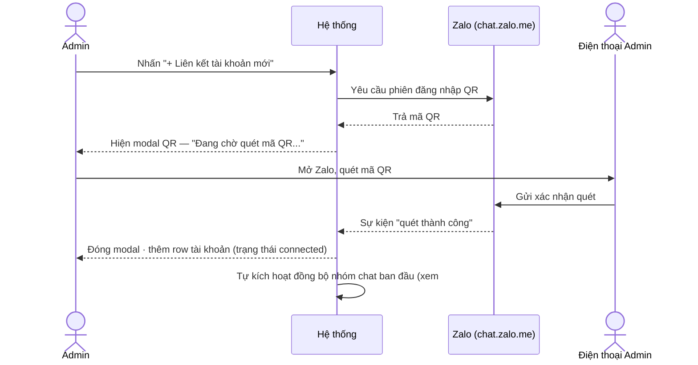
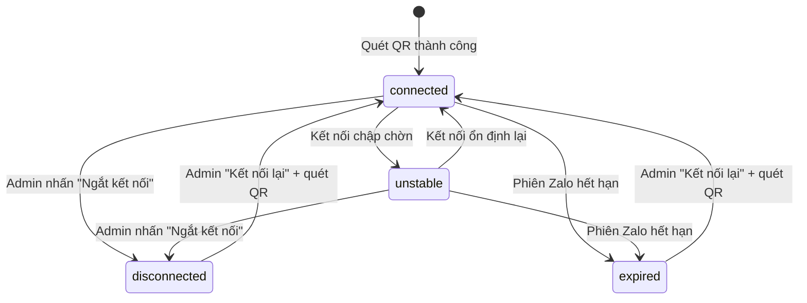

# #20 — Liên kết tài khoản Zalo

> **Trạng thái:** draft
> **Nguồn:** scope-and-features.md § F.20 · FSD-Admin-Site.md § 2.2 (Tab Liên kết tài khoản)

---

## 📌 Tóm tắt 1 dòng

Admin quét mã QR để liên kết tài khoản Zalo cá nhân vào hệ thống, theo dõi trạng thái kết nối và gán nhân viên được phép đại diện cho từng tài khoản.

---

## 🎯 Giá trị nghiệp vụ

Toàn bộ luồng tin nhắn của vendor được kéo về Chat Portal thông qua các tài khoản Zalo cá nhân do công ty quản lý. Trước khi có tính năng này, việc thêm một tài khoản Zalo vào hệ thống là thao tác kỹ thuật phải nhờ DEV; Admin không tự chủ động được khi cần mở rộng số tài khoản phục vụ hoặc thay thế tài khoản đã mất kết nối.

Tab **Liên kết tài khoản** cho Admin tự liên kết tài khoản Zalo mới chỉ bằng một lần quét QR (giống đăng nhập Zalo Web), xem ngay trạng thái kết nối của mọi tài khoản trên một bảng, và chỉ định nhân viên nào được phép thao tác thay mặt mỗi tài khoản. Khi một tài khoản rớt kết nối hoặc hết hạn, Admin chủ động kết nối lại mà không cần can thiệp kỹ thuật.

Việc gán nhân viên đại diện ngay tại đây là tiền đề cho phân quyền nhóm chat (#16): chỉ nhân viên được gán cho tài khoản đang sync một nhóm mới đủ điều kiện được thêm vào nhóm đó.

**Lợi ích:**

- Admin tự chủ liên kết / ngắt / kết nối lại tài khoản Zalo, không phụ thuộc DEV.
- Một bảng duy nhất phản ánh sức khỏe kết nối của tất cả tài khoản đang phục vụ.
- Kiểm soát rõ ai được đại diện cho tài khoản nào, làm nền cho phân quyền nhóm.

---

## 👥 Vai trò liên quan

| Vai trò | Trách nhiệm |
| ------- | ----------- |
| **Admin** | Quét QR liên kết tài khoản mới; xem trạng thái; gán/bỏ nhân viên đại diện; ngắt/kết nối lại tài khoản. |
| **Hệ thống** | Sinh mã QR; nhận sự kiện quét thành công từ Zalo; cập nhật trạng thái kết nối; tự kích hoạt đồng bộ ban đầu sau khi liên kết. |
| **Zalo (chat.zalo.me)** | Hiển thị xác nhận đăng nhập trên điện thoại; xác thực phiên; báo kết quả quét về hệ thống. |
| **Nhân viên (đại diện)** | Không thao tác ở tab này; được Admin gán quyền đại diện để sau đó thao tác trên các nhóm sync qua tài khoản tương ứng. |

---

## 🔄 Dòng chảy nghiệp vụ

**Liên kết tài khoản mới bằng QR — handoff giữa Admin, Zalo và Hệ thống:**



**Vòng đời trạng thái kết nối của một tài khoản đã liên kết:**



> **Lưu ý trạng thái:** `connected` = đang sync bình thường (badge xanh); `unstable` = kết nối chập chờn (vàng/hổ phách); `disconnected` = Admin chủ động ngắt (đỏ); `expired` = phiên Zalo hết hạn cần quét lại (đỏ, icon khoá).

---

## ✅ Kịch bản chấp nhận

```gherkin
# language: vi
Tính năng: Liên kết và quản lý tài khoản Zalo trong Admin Site

  Bối cảnh:
    Biết Admin đang ở Tab "Liên kết tài khoản" của trang Nhà Cung Cấp

  # ===== Liên kết tài khoản mới bằng QR =====

  Tình huống: Mở modal QR để liên kết tài khoản mới
    Khi Admin nhấn nút "+ Liên kết tài khoản mới"
    Thì hệ thống mở modal "Liên kết tài khoản Zalo mới"
    Và modal hiển thị hướng dẫn quét, khu vực mã QR và trạng thái "Đang chờ quét mã QR..."
    Và modal có nút "Huỷ"

  Tình huống: Quét QR thành công thêm tài khoản vào bảng
    Biết modal QR đang mở và đang chờ quét
    Khi tài khoản Zalo được quét và xác nhận thành công tại chat.zalo.me
    Thì modal tự động đóng
    Và một row tài khoản mới xuất hiện trong bảng với trạng thái "connected" (Đang kết nối)
    Và hệ thống tự kích hoạt đồng bộ nhóm chat ban đầu cho tài khoản này

  Tình huống: Huỷ modal QR khi chưa quét
    Biết modal QR đang mở và đang chờ quét
    Khi Admin nhấn nút "Huỷ"
    Thì modal đóng lại
    Và không có tài khoản nào được thêm vào bảng

  # ===== Bảng danh sách tài khoản đã liên kết =====

  Tình huống: Mỗi row hiển thị đủ thông tin tài khoản
    Biết đã có ít nhất một tài khoản được liên kết
    Khi Admin xem bảng tài khoản
    Thì mỗi row hiển thị avatar, display name, số điện thoại (nếu có) và thời điểm liên kết
    Và mỗi row hiển thị badge trạng thái kết nối
    Và mỗi row hiển thị danh sách chip nhân viên đại diện
    Và mỗi row hiển thị nút thao tác gán nhân viên và ngắt/kết nối lại

  Khung tình huống: Màu badge theo trạng thái kết nối
    Khi tài khoản đang ở trạng thái "<trạng thái>"
    Thì badge hiển thị màu "<màu>"

    Dữ liệu:
      | trạng thái   | màu                       |
      | connected    | xanh                      |
      | unstable     | vàng/hổ phách             |
      | disconnected | đỏ                        |
      | expired      | đỏ kèm icon khoá          |

  # ===== Gán nhân viên đại diện (#15) =====

  Tình huống: Gán nhiều nhân viên đại diện qua modal
    Biết Admin nhấn khu vực "Nhân viên đại diện" trên một row tài khoản
    Khi hệ thống mở modal "Gán nhân viên — [Tên tài khoản]"
    Thì modal có thanh tìm kiếm theo tên, dropdown lọc phòng ban và danh sách nhân viên đa chọn
    Và footer hiển thị counter "N nhân viên được chọn" cùng nút "Huỷ" và "Lưu"

  Tình huống: Lưu danh sách nhân viên đã chọn
    Biết Admin đang mở modal "Gán nhân viên" và đã chọn một số nhân viên
    Khi Admin nhấn nút "Lưu"
    Thì danh sách nhân viên đại diện của tài khoản được cập nhật theo lựa chọn

  Tình huống: Huỷ modal gán nhân viên không thay đổi dữ liệu
    Biết Admin đang mở modal "Gán nhân viên" và đã thay đổi lựa chọn
    Khi Admin nhấn nút "Huỷ"
    Thì danh sách nhân viên đại diện giữ nguyên như trước khi mở modal

  Tình huống: Xóa nhanh một nhân viên đại diện bằng chip
    Biết một row tài khoản đã được expand hiển thị đầy đủ chip nhân viên
    Khi Admin nhấn nút X trên chip của một nhân viên
    Thì nhân viên đó bị xóa khỏi danh sách đại diện mà không cần mở modal "Gán nhân viên"

  # ===== Ngắt kết nối / Kết nối lại (#27) =====

  Tình huống: Ngắt kết nối tài khoản đang hoạt động
    Biết tài khoản đang ở trạng thái "connected" hoặc "unstable"
    Khi Admin nhấn nút "Ngắt kết nối"
    Thì hệ thống hiển thị confirm dialog cảnh báo các nhóm đang sync sẽ tạm dừng cập nhật
    Và chỉ khi Admin xác nhận thì tài khoản chuyển sang trạng thái "disconnected"

  Tình huống: Kết nối lại tài khoản đã ngắt hoặc hết hạn
    Biết tài khoản đang ở trạng thái "disconnected" hoặc "expired"
    Khi Admin nhấn nút "Kết nối lại"
    Thì hệ thống mở modal QR pre-fill thông tin tài khoản cũ
    Và sau khi quét QR thành công thì tài khoản chuyển về trạng thái "connected"

  # ===== Trường hợp đặc biệt =====

  Tình huống: Không có nhân viên nào trong hệ thống
    Biết hệ thống chưa có nhân viên nào được tạo
    Khi Admin mở modal "Gán nhân viên"
    Thì modal hiển thị empty state gợi ý thêm nhân viên ở mục Quản Lý User & Phân Quyền trước

  Tình huống: Tài khoản hết hạn khi modal QR đang mở
    Biết modal QR (kết nối lại) đang mở cho một tài khoản
    Khi backend báo tài khoản đã hết hạn trong lúc chờ quét
    Thì hệ thống hiển thị message lỗi inline trong modal
    Và vẫn cho phép Admin quét lại

  Tình huống: Ngắt tài khoản đang sync nhiều nhóm
    Biết một tài khoản đang sync nhiều vendor group
    Khi Admin ngắt kết nối tài khoản đó
    Thì các vendor group liên quan hiển thị banner "Mất kết nối Zalo" ở Chat Portal
```

---

## 🎨 Mô tả giao diện

### Cấu trúc trang

```
Trang Nhà Cung Cấp
└─ [ Tab 1: Liên kết tài khoản ] [ Tab 2: Đồng bộ dữ liệu ] [ Tab 3: Theo dõi file lớn ]
   ┌──────────────────────────────────────────────[ + Liên kết tài khoản mới ]┐
   │ BẢNG TÀI KHOẢN ĐÃ LIÊN KẾT                                                │
   │ ┌──────┬─────────────┬─────────┬──────────────┬────────────┬───────────┐ │
   │ │Avatar│ Display name│ Phone   │ Liên kết lúc │ Trạng thái │ Thao tác  │ │
   │ ├──────┼─────────────┼─────────┼──────────────┼────────────┼───────────┤ │
   │ │  ◯   │ Nguyễn A    │ 09xx... │ 22/06 10:30  │ ●Đang KN   │ ⚙ ⋯       │ │
   │ │      │ chip NV: [B][C][+2]                                            │ │
   │ └──────┴─────────────┴─────────┴──────────────┴────────────┴───────────┘ │
   └──────────────────────────────────────────────────────────────────────────┘
```

### Bảng tài khoản đã liên kết

| Cột | Nội dung | Ghi chú |
| --- | -------- | ------- |
| Avatar | Ảnh đại diện tài khoản Zalo | — |
| Display name | Tên hiển thị của tài khoản | — |
| Phone | Số điện thoại (nếu Zalo trả về) | Có thể trống |
| Liên kết lúc | Thời điểm liên kết thành công | — |
| Trạng thái | Badge `connected` / `unstable` / `disconnected` / `expired` | Màu theo Kịch bản chấp nhận |
| Nhân viên đại diện | Chip avatar/tên (tối đa 2–3 + chip `+N`) | Expand row để xem đầy đủ + xóa nhanh |
| Thao tác | Gán nhân viên · Ngắt kết nối / Kết nối lại (theo trạng thái) | More menu ⋯ |

### Modal "Liên kết tài khoản Zalo mới"

| Thành phần | Nội dung |
| ---------- | -------- |
| Hướng dẫn | "Mở ứng dụng Zalo trên điện thoại, chọn Quét mã QR và hướng camera vào mã bên dưới." |
| Khu vực QR | Mã QR do hệ thống sinh |
| Trạng thái | "Đang chờ quét mã QR..." (icon loading) |
| Nút | "Huỷ" |
| Demo-only | Link "(Demo) Nhấn để giả lập quét QR thành công" — **không đưa vào production** |

### Modal "Gán nhân viên — [Tên tài khoản]"

| Thành phần | Nội dung |
| ---------- | -------- |
| Search | Tìm theo tên nhân viên |
| Filter | Dropdown "Tất cả phòng" (lọc theo phòng ban) |
| Danh sách | Mỗi row: avatar + tên + phòng ban + checkbox tròn xanh ✓ khi chọn |
| Footer | Counter "N nhân viên được chọn" + nút "Huỷ" / "Lưu" (xanh) |

### Mockup tham chiếu

> ✅ **Đã có:** (1) Bảng tài khoản đã liên kết; (2) Modal "Liên kết tài khoản Zalo mới" với QR; (3) Modal "Gán nhân viên — [Tên tài khoản]" với search + filter phòng + checkbox đa chọn + footer counter.

---

## 🔗 Tham chiếu & Q&A

### Liên quan các phần khác

- **#1 Kết nối tài khoản Zalo cá nhân (QR):** `01-ket-noi-tai-khoan-zalo.md` — flow quét QR gốc; #20 là phần quản lý vòng đời tài khoản sau khi đã kết nối.
- **#15 Phân quyền tài khoản Zalo:** `15-phan-quyen-tai-khoan-zalo.md` — gán nhân viên đại diện được thao tác ngay tại tab này (modal "Gán nhân viên").
- **#21 Đồng bộ dữ liệu:** `21-dong-bo-du-lieu.md` — sau khi liên kết, hệ thống tự kích hoạt đồng bộ ban đầu; Admin sync thủ công ở Tab 2.
- **#27 Kết nối lại & Thử lại:** `27-ket-noi-lai-va-thu-lai.md` — luồng ngắt/kết nối lại tài khoản.
- **#16 Phân quyền nhóm chat:** `16-phan-quyen-nhom-chat.md` — chỉ nhân viên được gán đại diện cho tài khoản đang sync một nhóm mới đủ điều kiện thêm vào nhóm đó.
- **Chat Portal — banner kết nối:** `FSD-Chat-Portal.md` § Nhóm A — khi tài khoản mất kết nối, các vendor group sync qua nó hiển thị banner "Mất kết nối Zalo".

### ⚠️ Q&A cần BA / PO làm rõ

1. **Modal QR pre-fill khi "Kết nối lại" có ràng buộc đúng tài khoản Zalo cũ không?**
   - Phương án A: Hệ thống chỉ chấp nhận quét đúng tài khoản Zalo đã liên kết trước đó; quét tài khoản khác → báo lỗi.
   - Phương án B: Chấp nhận bất kỳ tài khoản nào quét; nếu khác tài khoản cũ thì coi như liên kết mới.
   - **Pilot hiện đang theo:** chưa quyết. Cần BA/PO xác nhận hành vi khi Admin quét nhầm tài khoản khác lúc kết nối lại.

2. **Nhãn nút thêm tài khoản — "+ Liên kết tài khoản mới" hay "+ Thêm tài khoản Zalo"?**
   - Nguồn `scope-and-features.md § F.20` và Business Flow dùng "+ Liên kết tài khoản mới"; `FR-NCC.4` lại ghi "+ Thêm tài khoản Zalo".
   - **Pilot hiện đang theo:** "+ Liên kết tài khoản mới" (theo Business Flow). Cần BA chốt nhãn cuối cùng cho nhất quán.
