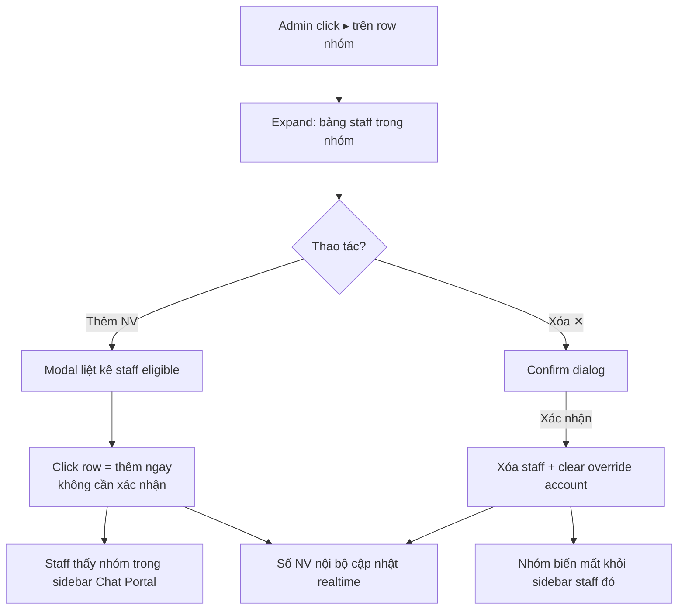

# #22 — Quản lý nhóm NCC

> **Trạng thái:** draft
> **Nguồn:** scope-and-features.md § F.22 · FSD-Admin-Site.md § 3.1, § 3.2 (Bảng nhóm NCC)

---

## 📌 Tóm tắt 1 dòng

Admin quản lý mọi nhóm vendor đã đồng bộ trên một bảng tập trung — xem thành viên, tài khoản Zalo đang sync, thẻ phân loại, trạng thái ẩn SĐT — và thêm/xóa nhân viên khỏi từng nhóm.

---

## 🎯 Giá trị nghiệp vụ

Sau khi tài khoản Zalo được liên kết (#20) và dữ liệu được đồng bộ (#21), hệ thống có rất nhiều nhóm chat vendor. Mỗi nhóm cần được cấu hình riêng: nhân viên nào được vào làm việc, đặt tên gợi nhớ thay cho tên gốc Zalo khó nhớ, có ẩn số điện thoại của vendor hay không, gắn thẻ phân loại gì. Nếu mỗi cấu hình nằm ở một nơi khác nhau, Admin phải nhảy qua lại nhiều màn hình và rất dễ bỏ sót nhóm.

Trang **Quản lý nhóm NCC** gom toàn bộ cấu hình đó vào **một bảng duy nhất**. Admin lọc nhanh theo tên nhóm, theo nhân viên, theo tài khoản Zalo, theo trạng thái ẩn SĐT hoặc theo thẻ phân loại; click mở rộng một nhóm để xem chi tiết danh sách nhân viên; và thao tác inline ngay trên row — đổi tên, thêm/xóa nhân viên, bật/tắt ẩn SĐT. Đây là trung tâm điều phối của Admin Site cho mảng vendor.

Việc thêm nhân viên vào nhóm ở đây gắn chặt với phân quyền: khi Admin thêm staff, staff mới thấy nhóm xuất hiện trong sidebar Chat Portal (#16); khi xóa, nhóm biến mất khỏi sidebar của staff đó.

**Lợi ích:**

- Một bảng tập trung thay cho nhiều màn hình rời rạc — giảm thao tác và sai sót.
- Lọc đa tiêu chí giúp Admin tìm đúng nhóm trong danh sách lớn.
- Thêm/xóa nhân viên phản ánh ngay sang Chat Portal, kiểm soát ai thấy nhóm nào.

---

## 👥 Vai trò liên quan

| Vai trò | Trách nhiệm |
| ------- | ----------- |
| **Admin** | Xem & lọc danh sách nhóm; thêm/xóa nhân viên; đổi tên hiển thị; bật/tắt ẩn SĐT; gắn thẻ phân loại; quản lý tài khoản Zalo của nhóm. |
| **Hệ thống** | Load danh sách nhóm đã đồng bộ; áp các bộ lọc cộng dồn; cập nhật realtime số liệu (số NV, trạng thái); đồng bộ thay đổi phân quyền sang Chat Portal. |
| **Nhân viên (staff)** | Không thao tác ở trang này; được Admin thêm/xóa khỏi nhóm → ảnh hưởng nhóm hiển thị trong sidebar Chat Portal của họ. |

---

## 🔄 Dòng chảy nghiệp vụ

**Lọc danh sách nhóm — các bộ lọc cộng dồn (AND):**

```mermaid
flowchart LR
    A[Bảng tải toàn bộ<br/>nhóm đã đồng bộ] --> B[Lọc theo tên nhóm]
    B --> C[Lọc theo tên nhân viên]
    C --> D[Lọc theo tài khoản Zalo]
    D --> E[Tabs ẩn SĐT:<br/>Tất cả / Đang ẩn / Đang hiện]
    E --> F[Chip thẻ phân loại]
    F --> G{Còn nhóm<br/>khớp?}
    G -- Có --> H[Hiển thị danh sách đã lọc]
    G -- Không --> I[Empty state<br/>"Không tìm thấy nhóm phù hợp"<br/>+ nút Đặt lại bộ lọc]
```

**Thêm / xóa nhân viên trong một nhóm (qua expand row):**



> **Lưu ý "staff eligible":** modal "Thêm nhân viên" chỉ liệt kê staff đã được gán làm đại diện cho ít nhất một tài khoản Zalo đang sync nhóm này (gán ở #20/#15). Staff chưa được gán account nào của nhóm sẽ không xuất hiện trong modal.

---

## ✅ Kịch bản chấp nhận

```gherkin
# language: vi
Tính năng: Quản lý nhóm NCC trên bảng tập trung

  Bối cảnh:
    Biết Admin đang ở trang "Quản lý nhóm NCC"
    Và bảng đã tải toàn bộ nhóm vendor đã đồng bộ

  # ===== Header & bộ đếm =====

  Tình huống: Header hiển thị bộ đếm và nút quản lý thẻ
    Khi Admin xem header trang
    Thì header hiển thị tiêu đề "Nhóm NCC"
    Và hiển thị nút "Quản lý thẻ phân loại"
    Và hiển thị counter động "N nhóm đã đồng bộ"
    Và hiển thị chip cam "M đang ẩn SĐT" với M là số nhóm đang ẩn số điện thoại

  Tình huống: Chip "đang ẩn SĐT" ẩn đi khi không có nhóm nào ẩn
    Biết không có nhóm nào đang ẩn số điện thoại
    Khi Admin xem header
    Thì chip cam "M đang ẩn SĐT" bị ẩn đi hoặc xám hóa

  # ===== Bộ lọc cộng dồn =====

  Tình huống: Các bộ lọc cộng dồn theo logic AND
    Biết Admin nhập tên nhóm vào ô tìm kiếm và chọn một tài khoản Zalo ở dropdown
    Khi cả hai bộ lọc cùng áp dụng
    Thì bảng chỉ hiển thị nhóm vừa khớp tên vừa có tài khoản Zalo đó đang sync

  Khung tình huống: Lọc theo từng tiêu chí
    Khi Admin áp bộ lọc "<bộ lọc>"
    Thì bảng chỉ hiển thị nhóm khớp với "<tiêu chí>"

    Dữ liệu:
      | bộ lọc            | tiêu chí                                  |
      | Tìm theo tên nhóm | tên hiển thị hoặc tên gốc Zalo khớp        |
      | Tìm theo tên NV   | nhóm có chứa nhân viên khớp tên           |
      | Tất cả tài khoản  | nhóm có tài khoản Zalo được chọn đang sync |

  Tình huống: Tabs ẩn SĐT lọc theo trạng thái
    Khi Admin nhấn tab "Đang ẩn SĐT"
    Thì bảng chỉ hiển thị nhóm đang ẩn số điện thoại
    Và tab active có underline và counter badge nổi bật

  Tình huống: Chip thẻ phân loại lọc theo thẻ
    Biết hàng chip thẻ phân loại hiển thị dưới tabs
    Khi Admin nhấn một chip thẻ
    Thì bảng chỉ hiển thị nhóm gắn thẻ đó
    Và khi không chip nào được chọn thì chip "Tất cả" active

  # ===== Cấu trúc bảng 7 cột =====

  Tình huống: Mỗi row hiển thị đủ 7 cột
    Khi Admin xem một row nhóm
    Thì row hiển thị caret expand, tên nhóm (kèm chip thẻ nếu có), tên gốc Zalo, badges tài khoản, số NV nội bộ, trạng thái ẩn SĐT kèm toggle, và cụm nút thao tác

  Tình huống: Cột tài khoản gộp khi có nhiều account
    Biết một nhóm có từ 3 tài khoản Zalo đang sync trở lên
    Khi Admin xem cột "Tài khoản" của row đó
    Thì hiển thị 2 badge đầu cộng chip "+N"
    Và hover chip "+N" hiển thị tooltip danh sách tài khoản còn lại

  # ===== Expand row & quản lý thành viên (#16) =====

  Tình huống: Mở rộng row xem danh sách staff
    Khi Admin click caret ▸ trên một row nhóm
    Thì row mở rộng hiển thị bảng staff với 4 cột Avatar+Tên, Phòng ban, Đại diện qua, Thao tác ✕
    Và row đang mở trước đó (nếu có) tự thu gọn lại

  Tình huống: Thêm nhân viên đủ điều kiện vào nhóm
    Biết Admin nhấn nút "Thêm NV" trên cột Thao tác của một row nhóm
    Khi hệ thống mở modal "Thêm nhân viên vào nhóm"
    Thì modal chỉ liệt kê staff đủ điều kiện (đã gán đại diện cho tài khoản đang sync nhóm)
    Và modal không có ô tìm kiếm và không có dropdown lọc phòng ban

  Tình huống: Click row trong modal là thêm ngay
    Biết modal "Thêm nhân viên vào nhóm" đang mở
    Khi Admin click vào một row staff trong modal
    Thì staff được thêm vào nhóm ngay lập tức không cần xác nhận
    Và số "NV nội bộ" trên row nhóm cập nhật realtime

  Tình huống: Xóa nhân viên khỏi nhóm cần xác nhận
    Biết row nhóm đang mở rộng hiển thị danh sách staff
    Khi Admin nhấn icon ✕ trên một row staff
    Thì hệ thống hiển thị confirm dialog cảnh báo staff sẽ không còn thấy nhóm trong sidebar Chat Portal
    Và chỉ khi Admin xác nhận thì staff bị xóa khỏi nhóm và mọi override tài khoản của staff trong nhóm được clear

  # ===== Trường hợp đặc biệt =====

  Tình huống: Chưa có nhóm nào đồng bộ
    Biết hệ thống chưa có nhóm vendor nào được đồng bộ
    Khi Admin mở trang Quản lý nhóm NCC
    Thì bảng hiển thị empty state gợi ý thực hiện đồng bộ ở trang Nhà Cung Cấp

  Tình huống: Bộ lọc không khớp nhóm nào
    Biết Admin đã áp một hoặc nhiều bộ lọc
    Khi không có nhóm nào khớp toàn bộ điều kiện
    Thì bảng hiển thị empty state "Không tìm thấy nhóm phù hợp với bộ lọc"
    Và có nút "Đặt lại bộ lọc"

  Tình huống: Modal thêm nhân viên không còn staff đủ điều kiện
    Biết nhóm chưa có staff eligible nào hoặc tất cả đã được thêm
    Khi Admin mở modal "Thêm nhân viên vào nhóm"
    Thì modal hiển thị empty state phù hợp (chưa có staff đủ điều kiện, hoặc tất cả đã được thêm)

  Tình huống: Không cho xóa tài khoản Zalo cuối cùng đang sync nhóm
    Biết một nhóm chỉ còn đúng một tài khoản Zalo đang sync
    Khi Admin mở dropdown "Tài khoản" để bỏ tài khoản cuối cùng đó
    Thì lựa chọn bỏ tài khoản bị disabled
    Và có tooltip "Nhóm phải có ít nhất 1 tài khoản đang sync"

  Tình huống: Xóa staff cuối cùng vẫn được phép
    Biết nhóm chỉ còn đúng một staff
    Khi Admin xóa staff cuối cùng đó
    Thì hệ thống vẫn cho phép và nhóm có thể không còn staff nào (chỉ Admin truy cập được)
```

---

## 🎨 Mô tả giao diện

### Cấu trúc trang

```
┌─ Nhóm NCC ──────────────── [N nhóm đã đồng bộ] [🟠 M đang ẩn SĐT] [Quản lý thẻ phân loại]┐
│ FILTER ROW: [Tìm theo tên nhóm…] [Tìm theo tên nhân viên…] [Tất cả tài khoản ▾]          │
│ TABS:  Tất cả (N)  ·  Đang ẩn SĐT (M)  ·  Đang hiện SĐT (N–M)                            │
│ CHIP THẺ:  [Tất cả]  [🔴 Ưu tiên]  [🔵 Thường]  [🟢 VIP] ...                              │
│ ┌──┬──────────────┬─────────────┬───────────┬─────────┬──────────┬──────────────────┐   │
│ │▸ │ Tên nhóm     │ Tên gốc Zalo│ Tài khoản │ NV nội  │ Ẩn SĐT   │ Thao tác         │   │
│ │  │ + chip thẻ   │ (xám italic)│ badges    │ bộ      │ badge+sw │ ✎ ThêmNV ⋯       │   │
│ ├──┴──────────────┴─────────────┴───────────┴─────────┴──────────┴──────────────────┤   │
│ │ ▾ [EXPANDED] Bảng staff: Avatar+Tên │ Phòng ban │ Đại diện qua ▾ │ ✕            │   │
│ └─────────────────────────────────────────────────────────────────────────────────┘   │
└────────────────────────────────────────────────────────────────────────────────────────┘
```

### Header

| Thành phần | Nội dung |
| ---------- | -------- |
| Tiêu đề | "Nhóm NCC" |
| Nút "Quản lý thẻ phân loại" | Mở modal #30 (xem § 4 FSD-Admin-Site) |
| Counter | "N nhóm đã đồng bộ" (động) |
| Chip cam | "M đang ẩn SĐT" — ẩn/xám khi M = 0 |

### Filter row & tabs & chip thẻ

| Lớp lọc | Thành phần | Hành vi |
| ------- | ---------- | ------- |
| Filter row | 3 ô: Tên nhóm · Tên nhân viên · Dropdown tài khoản | Cộng dồn (AND) |
| Tabs | Tất cả (N) · Đang ẩn SĐT (M) · Đang hiện SĐT (N–M) | Đổi filter `phoneHidden`, active có underline |
| Chip thẻ | "Tất cả" + từng chip thẻ (màu + tên) | Click filter theo thẻ |

### Bảng 7 cột

| Cột | Nội dung | Ghi chú |
| --- | -------- | ------- |
| ▸ | Caret expand/collapse | Chỉ 1 row mở tại 1 thời điểm |
| Tên nhóm | Tên hiển thị (đậm) + icon ghim + chip thẻ bên dưới | — |
| Tên gốc Zalo | Tên gốc (xám nhạt, italic) | — |
| Tài khoản | Badges account đang sync — ≥3 hiện 2 + chip `+N` tooltip | Dropdown checkbox thêm/xóa account |
| NV nội bộ | Số staff đang được phân quyền | Cập nhật realtime |
| Ẩn SĐT | Badge ("Đang ẩn" cam / "Đang hiện" xám) + toggle Switch | Đổi trạng thái tức thì (#28) |
| Thao tác | ✎ đổi tên (#26) · "Thêm NV" (#16) · ⋯ more menu | More menu: Phân loại / Ghim hội thoại |

### Expanded row — bảng staff

| Cột | Nội dung |
| --- | -------- |
| Avatar + Tên nhân viên | — |
| Phòng ban | — |
| Đại diện qua | Dropdown override per-staff (D.4(b)) |
| Thao tác | Icon ✕ (xóa khỏi nhóm, có confirm) |

### Modal "Thêm nhân viên vào nhóm"

| Đặc điểm | Nội dung |
| -------- | -------- |
| Tiêu đề | "Thêm nhân viên vào nhóm" (không kèm tên nhóm) |
| Danh sách | Chỉ staff eligible: avatar + tên + phòng ban |
| UX khác Tab 1 | **Không** có search · **không** có filter phòng · **click row = thêm ngay** |

### Mockup tham chiếu

> ✅ **Đã có:** (1) Bảng đầy đủ với tab "Tất cả"; (2) Tab "Đang ẩn SĐT" với 1 nhóm đang ẩn; (3) More menu (⋯) với 2 option "Phân loại" + "Ghim hội thoại"; (4) Expand row hiển thị staff list; (5) Modal "Thêm nhân viên vào nhóm" — click row để add trực tiếp.

---

## 🔗 Tham chiếu & Q&A

### Liên quan các phần khác

- **#16 Phân quyền nhóm chat:** `16-phan-quyen-nhom-chat.md` — thêm/xóa staff ở bảng này quyết định nhóm hiển thị trong sidebar Chat Portal của staff.
- **#26 Đặt tên hiển thị nhóm chat:** `26-dat-ten-hien-thi-nhom-chat.md` — nút ✎ trên row mở modal đổi tên gợi nhớ (Admin side).
- **#28 Mask SĐT (Staff side):** `28-an-hien-so-dien-thoai-staff.md` — toggle "Ẩn SĐT" trên row bật/tắt ẩn số điện thoại vendor cho cả nhóm.
- **#31 / #31a Lọc nhóm NCC theo thẻ:** `31a-loc-nhom-ncc-admin-site.md` — hàng chip thẻ phân loại trên bảng dùng để lọc.
- **#30 Quản lý thẻ phân loại:** `FSD-Admin-Site.md` § 4 — nút header "Quản lý thẻ phân loại" mở modal tạo/sửa/xóa thẻ.
- **#20 Liên kết tài khoản Zalo:** `20-lien-ket-tai-khoan-zalo.md` — "staff eligible" để thêm vào nhóm là staff đã được gán đại diện cho tài khoản đang sync nhóm.
- **D.4(b) Override tài khoản per-staff:** `D4-multi-account-vendor-group.md` — cột "Đại diện qua" trong expand row.

### ⚠️ Q&A cần BA / PO làm rõ

1. **Thẻ phân loại của nhóm là single-select hay multi-select?**
   - Nguồn `scope-and-features.md § F.22` ghi thẻ "single-select"; `FSD-Admin-Site.md § 3.1 (FR-NHOM.5)` lại mô tả "chips thẻ phân loại" (số nhiều) bên dưới tên nhóm, gợi ý nhiều thẻ.
   - **Pilot hiện đang theo:** single-select (theo scope canonical). Cần BA/PO chốt: một nhóm gắn được 1 hay nhiều thẻ.

2. **"Chỉ 1 row được expand tại 1 thời điểm" là bắt buộc hay tùy chọn?**
   - Nguồn `FR-NHOM.6` ghi "(tùy chọn)" cho việc tự collapse row cũ khi mở row mới.
   - **Pilot hiện đang theo:** auto-collapse row cũ (1 row mở tại 1 thời điểm). Cần BA/PO xác nhận có cho phép mở đồng thời nhiều row không.

3. **More menu (⋯) gồm những mục nào ngoài "Phân loại" và "Ghim hội thoại"?**
   - Mockup chỉ thể hiện 2 option. Scope đề cập thêm các cấu hình khác (ẩn SĐT, đổi tên) nhưng các mục đó đã có nút riêng trên row.
   - **Pilot hiện đang theo:** more menu chỉ 2 mục "Phân loại" + "Ghim hội thoại". Cần BA xác nhận danh sách đầy đủ.
