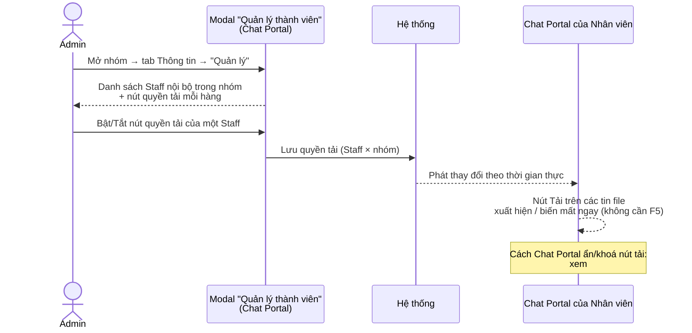

# #23 — Cập nhật quyền tải xuống theo nhóm chat

> **Trạng thái:** draft
> **Nguồn:** [`../scope-and-features.md § F.23`](../scope-and-features.md) (canonical — mô tả form Admin Site gốc) · [`../FSD-Admin-Site.md § 6.3 (decision 2026-06-11 #23)`](../FSD-Admin-Site.md) (override: bỏ form Admin Site) · [`../FSD-Chat-Portal.md § 5.4 FR-D.18`](../FSD-Chat-Portal.md) (kênh cấu hình thực tế — toggle trong modal "Quản lý thành viên")
> **Liên quan:** [`#14 Phân quyền tải tập tin (Chat Portal enforce)`](14-phan-quyen-tai-tap-tin.md) · [`#16 Phân quyền nhóm chat`](16-phan-quyen-nhom-chat.md) · [`#24 Theo dõi file lớn`](../FSD-Admin-Site.md)

---

## 📌 Tóm tắt 1 dòng

Quản trị viên bật/tắt quyền tải xuống của từng Nhân viên trong từng nhóm chat NCC, để Chat Portal biết ai được tải tập tin ở nhóm nào — đây là **mặt cấu hình** của tính năng phân quyền tải, đi cặp với phần **thực thi** ở [`#14`](14-phan-quyen-tai-tap-tin.md).

---

## 🎯 Giá trị nghiệp vụ

Tập tin trao đổi trong các nhóm NCC — hình ảnh chứng từ, tài liệu hợp đồng, video sản phẩm — là dữ liệu nhạy cảm. Để kiểm soát ai được mang dữ liệu này ra khỏi hệ thống, Quản trị viên cần một chỗ để **cấu hình quyền tải xuống** cho từng Nhân viên ở từng nhóm. Tài liệu này mô tả **mặt cấu hình** đó; phần Chat Portal **thực thi** quyền (ẩn/khoá nút tải khi quyền tắt) được mô tả riêng ở [`#14`](14-phan-quyen-tai-tap-tin.md).

Việc cấu hình diễn ra ngay trong modal **"Quản lý thành viên"** của một nhóm trên Chat Portal (modal Admin-only, dùng chung với #16): mỗi Nhân viên trong nhóm có một nút bật/tắt quyền tải. Thao tác bật/tắt có **hiệu lực tức thì** — Nhân viên đang xem nhóm thấy nút tải xuất hiện/biến mất ngay mà không cần tải lại trang.

> ⚠️ **Lưu ý mâu thuẫn nguồn (chi tiết ở Q&A):** Bản scope gốc ([§ F.23](../scope-and-features.md)) mô tả cấu hình theo **từng loại file** (Hình ảnh / Tài liệu / Video) trong một form ở **Admin Site**. Tuy nhiên theo **decision 2026-06-11**, form Admin Site đó **không được làm**; cấu hình chuyển hẳn về modal Chat Portal và rút gọn thành **một toggle bật/tắt toàn bộ** (cả 3 loại cùng lúc). Tài liệu này mô tả theo trạng thái đã chốt (Chat Portal, toggle toàn bộ) và giữ lại scope gốc như một câu hỏi cần BA/PO xác nhận.

**Lợi ích:**

- Quản trị viên kiểm soát được ai trong mỗi nhóm được phép tải tập tin về máy — giảm bề mặt rò rỉ dữ liệu.
- Cấu hình nằm ngay trong luồng quản lý thành viên nhóm, không phải mở thêm màn hình riêng.
- Quyền siết/mở có hiệu lực ngay thời gian thực, đồng bộ với phần thực thi ở Chat Portal ([`#14`](14-phan-quyen-tai-tap-tin.md)).

---

## 👥 Vai trò liên quan

| Vai trò | Trách nhiệm |
| --- | --- |
| **Quản trị (Admin)** | Người duy nhất thấy và thao tác cấu hình. Mở modal "Quản lý thành viên" của nhóm → bật/tắt quyền tải cho từng Nhân viên trong nhóm. Bản thân Admin luôn có quyền tải, không bị áp cấu hình này. |
| **Nhân viên (Staff)** | Là đối tượng được cấu hình. Không thấy nút "Quản lý", không tự đổi quyền tải của mình. Cảm nhận kết quả cấu hình qua việc nút tải xuất hiện/biến mất trên Chat Portal (xem [`#14`](14-phan-quyen-tai-tap-tin.md)). |
| **Hệ thống** | Lưu trạng thái quyền tải theo tổ hợp (Nhân viên × nhóm) · Phát thay đổi tới Chat Portal của Nhân viên liên quan theo thời gian thực · Hủy cấu hình quyền tải của Nhân viên khi họ bị xóa khỏi nhóm (xem [`#16`](16-phan-quyen-nhom-chat.md)). |

---

## 🔄 Dòng chảy nghiệp vụ



> Phần *thực thi* (Portal kiểm tra quyền và ẩn/khoá nút tải khi Nhân viên bấm Tải) thuộc [`#14`](14-phan-quyen-tai-tap-tin.md) — không lặp lại ở đây.

---

## ✅ Kịch bản chấp nhận

> Phạm vi các tình huống dưới đây là **mặt cấu hình** (Admin bật/tắt quyền, lưu trạng thái, phát thay đổi). Các tình huống *thực thi* trên Chat Portal (nút tải bị ẩn/khoá ra sao khi Nhân viên bấm Tải) nằm ở [`#14`](14-phan-quyen-tai-tap-tin.md) — không lặp lại tại đây.

```gherkin
# language: vi
Tính năng: Quản trị viên cấu hình quyền tải xuống của Nhân viên theo từng nhóm chat

  Bối cảnh:
    Biết Admin "Nguyễn Quản Trị" đã đăng nhập Chat Portal
    Và đang mở nhóm "NCC Vận Chuyển Phương Nam"
    Và Nhân viên "Lê Diễm Chi" đã được thêm vào nhóm này

  # =====================================================
  # Truy cập cấu hình (chỉ Admin) — FR-D.16
  # =====================================================

  Tình huống: Admin mở được cấu hình quyền tải qua modal Quản lý thành viên
    Biết Admin đang ở tab "Thông tin" trong panel phải của nhóm
    Khi Admin nhấn nút "Quản lý" ở mục Thành viên
    Thì hệ thống mở modal "Quản lý thành viên"
    Và mỗi hàng Nhân viên nội bộ có một nút bật/tắt quyền tải

  Tình huống: Nhân viên không thấy lối vào cấu hình quyền tải
    Biết người dùng hiện tại là Nhân viên (không phải Admin)
    Khi người đó mở tab "Thông tin" của nhóm
    Thì không hiển thị nút "Quản lý"
    Và Nhân viên không có cách nào tự đổi quyền tải của mình

  # =====================================================
  # Bật / tắt quyền tải — FR-D.18
  # =====================================================

  Tình huống: Bật quyền tải cho một Nhân viên
    Biết quyền tải của "Lê Diễm Chi" trong nhóm này đang TẮT
    Khi Admin nhấn nút quyền tải trên hàng của "Lê Diễm Chi"
    Thì quyền tải của "Lê Diễm Chi" trong nhóm này chuyển sang BẬT
    Và thay đổi được lưu ngay, không cần nút "Lưu"

  Tình huống: Tắt quyền tải cho một Nhân viên
    Biết quyền tải của "Lê Diễm Chi" trong nhóm này đang BẬT
    Khi Admin nhấn nút quyền tải trên hàng của "Lê Diễm Chi"
    Thì quyền tải của "Lê Diễm Chi" trong nhóm này chuyển sang TẮT
    Và thay đổi được lưu ngay

  Tình huống: Quyền tải cấu hình độc lập theo từng nhóm
    Biết "Lê Diễm Chi" được gán cả nhóm "NCC Vận Chuyển Phương Nam" và nhóm "NCC Vật Tư Miền Tây"
    Khi Admin tắt quyền tải của "Lê Diễm Chi" trong nhóm "NCC Vận Chuyển Phương Nam"
    Thì quyền tải của "Lê Diễm Chi" trong nhóm "NCC Vật Tư Miền Tây" không đổi

  Tình huống: Quyền tải cấu hình độc lập theo từng Nhân viên
    Biết nhóm có hai Nhân viên "Lê Diễm Chi" và "Phạm Minh Quân" đều đang BẬT quyền tải
    Khi Admin tắt quyền tải của "Lê Diễm Chi"
    Thì quyền tải của "Phạm Minh Quân" trong nhóm này vẫn BẬT

  # =====================================================
  # Hiệu lực thời gian thực sang Chat Portal — FR-D.21, FR-D.5
  # =====================================================

  Tình huống: Tắt quyền tải có hiệu lực ngay khi Nhân viên đang xem nhóm
    Biết "Lê Diễm Chi" đang mở nhóm này trên Chat Portal và quyền tải đang BẬT
    Khi Admin tắt quyền tải của "Lê Diễm Chi"
    Thì nút Tải trên các tin file trong nhóm đó biến mất ngay với "Lê Diễm Chi" mà không cần tải lại trang

  Tình huống: Bật quyền tải có hiệu lực ngay khi Nhân viên đang xem nhóm
    Biết "Lê Diễm Chi" đang mở nhóm này trên Chat Portal và quyền tải đang TẮT
    Khi Admin bật quyền tải của "Lê Diễm Chi"
    Thì nút Tải trên các tin file trong nhóm đó xuất hiện ngay với "Lê Diễm Chi"

  # =====================================================
  # Footer thống kê — § 5.4
  # =====================================================

  Tình huống: Footer modal cập nhật số Nhân viên có quyền tải
    Biết modal đang hiển thị 2 trên 3 Nhân viên có quyền tải
    Khi Admin tắt quyền tải của một Nhân viên đang BẬT
    Thì footer cập nhật còn 1 trên 3 Nhân viên có quyền tải

  # =====================================================
  # Trường hợp đặc biệt
  # =====================================================

  Tình huống: Xóa Nhân viên khỏi nhóm thì gỡ luôn cấu hình quyền tải của họ
    Biết "Lê Diễm Chi" đang có quyền tải BẬT trong nhóm này
    Khi Admin xóa "Lê Diễm Chi" khỏi nhóm
    Thì cấu hình quyền tải của "Lê Diễm Chi" trong nhóm này không còn
    Và nếu sau này được thêm lại, quyền tải áp theo giá trị mặc định cho thành viên mới
    # Giá trị mặc định khi thêm mới (BẬT hay TẮT) cần BA chốt — xem Q&A

  Tình huống: Admin luôn tải được nên không có cấu hình quyền tải cho Admin
    Biết một Admin khác cũng là thành viên hiển thị trong modal
    Khi xem hàng của Admin đó
    Thì hàng Admin không có nút bật/tắt quyền tải vì Admin luôn có quyền tải mọi loại file
    # Việc Admin luôn có quyền thuộc #14 FR-14.3 — cần xác nhận modal có liệt kê Admin không (Q&A)
```

---

## 🎨 Mô tả giao diện

> Cấu hình quyền tải **không có màn hình riêng** — nó nằm trong modal **"Quản lý thành viên"** dùng chung với #16 (thêm/xóa Staff). Phần dưới chỉ mô tả thành phần liên quan đến quyền tải; bố cục đầy đủ của modal xem [`#16 § Mô tả giao diện`](16-phan-quyen-nhom-chat.md).

### Lối vào

```
Chat Portal → mở nhóm → panel phải → tab "Thông tin"
   → mục "Thành viên" → nút "Quản lý" (⚙️, chỉ Admin thấy)
       → modal "Quản lý thành viên"
```

### Modal "Quản lý thành viên" — phần quyền tải

```
┌──────────────────────────────────────────────┐
│  Quản lý thành viên              [ + Thêm ]   │
│ ────────────────────────────────────────────  │
│  Lê Diễm Chi      [Staff]      [⬇ BẬT]   [✕]  │  ← nút quyền tải · nút xóa
│  Phạm Minh Quân   [Staff]      [⬇ TẮT]   [✕]  │
│  Tăng Thị Huyền   [Staff]      [⬇ BẬT]   [✕]  │
│ ────────────────────────────────────────────  │
│  Tổng 3 thành viên · 2 có quyền tải           │  ← footer thống kê
└──────────────────────────────────────────────┘
```

| Thành phần | Mô tả | Ghi chú |
| --- | --- | --- |
| **Nút quyền tải** (⬇) | Toggle bật/tắt **toàn bộ** quyền tải (Hình ảnh + Tài liệu + Video đồng thời) cho Nhân viên đó trong nhóm này | Theo FR-D.18 — **một** toggle, không tách loại file. Xem Q&A #1 |
| **Nút xóa** (✕) | Xóa Nhân viên khỏi nhóm | Thuộc [`#16`](16-phan-quyen-nhom-chat.md); xóa cũng gỡ cấu hình quyền tải |
| **Footer** | "Tổng N thành viên · M có quyền tải" | Cập nhật theo thời gian thực khi toggle |
| **Phạm vi danh sách** | Chỉ **Staff nội bộ** đã ở trong nhóm; Vendor Zalo không hiển thị | Xem Q&A #4 về việc có liệt kê Admin không |

### Trạng thái nút quyền tải

| Trạng thái | Hiển thị | Hệ quả trên Chat Portal của Nhân viên (xem #14) |
| --- | --- | --- |
| **BẬT** | Nút ở trạng thái bật (ví dụ icon ⬇ tô màu / nền sáng) | Nút Tải hiện trên các tin file trong nhóm |
| **TẮT** | Nút ở trạng thái tắt (icon mờ / nền xám) | Nút Tải bị ẩn/khoá trên các tin file (xem [`#14 FR-14.2`](14-phan-quyen-tai-tap-tin.md)) |

> Hình thức hiển thị chính xác của trạng thái BẬT/TẮT (màu, icon, nhãn) do BA chốt qua mockup.

### Mockup tham chiếu

> ⏳ **Cần BA bổ sung:**
> - Modal "Quản lý thành viên" với cột nút quyền tải — so sánh hàng BẬT vs TẮT.
> - Footer thống kê "Tổng N thành viên · M có quyền tải".
> - Xác nhận form Admin Site "Chỉnh sửa quyền tải xuống" theo scope § F.23 có còn được làm không (xem Q&A #2) — nếu không thì mockup này không tồn tại.

---

## 🔗 Tham chiếu & Q&A

### Liên quan các phần khác

- **#23 và #14 là 2 mặt của cùng một tính năng:** #23 = **cấu hình** quyền (Admin bật/tắt, lưu trạng thái); [`#14`](14-phan-quyen-tai-tap-tin.md) = **thực thi** quyền (Chat Portal ẩn/khoá nút Tải, cảnh báo video lớn, backend chặn vượt quyền). Mọi chi tiết về *hành vi khi tải* (theo loại file, video > 300MB, Admin luôn có quyền, cập nhật real-time phía người tải) nằm ở #14 — tài liệu này **không lặp lại**, chỉ cross-reference.
- [`#16 Phân quyền nhóm chat`](16-phan-quyen-nhom-chat.md): nút quyền tải nằm chung modal "Quản lý thành viên" với thao tác thêm/xóa Staff. Xóa Staff khỏi nhóm (#16) cũng gỡ cấu hình quyền tải của họ trong nhóm đó.
- [`#24 Theo dõi file lớn`](../FSD-Admin-Site.md): liên quan gián tiếp (ngưỡng 300MB cho video) — thuộc phần cảnh báo dung lượng ở #14, không phải cấu hình quyền.

### ⚠️ Q&A cần BA / PO làm rõ

1. **Cấu hình theo TỪNG LOẠI FILE hay TOÀN BỘ (cả 3 loại cùng lúc)?**
   - Mâu thuẫn nguồn:
     - **Phương án A — tách theo loại file:** [`scope-and-features.md § F.23`](../scope-and-features.md) mô tả bảng vendor groups, mỗi row có **3 toggle** (Hình ảnh / Tài liệu / Video), lưu `downloadPermissions[staffId][groupId] = { canDownloadImages, canDownloadFiles, canDownloadVideos }`. [`§ C.14`](../scope-and-features.md) và [`#14 FR-14.1`](14-phan-quyen-tai-tap-tin.md) (enforce) cũng giả định 3 quyền độc lập.
     - **Phương án B — toàn bộ một toggle:** kênh cấu hình thực tế đã chốt — [`FSD-Chat-Portal.md § 5.4 FR-D.18`](../FSD-Chat-Portal.md) — chỉ có **một** nút bật/tắt **toàn bộ quyền tải** (cả 3 loại đồng thời).
   - **Pilot hiện đang theo:** Phương án B (toggle toàn bộ) cho mặt *cấu hình*, vì đó là UI duy nhất tồn tại. Hệ quả: dù #14 enforce theo từng loại, trên thực tế cả 3 loại của một Nhân viên trong một nhóm luôn cùng BẬT hoặc cùng TẮT. **Cần BA/PO chốt** có thực sự cần tách 3 loại không — nếu có thì phải bổ sung 3 toggle vào modal (và đồng bộ với Q&A #1 của #14).

2. **Form cấu hình ở Admin Site (scope § F.23) có còn được làm không, hay đã bị override?**
   - Mâu thuẫn nguồn:
     - **Đề bài + [`scope-and-features.md § F.23`](../scope-and-features.md):** cấu hình trong form **"Chỉnh sửa quyền tải xuống"** của một staff, truy cập từ **trang quản lý user** (Admin Site).
     - **[`FSD-Admin-Site.md § 6.3 (decision 2026-06-11)`](../FSD-Admin-Site.md):** *"#23 — chỉ cấu hình được trên Chat Portal, không có UI Admin Site. Trang Quản lý User & Phân Quyền (Phase 1) **không** có form đó."* Đồng bộ với [`FSD-Chat-Portal.md § 5.4 FR-D.18`](../FSD-Chat-Portal.md).
   - **Pilot hiện đang theo:** decision 2026-06-11 — **không** làm form Admin Site; cấu hình chỉ ở modal Chat Portal. Tài liệu này viết theo hướng đó. **Cần BA/PO xác nhận** scope § F.23 đã chính thức bị thay thế (và nên cập nhật scope doc để tránh đọc nhầm trong tương lai).

3. **Giá trị mặc định quyền tải khi một Nhân viên vừa được thêm vào nhóm là BẬT hay TẮT?**
   - Không nguồn nào nêu rõ. Ảnh hưởng trực tiếp: nếu mặc định BẬT thì Nhân viên mới tải được ngay; nếu mặc định TẮT thì Admin phải chủ động cấp.
   - **Pilot tạm chọn:** chưa quyết — đề xuất mặc định **TẮT** (an toàn dữ liệu, opt-in), nhưng **cần BA/PO chốt**.

4. **Modal "Quản lý thành viên" có liệt kê Admin (cùng nút quyền tải) không?**
   - [`FSD-Chat-Portal.md § 5.4`](../FSD-Chat-Portal.md) nói modal hiển thị "Staff nội bộ". Chưa rõ một Admin khác (cũng là thành viên nhóm) có xuất hiện không, và nếu có thì có nút quyền tải không (vì Admin luôn có quyền — [`#14 FR-14.3`](14-phan-quyen-tai-tap-tin.md)).
   - **Pilot tạm chọn:** chỉ liệt kê Staff; Admin (nếu hiện) không có nút quyền tải. **Cần BA xác nhận.**

5. **Có ghi nhật ký (audit) ai đổi quyền tải, lúc nào không?**
   - Quyền tải kiểm soát dữ liệu nhạy cảm rời hệ thống, nên việc ai bật/tắt có thể cần truy vết. Không nguồn nào đề cập.
   - **Pilot tạm chọn:** Phase 2 chưa làm audit cho thao tác này. **Cần PO xác nhận** có yêu cầu compliance không.
