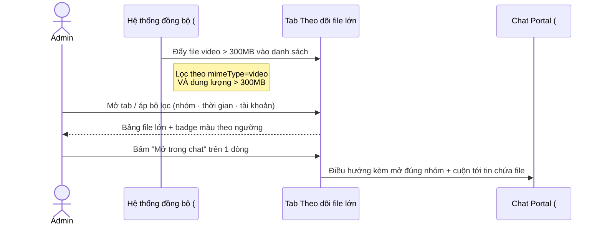

# #24 — Theo dõi file lớn

> **Trạng thái:** draft
> **Nguồn:** scope-and-features.md § F.24 (#24) · FSD-Admin-Site.md § 2.4 (Tab Theo dõi file lớn)

---

## 📌 Tóm tắt 1 dòng

Admin xem một bảng tổng hợp (chỉ-đọc) liệt kê mọi file video vượt 300MB đã đồng bộ về, để theo dõi và khoanh vùng nhanh các file có nguy cơ ảnh hưởng dung lượng / hiệu năng.

---

## 🎯 Giá trị nghiệp vụ

Trong các nhóm chat với nhà cung cấp, staff và NCC thường xuyên gửi video dung lượng lớn (clip kiểm hàng, quay phòng máy, video sự cố…). Những file này không bị chặn — hệ thống vẫn đồng bộ đầy đủ — nhưng chúng tiêu tốn nhiều dung lượng lưu trữ và làm chậm quá trình đồng bộ. Nếu không có nơi tập trung theo dõi, Admin chỉ phát hiện vấn đề dung lượng khi nó đã trở nên nghiêm trọng.

Tab **Theo dõi file lớn** gom tất cả file video vượt ngưỡng 300MB vào một bảng duy nhất, có bộ lọc theo nhóm / thời gian / tài khoản và badge màu cảnh báo theo mức dung lượng. Admin nhìn lướt là biết file nào "nặng nhất", thuộc nhóm nào, ai gửi, gửi lúc nào — và mở thẳng được tin nhắn chứa file đó trong cửa sổ chat để xử lý tiếp.

Đây là **màn hình theo dõi (monitoring)**: nó tổng hợp và trình bày, không phải nơi Admin chỉnh sửa hay xoá file. Mọi cảnh báo phát sinh tại thời điểm gửi nằm ở phía Chat Portal (xem [#6](#-tham-chiếu--qa)); tab này là bức tranh tổng hợp sau khi dữ liệu đã đồng bộ về.

**Lợi ích:**

- Phát hiện sớm các file ngốn dung lượng trước khi ảnh hưởng hiệu năng / chi phí lưu trữ.
- Một nơi duy nhất tra cứu file lớn theo nhóm, theo thời gian, theo tài khoản Zalo.
- Rút ngắn thời gian từ "thấy con số file lớn" đến "mở đúng tin nhắn chứa file" nhờ liên kết sang Chat Portal.

---

## 👥 Vai trò liên quan

| Vai trò | Trách nhiệm |
| ------- | ----------- |
| **Admin** | Mở tab, áp bộ lọc, đọc bảng, đọc badge cảnh báo; bấm "Mở trong chat" để điều hướng tới tin nhắn gốc. |
| **Hệ thống** | Trong lúc đồng bộ (#21), nhận diện file `video` có dung lượng > 300MB và đưa vào danh sách của tab này; cập nhật badge màu theo ngưỡng dung lượng. |

---

## 🔄 Dòng chảy nghiệp vụ

File lớn được nhận diện ở bước đồng bộ (#21), sau đó hiển thị thụ động trong tab. Admin chỉ đọc và lọc; thao tác duy nhất rời khỏi tab là "Mở trong chat" để nhảy sang Chat Portal.



---

## ✅ Kịch bản chấp nhận

```gherkin
# language: vi
Tính năng: Theo dõi file video lớn đã đồng bộ về hệ thống

  Bối cảnh:
    Biết người dùng là Admin đang ở Tab "Theo dõi file lớn" của trang Nhà cung cấp

  # ===== Hiển thị danh sách (FR-NCC.14) =====

  Tình huống: Bảng chỉ liệt kê file video vượt ngưỡng dung lượng
    Biết hệ thống đã đồng bộ về nhiều loại file khác nhau
    Khi Admin xem bảng
    Thì hệ thống chỉ hiển thị các file có định dạng video và dung lượng lớn hơn 300MB
    Và các file ảnh, tài liệu hoặc video nhỏ hơn 300MB không xuất hiện

  Tình huống: Sắp xếp mặc định theo thời điểm nhận mới nhất
    Biết bảng có nhiều file thoả ngưỡng
    Khi Admin mở tab lần đầu chưa đổi cách sắp xếp
    Thì các file mới nhận được hiển thị ở trên cùng

  # ===== Badge cảnh báo dung lượng (FR-NCC.15) =====

  Khung tình huống: Badge dung lượng đổi màu theo ngưỡng
    Biết một dòng file có dung lượng "<dung_lượng>"
    Khi Admin xem cột Dung lượng của dòng đó
    Thì badge hiển thị màu "<màu>"

    Dữ liệu:
      | dung_lượng | màu        |
      | 350MB      | vàng       |
      | 700MB      | cam        |
      | 1.4GB      | đỏ         |

  # ===== Bộ lọc (FR-NCC.16, FR-NCC.18) =====

  Tình huống: Lọc danh sách theo nhóm chat
    Biết bảng đang hiển thị file của nhiều nhóm
    Khi Admin chọn một nhóm chat trong bộ lọc
    Thì bảng chỉ còn các file thuộc nhóm chat đó

  Tình huống: Dropdown nhóm có ô tìm kiếm khi danh sách dài
    Biết số nhóm chat trong bộ lọc nhiều hơn 10 mục
    Khi Admin mở dropdown "Nhóm chat"
    Thì xuất hiện ô tìm kiếm để lọc nhanh tên nhóm

  Tình huống: Tab nhận bộ lọc dựng sẵn khi mở từ Tab Đồng bộ
    Biết Admin đang ở Tab "Đồng bộ dữ liệu" và thấy số "file video > 300MB" của một tài khoản
    Khi Admin bấm vào con số đó
    Thì Tab "Theo dõi file lớn" mở ra với bộ lọc đã đặt sẵn theo tài khoản Zalo tương ứng

  # ===== Điều hướng sang chat (FR-NCC.17) =====

  Tình huống: Mở tin nhắn gốc chứa file trong Chat Portal
    Biết Admin đang trỏ chuột vào một dòng file
    Khi Admin bấm "Mở trong chat"
    Thì hệ thống điều hướng sang Chat Portal, mở đúng nhóm chứa file
    Và cuộn tới đúng tin nhắn chứa file đó

  # ===== Trường hợp đặc biệt =====

  Tình huống: Chưa có file lớn nào được đồng bộ
    Biết chưa có file video nào vượt 300MB được đồng bộ về
    Khi Admin mở tab
    Thì hệ thống hiển thị trạng thái rỗng với thông báo "Chưa có file video lớn nào được đồng bộ về"

  Tình huống: Bộ lọc kết hợp không ra kết quả
    Biết bảng có dữ liệu nhưng bộ lọc hiện tại loại hết các dòng
    Khi kết quả lọc rỗng
    Thì hệ thống hiển thị thông báo "Không có file phù hợp với bộ lọc hiện tại"
    Và hiển thị nút "Đặt lại bộ lọc"

  Tình huống: File đã bị thu hồi khỏi Zalo vẫn được giữ để theo dõi
    Biết một file trong bảng đã bị người gửi thu hồi trên Zalo
    Khi Admin xem dòng file đó
    Thì file vẫn hiển thị trong bảng kèm nhãn nhỏ "(Đã thu hồi)" cạnh tên file

  Tình huống: File đã bị xoá khỏi lưu trữ theo chính sách lưu giữ
    Biết một file đã bị xoá khỏi storage do retention policy
    Khi Admin xem dòng file đó
    Thì dòng hiển thị mờ đi
    Và nút "Mở trong chat" bị vô hiệu hoá kèm tooltip "File không còn khả dụng"
```

---

## 🎨 Mô tả giao diện

Tab **Theo dõi file lớn** là tab thứ 3 trong trang Nhà cung cấp (cạnh "Liên kết tài khoản" và "Đồng bộ dữ liệu"). Layout gồm **filter bar** ở trên và **bảng danh sách** bên dưới. Đây là màn hình chỉ-đọc: không có nút thêm/sửa/xoá file, thao tác duy nhất là điều hướng sang chat.

### Cấu trúc trang

```
┌───────────────────────────────────────────────────────────────┐
│  [Nhóm chat ▾]   [Khoảng thời gian 📅]   [Tài khoản Zalo ▾]    │  ← filter bar
├───────────────────────────────────────────────────────────────┤
│  Tên file        │ Dung lượng │ Nhóm chat │ Người gửi │ Nhận lúc│
│ ─────────────────┼────────────┼───────────┼───────────┼─────────│
│  kiemhang_01.mp4 │ [350MB] 🟡 │ NCC An Phát│ Staff Lan │ 09:12   │
│  phongmay.mp4    │ [720MB] 🟠 │ NCC Hùng   │ NCC Hùng  │ Hôm qua │
│  succo_kho.mp4   │ [1.4GB] 🔴 │ NCC An Phát│ Staff Lan │ 12/06   │
│       └─ hover → [ Mở trong chat ]                              │
└───────────────────────────────────────────────────────────────┘
```

### Filter bar

| Bộ lọc | Kiểu | Ghi chú |
| ------ | ---- | ------- |
| Nhóm chat | Dropdown chọn nhóm NCC | Có ô tìm-trong-dropdown khi danh sách > 10 nhóm (FR-NCC.16). |
| Khoảng thời gian | Date range picker | Lọc theo thời điểm nhận file. |
| Tài khoản Zalo | Dropdown | Nhận giá trị dựng sẵn khi mở từ link trên Tab Đồng bộ (FR-NCC.18). |

### Bảng danh sách

| Cột | Nội dung | Ghi chú |
| --- | -------- | ------- |
| Tên file | Tên file video | Kèm nhãn "(Đã thu hồi)" nếu file đã bị thu hồi trên Zalo; làm mờ nếu đã bị xoá khỏi storage. |
| Dung lượng | Badge color-coded | 300–500MB: vàng · 500MB–1GB: cam · > 1GB: đỏ (FR-NCC.15). |
| Nhóm chat | Tên nhóm NCC | |
| Người gửi | Staff hoặc NCC gửi file | |
| Thời điểm nhận | Thời gian đồng bộ về | Cột sort mặc định, mới nhất trước. |
| (hover) | Action "Mở trong chat" | Điều hướng sang Chat Portal; bị vô hiệu hoá nếu file không còn khả dụng. |

### Trạng thái rỗng

- **Chưa có dữ liệu:** icon Video + *"Chưa có file video lớn nào được đồng bộ về"*.
- **Lọc ra 0 kết quả:** *"Không có file phù hợp với bộ lọc hiện tại"* + nút "Đặt lại bộ lọc".

### Mockup tham chiếu

> ✅ **Đã có:** filter bar (3 dropdown) + bảng với badge dung lượng color-coded.
> ⏳ **Cần BA bổ sung:** empty state khi không có dữ liệu; trạng thái dòng "Đã thu hồi" và dòng bị làm mờ (file đã xoá).

---

## 🔗 Tham chiếu & Q&A

### Liên quan các phần khác

- **#21 Đồng bộ dữ liệu**: `scope-and-features.md § F.21` · `FSD-Admin-Site.md § 2.3` — nơi file video > 300MB được nhận diện và đếm; stats grid của Tab Đồng bộ có ô "Số file video > 300MB" là **link** mở sang tab này kèm bộ lọc dựng sẵn (FR-NCC.18).
- **#6 Gửi/nhận IMG / FILE / VID**: `scope-and-features.md § A.6` — nơi **cảnh báo nội bộ** (tag/badge cạnh tin) xuất hiện ngay trong cửa sổ chat khi gửi video > 300MB. Tab #24 là bức tranh tổng hợp sau đồng bộ, không phải nơi phát sinh cảnh báo.
- **#14 Phân quyền tải tập tin**: `scope-and-features.md § A.14` — file video > 300MB vẫn hiển thị cảnh báo dung lượng (confirm dialog) trước khi tải; không liên quan trực tiếp tới bảng theo dõi nhưng cùng ngưỡng 300MB.

### ⚠️ Q&A cần BA / PO làm rõ

1. **Tab này là "read-only monitoring" hay được phép có action điều hướng?**
   - Phương án A: thuần đọc — không có bất kỳ action nào trên dòng (đúng tinh thần ghi chú "Admin xem, không có action trực tiếp trên bảng này").
   - Phương án B: đọc + 1 action điều hướng "Mở trong chat" (theo FR-NCC.17 / FR-NCC.5 trong `FSD-Admin-Site.md § 2.4`, mục Business Flow bước 5).
   - **Pilot hiện đang theo:** B (giữ "Mở trong chat" vì nó **không sửa đổi dữ liệu** — chỉ điều hướng, nên vẫn nhất quán với tính chất "không thao tác trực tiếp trên file"). Cần BA/PO xác nhận có giữ action này không.

2. **Ngưỡng "300MB" tính theo chuẩn nào?**
   - Phương án A: 300 × 1024 × 1024 bytes (binary MB) — mặc định trong `FSD-Admin-Site.md § 2.4 FR-NCC.14`.
   - Phương án B: 300 × 1.000.000 bytes (decimal MB) — nếu BA thống nhất khác.
   - **Pilot hiện đang theo:** A. Cần BA xác nhận để các badge ngưỡng (vàng/cam/đỏ) tính nhất quán với màn hình chat (#6) và stats grid (#21).

3. **Ngưỡng badge màu áp dụng từ ranh giới nào?** Scope ghi `300–500MB` vàng, `500MB–1GB` cam, `> 1GB` đỏ — chưa nói rõ điểm `500MB` và `1GB` thuộc khoảng trên hay dưới (ví dụ đúng 500MB là vàng hay cam). Cần BA chốt quy ước biên (đề xuất pilot: cận dưới đóng — `[300,500)` vàng, `[500,1024)` cam, `≥1GB` đỏ).

4. **File đã bị xoá khỏi storage có còn tính vào counter/badge "(N) chưa xem" trên đầu tab không?** `FSD-Admin-Site.md § 2.1 FR-NCC.3` nói tab 3 có thể hiển thị tổng số file > 300MB chưa xem; chưa rõ file đã xoá/đã thu hồi có trừ khỏi con số này không. Cần BA làm rõ định nghĩa "chưa xem" và phạm vi đếm.
