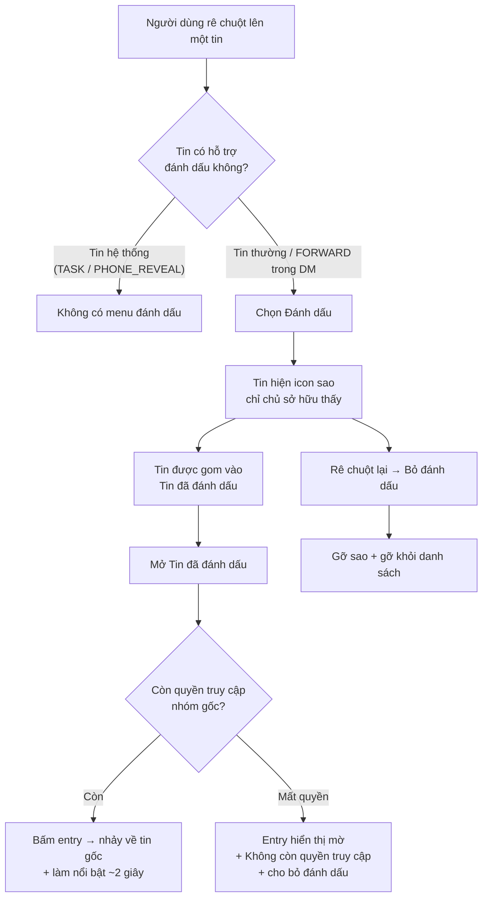

# #25 — Đánh dấu tin nhắn (Bookmark)

> **Trạng thái:** draft
> **Nguồn:** [`../scope-and-features.md § B.25`](../scope-and-features.md) (canonical) · [`../FSD-Chat-Portal.md § 3.9`](../FSD-Chat-Portal.md)
> **Liên quan:** [`#9 Thu hồi tin nhắn`](09-thu-hoi-tin-nhan.md) · [`#11 Forward tin nhắn đến Admin`](11-forward-tin-nhan-den-admin.md) · #14 Phân quyền tải file · #16 Gán Staff vào nhóm vendor

---

## 📌 Tóm tắt 1 dòng

Mỗi người dùng tự đánh dấu (⭐) những tin quan trọng để xem lại sau qua mục "Tin đã đánh dấu" — dấu này là riêng tư cho từng người, không ai khác thấy và không đồng bộ lên Zalo.

---

## 🎯 Giá trị nghiệp vụ

Trong một ngày làm việc, Nhân viên lướt qua rất nhiều tin trong nhiều nhóm NCC khác nhau. Một số tin cần xử lý sau hoặc cần nhớ để tra cứu lại — một cam kết của khách, một con số báo giá, một yêu cầu chưa làm xong. Hiện không có cách nào để "đánh dấu để quay lại"; người dùng phải cuộn ngược lịch sử hoặc tự ghi nhớ tên nhóm, dẫn đến bỏ sót.

Tính năng Đánh dấu tin nhắn cho phép mỗi người dùng "ghim cá nhân" bất kỳ tin nào: tin được gắn icon ⭐ ở góc bóng tin và đồng thời gom vào một danh sách tập trung **"Tin đã đánh dấu"** trải khắp mọi nhóm. Từ danh sách này, bấm một cái là nhảy thẳng về đúng tin gốc trong nhóm tương ứng. Điểm cốt lõi: việc đánh dấu là **hoàn toàn riêng tư** — chỉ chính người đánh dấu nhìn thấy ⭐ và danh sách của mình, người khác (kể cả Nhân viên cùng nhóm hay khách hàng) không hề biết.

Vì là ghi chú cá nhân nội bộ trong Portal, thao tác đánh dấu **không** tạo bất kỳ thay đổi nào trên Zalo và không sinh thông báo cho ai.

**Lợi ích:**

- Mỗi người tự quản lý "danh sách việc cần quay lại" mà không làm phiền người khác.
- Bấm một lần từ danh sách là về đúng tin gốc trong nhóm — không phải dò tìm thủ công.
- Riêng tư tuyệt đối: không lộ cho đồng nghiệp hay khách hàng, không lên Zalo.
- Tập trung tin quan trọng từ nhiều nhóm vào một chỗ duy nhất.

---

## 👥 Vai trò liên quan

| Vai trò | Trách nhiệm |
| --- | --- |
| **Nhân viên (Staff)** | Đánh dấu / bỏ đánh dấu tin cho riêng mình. Mở mục "Tin đã đánh dấu" để xem lại và nhảy về tin gốc. Chỉ thấy ⭐ và danh sách của chính mình. |
| **Quản trị (Admin)** | Cũng có thể đánh dấu tin cho riêng mình với hành vi giống Nhân viên. Khác biệt: với tin đã bị thu hồi mà mình từng đánh dấu, Quản trị vẫn xem được nội dung gốc trong danh sách (theo quy tắc thu hồi của #9). |
| **Vendor (NCC)** | Không liên quan. Không có khái niệm đánh dấu, không thấy ⭐ của bất kỳ ai. Thao tác đánh dấu không đồng bộ lên Zalo. |
| **Hệ thống** | Lưu trạng thái đánh dấu theo từng cặp (người dùng × tin nhắn); chỉ render ⭐ cho đúng chủ sở hữu; tổng hợp danh sách "Tin đã đánh dấu" xuyên nhiều nhóm; xử lý nhảy-về-tin-gốc và kiểm tra quyền truy cập theo trạng thái **hiện tại** của người dùng trong nhóm gốc. |

---

## 🔄 Dòng chảy nghiệp vụ



---

## ✅ Kịch bản chấp nhận

```gherkin
# language: vi
Tính năng: Đánh dấu cá nhân một tin nhắn để xem lại sau

  Bối cảnh:
    Biết người dùng đang đăng nhập Portal và mở một nhóm NCC được phép truy cập
    Và việc đánh dấu là riêng tư cho từng người, không đồng bộ lên Zalo
    Và mỗi tin có thể được nhiều người đánh dấu độc lập với nhau

  # =====================================================
  # Đánh dấu & bỏ đánh dấu (happy path) — FR-25.1, FR-25.2
  # =====================================================

  Tình huống: Đánh dấu một tin từ menu rê chuột
    Biết một tin nhắn thường trong nhóm chưa được người dùng đánh dấu
    Khi người dùng rê chuột lên tin đó và chọn "Đánh dấu"
    Thì tin hiển thị icon ⭐ ở góc bóng tin
    Và tin được thêm vào mục "Tin đã đánh dấu" của người dùng

  Tình huống: Bỏ đánh dấu một tin đã đánh dấu
    Biết một tin đang được người dùng đánh dấu (có ⭐)
    Khi người dùng rê chuột lên tin đó và chọn "Bỏ đánh dấu"
    Thì icon ⭐ biến mất khỏi bóng tin
    Và tin bị gỡ khỏi mục "Tin đã đánh dấu"

  Tình huống: Đánh dấu chính tin do mình gửi
    Biết một tin do chính người dùng gửi trong nhóm
    Khi người dùng chọn "Đánh dấu" trên tin đó
    Thì tin được đánh dấu thành công

  # =====================================================
  # Tính riêng tư của dấu đánh dấu — FR-25.1, FR-25.2
  # =====================================================

  Tình huống: Người khác không thấy ⭐ của mình
    Biết Nhân viên A đã đánh dấu một tin trong nhóm
    Khi Nhân viên B mở cùng nhóm đó và xem cùng tin
    Thì Nhân viên B không thấy icon ⭐ trên tin
    Và tin không xuất hiện trong "Tin đã đánh dấu" của Nhân viên B

  Tình huống: Đánh dấu của một người không ảnh hưởng người khác
    Biết Nhân viên A và Nhân viên B cùng truy cập một nhóm
    Khi Nhân viên A đánh dấu một tin
    Thì trạng thái đánh dấu của Nhân viên B trên tin đó không thay đổi

  # =====================================================
  # Mục "Tin đã đánh dấu" — FR-25.3, FR-25.4
  # =====================================================

  Tình huống: Danh sách gom tin từ nhiều nhóm
    Biết người dùng đã đánh dấu tin ở nhiều nhóm NCC khác nhau
    Khi người dùng mở mục "Tin đã đánh dấu"
    Thì danh sách hiển thị tất cả tin đã đánh dấu trên mọi nhóm
    Và mỗi entry hiển thị trích đoạn nội dung, người gửi gốc, tên nhóm và thời điểm

  Tình huống: Sắp xếp mặc định mới nhất trước
    Biết mục "Tin đã đánh dấu" có nhiều entry
    Khi người dùng mở danh sách
    Thì các entry được sắp xếp mới nhất lên trước

  Tình huống: Nhảy về tin gốc từ danh sách
    Biết một entry trong "Tin đã đánh dấu" thuộc nhóm người dùng còn quyền truy cập
    Khi người dùng bấm vào entry đó
    Thì Portal mở nhóm gốc và cuộn tới tin gốc
    Và tin gốc được làm nổi bật khoảng 2 giây

  Tình huống: Mục "Tin đã đánh dấu" rỗng
    Biết người dùng chưa đánh dấu tin nào
    Khi người dùng mở mục "Tin đã đánh dấu"
    Thì danh sách hiển thị trạng thái rỗng thay vì danh sách entry

  # =====================================================
  # Tương tác với thu hồi (#9) — FR-25.5, FR-9.4
  # =====================================================

  Tình huống: Tin đã đánh dấu sau đó bị thu hồi — góc nhìn Nhân viên
    Biết Nhân viên đã đánh dấu một tin
    Và tin đó sau đó bị thu hồi
    Khi Nhân viên mở mục "Tin đã đánh dấu"
    Thì entry vẫn còn trong danh sách
    Và nội dung hiển thị thành ô giữ chỗ "Tin đã thu hồi"
    Và Nhân viên vẫn có thể bỏ đánh dấu entry này

  Tình huống: Tin đã đánh dấu sau đó bị thu hồi — góc nhìn Quản trị
    Biết Quản trị đã đánh dấu một tin
    Và tin đó sau đó bị thu hồi
    Khi Quản trị mở mục "Tin đã đánh dấu"
    Thì Quản trị vẫn xem được nội dung gốc của tin trong danh sách

  Tình huống: Không thể đánh dấu mới một tin đã thu hồi
    Biết một tin đã bị thu hồi mà người dùng chưa từng đánh dấu
    Khi người dùng rê chuột lên tin đó
    Thì menu không hiển thị tùy chọn "Đánh dấu"

  # =====================================================
  # Trường hợp đặc biệt — quyền truy cập & loại tin
  # =====================================================

  Tình huống: Mất quyền truy cập nhóm gốc
    Biết người dùng đã đánh dấu một tin trong một nhóm
    Và sau đó người dùng bị gỡ khỏi nhóm đó
    Khi người dùng mở mục "Tin đã đánh dấu"
    Thì entry của nhóm đó hiển thị mờ
    Và kèm nhãn "Không còn quyền truy cập"
    Và người dùng chỉ có thể bỏ đánh dấu, không thể nhảy về tin gốc

  Tình huống: Quyền tải file của tin đã đánh dấu kiểm theo trạng thái hiện tại
    Biết một tin chứa tập tin đã được người dùng đánh dấu
    Khi người dùng nhảy về tin gốc và thao tác với tập tin
    Thì quyền tải xuống được kiểm theo trạng thái quyền hiện tại của người dùng trong nhóm gốc, không theo thời điểm đánh dấu

  Khung tình huống: Loại tin và khả năng đánh dấu
    Biết người dùng rê chuột lên một tin loại "<loại tin>"
    Khi xem menu rê chuột
    Thì tùy chọn đánh dấu "<kết quả>"

    Dữ liệu:
      | loại tin                          | kết quả                |
      | Tin thường trong nhóm NCC         | có sẵn                 |
      | Tin chuyển tiếp (FORWARD) trong DM | có sẵn                 |
      | Tin hệ thống TASK                 | không hiển thị         |
      | Tin hệ thống PHONE_REVEAL_*       | không hiển thị         |
      | Tin nhật ký công việc (#19)       | không hiển thị         |
```

---

## 🎨 Mô tả giao diện

### Trên bóng tin

```
┌─────────────────────────────────────┐
│ Tên người gửi · 14:32           ⭐  │  ← icon sao chỉ hiện với
│ Nội dung tin nhắn ...                │     chính người đã đánh dấu
└─────────────────────────────────────┘
        ▲ rê chuột → menu: Reply · React · ... · Đánh dấu
```

- Icon ⭐ nằm ở góc bóng tin, **chỉ render cho chính người đã đánh dấu**; Nhân viên khác và vendor không thấy.
- Tùy chọn **"Đánh dấu" / "Bỏ đánh dấu"** nằm trong menu rê chuột chung của bóng tin (cùng nhóm với Reply · React · Thu hồi · Ghim · Forward — xem [`../FSD-Chat-Portal.md § 3.1`](../FSD-Chat-Portal.md)). Tin hệ thống không có menu rê chuột nên không có tùy chọn này.

### Mục "Tin đã đánh dấu"

Truy cập từ sidebar/menu của người dùng. Mở ra danh sách tổng hợp mọi tin đã đánh dấu trên tất cả nhóm.

| Thành phần entry | Nội dung | Ghi chú |
| --- | --- | --- |
| Trích đoạn nội dung | Snippet text của tin gốc | Tin đã thu hồi → "Tin đã thu hồi" (Nhân viên) / nội dung gốc (Quản trị) |
| Người gửi gốc | Tên người gửi tin | |
| Tên nhóm | Nhóm NCC chứa tin gốc | |
| Thời điểm | Timestamp của tin gốc | Sort mặc định: mới nhất trước |
| Hành động | Bấm entry → nhảy về tin gốc | Mất quyền → entry mờ + "Không còn quyền truy cập", chỉ cho bỏ đánh dấu |

```
Tin đã đánh dấu
─────────────────────────────────────────
⭐ [Nhóm A] Nguyễn Văn X · hôm nay 14:32
   "Báo giá đợt này em chốt 12 triệu..."
─────────────────────────────────────────
⭐ [Nhóm B] Trần Thị Y · hôm qua 09:10
   "Tin đã thu hồi"                  (mờ với placeholder)
─────────────────────────────────────────
⊘ [Nhóm C] (Không còn quyền truy cập)   [Bỏ đánh dấu]
─────────────────────────────────────────
```

### Mockup tham chiếu

> ⏳ **Cần BA bổ sung:**
> - Bóng tin có icon ⭐ — đối chiếu góc nhìn người đã đánh dấu vs người khác (người khác không thấy).
> - Panel/màn hình "Tin đã đánh dấu" trong sidebar (layout entry, trạng thái rỗng).
> - Entry mờ khi mất quyền truy cập nhóm + nút "Bỏ đánh dấu".
> - Entry placeholder "Tin đã thu hồi".

---

## 🔗 Tham chiếu & Q&A

### Liên quan các phần khác

- **#9 Thu hồi tin nhắn**: [`09-thu-hoi-tin-nhan.md`](09-thu-hoi-tin-nhan.md) — tin đã đánh dấu rồi bị thu hồi vẫn giữ entry; Nhân viên thấy placeholder, Quản trị thấy nội dung gốc. Tin đã thu hồi không cho đánh dấu mới (FR-9.4).
- **#11 Forward tin nhắn đến Admin**: [`11-forward-tin-nhan-den-admin.md`](11-forward-tin-nhan-den-admin.md) — flow nhảy-về-tin-gốc + highlight ~2s dùng chung; tin FORWARD trong DM được phép đánh dấu (bối cảnh kênh riêng).
- **#14 Phân quyền tải file**: [`../FSD-Chat-Portal.md § FR-14.8`](../FSD-Chat-Portal.md) — file trong tin đã đánh dấu khi jump-to kiểm quyền theo trạng thái **hiện tại** của Staff trong nhóm gốc, không snapshot.
- **#16 Gán Staff vào nhóm vendor**: [`../FSD-Chat-Portal.md`](../FSD-Chat-Portal.md) — quyết định Staff còn quyền truy cập nhóm gốc hay không → ảnh hưởng entry mờ "Không còn quyền truy cập".
- **Phân loại tin nội bộ**: tin hệ thống (TASK, PHONE_REVEAL_*) trong nhóm NCC và tin nhật ký (#19) không có menu thao tác → không đánh dấu được.

### ⚠️ Q&A cần BA / PO làm rõ

1. **Mục "Tin đã đánh dấu" có hỗ trợ tìm kiếm / lọc theo nhóm không?**
   - Phương án A: Chỉ là danh sách phẳng sort mới-nhất-trước (như FR-25.3 mô tả).
   - Phương án B: Có thêm ô tìm kiếm + lọc theo nhóm khi số lượng entry lớn.
   - **Pilot hiện đang theo:** A. Cần BA/PO xác nhận có cần B khi danh sách dài.

2. **Danh sách có giới hạn số lượng / phân trang không?**
   - Nguồn không quy định giới hạn hay cơ chế tải thêm (pagination / infinite scroll).
   - **Pilot hiện đang theo:** chưa quyết — tạm hiển thị toàn bộ. Cần BA/PO xác nhận hành vi khi entry rất nhiều.

3. **Nội dung trạng thái rỗng của "Tin đã đánh dấu" hiển thị gì?**
   - Nguồn chưa định nghĩa text/icon cho empty state.
   - **Pilot hiện đang theo:** chưa quyết — cần BA cung cấp nội dung và minh hoạ.

4. **Đánh dấu tin FORWARD trong DM — đã chốt chưa?**
   - [`../FSD-Chat-Portal.md § 3.9`](../FSD-Chat-Portal.md) nêu "tin FORWARD trong DM có thể bookmark"; còn [`11-forward-tin-nhan-den-admin.md`](11-forward-tin-nhan-den-admin.md) ghi là "gợi ý" — chưa khẳng định dứt khoát.
   - **Pilot hiện đang theo:** cho phép đánh dấu tin FORWARD trong DM. Cần BA/PO xác nhận chính thức.

5. **Danh sách có gom cả tin đánh dấu trong DM (kênh riêng với Admin) không, hay chỉ tin trong nhóm NCC?**
   - FR-25.3 nói "across mọi group" — chưa rõ "group" có bao gồm DM hay không.
   - **Pilot hiện đang theo:** chưa quyết. Nếu cho đánh dấu tin FORWARD trong DM (Q4) thì danh sách logic cũng nên gom DM. Cần BA/PO xác nhận phạm vi.
