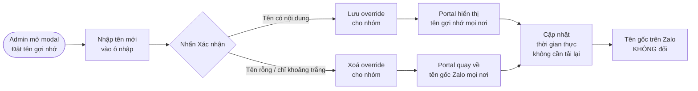

# #26 — Đặt tên hiển thị nhóm chat

> **Trạng thái:** draft
> **Nguồn:** [`../scope-and-features.md § C`](../scope-and-features.md) (mục #26, canonical) · [`../FSD-Admin-Site.md § 3.3`](../FSD-Admin-Site.md) (modal "Đặt tên gợi nhớ" — FR-NHOM.10→13) · [`../FSD-Chat-Portal.md § 4.4`](../FSD-Chat-Portal.md) (Portal hiển thị — FR-26.1→5)
> **Liên quan:** [`#2 Đồng bộ nhóm chat vendor`](02-dong-bo-nhom-chat-vendor.md) · [`#11 Forward tin nhắn đến Admin`](11-forward-tin-nhan-den-admin.md) · [`#25 Đánh dấu tin nhắn`](25-danh-dau-tin-nhan.md)

---

## 📌 Tóm tắt 1 dòng

Quản trị viên đặt một **tên hiển thị nội bộ** dễ nhớ cho nhóm NCC trong Portal, đè lên tên gốc lộn xộn từ Zalo — tên gốc trên Zalo vẫn giữ nguyên, không bị đồng bộ ngược.

---

## 🎯 Giá trị nghiệp vụ

Tên nhóm gốc trên Zalo thường do phía vendor (NCC) tự đặt, nên hay lộn xộn, viết tắt khó hiểu, hoặc không nhất quán giữa các nhóm. Khi công ty quản lý hàng chục nhóm NCC trong Portal, việc nhìn vào danh sách mà không biết nhóm nào là nhóm nào làm chậm thao tác và dễ nhầm lẫn.

Tính năng này cho phép Quản trị viên đặt một **tên gợi nhớ** cho từng nhóm — ví dụ đổi "Nhom 3 - PN ship" thành "NCC Vận Chuyển Phương Nam". Tên này chỉ là một lớp **đè (override)** hiển thị trong nội bộ Portal: tên gốc trên Zalo hoàn toàn không thay đổi, vendor và các thành viên Zalo khác trong nhóm vẫn thấy tên cũ. Khi xoá tên gợi nhớ, hệ thống tự quay về dùng tên gốc Zalo.

Tên gợi nhớ được áp dụng nhất quán ở mọi nơi hiển thị tên nhóm trên Chat Portal (sidebar, header cửa sổ chat, preview reply, thanh tóm tắt tin đã forward, danh sách tin đã đánh dấu) và cập nhật ngay lập tức khi Quản trị viên đổi.

**Lợi ích:**

- Nhận diện nhóm nhanh hơn — giảm nhầm lẫn khi vận hành nhiều nhóm NCC.
- Không rủi ro ảnh hưởng phía vendor: tên Zalo gốc không bị động chạm.
- Thay đổi áp dụng tức thì, đồng nhất ở mọi màn hình, không cần tải lại trang.

---

## 👥 Vai trò liên quan

| Vai trò | Trách nhiệm |
| --- | --- |
| **Quản trị (Admin)** | Người **duy nhất** được đặt / sửa / xoá tên hiển thị nhóm. Thao tác được từ Admin Site (modal "Đặt tên gợi nhớ") hoặc trực tiếp trong Chat Portal (header cửa sổ chat / tab thông tin). |
| **Nhân viên (Staff)** | Chỉ **xem** tên hiển thị (tên gợi nhớ nếu có, nếu không thì tên gốc Zalo). Không có quyền đổi tên. Trên Chat Portal, Nhân viên không bao giờ nhìn thấy tên gốc Zalo. |
| **Hệ thống** | Lưu tên gợi nhớ dưới dạng override theo từng nhóm · Quay về tên gốc Zalo khi override rỗng hoặc bị xoá · Cập nhật mọi vị trí hiển thị trên Portal theo thời gian thực · Không đồng bộ thay đổi này ngược lên Zalo. |

---

## 🔄 Dòng chảy nghiệp vụ



---

## ✅ Kịch bản chấp nhận

```gherkin
# language: vi
Tính năng: Đặt tên hiển thị nội bộ cho nhóm NCC

  Bối cảnh:
    Biết nhóm có tên gốc Zalo là "Nhom 3 - PN ship"
    Và Quản trị viên đã đăng nhập Portal

  # =====================================================
  # Đặt tên gợi nhớ
  # =====================================================

  Tình huống: Admin mở modal đặt tên gợi nhớ từ Admin Site
    Biết Admin đang ở trang Quản lý nhóm NCC trên Admin Site
    Khi Admin nhấn nút bút chì (✎) ở cột Thao tác của dòng nhóm
    Thì modal "Đặt tên gợi nhớ" mở ra
    Và modal hiển thị dòng gợi ý nêu tên gốc Zalo của nhóm
    Và có banner cảnh báo vàng "Tên gợi nhớ chỉ hiển thị trong chat portal, không đồng bộ lên Zalo"
    Và ô nhập được điền sẵn tên hiển thị hiện tại của nhóm

  Tình huống: Admin đặt tên gợi nhớ mới cho nhóm chưa có override
    Biết nhóm chưa có tên gợi nhớ nào
    Khi Admin nhập "NCC Vận Chuyển Phương Nam" và nhấn "Xác nhận"
    Thì modal đóng lại
    Và tên hiển thị của nhóm đổi thành "NCC Vận Chuyển Phương Nam"
    Và tên gốc Zalo "Nhom 3 - PN ship" không thay đổi

  Tình huống: Tên gốc trên Zalo không bị thay đổi sau khi đặt tên gợi nhớ
    Khi Admin đặt tên gợi nhớ "NCC Vận Chuyển Phương Nam"
    Thì vendor và các thành viên Zalo khác trong nhóm vẫn thấy tên gốc "Nhom 3 - PN ship" trên Zalo
    Và thay đổi này không được gửi ngược lên Zalo

  Tình huống: Admin sửa tên gợi nhớ đã có sang tên khác
    Biết nhóm đang có tên gợi nhớ "NCC Phương Nam"
    Khi Admin sửa thành "NCC Vận Chuyển Phương Nam" và nhấn "Xác nhận"
    Thì tên hiển thị đổi sang "NCC Vận Chuyển Phương Nam"
    Và tên gợi nhớ cũ bị ghi đè, không lưu lịch sử tên cũ

  # =====================================================
  # Hiển thị & ưu tiên tên
  # =====================================================

  Tình huống: Portal ưu tiên tên gợi nhớ ở mọi vị trí hiển thị tên nhóm
    Biết nhóm đang có tên gợi nhớ "NCC Vận Chuyển Phương Nam"
    Khi Nhân viên mở Chat Portal
    Thì tên gợi nhớ hiển thị ở sidebar danh sách hội thoại NCC
    Và ở header cửa sổ chat
    Và ở preview khi trích dẫn (reply) tin của nhóm
    Và ở thanh tóm tắt của tin đã forward sang DM Admin
    Và ở danh sách "Tin đã đánh dấu"

  Tình huống: Nhân viên không bao giờ thấy tên gốc Zalo trên Chat Portal
    Biết nhóm đang có tên gợi nhớ
    Khi Nhân viên xem nhóm ở bất kỳ vị trí nào trên Chat Portal
    Thì chỉ tên gợi nhớ được hiển thị
    Nhưng tên gốc Zalo không xuất hiện ở bất kỳ đâu trên Chat Portal

  Tình huống: Đổi tên gợi nhớ cập nhật mọi vị trí ngay lập tức
    Biết Nhân viên đang mở Chat Portal và thấy nhóm với tên hiển thị cũ
    Khi Admin đổi tên gợi nhớ của nhóm
    Thì trong vài giây mọi vị trí hiển thị tên nhóm trên Portal đổi sang tên mới
    Và Nhân viên không cần tải lại trang

  # =====================================================
  # Quyền đặt tên
  # =====================================================

  Tình huống: Chỉ Admin được thấy và dùng tính năng đổi tên trong Chat Portal
    Biết nhóm đang mở trong cửa sổ chat
    Khi Admin xem header cửa sổ chat
    Thì Admin thấy có thể click vào tên nhóm để chỉnh sửa
    Nhưng Nhân viên xem cùng header không thấy tuỳ chọn chỉnh sửa này

  # =====================================================
  # Validation tên
  # =====================================================

  Tình huống: Hệ thống cắt bỏ khoảng trắng thừa ở đầu/cuối khi lưu
    Khi Admin nhập "  NCC Phương Nam  " và nhấn "Xác nhận"
    Thì tên hiển thị được lưu là "NCC Phương Nam"

  Khung tình huống: Hệ thống chặn tên không hợp lệ
    Khi Admin nhập tên "<truong_hop>"
    Thì hệ thống không cho lưu tên đó

    Dữ liệu:
      | truong_hop                                   |
      | tên dài hơn 100 ký tự                        |
      | tên chứa ký tự điều khiển (control character) |

  # =====================================================
  # Xoá override — về tên gốc
  # =====================================================

  Tình huống: Admin xoá tên gợi nhớ để quay về tên gốc Zalo
    Biết nhóm đang có tên gợi nhớ "NCC Vận Chuyển Phương Nam"
    Khi Admin xoá sạch nội dung ô nhập và nhấn "Xác nhận"
    Thì tên gợi nhớ bị xoá
    Và tên hiển thị của nhóm quay về tên gốc Zalo "Nhom 3 - PN ship" ở mọi vị trí trên Portal

  Tình huống: Tên chỉ chứa khoảng trắng được coi như xoá override
    Biết nhóm đang có tên gợi nhớ "NCC Phương Nam"
    Khi Admin nhập một chuỗi chỉ gồm khoảng trắng và nhấn "Xác nhận"
    Thì hệ thống coi như tên rỗng và xoá override
    Và tên hiển thị quay về tên gốc Zalo

  # =====================================================
  # Trường hợp đặc biệt
  # =====================================================

  Tình huống: Nhóm chưa đặt tên gợi nhớ hiển thị tên gốc Zalo
    Biết nhóm chưa có tên gợi nhớ nào
    Khi Nhân viên hoặc Admin xem nhóm trên Portal
    Thì tên hiển thị chính là tên gốc Zalo "Nhom 3 - PN ship"

  Tình huống: Đặt tên trùng với một nhóm khác vẫn được chấp nhận
    Biết đã có nhóm khác mang tên gợi nhớ "NCC Phương Nam"
    Khi Admin đặt tên gợi nhớ "NCC Phương Nam" cho nhóm hiện tại
    Thì hệ thống chấp nhận, không báo trùng
    Và cả hai nhóm cùng hiển thị tên "NCC Phương Nam"

  Tình huống: Tin đã forward trước khi đổi tên hiển thị theo tên hiện tại
    Biết một tin của nhóm đã được forward sang DM Admin trước khi nhóm được đổi tên
    Khi Admin đổi tên gợi nhớ của nhóm
    Thì thanh tóm tắt nguồn của tin đã forward hiển thị tên mới (tên hiện tại)
    Nhưng không giữ lại tên cũ tại thời điểm forward

  Tình huống: Tìm kiếm nhóm trên sidebar chỉ khớp theo tên hiển thị
    Biết nhóm có tên gốc Zalo "Nhom 3 - PN ship" và tên gợi nhớ "NCC Vận Chuyển Phương Nam"
    Khi Nhân viên gõ "PN ship" vào ô tìm nhóm trên sidebar
    Thì nhóm không xuất hiện trong kết quả
    Nhưng khi gõ "Phương Nam" thì nhóm xuất hiện
```

---

## 🎨 Mô tả giao diện

Tính năng có 2 surface: **Admin Site** (modal đặt tên đầy đủ) và **Chat Portal** (hiển thị tên + điểm sửa nhanh inline cho Admin).

### Modal "Đặt tên gợi nhớ" (Admin Site)

```
┌──────────────────────────────────────────────┐
│ Đặt tên gợi nhớ                          [×]  │
│ Hãy đặt cho NCC - [Tên gốc Zalo] một          │
│ cái tên dễ nhớ.                                │
│                                                │
│ ⚠ Lưu ý: Tên gợi nhớ chỉ hiển thị trong       │
│   chat portal, không đồng bộ lên Zalo.        │
│                                                │
│ ┌──────────────────────────────────────────┐ │
│ │ NCC Vận Chuyển Phương Nam                 │ │  ← pre-filled
│ └──────────────────────────────────────────┘ │
│                                                │
│                      [ Huỷ ]   [ Xác nhận ]   │
└──────────────────────────────────────────────┘
```

| Thành phần | Mô tả |
| --- | --- |
| **Tiêu đề** | "Đặt tên gợi nhớ" |
| **Dòng gợi ý (subtitle)** | "Hãy đặt cho NCC - [Tên gốc Zalo] một cái tên dễ nhớ." — nêu rõ tên gốc Zalo để Admin biết đang đặt cho nhóm nào |
| **Banner cảnh báo** | Nền vàng, icon ⚠: "Tên gợi nhớ chỉ hiển thị trong chat portal, không đồng bộ lên Zalo." |
| **Ô nhập** | Điền sẵn tên hiển thị hiện tại (tên gợi nhớ nếu đã có, nếu chưa thì tên gốc Zalo). Cho phép xoá trắng để quay về tên gốc. |
| **Footer** | Nút **Huỷ** + nút **Xác nhận** (màu xanh) |

### Điểm mở modal trên Admin Site

| Vị trí | Mô tả |
| --- | --- |
| Cột "Thao tác" trên bảng Quản lý nhóm NCC | Nút bút chì (✎) ở mỗi dòng nhóm — click để mở modal |

> Lưu ý: trên **bảng Admin Site**, vẫn có cột riêng hiển thị **Tên gốc Zalo** (để Admin đối chiếu). Đây là khác biệt có chủ ý với Chat Portal — nơi tên gốc Zalo không bao giờ lộ.

### Hiển thị tên trên Chat Portal

Tên hiển thị (gợi nhớ nếu có, nếu không thì tên gốc Zalo) áp dụng ở **mọi** vị trí có tên nhóm:

| Vị trí | Ghi chú |
| --- | --- |
| Sidebar tab NCC | Mỗi item nhóm trong danh sách hội thoại |
| Header cửa sổ chat | Tên ở đầu khung chat |
| Preview reply / trích dẫn | Khi tham chiếu tin của nhóm |
| Thanh tóm tắt tin đã forward | "Nguồn nhóm" trong DM Admin (#11) |
| Danh sách "Tin đã đánh dấu" | Cột nhóm (#25) |
| Mention picker | Khi cần show ngữ cảnh nhóm (hiếm) |

### Điểm sửa nhanh trên Chat Portal (chỉ Admin)

| Vị trí | Mô tả |
| --- | --- |
| Header cửa sổ chat | Admin click trực tiếp vào tên để sửa (Nhân viên không thấy tuỳ chọn này) |
| Tab thông tin (panel phải) | Trường tên trong panel thông tin nhóm |

### Mockup tham chiếu

> ✅ **Đã có:**
> - Modal "Đặt tên gợi nhớ" trên Admin Site (subtitle nêu tên gốc Zalo, banner cảnh báo vàng, ô nhập điền sẵn, 2 nút footer Huỷ / Xác nhận).
>
> ⏳ **Cần BA bổ sung:**
> - Sidebar item + header chat hiển thị tên gợi nhớ (so sánh trước/sau khi đổi tên).
> - Header chat hiển thị nút sửa nhỏ (chỉ Admin thấy) và trạng thái edit inline.
> - Tab thông tin (panel phải) với trường tên + điểm sửa nhanh.
> - Thông báo lỗi khi nhập tên > 100 ký tự hoặc chứa ký tự điều khiển.

---

## 🔗 Tham chiếu & Q&A

### Liên quan các phần khác

- [`#2 Đồng bộ nhóm chat vendor`](02-dong-bo-nhom-chat-vendor.md): nguồn của tên gốc Zalo được đồng bộ về.
- [`#11 Forward tin nhắn đến Admin`](11-forward-tin-nhan-den-admin.md): thanh tóm tắt nguồn nhóm dùng tên hiển thị hiện tại.
- [`#25 Đánh dấu tin nhắn`](25-danh-dau-tin-nhan.md): cột nhóm trong danh sách "Tin đã đánh dấu" dùng tên hiển thị.
- Bảng Quản lý nhóm NCC (Admin Site): điểm mở modal đổi tên — [`../FSD-Admin-Site.md § 3.3`](../FSD-Admin-Site.md).

### ⚠️ Q&A cần BA / PO làm rõ

1. **Đổi tên trực tiếp trong Chat Portal được spec tới mức nào?**
   - Bối cảnh: [`../FSD-Chat-Portal.md § 4.4 FR-26.5`](../FSD-Chat-Portal.md) nói Admin có thể đặt/sửa tên qua **3 vị trí**: Admin Site, header cửa sổ chat (click trực tiếp), và tab thông tin panel phải. Trong khi đó [`../FSD-Admin-Site.md § 3.3`](../FSD-Admin-Site.md) và [`../scope-and-features.md`](../scope-and-features.md) chỉ mô tả chi tiết **modal "Đặt tên gợi nhớ" trên Admin Site** (FR-NHOM.10→13: subtitle, banner cảnh báo, validation 100 ký tự...).
   - Vấn đề: chưa rõ điểm sửa inline trên Chat Portal (header / tab thông tin) có dùng **cùng modal** "Đặt tên gợi nhớ" (kèm banner cảnh báo + validation giống hệt) hay là một ô edit inline rút gọn riêng.
     - Phương án A: tái sử dụng đúng modal "Đặt tên gợi nhớ" cho cả 3 điểm vào.
     - Phương án B: header/tab thông tin dùng edit inline rút gọn (không banner, vẫn áp validation 100 ký tự + xoá trắng = clear).
   - **Pilot hiện đang theo:** chưa quyết. Mockup hiện chỉ có modal Admin Site; điểm sửa inline trên Chat Portal chưa có mockup. Cần BA/PO xác nhận và bổ sung mockup.

2. **Khi tên gốc Zalo đổi sau khi nhóm đã được đặt tên gợi nhớ — override có giữ nguyên không?**
   - Bối cảnh: không nguồn nào ([`scope-and-features.md`](../scope-and-features.md), [`FSD-Admin-Site.md § 3.3`](../FSD-Admin-Site.md), [`FSD-Chat-Portal.md § 4.4`](../FSD-Chat-Portal.md)) mô tả tình huống vendor đổi tên nhóm trên Zalo **sau khi** Admin đã đặt tên gợi nhớ.
   - Vấn đề: nếu tên gốc Zalo thay đổi qua đồng bộ (#2), override có bị ảnh hưởng không?
     - Phương án A: override **độc lập** — vẫn giữ nguyên tên gợi nhớ; chỉ tên gốc Zalo (hiển thị trong cột "Tên gốc Zalo" ở Admin Site) cập nhật theo Zalo. Nhân viên trên Chat Portal không nhận ra gì.
     - Phương án B: hệ thống cảnh báo Admin rằng tên gốc đã đổi, gợi ý xem lại tên gợi nhớ.
   - **Pilot hiện đang theo:** suy đoán Phương án A (override là lớp đè độc lập, theo tinh thần FR-26.1 / FR-NHOM.11) — nhưng **chưa được spec rõ ràng**. Cần BA/PO xác nhận.

3. **Quyền đặt tên: đã rõ là "Chỉ Admin".**
   - [`../FSD-Chat-Portal.md § 4.4 FR-26.5`](../FSD-Chat-Portal.md) ghi rõ **chỉ Admin** được thay đổi tên hiển thị; Nhân viên chỉ xem. Đây **không** phải điểm mơ hồ. Ghi lại ở đây để khẳng định: nếu BA/PO muốn cho Staff (vai trò khác Admin) cũng được đặt tên thì cần nêu lại — pilot mặc định **chỉ Admin**.
