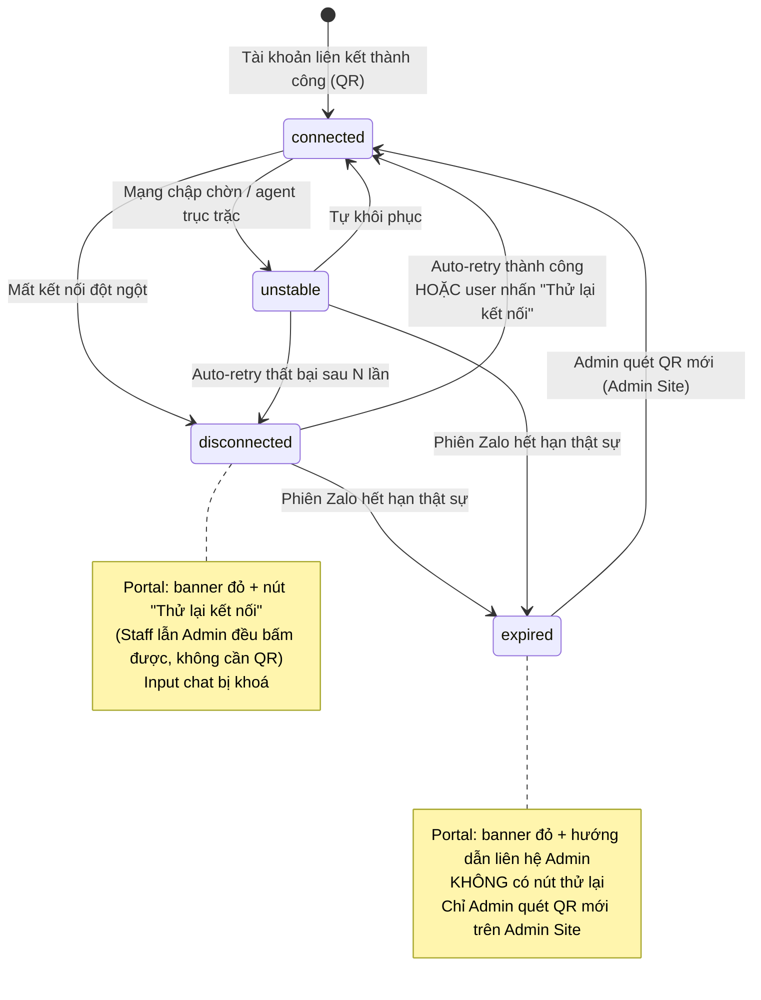

# #27 — Kết nối lại & Thử lại kết nối

> **Trạng thái:** draft
> **Nguồn:** [`../scope-and-features.md § A.27`](../scope-and-features.md) (canonical) · [`../FSD-Chat-Portal.md § 2.1, § 2.2`](../FSD-Chat-Portal.md) · [`../FSD-Admin-Site.md § 2.2 (D)`](../FSD-Admin-Site.md)
> **Liên quan:** [`#1 / #20 — Liên kết tài khoản Zalo (QR)`](01-ket-noi-tai-khoan-zalo.md) · ZaloIdentityBar (banner đại diện tài khoản, [`../FSD-Chat-Portal.md § 5.2`](../FSD-Chat-Portal.md))

---

## 📌 Tóm tắt 1 dòng

Hệ thống tự động kết nối lại tài khoản Zalo khi bị gián đoạn; nếu thất bại, cả Nhân viên và Quản trị có nút **"Thử lại kết nối"** ngay trên Chat Portal (không cần QR), và chỉ khi phiên Zalo thực sự hết hạn thì Quản trị mới quét QR mới trên Admin Site để khôi phục.

---

## 🎯 Giá trị nghiệp vụ

Mỗi tài khoản Zalo đại diện được duy trì bởi một phiên đăng nhập nền trên `chat.zalo.me`. Phiên này có thể rớt vì nhiều lý do tạm thời: mạng chập chờn, máy chủ agent khởi động lại, hoặc Zalo tạm thời giới hạn. Nếu mỗi lần rớt đều bắt buộc phải có người quét lại QR, vận hành sẽ gián đoạn liên tục — Nhân viên không gửi được tin cho NCC, ảnh hưởng trực tiếp tới công việc.

Tính năng này tách bạch rõ **trục trặc tạm thời** (tự khôi phục được, hoặc bấm một nút là xong) khỏi **hết hạn phiên thật sự** (bắt buộc xác thực lại bằng QR). Phần lớn sự cố được hệ thống tự xử lý ngầm; khi cần con người can thiệp, ai cũng bấm được nút "Thử lại kết nối" mà không phụ thuộc Quản trị. Chỉ trường hợp hết hạn thật mới cần Quản trị quét QR mới — đúng người, đúng việc.

**Lợi ích:**

- Giảm tối đa thời gian gián đoạn nhắn tin với NCC.
- Nhân viên tự khắc phục được phần lớn sự cố, không phải chờ Quản trị.
- Phân biệt rõ "trục trặc tạm thời" và "hết hạn thật" để biết khi nào mới cần Quản trị quét QR.
- Tin nhắn bị bỏ lỡ trong lúc mất kết nối được hệ thống tự kéo bù khi khôi phục.

---

## 👥 Vai trò liên quan

| Vai trò | Trách nhiệm |
| --- | --- |
| **Nhân viên (Staff)** | Trên Chat Portal: thấy banner trạng thái kết nối của nhóm đang mở; nhấn **"Thử lại kết nối"** khi mất kết nối. Không có quyền quét QR. |
| **Quản trị (Admin)** | Trên Chat Portal: giống Nhân viên. Trên Admin Site: xem badge trạng thái từng tài khoản Zalo; nhấn **"Kết nối lại"** (quét QR mới) khi tài khoản hết hạn / mất kết nối. |
| **Hệ thống** | Chạy auto-retry nền · chuyển trạng thái tài khoản (`connected` / `unstable` / `disconnected` / `expired`) · cập nhật banner Portal + badge Admin Site theo thời gian thực · kéo bù tin nhắn bị bỏ lỡ khi khôi phục. |
| **Vendor (NCC)** | Không liên quan — chỉ tương tác qua Zalo, không truy cập Portal. |

---

## 🔄 Dòng chảy nghiệp vụ

Mỗi tài khoản Zalo đại diện luôn ở một trong 4 trạng thái sau (do hệ thống tự xác định). Tên hiển thị: `connected` = đã kết nối, `unstable` = không ổn định, `disconnected` = mất kết nối, `expired` = hết hạn phiên.



---

## ✅ Kịch bản chấp nhận

```gherkin
# language: vi
Tính năng: Kết nối lại tự động và thử lại kết nối thủ công cho tài khoản Zalo đại diện

  Bối cảnh:
    Biết mỗi tài khoản Zalo đại diện luôn ở một trong các trạng thái: connected, unstable, disconnected, expired
    Và banner kết nối hiển thị ở đầu cửa sổ chat của vendor group đang mở

  # =====================================================
  # Banner trạng thái trên Chat Portal
  # =====================================================

  Khung tình huống: Banner và hành vi ô nhập tin theo từng trạng thái kết nối
    Biết tài khoản đại diện cho nhóm đang mở có trạng thái "<trang_thai>"
    Khi Nhân viên mở cửa sổ chat của nhóm đó
    Thì banner hiển thị "<banner>"
    Và ô nhập tin ở trạng thái "<input>"

    Dữ liệu:
      | trang_thai   | banner                                                                       | input        |
      | connected    | không hiển thị banner                                                        | cho gửi tin  |
      | unstable     | banner vàng "Kết nối Zalo không ổn định, tin nhắn có thể bị chậm"             | cho gửi tin  |
      | disconnected | banner đỏ "Mất kết nối Zalo" kèm nút "Thử lại kết nối"                        | bị khoá      |
      | expired      | banner đỏ "Phiên Zalo đã hết hạn. Vui lòng liên hệ Admin để quét QR mới"     | bị khoá      |

  Tình huống: Banner cập nhật theo thời gian thực, không cần tải lại trang
    Biết Nhân viên đang mở một nhóm với banner đỏ "Mất kết nối Zalo"
    Khi hệ thống chuyển trạng thái tài khoản về connected
    Thì banner tự ẩn
    Và ô nhập tin được bật lại
    Và không hiển thị thông báo "đã khôi phục" nào

  Tình huống: Sidebar đánh dấu nhóm có tài khoản đại diện đang gặp sự cố
    Biết một nhóm trong sidebar NCC có tài khoản đại diện ở trạng thái disconnected hoặc expired
    Khi Nhân viên xem danh sách hội thoại NCC
    Thì cạnh tên nhóm đó hiển thị một icon cảnh báo nhỏ

  Tình huống: Giữ nguyên nội dung đang soạn khi mất kết nối
    Biết Nhân viên đang soạn dở một tin nhưng chưa gửi
    Khi tài khoản đại diện chuyển sang disconnected
    Thì nội dung đang soạn được giữ nguyên trong ô nhập tin
    Và Nhân viên có thể gửi tiếp sau khi kết nối được khôi phục

  # =====================================================
  # Thử lại kết nối thủ công (Staff & Admin)
  # =====================================================

  Tình huống: Nút "Thử lại kết nối" hiển thị cho cả Nhân viên và Quản trị
    Biết tài khoản đại diện đang ở trạng thái disconnected
    Thì nút "Thử lại kết nối" hiển thị trong banner cho cả vai trò Nhân viên và Quản trị
    Và việc hiển thị nút không phân biệt theo vai trò

  Tình huống: Nhấn "Thử lại kết nối" chuyển nút sang trạng thái đang xử lý
    Biết banner đỏ "Mất kết nối Zalo" đang hiển thị
    Khi người dùng nhấn "Thử lại kết nối"
    Thì nút chuyển sang trạng thái loading với icon spinner và chữ "Đang thử…"
    Và nút bị vô hiệu hoá trong khi đang xử lý để tránh bấm liên tục

  Tình huống: Thử lại thành công thì khôi phục và kéo bù tin nhắn bị bỏ lỡ
    Biết người dùng vừa nhấn "Thử lại kết nối"
    Khi hệ thống kết nối lại thành công
    Thì trạng thái tài khoản về connected
    Và banner tự ẩn, ô nhập tin được bật lại
    Và các tin nhắn bị bỏ lỡ trong thời gian mất kết nối được kéo bù về nhóm
    Và không hiển thị toast "đã kết nối lại"

  Tình huống: Thử lại thất bại thì báo rõ và cho bấm lại sau khoảng chờ
    Biết người dùng vừa nhấn "Thử lại kết nối"
    Khi hệ thống vẫn không kết nối được
    Thì banner cập nhật nội dung "Vẫn chưa kết nối được. Hệ thống đang tiếp tục thử lại tự động."
    Và nút "Thử lại kết nối" được bật lại sau khoảng chờ để người dùng có thể bấm lại

  Tình huống: Bấm nút liên tục bị chặn bởi khoảng chờ
    Biết người dùng vừa nhấn "Thử lại kết nối" và nút đang trong khoảng chờ
    Khi người dùng cố nhấn nút lần nữa
    Thì thao tác không có hiệu lực
    Và hiển thị tooltip "Vui lòng chờ trước khi thử lại"

  Tình huống: Auto-retry vẫn chạy nền song song với thử lại thủ công
    Biết tài khoản đang ở trạng thái disconnected
    Thì hệ thống vẫn tự động thử kết nối lại theo định kỳ ở nền
    Và nút "Thử lại kết nối" chỉ là cách để người dùng kích hoạt thử lại ngay, không thay thế auto-retry

  Tình huống: Tiếp tục thử lại ở nền khi người dùng chuyển sang nhóm khác
    Biết người dùng vừa nhấn "Thử lại kết nối" cho một nhóm
    Khi người dùng chuyển sang xem một vendor group khác trước khi có kết quả
    Thì tiến trình thử lại của tài khoản vẫn chạy nền
    Và khi quay lại nhóm cũ, người dùng thấy kết quả mới nhất

  # =====================================================
  # Hết hạn phiên — chỉ Admin quét QR
  # =====================================================

  Tình huống: Trạng thái expired không có nút thử lại
    Biết tài khoản đại diện ở trạng thái expired
    Khi người dùng mở cửa sổ chat của nhóm đó
    Thì banner KHÔNG hiển thị nút "Thử lại kết nối"
    Và banner hiển thị hướng dẫn "Liên hệ Admin để quét QR mới"

  Tình huống: Nút thử lại không yêu cầu quét QR
    Biết tài khoản đại diện ở trạng thái disconnected
    Khi người dùng nhấn "Thử lại kết nối"
    Thì hệ thống thử kết nối lại mà không yêu cầu quét QR

  Tình huống: Banner đổi từ mất kết nối sang hết hạn ngay khi người dùng đang xem
    Biết người dùng đang xem nhóm với banner đỏ "Mất kết nối Zalo" kèm nút thử lại
    Khi hệ thống chuyển trạng thái tài khoản sang expired
    Thì banner đổi sang "Phiên Zalo đã hết hạn. Vui lòng liên hệ Admin để quét QR mới"
    Và nút "Thử lại kết nối" biến mất

  Tình huống: Nhân viên thử lại nhưng kết quả là hết hạn phiên
    Biết Nhân viên nhấn "Thử lại kết nối" cho một tài khoản disconnected
    Khi hệ thống xác định phiên Zalo đã thật sự hết hạn
    Thì banner đổi sang trạng thái expired với nội dung cần Admin quét QR mới
    Và Nhân viên không có thao tác nào khác để tự xử lý

  # =====================================================
  # Trường hợp nhiều tài khoản đại diện một nhóm (multi-account)
  # =====================================================

  Tình huống: Banner chỉ phản ánh tài khoản đang đại diện cho người dùng hiện tại
    Biết một nhóm có từ 2 tài khoản Zalo trở lên đang đồng bộ
    Và chỉ tài khoản đang đại diện cho người dùng hiện tại bị disconnected
    Khi người dùng mở nhóm đó
    Thì banner hiển thị sự cố của tài khoản đang đại diện cho mình
    Và chỉ hiển thị một banner duy nhất, không gộp banner của các tài khoản khác

  Tình huống: Thử lại chỉ tác động đúng tài khoản đang đại diện
    Biết một nhóm có nhiều tài khoản đại diện và tài khoản đang active cho người dùng bị disconnected
    Khi người dùng nhấn "Thử lại kết nối"
    Thì hệ thống chỉ thử lại tài khoản đang đại diện cho nhóm hiện tại
    Và không thử lại các tài khoản khác trong nhóm

  # =====================================================
  # Quản lý tài khoản trên Admin Site
  # =====================================================

  Tình huống: Mỗi tài khoản hiển thị badge trạng thái kết nối
    Biết Admin đang ở trang "Nhà cung cấp" tab "Liên kết tài khoản"
    Thì mỗi tài khoản đã liên kết hiển thị badge trạng thái theo màu: connected = xanh, unstable = vàng, disconnected = đỏ, expired = đỏ kèm icon khoá

  Khung tình huống: Nút thao tác trên Admin Site thay đổi theo trạng thái tài khoản
    Biết một tài khoản Zalo có trạng thái "<trang_thai>"
    Thì row của tài khoản đó hiển thị nút "<nut>"

    Dữ liệu:
      | trang_thai   | nut           |
      | connected    | Ngắt kết nối  |
      | unstable     | Ngắt kết nối  |
      | disconnected | Kết nối lại   |
      | expired      | Kết nối lại   |

  Tình huống: Admin kết nối lại tài khoản hết hạn bằng QR
    Biết một tài khoản ở trạng thái expired
    Khi Admin nhấn "Kết nối lại" trên row đó
    Thì hệ thống mở modal quét QR đã điền sẵn thông tin tài khoản cũ
    Và sau khi quét QR thành công, trạng thái tài khoản về connected

  Tình huống: Admin ngắt kết nối tài khoản đang hoạt động phải xác nhận
    Biết một tài khoản ở trạng thái connected
    Khi Admin nhấn "Ngắt kết nối"
    Thì hệ thống hiển thị hộp thoại xác nhận cảnh báo rằng các nhóm đang sync qua tài khoản này sẽ tạm dừng cập nhật

  Tình huống: Ngắt kết nối tài khoản làm các nhóm liên quan hiện banner mất kết nối
    Biết một tài khoản đang đồng bộ nhiều vendor group
    Khi Admin ngắt kết nối tài khoản đó
    Thì các nhóm đang sync qua tài khoản này hiển thị banner "Mất kết nối Zalo" trên Chat Portal

  # =====================================================
  # Trường hợp đặc biệt
  # =====================================================

  Tình huống: Tài khoản hết hạn ngay khi modal QR đang mở
    Biết Admin đang mở modal quét QR để kết nối lại một tài khoản
    Khi phiên tài khoản hết hạn trong lúc modal đang mở
    Thì modal hiển thị thông báo lỗi nội tuyến
    Và vẫn cho phép Admin quét lại

  Tình huống: Mất kết nối với máy chủ Portal không phải sự cố Zalo
    Biết Chat Portal mất kết nối với máy chủ Portal (không phải mất kết nối Zalo)
    Khi sự cố xảy ra
    Thì hệ thống hiển thị một banner riêng "Mất kết nối với máy chủ" ở cấp toàn Portal
    Nhưng đây không thuộc phạm vi tính năng kết nối lại Zalo
```

---

## 🎨 Mô tả giao diện

### Banner kết nối trên Chat Portal

Banner nằm ở **đầu cửa sổ chat** của vendor group đang mở (dưới header nhóm, trên danh sách tin nhắn).

```
┌─────────────────────────────────────────────────────────────┐
│ [Header nhóm NCC]                                            │
├─────────────────────────────────────────────────────────────┤
│ 🔴 Mất kết nối Zalo            [ Thử lại kết nối ]           │  ← banner đỏ (disconnected)
├─────────────────────────────────────────────────────────────┤
│ [Danh sách tin nhắn]                                        │
│ ...                                                         │
├─────────────────────────────────────────────────────────────┤
│ [Ô nhập tin — bị khoá khi disconnected / expired]           │
└─────────────────────────────────────────────────────────────┘
```

### Banner theo trạng thái

| Trạng thái     | Banner trên Portal                                                       | Nút thử lại | Ô nhập tin     |
| -------------- | ------------------------------------------------------------------------ | :---------: | -------------- |
| `connected`    | Không hiển thị                                                            | —           | Cho gửi tin    |
| `unstable`     | Vàng — "Kết nối Zalo không ổn định, tin nhắn có thể bị chậm"              | —           | Cho gửi (chậm) |
| `disconnected` | Đỏ — "Mất kết nối Zalo"                                                   | ✅ Có       | Bị khoá        |
| `expired`      | Đỏ — "Phiên Zalo đã hết hạn. Vui lòng liên hệ Admin để quét QR mới"       | ❌ Không    | Bị khoá        |

> **Tích hợp với ZaloIdentityBar (banner đại diện tài khoản, [`../FSD-Chat-Portal.md § 5.2`](../FSD-Chat-Portal.md)):** trong vendor group, ZaloIdentityBar (luôn hiển thị "🟢 Đang đại diện tài khoản: …") **đảm nhiệm luôn** việc hiển thị trạng thái kết nối. Khi tài khoản đại diện gặp sự cố, banner đại diện đổi màu (vàng/đỏ) và chứa nút "Thử lại kết nối" — **không hiển thị 2 banner cùng lúc**.

### Nút "Thử lại kết nối" — các trạng thái

| Trạng thái nút | Hiển thị                                        |
| -------------- | ----------------------------------------------- |
| Bình thường    | Nút "Thử lại kết nối" trong banner đỏ           |
| Đang xử lý     | Icon spinner + chữ "Đang thử…" · nút disabled   |
| Trong khoảng chờ | Nút disabled · tooltip "Vui lòng chờ trước khi thử lại" |

### Admin Site — badge trạng thái & nút thao tác (tab "Liên kết tài khoản")

| Trạng thái     | Màu badge          | Nút thao tác trên row             |
| -------------- | ------------------ | --------------------------------- |
| `connected`    | Xanh               | **[Ngắt kết nối]** (kèm xác nhận) |
| `unstable`     | Vàng / hổ phách    | **[Ngắt kết nối]** (kèm xác nhận) |
| `disconnected` | Đỏ                 | **[Kết nối lại]** (mở modal QR pre-fill) |
| `expired`      | Đỏ + icon khoá     | **[Kết nối lại]** (mở modal QR pre-fill) |

### Mockup tham chiếu

> ⏳ **Cần BA bổ sung:**
> - Banner vàng `unstable` ở đầu cửa sổ chat.
> - Banner đỏ `disconnected` + nút "Thử lại kết nối" (trạng thái thường).
> - Nút "Thử lại kết nối" ở trạng thái loading.
> - Banner đỏ `expired` (không có nút thử) + hướng dẫn liên hệ Admin.
> - Sidebar item kèm icon cảnh báo cho nhóm có tài khoản đang lỗi.
> - Admin Site: badge 4 trạng thái + nút "Ngắt kết nối" / "Kết nối lại".
> - Admin Site: modal QR "Kết nối lại" với thông tin tài khoản pre-fill.

---

## 🔗 Tham chiếu & Q&A

### Liên quan các phần khác

- [`#1 / #20 — Liên kết tài khoản Zalo (QR)`](01-ket-noi-tai-khoan-zalo.md): luồng quét QR gốc; nút "Kết nối lại" của #27 dùng lại modal QR này (pre-fill tài khoản cũ). UI thao tác Admin Site nằm chung trên trang Nhà cung cấp → tab "Liên kết tài khoản".
- **ZaloIdentityBar** ([`../FSD-Chat-Portal.md § 5.2`](../FSD-Chat-Portal.md)): banner đại diện tài khoản tích hợp luôn trạng thái kết nối; nút "Thử lại kết nối" nằm trong banner này khi tài khoản active bị sự cố.
- **Đồng bộ tin nhắn** ([`03-dong-bo-tin-nhan-gan-thuc.md`](03-dong-bo-tin-nhan-gan-thuc.md), [`04-dong-bo-lich-su-chat.md`](04-dong-bo-lich-su-chat.md)): cơ chế kéo bù (gap-fill) tin nhắn bị bỏ lỡ khi khôi phục kết nối thuộc về phần đồng bộ.

### ⚠️ Q&A cần BA / PO làm rõ

1. **#27 trải trên 2 bề mặt UI — gộp 1 file có ổn không?**
   - Tính năng gồm phần **Chat Portal** (banner + nút "Thử lại kết nối") và phần **Admin Site** (badge trạng thái + "Kết nối lại" bằng QR). File này gộp cả hai.
   - Phần thao tác Admin Site về mặt vật lý nằm trên trang của [`#20`](01-ket-noi-tai-khoan-zalo.md) (tab "Liên kết tài khoản") — file #27 chỉ mô tả phần *liên quan kết nối lại*, không lặp lại toàn bộ trang liên kết tài khoản.
   - **Pilot hiện đang theo:** gộp 1 file như tài liệu này. Cần BA/PO xác nhận, hoặc yêu cầu tách `#27` (Portal) và đưa phần Admin về thẳng `#20`.

2. **Số lần auto-retry "N lần" trước khi chuyển sang `disconnected` là bao nhiêu?**
   - Nguồn chỉ ghi "thất bại sau N lần" — chưa có con số cụ thể.
   - **Pilot hiện đang theo:** để hệ thống cấu hình, không cố định trong FSD. Cần BA/PO xác nhận có cần con số rõ để hiển thị cho người dùng không (ví dụ "đã thử 3/5 lần").

3. **Khoảng chờ (cooldown) của nút "Thử lại kết nối" là bao lâu?**
   - `FSD-Chat-Portal.md FR-27.2` đề xuất **ít nhất 5 giây**.
   - **Pilot hiện đang theo:** 5 giây. Cần BA/PO xác nhận.

4. **Phân biệt `unstable` vs `disconnected` dựa trên tiêu chí nào?**
   - Cả hai đều là trục trặc tạm thời; `unstable` vẫn cho gửi tin (có thể chậm), `disconnected` thì khoá input. Ranh giới chuyển trạng thái do hệ thống quyết định.
   - **Pilot hiện đang theo:** ranh giới do backend xác định, không mô tả ngưỡng cụ thể trong FSD. Cần BA/PO xác nhận có cần định nghĩa rõ tiêu chí cho người dùng hiểu không.

5. **Icon cảnh báo trên sidebar — áp dụng cho cả `unstable` hay chỉ `disconnected` / `expired`?**
   - `FSD-Chat-Portal.md FR-A.4` chỉ nêu `disconnected` và `expired`.
   - **Pilot hiện đang theo:** chỉ hiện icon cảnh báo sidebar cho `disconnected` và `expired`; `unstable` không có icon sidebar. Cần BA/PO xác nhận.
