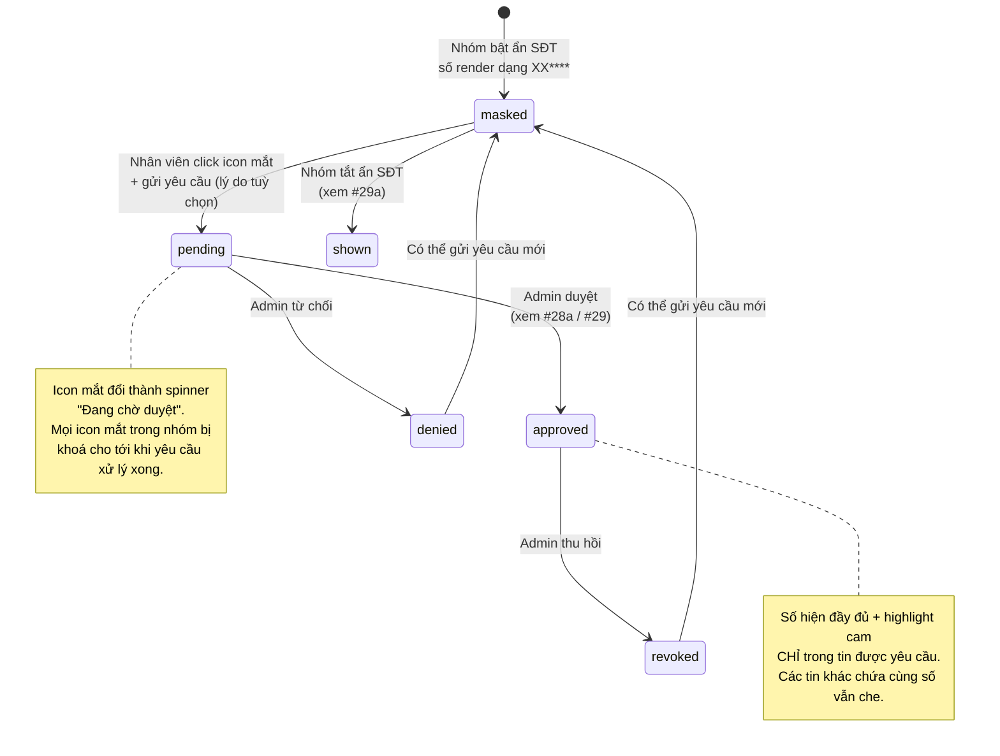

# #28 — Ẩn/hiện số điện thoại (phía Nhân viên)

> **Trạng thái:** draft
> **Nguồn:** [`../FSD-Chat-Portal.md § 4.5 (#28)`](../FSD-Chat-Portal.md) (chuẩn cho Staff side) · [`../scope-and-features.md § C.28 deep dive`](../scope-and-features.md) (canonical) · [`../FSD-Admin-Site.md § PRR`](../FSD-Admin-Site.md) (chỉ để đối chiếu conflict)
> **Liên quan:** [`#28a Admin duyệt yêu cầu xem SĐT ngay trong nhóm chat`](28a-admin-duyet-yeu-cau-tu-chat.md) · [`#29 Trang Yêu Cầu Xem SĐT (Admin Site)`](29-trang-yeu-cau-xem-sdt.md) · [`#29a Cấu hình bật/tắt ẩn SĐT`](29a-cau-hinh-an-sdt.md)

---

## 📌 Tóm tắt 1 dòng

Trong nhóm bật chế độ ẩn SĐT, Nhân viên thấy số điện thoại bị che (`XX****`) kèm icon mắt để gửi yêu cầu xem; khi Admin duyệt, số hiện đầy đủ với highlight cam ngay trong tin được yêu cầu — giúp bảo vệ dữ liệu khách hàng mà vẫn cho phép liên hệ khi cần.

---

## 🎯 Giá trị nghiệp vụ

Số điện thoại khách hàng trong các nhóm NCC là dữ liệu nhạy cảm. Nếu mọi Nhân viên đều thấy số tự do, rủi ro rò rỉ ra ngoài rất cao — nhất là với nhân viên không trực tiếp phụ trách nhóm hoặc đã rời công ty. Khi công ty bật chế độ ẩn SĐT cho một nhóm (xem [`#29a`](29a-cau-hinh-an-sdt.md)), Nhân viên chỉ thấy số dưới dạng che.

Tính năng này (phía Nhân viên) lo phần hiển thị và khởi tạo yêu cầu: che số trong nội dung tin, đặt icon mắt cạnh mỗi số bị che, mở popup để Nhân viên xin xem, và phản ánh trạng thái duyệt trực tiếp trên tin nhắn (đang chờ / được duyệt / bị từ chối / bị thu hồi). Nhân viên không phải rời màn hình chat hay học cách dùng Admin Site — toàn bộ thao tác xin xem nằm ngay trong cửa sổ chat của nhóm.

Việc duyệt là **per-message**: một yêu cầu gắn với đúng một tin nhắn cụ thể. Khi được duyệt, cả nhóm thấy số đầy đủ **chỉ trong tin đó** — các tin khác chứa cùng số vẫn che. Điều này giữ phạm vi mở khoá ở mức nhỏ nhất cần thiết, đúng với mục đích bảo vệ dữ liệu.

**Lợi ích:**

- Số khách hàng không bị lộ tự do cho toàn bộ Nhân viên.
- Nhân viên vẫn liên hệ được khách khi cần — chỉ cần một thao tác xin xem ngay trong chat.
- Phạm vi mở khoá hẹp (đúng 1 tin), giảm bề mặt rò rỉ; Admin có thể thu hồi bất kỳ lúc nào.

---

## 👥 Vai trò liên quan

| Vai trò | Trách nhiệm |
| --- | --- |
| **Nhân viên (Staff)** | Thấy số bị che `XX****` trong tin text của nhóm bật ẩn SĐT. Click icon mắt 👁 cạnh số → mở popup gửi yêu cầu xem (lý do tuỳ chọn). Theo dõi trạng thái ngay trên tin: đang chờ / được duyệt (số hiện + highlight cam) / bị từ chối (vẫn che) / bị thu hồi (che lại). Không có quyền duyệt. |
| **Quản trị (Admin)** | **Luôn thấy số thật** trong mọi tin của nhóm, kèm badge "Đang ẩn với nhóm" cạnh số để biết Nhân viên đang không thấy. Việc duyệt/từ chối/thu hồi thuộc ranh giới Admin side — chi tiết tại [`#28a`](28a-admin-duyet-yeu-cau-tu-chat.md) và [`#29`](29-trang-yeu-cau-xem-sdt.md), không mô tả lại ở file này. |
| **Vendor (phía Zalo)** | Không bị ảnh hưởng. Việc che số và các thông báo nội bộ liên quan không hiển thị sang Zalo. |
| **Hệ thống** | Phát hiện số điện thoại trong nội dung text và render dạng che cho Nhân viên · Đặt icon mắt cạnh mỗi số bị che · Phản ánh trạng thái yêu cầu lên tin nhắn theo thời gian thực · Phát thông báo nội bộ vào nhóm sau mỗi bước (yêu cầu / duyệt / từ chối / thu hồi). |

---

## 🔄 Dòng chảy nghiệp vụ

Trạng thái hiển thị của một số bị che, từ góc nhìn Nhân viên:



---

## ✅ Kịch bản chấp nhận

```gherkin
# language: vi
Tính năng: Nhân viên xem số điện thoại bị che và gửi yêu cầu xem trong nhóm chat

  Bối cảnh:
    Biết nhóm "NCC Vận Chuyển Phương Nam" đang ở trạng thái ẩn SĐT = ON
    Và Nhân viên "Lê Diễm Chi" đã đăng nhập Chat Portal
    Và Nhân viên đang mở cửa sổ chat của nhóm đó

  # =====================================================
  # Che số trong nội dung tin (FR-28.1, FR-28.2)
  # =====================================================

  Tình huống: Số điện thoại trong tin text hiển thị dạng che với Nhân viên
    Biết một tin trong nhóm chứa số "0935587965"
    Khi Nhân viên xem tin đó
    Thì số hiển thị dưới dạng "09****" (giữ 2 chữ số đầu, phần còn lại là 4 dấu sao)
    Và cạnh số có icon mắt 👁 có thể click

  Khung tình huống: Hệ thống nhận diện số điện thoại Việt Nam để che
    Biết một tin text chứa "<so>"
    Khi Nhân viên xem tin đó
    Thì "<so>" được render dạng che với 2 chữ số đầu giữ nguyên

    Dữ liệu:
      | so          |
      | 0935587965  |
      | 0856123456  |
      | 0708111222  |
      | 0512345678  |
      | 0387654321  |
      | 02838221234 |

  Tình huống: Hai số khác nhau trong cùng một tin được che độc lập
    Biết một tin chứa cả "0935587965" và "0708111222"
    Khi Nhân viên xem tin đó
    Thì mỗi số được che riêng và có icon mắt 👁 riêng
    Và mỗi số là một yêu cầu xem độc lập

  # =====================================================
  # Gửi yêu cầu xem số (FR-28.3, FR-28.4)
  # =====================================================

  Tình huống: Nhân viên mở popup yêu cầu xem khi click icon mắt
    Biết một số trong tin đang ở trạng thái che với icon mắt có thể click
    Khi Nhân viên click icon mắt 👁 cạnh số đó
    Thì hệ thống mở popup "Yêu cầu xem số điện thoại"
    Và popup hiển thị đoạn trích tin chứa số cùng số đã che
    Và popup có ô nhập lý do (tuỳ chọn) cùng 2 nút "Hủy" và "Gửi yêu cầu"

  Tình huống: Nhân viên đóng popup mà không gửi
    Biết popup "Yêu cầu xem số điện thoại" đang mở
    Khi Nhân viên nhấn "Hủy"
    Thì popup đóng lại
    Và số vẫn ở trạng thái che với icon mắt có thể click

  Tình huống: Nhân viên gửi yêu cầu xem số
    Biết popup "Yêu cầu xem số điện thoại" đang mở cho số "0935587965"
    Khi Nhân viên nhấn "Gửi yêu cầu"
    Thì yêu cầu được tạo ở trạng thái pending (đang chờ duyệt)
    Và icon mắt cạnh số đó đổi thành spinner "Đang chờ duyệt"
    Và một thông báo nội bộ xuất hiện trong nhóm ghi nhận "Lê Diễm Chi đã yêu cầu xem một số điện thoại trong tin từ [tên vendor]" mà không lộ số

  Tình huống: Yêu cầu không có thời gian chờ tự động
    Biết một yêu cầu đang ở trạng thái pending
    Khi chưa có Admin xử lý
    Thì icon mắt vẫn giữ spinner "Đang chờ duyệt" vô thời hạn
    Và yêu cầu không tự huỷ vì hết giờ

  # =====================================================
  # Chỉ 1 yêu cầu pending mỗi nhóm — khoá icon mắt
  # =====================================================

  Tình huống: Mọi icon mắt trong nhóm bị khoá khi đang có yêu cầu pending
    Biết Nhân viên "Lê Diễm Chi" vừa gửi yêu cầu xem số trong một tin và yêu cầu đang pending
    Khi Nhân viên "Tăng Thị Huyền" mở cùng nhóm đó
    Thì icon mắt cạnh mọi số bị che trong nhóm không còn click được
    Và "Tăng Thị Huyền" không thể gửi yêu cầu mới cho tới khi yêu cầu hiện tại được xử lý

  Tình huống: Icon mắt hoạt động lại sau khi yêu cầu hiện tại được xử lý
    Biết yêu cầu pending trong nhóm vừa được Admin từ chối
    Khi Nhân viên mở lại nhóm
    Thì icon mắt cạnh các số bị che đã click được trở lại
    Và Nhân viên có thể gửi yêu cầu mới

  # =====================================================
  # Trạng thái trên tin sau khi Admin xử lý (FR-28.5, FR-28.6, FR-28.7)
  # =====================================================

  Tình huống: Số hiện đầy đủ với highlight cam khi yêu cầu được duyệt — chỉ trong tin đó
    Biết yêu cầu xem số "0935587965" trong tin A đang pending
    Khi Admin duyệt yêu cầu đó
    Thì số "0935587965" hiển thị đầy đủ kèm highlight cam (nền cam nhạt) trong tin A cho mọi Nhân viên trong nhóm
    Và spinner "Đang chờ duyệt" biến mất khỏi số đó
    Và một thông báo nội bộ "Admin [tên] đã duyệt yêu cầu của Lê Diễm Chi lúc [HH:mm]" xuất hiện trong nhóm

  Tình huống: Số đã duyệt trong một tin không làm lộ cùng số ở tin khác
    Biết số "0935587965" xuất hiện ở cả tin A và tin B
    Và yêu cầu xem số đó trong tin A vừa được duyệt
    Khi Nhân viên xem tin B
    Thì số trong tin B vẫn ở trạng thái che "09****"

  Tình huống: Số vẫn bị che khi yêu cầu bị từ chối
    Biết yêu cầu xem số "0935587965" trong tin A đang pending
    Khi Admin từ chối yêu cầu đó
    Thì số trong tin A vẫn hiển thị dạng che "09****"
    Và icon mắt cạnh số trở lại trạng thái có thể click
    Và một thông báo nội bộ "Admin [tên] đã từ chối yêu cầu của Lê Diễm Chi" xuất hiện trong nhóm
    Và Nhân viên có thể gửi yêu cầu mới cho số đó

  Tình huống: Số bị che trở lại khi Admin thu hồi quyền đã duyệt
    Biết số "0935587965" trong tin A đang hiển thị đầy đủ do đã được duyệt
    Khi Admin thu hồi quyền xem số trong tin A
    Thì số trong tin A trở lại trạng thái che "09****" cho mọi Nhân viên trong nhóm
    Và highlight cam biến mất
    Và một thông báo nội bộ "Admin [tên] đã thu hồi quyền xem số điện thoại lúc [HH:mm]" xuất hiện trong nhóm

  # =====================================================
  # Số trong reply quote (FR-28.10)
  # =====================================================

  Tình huống: Số trong đoạn trích reply được che theo trạng thái hiện tại
    Biết tin A chứa số "0935587965" đang ở trạng thái che
    Và một tin mới reply trích lại tin A
    Khi Nhân viên xem tin reply
    Thì số trong đoạn trích cũng hiển thị dạng che "09****"

  # =====================================================
  # Thông báo nội bộ PHONE_REVEAL_* (FR-28.8, FR-28.9)
  # =====================================================

  Tình huống: Thông báo nội bộ về yêu cầu xem số không có thao tác và không sync Zalo
    Biết một thông báo nội bộ liên quan yêu cầu xem số vừa xuất hiện trong nhóm
    Khi Nhân viên rê chuột lên thông báo đó
    Thì không có menu thao tác (hover menu) nào hiện ra
    Và thông báo này không được gửi sang phía Zalo (Vendor không thấy)

  # =====================================================
  # Trường hợp đặc biệt
  # =====================================================

  Tình huống: Nhóm tắt ẩn SĐT thì mọi số hiện đầy đủ (FR-28.11)
    Biết nhóm đang có một yêu cầu pending và nhiều số đang bị che
    Khi Admin tắt cấu hình ẩn SĐT cho nhóm (xem #29a)
    Thì mọi số trong nhóm hiển thị đầy đủ cho mọi vai trò
    Và icon mắt cùng spinner "Đang chờ duyệt" biến mất khỏi các tin

  Tình huống: Số nằm trong ảnh hoặc tập tin không bị che
    Biết một số điện thoại xuất hiện bên trong ảnh đính kèm (không phải nội dung text)
    Khi Nhân viên xem tin có ảnh đó
    Thì số trong ảnh hiển thị nguyên trạng (hệ thống chỉ che số trong nội dung text)

  Tình huống: Người không có quyền truy cập nhóm không xem được tin
    Biết Nhân viên đã bị xoá khỏi nhóm sau khi từng được duyệt xem một số
    Khi Nhân viên cố mở nhóm đó
    Thì Nhân viên không truy cập được bất kỳ tin nào trong nhóm
    Và quyền xem số đã duyệt trước đó cũng không còn truy cập được

  Tình huống: Chuỗi ký tự không khớp định dạng số điện thoại thì không bị che
    Biết một tin chứa chuỗi "1234" không khớp định dạng số điện thoại Việt Nam
    Khi Nhân viên xem tin đó
    Thì chuỗi "1234" hiển thị nguyên trạng, không bị che và không có icon mắt
```

---

## 🎨 Mô tả giao diện

### Số bị che trong message list (góc nhìn Nhân viên)

Mỗi số điện thoại trong nội dung text được render thành một span riêng, giữ 2 chữ số đầu, phần còn lại là 4 dấu sao, kèm icon mắt 👁 nhỏ ngay sau số.

```
┌──────────────────────────────────────────────────────────┐
│ Vendor: Anh gọi giúp em số 09**** 👁 nhé, gấp lắm ạ      │
│                              ▲       ▲                     │
│                       số bị che   icon mắt (click để xin) │
└──────────────────────────────────────────────────────────┘
```

### Trạng thái của số trên tin (Nhân viên view)

| Trạng thái | Hiển thị số | Icon / phần phụ cạnh số |
| --- | --- | --- |
| **masked** (chưa xin) | `09****` | Icon mắt 👁 có thể click |
| **pending** (đang chờ) | `09****` | Spinner "Đang chờ duyệt" (icon mắt bị thay) |
| **approved** (được duyệt) | `0935587965` đầy đủ | Nền highlight cam nhạt; không còn icon mắt |
| **denied** (bị từ chối) | `09****` | Icon mắt 👁 trở lại trạng thái click được |
| **revoked** (bị thu hồi) | `09****` | Icon mắt 👁 trở lại trạng thái click được |
| Nhóm tắt ẩn SĐT | số đầy đủ | Không icon, không spinner |

> Lưu ý phạm vi: trạng thái approved chỉ áp dụng cho **đúng tin được yêu cầu**. Cùng một số ở tin khác vẫn hiển thị theo trạng thái riêng của tin đó (thường là `masked`).

### Khoá icon mắt khi đang có yêu cầu pending

Khi nhóm đang có một yêu cầu pending (bất kỳ ai gửi), icon mắt cạnh **mọi** số bị che trong nhóm chuyển sang trạng thái không click được (disabled) với mọi Nhân viên. Icon hoạt động lại sau khi yêu cầu đó được duyệt hoặc từ chối.

### Popup "Yêu cầu xem số điện thoại"

```
┌────────────────────────────────────────────┐
│  Yêu cầu xem số điện thoại                  │
│ ──────────────────────────────────────────  │
│  Tin chứa số:                               │
│  "...gọi giúp em số 09**** nhé, gấp lắm ạ"  │
│                                             │
│  Lý do (tuỳ chọn):                          │
│  ┌────────────────────────────────────────┐ │
│  │                                        │ │
│  └────────────────────────────────────────┘ │
│                                             │
│              [ Hủy ]   [ Gửi yêu cầu ]      │
└────────────────────────────────────────────┘
```

| Thành phần | Mô tả |
| --- | --- |
| **Tiêu đề** | "Yêu cầu xem số điện thoại" |
| **Đoạn trích tin** | Snippet tin chứa số, số vẫn hiển thị dạng che |
| **Ô lý do** | Textarea tuỳ chọn — không bắt buộc nhập |
| **Nút "Hủy"** | Đóng popup, không tạo yêu cầu |
| **Nút "Gửi yêu cầu"** | Tạo yêu cầu pending, icon mắt chuyển spinner, phát thông báo nội bộ vào nhóm |

### Thông báo nội bộ trong nhóm

Sau khi gửi yêu cầu và sau mỗi lần Admin xử lý, một thông báo nội bộ full-width xuất hiện trong dòng tin (style bar nhỏ màu xám/cam, icon khoá). Thông báo này là tin hệ thống — **không có menu hover, không có nút thao tác**, và không hiển thị sang Zalo. Nội dung từng loại:

| Sự kiện | Nội dung |
| --- | --- |
| Gửi yêu cầu | "[Tên Nhân viên] đã yêu cầu xem một số điện thoại trong tin từ [tên vendor]" — **không lộ số** |
| Được duyệt | "Admin [tên] đã duyệt yêu cầu của [tên Nhân viên] lúc [HH:mm]" |
| Bị từ chối | "Admin [tên] đã từ chối yêu cầu của [tên Nhân viên]" |
| Bị thu hồi | "Admin [tên] đã thu hồi quyền xem số điện thoại lúc [HH:mm]" |

> Card "Yêu cầu xem SĐT" có nút thao tác (chỉ Admin thấy) là một thành phần khác, mô tả tại [`#28a`](28a-admin-duyet-yeu-cau-tu-chat.md) — không thuộc file này.

### Mockup tham chiếu

> ⏳ **Cần BA bổ sung:**
> - Tin chứa số bị che `XX****` với icon mắt 👁 cạnh số (góc nhìn Nhân viên).
> - Icon mắt ở trạng thái spinner "Đang chờ duyệt".
> - Icon mắt ở trạng thái bị khoá (disabled) khi nhóm đang có yêu cầu pending.
> - Số đã duyệt với highlight cam.
> - Popup "Yêu cầu xem số điện thoại" (kèm ô lý do tuỳ chọn).
> - Số trong reply quote ở trạng thái che.

---

## 🔗 Tham chiếu & Q&A

### Liên quan các phần khác

- [`#28a Admin duyệt yêu cầu xem SĐT ngay trong nhóm chat`](28a-admin-duyet-yeu-cau-tu-chat.md): card "Yêu cầu xem SĐT" inline + nút Duyệt/Từ chối/Thu hồi (góc nhìn Admin).
- [`#29 Trang Yêu Cầu Xem SĐT (Admin Site)`](29-trang-yeu-cau-xem-sdt.md): kênh xử lý tập trung trên Admin Site.
- [`#29a Cấu hình bật/tắt ẩn SĐT`](29a-cau-hinh-an-sdt.md): tiền điều kiện — chỉ khi nhóm bật ẩn SĐT thì Nhân viên mới thấy số bị che và phải gửi yêu cầu.
- Thông báo nội bộ `PHONE_REVEAL_*`: nội dung chi tiết tại [`../FSD-Chat-Portal.md § 4.5 FR-28.8 / FR-28.9`](../FSD-Chat-Portal.md).

### ⚠️ Q&A cần BA / PO làm rõ

1. **Phạm vi (scope) khi Admin duyệt một yêu cầu: per-message hay per-group? — CONFLICT giữa các nguồn**
   - **Phương án A — per-group (group-wide):** Mỗi yêu cầu gắn key `(nhóm, số)`. Khi duyệt, **toàn bộ Nhân viên trong nhóm** thấy số đó ở **mọi tin** chứa nó; revoke cũng tác động toàn nhóm.
     - Nguồn: [`../scope-and-features.md § C.28 mục 5`](../scope-and-features.md) (dòng ~240-246) · [`../FSD-Admin-Site.md FR-PRR.8`](../FSD-Admin-Site.md) (key `(groupId, phoneFingerprint)`, "scope group-wide").
   - **Phương án B — per-message:** Mỗi yêu cầu gắn với **1 tin nhắn cụ thể**. Khi duyệt, mọi Nhân viên trong nhóm thấy số đầy đủ **chỉ trong tin đó**; các tin khác chứa cùng số vẫn che. Revoke cũng chỉ tác động tin đó.
     - Nguồn: [`../FSD-Chat-Portal.md § 4.5 FR-28.5 / FR-28.6 / FR-28.9`](../FSD-Chat-Portal.md) · quyết định BA/PO 2026-06-17 (đã ghi tại [`#29 Q&A #1`](29-trang-yeu-cau-xem-sdt.md) và [`#28a`](28a-admin-duyet-yeu-cau-tu-chat.md)).
   - **Pilot hiện đang theo:** **Phương án B — per-message** (đã chốt 2026-06-17). Toàn bộ Gherkin trong file này viết theo per-message.
   - **Đề xuất:** Sửa [`../scope-and-features.md § C.28 mục 5`](../scope-and-features.md) và [`../FSD-Admin-Site.md FR-PRR.8`](../FSD-Admin-Site.md) từ per-group sang per-message để 3 nguồn thống nhất. Cần BA/PO xác nhận và cập nhật 2 nguồn cũ.

2. **Nhân viên mới được thêm vào nhóm có thấy số đã duyệt trước đó không?**
   - [`../FSD-Chat-Portal.md`](../FSD-Chat-Portal.md) "Trạng thái UI & Edge Cases" ghi: trong các tin đã được duyệt, số thật vẫn hiển thị cho Nhân viên mới ("approval áp dụng per-message cho toàn bộ staff trong nhóm").
   - **Pilot hiện đang theo:** Nhân viên mới thừa hưởng trạng thái approved của từng tin (vì duyệt per-message áp cho cả nhóm trong tin đó). Cần BA/PO xác nhận đây là hành vi mong muốn.

3. **Yêu cầu pending khi nhóm tắt ẩn SĐT: huỷ trong dữ liệu hay chỉ ẩn UI?**
   - [`../FSD-Chat-Portal.md FR-28.11`](../FSD-Chat-Portal.md) chỉ nói icon spinner "tự ẩn" khi tắt; bản gốc còn flag câu hỏi này.
   - [`#28a`](28a-admin-duyet-yeu-cau-tu-chat.md) và [`#29a`](29a-cau-hinh-an-sdt.md) đã chốt 2026-06-17: pending **chuyển sang trạng thái huỷ (cancelled)** khi config tắt.
   - **Pilot hiện đang theo:** cancelled (đã chốt). Với Nhân viên, hệ quả quan sát được là spinner và icon mắt biến mất, số hiện đầy đủ — đã viết trong Gherkin. Giữ Q&A để nhất quán xuyên các file.
