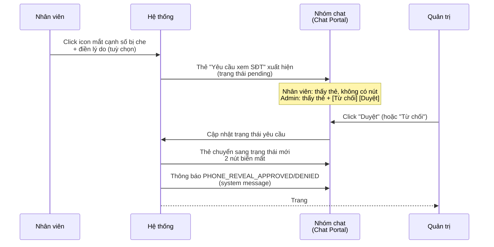

# #28a — Admin duyệt yêu cầu xem SĐT ngay trong nhóm chat (Chat Portal)

> **Trạng thái:** draft
> **Nguồn:** Quan sát từ demo Chat Portal (ảnh PO cung cấp 2026-06-16) · Bổ sung cho [`../scope-and-features.md § C.28 bước 4`](../scope-and-features.md) (canonical đã đề cập "Admin duyệt" nhưng chưa mô tả kênh inline)
> **Liên quan:** [`#28 Mask SĐT & Nhân viên gửi yêu cầu`](../FSD-Chat-Portal.md) · [`#29 Trang Yêu Cầu Xem SĐT (Admin Site)`](29-trang-yeu-cau-xem-sdt.md) · [`#29a Cấu hình bật/tắt ẩn SĐT`](29a-cau-hinh-an-sdt.md)

---

## 📌 Tóm tắt 1 dòng

Khi Nhân viên gửi yêu cầu xem số điện thoại, một thẻ thông báo "Yêu cầu xem SĐT" xuất hiện ngay trong nhóm chat; Quản trị viên có thể **Duyệt** hoặc **Từ chối** ngay tại đó mà không cần rời màn hình.

---

## 🎯 Giá trị nghiệp vụ

Trang [Yêu Cầu Xem SĐT](29-trang-yeu-cau-xem-sdt.md) trên Admin Site là kênh quản lý tập trung, nhưng yêu cầu thường khẩn (Nhân viên cần liên hệ khách gấp). Bắt Admin phải rời Chat Portal, mở Admin Site, tìm dòng tương ứng rồi xử lý là chậm và không tự nhiên.

Kênh inline giải quyết bằng cách hiển thị **thẻ thông báo có nút thao tác** ngay tại dòng tin nhắn trong nhóm chat. Admin đang trao đổi với Nhân viên trong nhóm thấy yêu cầu, hiểu ngữ cảnh, và xử lý ngay tại chỗ. Sau khi xử lý, trạng thái đồng bộ với trang quản lý tập trung — không có chuyện "duyệt 2 lần" hay lệch dữ liệu.

**Lợi ích:**

- Rút ngắn thời gian xử lý: vài giây thay vì vài phút.
- Admin nắm bối cảnh tốt hơn (ai gửi, tin nào kèm theo).
- Không cần đào tạo Nhân viên về Admin Site — chỉ xem trong nhóm chat của mình.

---

## 👥 Vai trò liên quan

| Vai trò | Trách nhiệm |
| --- | --- |
| **Nhân viên (Staff)** | Thấy thẻ "Yêu cầu xem SĐT" (do chính mình hoặc đồng nghiệp gửi) hiển thị trong nhóm. Không có nút thao tác. Khi Admin xử lý xong, thẻ cập nhật trạng thái. |
| **Quản trị (Admin)** | Thấy thẻ kèm 2 nút **[Từ chối] [Duyệt]** khi yêu cầu còn ở trạng thái pending. Click để xử lý ngay. |
| **Hệ thống** | Tạo thẻ inline khi nhận yêu cầu mới · Khoá thẻ sau khi đã có Admin xử lý (tránh duyệt 2 lần) · Đồng bộ trạng thái với trang [Yêu Cầu Xem SĐT](29-trang-yeu-cau-xem-sdt.md) · Phát thông báo `PHONE_REVEAL_APPROVED` / `PHONE_REVEAL_DENIED` vào nhóm. |

---

## 🔄 Dòng chảy nghiệp vụ



---

## ✅ Kịch bản chấp nhận

```gherkin
# language: vi
Tính năng: Admin duyệt yêu cầu xem SĐT ngay trong nhóm chat

  Bối cảnh:
    Biết nhóm "NCC Vận Chuyển Phương Nam" đang ở trạng thái ẩn SĐT = ON
    Và Admin đã đăng nhập Chat Portal
    Và Admin đang mở cửa sổ chat của nhóm đó

  # =====================================================
  # Hiển thị thẻ yêu cầu khi có request mới
  # =====================================================

  Tình huống: Thẻ "Yêu cầu xem SĐT" xuất hiện trong nhóm khi Nhân viên gửi yêu cầu
    Biết Nhân viên "Tăng Thị Huyền" vừa click icon mắt cạnh số bị che trong nhóm
    Khi yêu cầu được gửi đi
    Thì một thẻ thông báo xuất hiện trong dòng tin nhắn của nhóm với:
      | Biểu tượng        | ổ khoá                                                            |
      | Tiêu đề           | "Yêu cầu xem SĐT"                                                 |
      | Người gửi         | "Tăng Thị Huyền" hiển thị bên phải tiêu đề                        |
      | Trường "Số điện thoại" | hiển thị số đã được Nhân viên yêu cầu xem (đầy đủ, không che) |
      | Link              | "↗ Xem tin nhắn" — click để cuộn tới tin gốc chứa số             |
      | Thời điểm         | góc phải, định dạng "HH:mm"                                       |

  Tình huống: Thẻ hiển thị 2 nút thao tác khi yêu cầu còn ở trạng thái pending — chỉ với Admin
    Biết một thẻ "Yêu cầu xem SĐT" đang ở trạng thái pending
    Khi Admin xem thẻ
    Thì thẻ hiển thị 2 nút bên dưới: **[Từ chối]** (viền đỏ) và **[Duyệt]** (nền xanh)

  Tình huống: Nhân viên thấy cùng thẻ nhưng không có nút thao tác
    Biết một thẻ "Yêu cầu xem SĐT" đang ở trạng thái pending
    Khi Nhân viên xem thẻ
    Thì thẻ hiển thị cùng nội dung (biểu tượng, tiêu đề, người gửi, số, link "Xem tin nhắn")
    Nhưng không có nút [Từ chối] hoặc [Duyệt]

  # =====================================================
  # Admin duyệt từ thẻ
  # =====================================================

  Tình huống: Admin duyệt yêu cầu từ thẻ inline
    Biết thẻ yêu cầu của "Tăng Thị Huyền" cho số "092687256" đang pending
    Khi Admin click "Duyệt" trên thẻ
    Thì trạng thái của yêu cầu đổi sang approved
    Và 2 nút [Từ chối] [Duyệt] biến mất khỏi thẻ
    Và thẻ hiển thị thêm dòng "Đã duyệt bởi [Admin] · HH:mm dd/MM/yyyy"
    Và một system message "PHONE_REVEAL_APPROVED" xuất hiện ngay sau thẻ trong nhóm
    Và mọi Nhân viên trong nhóm thấy số "092687256" hiển thị đầy đủ kèm highlight cam trong tin nhắn được yêu cầu xem (chỉ tin đó, không ảnh hưởng các tin khác)

  Tình huống: Admin từ chối yêu cầu từ thẻ inline
    Biết thẻ yêu cầu đang pending
    Khi Admin click "Từ chối" trên thẻ
    Thì trạng thái của yêu cầu đổi sang denied
    Và 2 nút biến mất
    Và thẻ hiển thị thêm dòng "Đã từ chối bởi [Admin] · HH:mm dd/MM/yyyy"
    Và một system message "PHONE_REVEAL_DENIED" xuất hiện ngay sau thẻ
    Và số trong nhóm vẫn ở trạng thái bị che
    Và Nhân viên có thể gửi yêu cầu mới sau đó

  # =====================================================
  # Đồng bộ với trang #29 Yêu Cầu Xem SĐT
  # =====================================================

  Tình huống: Trạng thái cập nhật từ chat phản ánh ngay trên trang #29
    Biết Admin A đang mở thẻ pending trong nhóm chat trên Chat Portal
    Và Admin B đang mở trang "Yêu Cầu Xem SĐT" trên Admin Site
    Khi Admin A click "Duyệt" trên thẻ
    Thì trong vòng vài giây trang của Admin B cập nhật:
      | Dòng yêu cầu đó | đổi badge sang "✓ Đã duyệt"                            |
      | Cột "ADMIN XỬ LÝ" | hiển thị tên Admin A                                  |
      | Bộ đếm tab "Đang chờ" | giảm đi 1                                          |
      | Bộ đếm tab "Đã duyệt" | tăng thêm 1                                        |

  Tình huống: Trạng thái cập nhật từ trang #29 phản ánh ngay trong chat
    Biết một thẻ pending đang hiển thị trong nhóm chat
    Và Admin B mở trang "Yêu Cầu Xem SĐT" trên Admin Site
    Khi Admin B click "Từ chối" trên dòng tương ứng
    Thì trong vòng vài giây thẻ trong chat cập nhật:
      | Nút [Từ chối] [Duyệt] | biến mất                                       |
      | Thẻ                    | hiển thị "Đã từ chối bởi [Admin B] · HH:mm dd/MM/yyyy" |

  Tình huống: Yêu cầu đã được xử lý không thể duyệt/từ chối lại từ thẻ
    Biết một yêu cầu đã được duyệt (qua bất kỳ kênh nào)
    Khi Admin mở lại nhóm chat
    Thì thẻ tương ứng không còn nút [Từ chối] và [Duyệt]
    Và chỉ hiển thị thông tin trạng thái "Đã duyệt bởi [Admin] · HH:mm dd/MM/yyyy"

  # =====================================================
  # Race condition giữa 2 Admin
  # =====================================================

  Tình huống: Hai Admin cùng xử lý một yêu cầu — chỉ Admin xử lý trước thắng
    Biết Admin A đang xem thẻ pending trong nhóm chat
    Và Admin B đang xem cùng dòng pending trên trang "Yêu Cầu Xem SĐT"
    Khi Admin A click "Duyệt" trước Admin B vài giây
    Thì hệ thống nhận thao tác của Admin A và set trạng thái = approved
    Và khi Admin B click "Từ chối" sau đó
    Thì hệ thống từ chối thao tác B với thông báo lỗi "Yêu cầu đã được xử lý"
    Và dòng/thẻ tự cập nhật về trạng thái approved (do Admin A)

  # =====================================================
  # Thu hồi (revoke) — có thể làm trực tiếp từ thẻ
  # =====================================================

  Tình huống: Thẻ ở trạng thái approved hiển thị nút [Thu hồi]
    Biết thẻ trong nhóm chat đang ở trạng thái approved
    Khi Admin xem thẻ
    Thì thẻ hiển thị nút **[Thu hồi]** (viền cam)
    Và không còn nút [Từ chối] hoặc [Duyệt] trên thẻ

  Tình huống: Admin thu hồi trực tiếp từ thẻ inline
    Biết thẻ trong nhóm chat đang ở trạng thái approved với nút [Thu hồi]
    Khi Admin click [Thu hồi] trên thẻ
    Thì hệ thống mở hộp thoại xác nhận (nội dung tương tự hộp thoại trang #29)
    Khi Admin xác nhận
    Thì trạng thái yêu cầu đổi sang revoked
    Và nút [Thu hồi] biến mất khỏi thẻ
    Và thẻ hiển thị trạng thái cuối (không còn nút nào)
    Và một system message "PHONE_REVEAL_REVOKED" xuất hiện ngay sau thẻ trong nhóm
    Và mọi Nhân viên trong nhóm thấy số trong tin nhắn đó trở lại trạng thái bị che
    Và trang [#29 Yêu Cầu Xem SĐT](29-trang-yeu-cau-xem-sdt.md) cũng cập nhật sang revoked

  Tình huống: Sau khi Admin thu hồi từ trang #29, thẻ inline cũng cập nhật
    Biết Admin vừa thu hồi một yêu cầu approved từ trang "Yêu Cầu Xem SĐT"
    Khi Admin quay lại nhóm chat
    Thì thẻ tương ứng không còn nút [Thu hồi]
    Và một system message "PHONE_REVEAL_REVOKED" xuất hiện sau thẻ

  # =====================================================
  # Trường hợp đặc biệt
  # =====================================================

  Tình huống: Khi Admin tắt cấu hình ẩn SĐT khi đang có thẻ pending — thẻ tự động huỷ
    Biết một thẻ "Yêu cầu xem SĐT" đang ở trạng thái pending trong nhóm
    Khi Admin tắt cấu hình ẩn SĐT (xem [`#29a`](29a-cau-hinh-an-sdt.md))
    Thì thẻ cập nhật: 2 nút [Từ chối] [Duyệt] biến mất
    Và thẻ hiển thị trạng thái "Đã huỷ" (do cấu hình ẩn SĐT tắt)
    Và mọi Nhân viên trong nhóm thấy số đầy đủ trong mọi tin (do cấu hình tắt)

  Tình huống: Thẻ vẫn hiển thị khi cuộn lại lịch sử cũ
    Biết một thẻ đã ở trạng thái terminal (approved / denied / revoked)
    Khi Nhân viên hoặc Admin cuộn lên đoạn tin nhắn cũ
    Thì thẻ vẫn xuất hiện với trạng thái cuối cùng (không có nút thao tác)

  Tình huống: Thẻ không sync lên Zalo (chỉ hiển thị nội bộ)
    Khi một thẻ "Yêu cầu xem SĐT" xuất hiện trong nhóm
    Thì Vendor (phía Zalo) không nhận được thẻ này
    Và các system message liên quan (`PHONE_REVEAL_*`) cũng không sync lên Zalo
```

---

## 🎨 Mô tả giao diện

### Vị trí

Thẻ "Yêu cầu xem SĐT" hiển thị **trong dòng tin nhắn của nhóm chat**, ngay sau tin nhắn của Nhân viên đã trigger request. Style: full-width bubble với nền xanh nhạt, viền trái màu xanh đậm hơn, biểu tượng ổ khoá ở góc trái.

**Thẻ yêu cầu — trạng thái pending (Admin view):**
```
┌──────────────────────────────────────────────────────────────┐
│ 🔒 Yêu cầu xem SĐT · Lê Diễm Chi                     15:08   │
│ Số điện thoại: [ 0935587965 ]                                 │
│ ↗ Xem tin nhắn                                                │
│ ────────────────────                                          │
│  [ Từ chối ]   [   Duyệt   ]      ← chỉ Admin thấy           │
└──────────────────────────────────────────────────────────────┘
```

**Thẻ yêu cầu — trạng thái approved (Admin view, từ ảnh PO 2026-06-17):**
```
┌──────────────────────────────────────────────────────────────┐
│ 🔒 Yêu cầu xem SĐT · Lê Diễm Chi                     15:08   │
│ Số điện thoại: [ 0935587965 ]                                 │
│ ↗ Xem tin nhắn                                                │
│ ────────────────────                                          │
│  [ Thu hồi ]                      ← chỉ Admin thấy           │
└──────────────────────────────────────────────────────────────┘
```

**Card system message "Đã duyệt" xuất hiện sau thẻ (từ ảnh PO 2026-06-17):**
```
┌──────────────────────────────────────────────────────────────┐
│ 🟢 Đã duyệt xem SĐT · Diệp Nguyên                    15:10   │
│ Diệp Nguyên đã duyệt — Lê Diễm Chi có thể xem số điện thoại  │
│ ↗ Xem tin nhắn                                                │
└──────────────────────────────────────────────────────────────┘
```
> Lưu ý: "Đã duyệt xem SĐT" là **card riêng biệt** (icon 🟢 khác với 🔒 của thẻ yêu cầu), không phải trạng thái của thẻ yêu cầu. Tên trong title là **Admin đã duyệt** (không phải NV gửi yêu cầu).

### Thành phần thẻ

| Thành phần | Mô tả |
| --- | --- |
| **Biểu tượng** | Ổ khoá (giống icon dùng cho phone reveal) ở góc trái |
| **Tiêu đề** | "Yêu cầu xem SĐT" — font đậm |
| **Người gửi** | Tên Nhân viên gửi yêu cầu, hiển thị bên phải tiêu đề |
| **Trường Số điện thoại** | "Số điện thoại:" + chip font mono chứa số đầy đủ |
| **Link "↗ Xem tin nhắn"** | Click → cuộn message list về tin gốc chứa số bị che, highlight tin trong 2 giây |
| **Thời điểm** | Góc phải trên cùng, định dạng "HH:mm" |
| **Vùng thao tác** | Hiển thị có điều kiện theo vai trò + trạng thái (xem bảng bên dưới) |

### Vùng thao tác theo vai trò × trạng thái

| Vai trò × Trạng thái | Vùng thao tác hiển thị |
| --- | --- |
| Admin × **pending** | 2 nút **[Từ chối]** (viền đỏ) + **[Duyệt]** (xanh solid) |
| Admin × **approved** | Nút **[Thu hồi]** (viền cam) |
| Admin × **denied** | Không nút |
| Admin × **cancelled** | Không nút (tự động huỷ do config tắt) |
| Admin × **revoked** | Không nút |
| Nhân viên × **mọi trạng thái** | Không bao giờ có nút |

### System messages kèm theo

Sau mỗi thao tác Duyệt / Từ chối / Thu hồi, hệ thống chèn thêm 1 system message full-width vào ngay sau thẻ. Style và nội dung chi tiết: xem [`../FSD-Chat-Portal.md § C.28 FR-28.8 / FR-28.9`](../FSD-Chat-Portal.md).

### Mockup tham chiếu

> ✅ **Đã có:**
> - Thẻ pending với "[Từ chối] [Duyệt]" (ảnh từ PO 2026-06-16).
> - Thẻ approved với "[Thu hồi]" (ảnh từ PO 2026-06-17).
> - Card "Đã duyệt xem SĐT · [Admin]" (system message, ảnh từ PO 2026-06-17).
>
> ⏳ **Cần BA bổ sung:**
> - Thẻ ở trạng thái denied, revoked, cancelled (Admin view + Nhân viên view).
> - System message `PHONE_REVEAL_DENIED` / `REVOKED` / `CANCELLED` đứng sau thẻ.

---

## 🔗 Tham chiếu & Q&A

### Liên quan các phần khác

- [`#28 Mask SĐT & Nhân viên gửi yêu cầu`](../FSD-Chat-Portal.md): khởi tạo yêu cầu → tạo thẻ này.
- [`#29 Trang Yêu Cầu Xem SĐT (Admin Site)`](29-trang-yeu-cau-xem-sdt.md): kênh xử lý tập trung song song, đồng bộ trạng thái với thẻ này.
- [`#29a Cấu hình ẩn SĐT`](29a-cau-hinh-an-sdt.md): điều kiện để có yêu cầu phát sinh.
- System message `PHONE_REVEAL_*`: nội dung chi tiết tại [`../FSD-Chat-Portal.md § C.28 FR-28.8 / FR-28.9`](../FSD-Chat-Portal.md).

### ✅ Quyết định thiết kế đã chốt (BA/PO xác nhận 2026-06-17)

1. **Thẻ approved CÓ nút [Thu hồi]**
   - **Chốt:** Thẻ ở trạng thái approved hiển thị nút [Thu hồi] (viền cam). Admin có thể thu hồi trực tiếp từ thẻ inline mà không cần vào trang #29. Có hộp thoại xác nhận trước khi thu hồi. Confirmed từ ảnh PO 2026-06-17.

2. **Pending bị huỷ (cancelled) khi config tắt**
   - **Chốt:** Khi Admin tắt cấu hình ẩn SĐT, toàn bộ pending của nhóm tự động huỷ. Thẻ inline cập nhật (nút biến mất). Xem đồng bộ với [`#29a Q&A #1`](29a-cau-hinh-an-sdt.md).

3. **✅ Chỉ 1 yêu cầu pending tại 1 thời điểm / nhóm**
   - Khi đã có 1 yêu cầu pending trong nhóm, icon mắt toàn bộ tin nhắn bị disable cho mọi Nhân viên. Xem chi tiết tại [`#29 Q&A #3`](29-trang-yeu-cau-xem-sdt.md).

4. **"↗ Xem tin nhắn": scroll smooth + highlight vài giây**
   - **Chốt:** Scroll smooth. Tin gốc được highlight trong vài giây. Thời lượng chính xác do DEV quyết định UX.

5. **Không gộp thẻ — 1 thẻ / 1 yêu cầu**
   - **Chốt:** Không gộp. Quy tắc 1 pending/nhóm (Q&A #3) đã loại trừ tình huống nhiều thẻ xuất hiện đồng thời.
