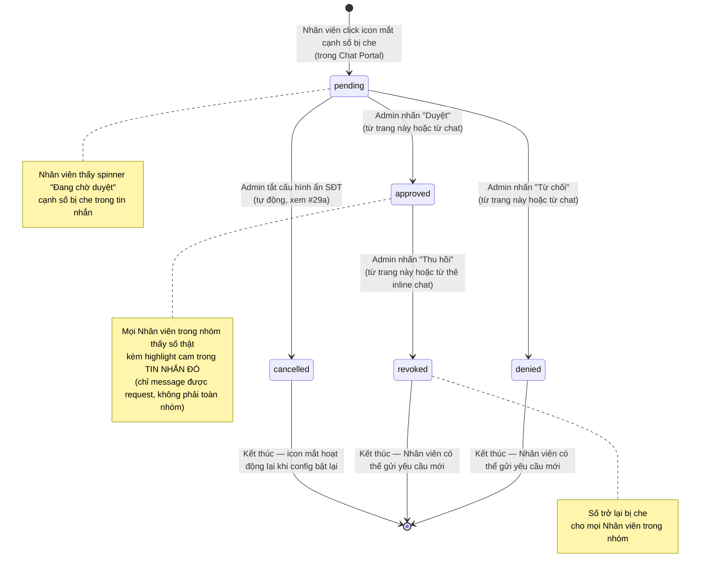

# #29 — Trang Yêu Cầu Xem Số Điện Thoại (Admin Site)

> **Trạng thái:** draft
> **Nguồn:** [`../scope-and-features.md § C.28`](../scope-and-features.md) (canonical) · [`../FSD-Admin-Site.md § 5`](../FSD-Admin-Site.md) · [`../FSD-Chat-Portal.md § C.28`](../FSD-Chat-Portal.md)
> **Liên quan:** [`#28a — Admin duyệt yêu cầu xem SĐT ngay trong nhóm chat`](28a-admin-duyet-yeu-cau-tu-chat.md) · [`#29a — Cấu hình bật/tắt ẩn SĐT`](29a-cau-hinh-an-sdt.md)

---

## 📌 Tóm tắt 1 dòng

Trang quản lý tập trung trên Admin Site, nơi Admin xem toàn bộ yêu cầu xem số điện thoại do Nhân viên gửi và ra quyết định **Duyệt** / **Từ chối** / **Thu hồi** kèm lịch sử không thể xoá.

---

## 🎯 Giá trị nghiệp vụ

Số điện thoại khách hàng là dữ liệu nhạy cảm. Nếu mọi Nhân viên đều thấy được số tự do thì rủi ro rò rỉ ra ngoài là rất cao — đặc biệt với nhân viên đã rời công ty hoặc nhân viên không trực tiếp phụ trách nhóm đó.

Khi công ty bật chế độ ẩn SĐT cho một nhóm khách (xem [`#29a Cấu hình ẩn SĐT`](29a-cau-hinh-an-sdt.md)), Nhân viên chỉ thấy số dưới dạng che (ví dụ `09xx`). Nếu cần liên hệ trực tiếp, Nhân viên gửi yêu cầu trên Chat Portal; Admin xem xét và quyết định. Sau khi đã duyệt, Admin vẫn có thể thu hồi lại bất kỳ lúc nào.

Trang này là **kênh xử lý chính** (tập trung, theo dõi được lịch sử). Admin cũng có thể xử lý nhanh trực tiếp trong nhóm chat (xem [`#28a`](28a-admin-duyet-yeu-cau-tu-chat.md)) — hai kênh đồng bộ trạng thái với nhau.

**Lợi ích:**

- Admin nắm rõ **ai đang xem số nào, khi nào, ở nhóm nào**.
- Mọi thao tác được lưu lịch sử không thể xoá.
- **Thu hồi được** nếu nhân viên rời công ty hoặc sai mục đích.

---

## 👥 Vai trò liên quan

| Vai trò | Trách nhiệm |
| --- | --- |
| **Nhân viên (Staff)** | Gửi yêu cầu từ Chat Portal khi cần liên hệ khách. Không có quyền truy cập trang này. |
| **Quản trị (Admin)** | Vào trang **"Yêu Cầu Xem SĐT"** trên Admin Site → xem danh sách yêu cầu → **Duyệt** / **Từ chối** / **Thu hồi**. |
| **Hệ thống** | Gửi thông báo (system message) vào nhóm chat sau mỗi thao tác · Lưu lịch sử ai xử lý + lúc nào · Hiện/ẩn số cho mọi Nhân viên trong nhóm theo trạng thái mới nhất. |

---

## 🔄 Dòng chảy nghiệp vụ



---

## ✅ Kịch bản chấp nhận

```gherkin
# language: vi
Tính năng: Admin duyệt yêu cầu xem số điện thoại trên trang quản lý

  Bối cảnh:
    Biết Admin đã đăng nhập Admin Site
    Và Admin đang ở trang "Yêu Cầu Xem SĐT"

  # =====================================================
  # Cấu trúc trang
  # =====================================================

  Tình huống: Trang hiển thị header và 5 tab trạng thái kèm số đếm
    Khi trang load xong
    Thì header hiển thị tiêu đề "Yêu Cầu Xem Số Điện Thoại" kèm icon điện thoại
    Và mô tả phụ "Quản lý các yêu cầu xem số điện thoại bị ẩn trong các nhóm NCC"
    Và hiển thị 5 tab theo thứ tự: "Tất cả", "Đang chờ", "Đã duyệt", "Đã từ chối", "Đã thu hồi"
    Và mỗi tab có số đếm bằng số yêu cầu thuộc trạng thái đó
    Và tab "Tất cả" được chọn mặc định

  Tình huống: Số đếm tab "Đang chờ" được làm nổi khi có ít nhất 1 yêu cầu chờ
    Biết có ít nhất 1 yêu cầu trạng thái pending trong hệ thống
    Thì số đếm trên tab "Đang chờ" có nền màu cam đậm

  Tình huống: Bảng yêu cầu có 8 cột theo đúng thứ tự
    Thì bảng hiển thị các cột theo đúng thứ tự sau:
      | NHÂN VIÊN         |
      | SỐ ĐIỆN THOẠI     |
      | NHÓM NCC          |
      | THỜI GIAN YÊU CẦU |
      | TRẠNG THÁI        |
      | ADMIN XỬ LÝ       |
      | THỜI GIAN XỬ LÝ   |
      | THAO TÁC          |

  Tình huống: Admin luôn thấy số điện thoại đầy đủ, không bị che
    Biết bảng có ít nhất 1 dòng
    Thì cột "SỐ ĐIỆN THOẠI" hiển thị số đầy đủ
    Và số được hiển thị trong khung font mono, nền xám nhạt

  Tình huống: Mặc định sắp xếp theo "Thời gian yêu cầu" mới nhất trước
    Thì các dòng được sắp xếp theo cột "THỜI GIAN YÊU CẦU" giảm dần

  # =====================================================
  # Lọc theo tab trạng thái
  # =====================================================

  Khung tình huống: Click tab trạng thái sẽ lọc bảng theo trạng thái đó
    Khi Admin nhấn vào tab "<tab>"
    Thì bảng chỉ hiển thị các yêu cầu có trạng thái "<trang_thai>"

    Dữ liệu:
      | tab        | trang_thai |
      | Đang chờ   | pending    |
      | Đã duyệt   | approved   |
      | Đã từ chối | denied     |
      | Đã thu hồi | revoked    |

  Tình huống: Click tab "Tất cả" sẽ bỏ lọc trạng thái
    Khi Admin nhấn vào tab "Tất cả"
    Thì bảng hiển thị yêu cầu của tất cả các trạng thái

  # =====================================================
  # Badge trạng thái
  # =====================================================

  Khung tình huống: Cột "Trạng thái" hiển thị badge đúng icon và màu
    Biết một dòng có trạng thái "<trang_thai>"
    Thì ô "TRẠNG THÁI" hiển thị badge với icon "<icon>", nhãn "<nhan>", màu "<mau>"

    Dữ liệu:
      | trang_thai | icon | nhan        | mau  |
      | pending    | ⏱   | Đang chờ    | cam  |
      | approved   | ✓   | Đã duyệt    | xanh |
      | denied     | ✕   | Đã từ chối  | đỏ   |
      | revoked    | ↩   | Đã thu hồi  | xám  |
      | cancelled  | ⊘   | Đã huỷ      | xám nhạt |

  # =====================================================
  # Duyệt một yêu cầu đang chờ
  # =====================================================

  Tình huống: Admin duyệt một yêu cầu đang chờ — không cần xác nhận
    Biết có một yêu cầu pending của Nhân viên "Lê Diễm Chi", số "0952908786", nhóm "NCC Vận Chuyển Phương Nam"
    Khi Admin nhấn "Duyệt" trên dòng đó
    Thì trạng thái đổi sang approved ngay lập tức, không có hộp thoại xác nhận
    Và badge chuyển thành "✓ Đã duyệt"
    Và cột "ADMIN XỬ LÝ" hiển thị tên Admin vừa thao tác
    Và cột "THỜI GIAN XỬ LÝ" hiển thị thời điểm hiện tại
    Và một thông báo "PHONE_REVEAL_APPROVED" được gửi vào nhóm chat với nội dung "Admin [tên] đã duyệt yêu cầu của Lê Diễm Chi lúc [HH:mm]"
    Và mọi Nhân viên trong nhóm thấy số "0952908786" hiển thị đầy đủ kèm highlight cam trong tin nhắn được yêu cầu xem (không ảnh hưởng các tin khác chứa cùng số)

  # =====================================================
  # Từ chối một yêu cầu đang chờ
  # =====================================================

  Tình huống: Admin từ chối một yêu cầu đang chờ — không cần xác nhận
    Biết có một yêu cầu đang chờ
    Khi Admin nhấn "Từ chối" trên dòng đó
    Thì trạng thái đổi sang denied ngay lập tức, không có hộp thoại xác nhận
    Và badge chuyển thành "✕ Đã từ chối"
    Và cột "ADMIN XỬ LÝ" và "THỜI GIAN XỬ LÝ" được điền
    Và một thông báo "PHONE_REVEAL_DENIED" được gửi vào nhóm chat
    Và số điện thoại vẫn ở trạng thái bị che với Nhân viên
    Và Nhân viên đã gửi yêu cầu có thể gửi yêu cầu mới sau đó

  # =====================================================
  # Giới hạn: chỉ 1 yêu cầu pending tại 1 thời điểm / nhóm
  # =====================================================

  Tình huống: Nhân viên khác không thể gửi yêu cầu khi đã có yêu cầu pending trong nhóm
    Biết Nhân viên "Lê Diễm Chi" vừa gửi yêu cầu xem số trong tin nhắn A của nhóm và yêu cầu đang pending
    Khi Nhân viên "Tăng Thị Huyền" mở cùng nhóm đó trong Chat Portal
    Thì icon mắt cạnh các số bị che trong mọi tin nhắn của nhóm không còn click được
    Và Nhân viên "Tăng Thị Huyền" không thể gửi yêu cầu mới cho đến khi yêu cầu hiện tại được xử lý (duyệt hoặc từ chối)

  Tình huống: Nhân viên có thể gửi yêu cầu mới ngay sau khi yêu cầu trước được từ chối
    Biết yêu cầu của Nhân viên "Lê Diễm Chi" vừa bị từ chối
    Khi Nhân viên "Tăng Thị Huyền" mở nhóm đó
    Thì icon mắt cạnh các số bị che đã hoạt động trở lại

  # =====================================================
  # Thu hồi một yêu cầu đã duyệt
  # =====================================================

  Tình huống: Admin thu hồi một yêu cầu đã duyệt — phải xác nhận trước
    Biết có một yêu cầu đã được duyệt cho số "0952908786", nhóm "NCC Vận Chuyển Phương Nam"
    Khi Admin nhấn "Thu hồi" trên dòng đó
    Thì hệ thống mở hộp thoại xác nhận với nội dung "Thu hồi quyền xem số 0952908786 cho nhóm NCC Vận Chuyển Phương Nam? Tất cả staff trong nhóm sẽ thấy số bị ẩn trở lại."

  Tình huống: Admin xác nhận thu hồi
    Biết hộp thoại xác nhận thu hồi đang mở
    Khi Admin xác nhận
    Thì trạng thái đổi sang revoked
    Và badge chuyển thành "↩ Đã thu hồi"
    Và một thông báo "PHONE_REVEAL_REVOKED" được gửi vào nhóm chat
    Và mọi Nhân viên trong nhóm thấy số "0952908786" trở lại trạng thái bị che trong tin nhắn đó

  Tình huống: Admin huỷ hộp thoại thu hồi
    Biết hộp thoại xác nhận thu hồi đang mở
    Khi Admin nhấn "Huỷ"
    Thì trạng thái yêu cầu vẫn là approved
    Và không có thông báo nào được gửi vào nhóm chat

  # =====================================================
  # Trạng thái kết thúc
  # =====================================================

  Khung tình huống: Yêu cầu đã từ chối hoặc đã thu hồi không còn thao tác
    Biết một yêu cầu có trạng thái "<trang_thai>"
    Thì cột "THAO TÁC" của dòng đó không hiển thị nút nào
    Và không thể đổi trạng thái từ trang này

    Dữ liệu:
      | trang_thai |
      | denied     |
      | revoked    |

  # =====================================================
  # Đồng bộ với kênh duyệt trong chat (#28a)
  # =====================================================

  Tình huống: Yêu cầu đã được Admin xử lý từ kênh chat sẽ phản ánh trạng thái mới trên trang này
    Biết có một yêu cầu pending hiển thị trong tab "Đang chờ"
    Khi một Admin khác duyệt chính yêu cầu đó từ thẻ inline trong nhóm chat
    Thì trang này tự cập nhật: dòng chuyển sang trạng thái approved
    Và cột "ADMIN XỬ LÝ" và "THỜI GIAN XỬ LÝ" hiển thị Admin xử lý từ chat
    Và bộ đếm các tab được cập nhật theo

  Tình huống: Yêu cầu đã được xử lý không thể bị xử lý lại từ kênh khác
    Biết một yêu cầu đã được duyệt từ kênh chat (#28a)
    Khi Admin mở trang "Yêu Cầu Xem SĐT" sau đó
    Thì dòng tương ứng đã ở trạng thái approved và không còn nút "Duyệt" / "Từ chối"
    Và chỉ còn nút "Thu hồi" nếu trạng thái là approved

  # =====================================================
  # Audit trail
  # =====================================================

  Tình huống: Mọi thao tác đều được lưu vĩnh viễn
    Khi Admin thực hiện thao tác Duyệt, Từ chối, hoặc Thu hồi trên bất kỳ yêu cầu nào
    Thì hệ thống lưu Admin đã thao tác
    Và lưu thời điểm thao tác
    Và bản ghi không thể bị sửa hay xoá

  # =====================================================
  # Trường hợp đặc biệt
  # =====================================================

  Tình huống: Trạng thái rỗng khi chưa có yêu cầu nào
    Biết hệ thống chưa có yêu cầu xem SĐT nào
    Khi Admin mở trang
    Thì trang hiển thị trạng thái rỗng với icon nhóm người dùng
    Và dòng chữ "Chưa có yêu cầu nào"

  Tình huống: Yêu cầu của Nhân viên đã rời công ty
    Biết một yêu cầu do Nhân viên đã rời công ty gửi
    Thì cột "NHÂN VIÊN" hiển thị tên kèm hậu tố "(đã rời)"

  Tình huống: Yêu cầu thuộc nhóm đã bị xoá
    Biết một yêu cầu thuộc nhóm NCC đã bị xoá khỏi hệ thống
    Thì các nút thao tác trên dòng đó bị vô hiệu hoá
    Và khi rê chuột vào nút bị vô hiệu hoá, tooltip hiển thị "Nhóm không còn tồn tại"
    Nhưng dòng vẫn hiển thị trong bảng để phục vụ tra cứu lịch sử
```

---

## 🎨 Mô tả giao diện

### Cấu trúc trang

```
┌─────────────────────────────────────────────────────────────┐
│ 📞 Yêu Cầu Xem Số Điện Thoại                                │
│ Quản lý các yêu cầu xem số điện thoại bị ẩn trong nhóm NCC  │
├─────────────────────────────────────────────────────────────┤
│ [Tất cả (N)] [Đang chờ (M)] [Đã duyệt] [Đã từ chối] [Đã thu hồi] │
├─────────────────────────────────────────────────────────────┤
│ Bảng yêu cầu — 8 cột                                        │
└─────────────────────────────────────────────────────────────┘
```

### Tab trạng thái

| Tab          | Bộ đếm           | Style đặc biệt                      |
| ------------ | ---------------- | ----------------------------------- |
| Tất cả (N)   | Tổng số yêu cầu  | Tab mặc định khi mở trang           |
| Đang chờ (M) | Số `pending`     | Bộ đếm có nền cam đậm khi M > 0     |
| Đã duyệt     | Số `approved`    | —                                   |
| Đã từ chối   | Số `denied`      | —                                   |
| Đã thu hồi   | Số `revoked`     | —                                   |

### Bảng yêu cầu — 8 cột

| # | Cột                 | Nội dung                                                                                                       |
| - | ------------------- | -------------------------------------------------------------------------------------------------------------- |
| 1 | **NHÂN VIÊN**       | Tên Nhân viên đã gửi yêu cầu. Nếu Nhân viên đã rời → thêm nhãn "(đã rời)" cạnh tên.                            |
| 2 | **SỐ ĐIỆN THOẠI**   | Hiển thị trong khung font mono, padding nhỏ, nền xám nhạt. Admin **luôn** thấy số đầy đủ, không che.            |
| 3 | **NHÓM NCC**        | Tên hiển thị của nhóm (đã rename nếu có).                                                                       |
| 4 | **THỜI GIAN YÊU CẦU** | Định dạng `HH:mm dd/MM/yyyy`.                                                                                 |
| 5 | **TRẠNG THÁI**      | Badge có icon + nhãn + màu — xem bảng "Badge trạng thái" trong phần Kịch bản chấp nhận.                         |
| 6 | **ADMIN XỬ LÝ**     | Tên Admin đã xử lý. Nếu chưa xử lý → hiển thị dấu "—".                                                          |
| 7 | **THỜI GIAN XỬ LÝ** | Định dạng giống cột 4. Nếu chưa xử lý → "—".                                                                    |
| 8 | **THAO TÁC**        | Nút thao tác theo trạng thái — xem bảng "Thao tác theo trạng thái" bên dưới.                                    |

### Thao tác theo trạng thái

| Trạng thái   | Nút hiển thị                                | Có hộp thoại xác nhận?                                          |
| ------------ | ------------------------------------------- | --------------------------------------------------------------- |
| **pending**   | **[Từ chối]** (viền đỏ) + **[Duyệt]** (xanh solid) | Không — Admin quyết định nhanh |
| **approved**  | **[Thu hồi]** (viền cam)                    | **Có** — xem Tình huống "Admin thu hồi một yêu cầu đã duyệt" |
| **denied**    | — (không nút)                               | — |
| **revoked**   | — (không nút)                               | — |
| **cancelled** | — (không nút, tự động bởi hệ thống)         | — |

### Sắp xếp & lọc

- Sắp xếp mặc định: cột "THỜI GIAN YÊU CẦU" mới nhất trước.
- Click tab → lọc theo trạng thái (xem Khung tình huống).
- Click header cột để đổi sắp xếp: **Phase 2 không bắt buộc**.

### Mockup tham chiếu

> ✅ **Đã có:**
> - Dòng pending: "Lê Diễm Chi / chip mono `0952908786` / NCC - Vận Chuyển Phương Nam / 16:28 12/06/2026 / badge ⏱ Đang chờ / — / — / [Từ chối] [Duyệt]"
>
> ⏳ **Cần BA bổ sung:**
> - State các tab khác (đã duyệt / đã từ chối / đã thu hồi) khi có dữ liệu
> - Hộp thoại xác nhận "Thu hồi"
> - Trạng thái rỗng "Chưa có yêu cầu nào"
> - Dòng có Nhân viên đã rời công ty (nhãn "(đã rời)")

---

## 🔗 Tham chiếu & Q&A

### Liên quan các phần khác

- [`#28 Mask SĐT & Staff gửi yêu cầu (Chat Portal)`](../FSD-Chat-Portal.md): Nhân viên thấy `XX****`, click icon mắt, mở popup gửi yêu cầu, spinner chờ duyệt.
- [`#28a Admin duyệt yêu cầu ngay trong nhóm chat`](28a-admin-duyet-yeu-cau-tu-chat.md): kênh xử lý thay thế đồng bộ trạng thái với trang này.
- [`#29a Cấu hình bật/tắt ẩn SĐT cho nhóm`](29a-cau-hinh-an-sdt.md): tiền điều kiện — chỉ khi nhóm bật "Ẩn số điện thoại" thì Nhân viên mới phải gửi yêu cầu.
- System message `PHONE_REVEAL_*`: nội dung chi tiết tại [`../FSD-Chat-Portal.md § C.28 FR-28.8 / FR-28.9`](../FSD-Chat-Portal.md).
- Audit chung Phase 2: [`../FSD-Admin-Site.md § 1.4`](../FSD-Admin-Site.md).

### ✅ Quyết định thiết kế đã chốt (BA/PO xác nhận 2026-06-17)

1. **Phạm vi (scope) của Duyệt: `per-message` + cả nhóm thấy**
   - **Chốt:** Mỗi yêu cầu gắn với **1 tin nhắn cụ thể** (scope key = `(nhóm, tin nhắn)`). Khi được duyệt, **mọi Nhân viên trong nhóm** thấy số đầy đủ **trong tin đó** — các tin khác chứa cùng số không bị ảnh hưởng.
   - **Hệ quả khi convert `FSD-Chat-Portal.md § C.28`:** FR-28.5/6/9 cần được giữ nguyên (per-message đúng). `FR-PRR.8` trong `FSD-Admin-Site.md` và `scope-and-features.md § C.28 mục 5` cần sửa thành per-message khi convert sang format mới.

2. **Khi Admin nhấn "Từ chối": không cần nhập lý do**
   - **Chốt:** Không có textarea lý do. Đúng với pilot hiện tại (không có textarea).

3. **Chỉ 1 yêu cầu pending được phép tồn tại cùng lúc trong cùng nhóm**
   - **Chốt:** Khi đã có 1 yêu cầu đang pending trong nhóm, icon mắt của toàn bộ tin nhắn trong nhóm bị disable cho mọi Nhân viên. Sau khi yêu cầu được xử lý (duyệt hoặc từ chối), icon mắt hoạt động trở lại.
   - **Lý do:** Khi được duyệt, cả nhóm thấy số đó — không cần nhiều Nhân viên cùng gửi yêu cầu cho cùng nhóm.

4. **Reopen yêu cầu đã từ chối: không có nút reopen**
   - **Chốt:** Nhân viên gửi yêu cầu mới (không có UI reopen). Đúng với pilot hiện tại.

5. **Click vào row tại Admin Site: không navigate sang Chat Portal**
   - **Chốt:** Admin Site không có chức năng navigate sang Chat Portal. Trong Chat Portal, system message có link "↗ Xem tin nhắn" để navigate đến tin gốc — nhưng tính năng này thuộc về [`#28a`](28a-admin-duyet-yeu-cau-tu-chat.md) và [`#28`](../FSD-Chat-Portal.md), không phải trang này.

6. **Tab mặc định khi mở trang: "Tất cả"**
   - **Chốt:** Tab mặc định = "Tất cả". Đúng với pilot hiện tại.

7. **Sau khi Admin thu hồi từ trang này: Chat Portal giữ nguyên lịch sử system messages**
   - **Chốt:** Card inline trong nhóm chat hiển thị trạng thái cuối (`revoked`). Các system messages `PHONE_REVEAL_APPROVED` và `PHONE_REVEAL_REVOKED` đều giữ nguyên trong dòng tin — Nhân viên thấy toàn bộ lịch sử thay đổi. Đúng với pilot hiện tại.
