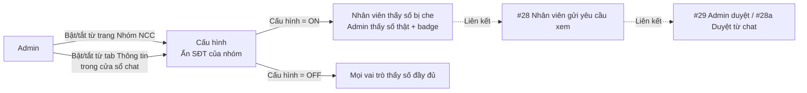

# #29a — Cấu hình bật/tắt ẩn số điện thoại cho nhóm NCC

> **Trạng thái:** draft
> **Nguồn:** [`../scope-and-features.md § C.28 bước 1`](../scope-and-features.md) (canonical) · [`../FSD-Admin-Site.md § 3`](../FSD-Admin-Site.md) · [`../FSD-Chat-Portal.md § C.28 FR-28.1, FR-28.10`](../FSD-Chat-Portal.md)
> **Liên quan:** [`#28 Mask SĐT & gửi yêu cầu (Chat Portal)`](../FSD-Chat-Portal.md) · [`#28a Admin duyệt từ chat`](28a-admin-duyet-yeu-cau-tu-chat.md) · [`#29 Trang Yêu Cầu Xem SĐT`](29-trang-yeu-cau-xem-sdt.md)

---

## 📌 Tóm tắt 1 dòng

Quản trị viên bật/tắt chế độ "Ẩn số điện thoại" cho từng nhóm NCC từ **Admin Site** (trang Nhóm NCC) hoặc nhanh chóng từ **Chat Portal** (tab Thông tin trong nhóm); chỉ khi chế độ bật thì Nhân viên mới thấy số bị che và phải gửi yêu cầu xem.

---

## 🎯 Giá trị nghiệp vụ

Không phải nhóm NCC nào cũng cần ẩn số. Một số nhóm chứa số điện thoại nhạy cảm của khách lớn, đối tác chiến lược, hoặc thông tin pháp lý — công ty cần Admin chủ động bật chế độ bảo vệ. Các nhóm bình thường giữ nguyên hiển thị để Nhân viên thao tác nhanh.

Cấu hình theo **từng nhóm** (per-group) thay vì toàn hệ thống để linh hoạt. Đặt ở 2 nơi để Admin tiện thao tác:

- **Admin Site (Quản lý nhóm NCC):** thao tác hàng loạt, có bộ lọc "Đang ẩn / Đang hiện" giúp Admin rà soát toàn cảnh.
- **Chat Portal (tab Thông tin trong nhóm):** thao tác nhanh khi đang xem chat — Admin phát hiện nhóm cần bảo vệ có thể bật ngay tại chỗ.

Cả 2 nơi cùng ghi vào một cấu hình duy nhất; bật/tắt từ bất kỳ đâu sẽ phản ánh ngay ở nơi còn lại.

**Lợi ích:**

- Admin chủ động kiểm soát phạm vi bảo vệ theo từng nhóm.
- Thao tác nhanh ngay trong ngữ cảnh chat, không phải rời màn hình.
- Trạng thái cấu hình hiện rõ trên cả 2 UI để dễ rà soát.

---

## 👥 Vai trò liên quan

| Vai trò | Trách nhiệm |
| --- | --- |
| **Quản trị (Admin)** | Người duy nhất có quyền bật/tắt cấu hình ẩn SĐT, cả ở Admin Site lẫn Chat Portal. |
| **Nhân viên (Staff)** | Không thấy nút toggle. Chỉ nhận hệ quả: số trong tin nhắn của nhóm bị che khi cấu hình bật. |
| **Hệ thống** | Lưu trạng thái cấu hình theo nhóm · Tự động che/hiện số trong message list theo trạng thái hiện tại · Cập nhật bộ đếm "Đang ẩn SĐT" trên trang Nhóm NCC. |

---

## 🔄 Dòng chảy nghiệp vụ



---

## ✅ Kịch bản chấp nhận

```gherkin
# language: vi
Tính năng: Bật/tắt chế độ ẩn số điện thoại cho nhóm NCC

  Bối cảnh:
    Biết hệ thống có nhóm "NCC Vận Chuyển Phương Nam" đang đồng bộ

  # =====================================================
  # Cấu hình từ Admin Site — trang Nhóm NCC
  # =====================================================

  Tình huống: Cột "Ẩn SĐT" hiển thị trạng thái hiện tại của từng nhóm
    Biết Admin mở trang "Nhóm NCC" trên Admin Site
    Thì mỗi dòng nhóm có cột "ẨN SĐT" hiển thị một công tắc (toggle)
    Và công tắc ở vị trí "bật" với nhóm có cấu hình ẩn SĐT đang ON
    Và công tắc ở vị trí "tắt" với nhóm có cấu hình ẩn SĐT đang OFF

  Tình huống: Admin bật cấu hình ẩn SĐT từ Admin Site
    Biết Admin đang ở trang "Nhóm NCC"
    Và nhóm "NCC Vận Chuyển Phương Nam" đang ở trạng thái ẩn SĐT = OFF
    Khi Admin click vào công tắc "ẨN SĐT" của dòng đó
    Thì công tắc chuyển sang vị trí "bật" ngay lập tức
    Và bộ đếm "Đang ẩn SĐT" trên header tăng thêm 1
    Và mọi Nhân viên trong nhóm này từ giờ thấy số điện thoại bị che trong tin nhắn

  Tình huống: Admin tắt cấu hình ẩn SĐT từ Admin Site
    Biết nhóm "NCC Vận Chuyển Phương Nam" đang ở trạng thái ẩn SĐT = ON
    Khi Admin click vào công tắc "ẨN SĐT" của dòng đó
    Thì công tắc chuyển sang vị trí "tắt" ngay lập tức
    Và bộ đếm "Đang ẩn SĐT" trên header giảm đi 1
    Và mọi Nhân viên trong nhóm này từ giờ thấy số điện thoại hiển thị đầy đủ

  Tình huống: Lọc nhóm theo trạng thái ẩn SĐT
    Biết Admin đang ở trang "Nhóm NCC"
    Khi Admin click tab "Đang ẩn SĐT"
    Thì bảng chỉ hiển thị các nhóm có cấu hình ẩn SĐT đang ON

  # =====================================================
  # Cấu hình từ Chat Portal — tab Thông tin của nhóm
  # =====================================================

  Tình huống: Admin thấy công tắc ẩn SĐT trong tab Thông tin của nhóm
    Biết Admin đã đăng nhập Chat Portal
    Và đang mở cửa sổ chat của nhóm "NCC Vận Chuyển Phương Nam"
    Và đang ở tab "Thông tin" (panel bên phải)
    Thì panel hiển thị dòng "Ẩn số điện thoại" với:
      | Biểu tượng        | con mắt gạch chéo                                  |
      | Nhãn trạng thái   | "Đang ẩn" (nếu ON) hoặc "Đang hiện" (nếu OFF)     |
      | Công tắc (toggle) | bên phải dòng                                      |

  Tình huống: Admin bật cấu hình ẩn SĐT từ Chat Portal
    Biết nhóm hiện tại đang ở trạng thái ẩn SĐT = OFF
    Khi Admin gạt công tắc "Ẩn số điện thoại" sang vị trí bật
    Thì nhãn trạng thái đổi thành "Đang ẩn"
    Và mọi Nhân viên đang mở nhóm này thấy số trong tin nhắn chuyển sang dạng bị che ngay lập tức
    Và bộ đếm "Đang ẩn SĐT" trên trang "Nhóm NCC" của Admin Site cũng tăng theo

  Tình huống: Admin tắt cấu hình ẩn SĐT từ Chat Portal
    Biết nhóm hiện tại đang ở trạng thái ẩn SĐT = ON
    Khi Admin gạt công tắc "Ẩn số điện thoại" sang vị trí tắt
    Thì nhãn trạng thái đổi thành "Đang hiện"
    Và mọi Nhân viên đang mở nhóm này thấy số trong tin nhắn chuyển sang dạng đầy đủ ngay lập tức

  Tình huống: Nhân viên không thấy công tắc trong tab Thông tin
    Biết Nhân viên đăng nhập Chat Portal
    Và mở cửa sổ chat của một nhóm bất kỳ
    Khi Nhân viên mở tab "Thông tin"
    Thì panel không hiển thị dòng "Ẩn số điện thoại" và không có công tắc nào liên quan

  # =====================================================
  # Đồng bộ giữa 2 nơi
  # =====================================================

  Tình huống: Bật/tắt ở Admin Site phản ánh ngay trong Chat Portal
    Biết Admin A đang ở trang "Nhóm NCC" trên Admin Site
    Và Admin B đang mở tab "Thông tin" của nhóm "NCC Vận Chuyển Phương Nam" trên Chat Portal
    Khi Admin A bật công tắc "ẨN SĐT" của nhóm đó
    Thì trong vòng vài giây Chat Portal của Admin B cập nhật:
      | Nhãn trạng thái   | đổi sang "Đang ẩn" |
      | Công tắc          | chuyển sang vị trí bật |

  Tình huống: Bật/tắt ở Chat Portal phản ánh ngay trong Admin Site
    Biết Admin A đang ở tab "Thông tin" của một nhóm trên Chat Portal
    Và Admin B đang ở trang "Nhóm NCC" trên Admin Site
    Khi Admin A gạt công tắc "Ẩn số điện thoại" sang vị trí tắt
    Thì bảng nhóm trên Admin Site của Admin B cập nhật:
      | Công tắc cột "ẨN SĐT" của dòng đó | chuyển sang vị trí tắt |
      | Bộ đếm "Đang ẩn SĐT" trên header   | giảm đi 1               |

  # =====================================================
  # Tương tác với yêu cầu xem SĐT đã có
  # =====================================================

  Tình huống: Tắt ẩn SĐT khi nhóm đang có yêu cầu pending — pending tự động bị huỷ
    Biết nhóm "NCC Vận Chuyển Phương Nam" đang ở trạng thái ẩn SĐT = ON
    Và có 1 yêu cầu xem SĐT đang ở trạng thái pending trong nhóm
    Khi Admin tắt cấu hình ẩn SĐT
    Thì yêu cầu pending đó tự động chuyển sang trạng thái đã huỷ (cancelled)
    Và thẻ yêu cầu trong nhóm chat cập nhật: 2 nút [Từ chối] [Duyệt] biến mất, thẻ hiển thị "Đã huỷ"
    Và trang [#29 Yêu Cầu Xem SĐT](29-trang-yeu-cau-xem-sdt.md) phản ánh trạng thái cancelled
    Và mọi Nhân viên thấy số đầy đủ trong toàn bộ tin nhắn của nhóm (do cấu hình tắt)

  # =====================================================
  # Trường hợp đặc biệt
  # =====================================================

  Tình huống: Toggle "ẨN SĐT" hoạt động bình thường kể cả khi nhóm chưa có tài khoản Zalo sync
    Biết một nhóm chưa có hoặc chưa còn tài khoản Zalo nào đang sync
    Khi Admin mở trang "Nhóm NCC"
    Thì công tắc "ẨN SĐT" của dòng đó vẫn hiển thị bình thường và có thể thao tác được
    Và cấu hình được lưu và sẽ có hiệu lực khi nhóm được sync với tài khoản Zalo sau

  Tình huống: Trạng thái cấu hình giữ nguyên qua các phiên đăng nhập
    Biết Admin đã bật ẩn SĐT cho nhóm "NCC Vận Chuyển Phương Nam"
    Khi Admin đăng xuất rồi đăng nhập lại sau 1 ngày
    Thì cấu hình ẩn SĐT của nhóm vẫn ở trạng thái bật

  # =====================================================
  # Audit log
  # =====================================================

  Tình huống: Hệ thống ghi audit log mỗi lần bật/tắt cấu hình ẩn SĐT
    Khi Admin bật hoặc tắt cấu hình ẩn SĐT cho bất kỳ nhóm nào (từ Admin Site hoặc Chat Portal)
    Thì hệ thống lưu: tên Admin đã thao tác, thời điểm thao tác, hành động (bật/tắt), tên nhóm
    Và bản ghi không thể bị sửa hoặc xoá

  # =====================================================
  # Yêu cầu approved và config toggle
  # =====================================================

  Tình huống: Yêu cầu đã approved vẫn giữ hiệu lực khi bật lại ẩn SĐT sau thời gian tắt
    Biết nhóm "NCC Vận Chuyển Phương Nam" đã từng bật ẩn SĐT
    Và có 1 yêu cầu xem SĐT đã được duyệt (approved) khi đó
    Khi Admin tắt ẩn SĐT (mọi NV thấy số đầy đủ)
    Và Admin bật lại ẩn SĐT sau đó
    Thì yêu cầu đã approved trước đó vẫn còn hiệu lực
    Và Nhân viên trong nhóm vẫn thấy số trong tin nhắn đã approved hiển thị đầy đủ
    # Lưu ý: chỉ pending mới bị huỷ khi tắt config; approved không bị ảnh hưởng
```

---

## 🎨 Mô tả giao diện

### Vị trí 1 — Admin Site, trang **Nhóm NCC**

Cấu hình hiển thị tại **cột "ẨN SĐT"** trong bảng danh sách nhóm:

```
┌─────────────────────────────────────────────────────────────┐
│ Header: Nhóm NCC · [Quản lý thẻ phân loại] · N nhóm · 🟠 M đang ẩn SĐT │
├─────────────────────────────────────────────────────────────┤
│ Filter: [Tìm nhóm] [Tìm nhân viên] [Tài khoản ▾]            │
├─────────────────────────────────────────────────────────────┤
│ Tabs:   Tất cả (N)  ·  Đang ẩn SĐT (M)  ·  Đang hiện SĐT (N-M) │
├─────────────────────────────────────────────────────────────┤
│ [Chips thẻ phân loại]                                       │
├─────────────────────────────────────────────────────────────┤
│ ▸ Tên nhóm           │ Tài khoản │ NV nội bộ │ ẨN SĐT │ ⋯  │
│ ▸ Vận Chuyển PN      │ Quốc Nam  │ 2 NV      │ [🔘  ]│ ⋯  │
│ ▸ Thực Phẩm Cô Ba    │ Quốc Nam  │ 4 NV      │ [  🔘]│ ⋯  │
└─────────────────────────────────────────────────────────────┘
```

- **Header chip "🟠 M đang ẩn SĐT":** counter động, ẩn/xám khi M = 0.
- **Tabs "Đang ẩn SĐT / Đang hiện SĐT":** filter nhanh theo trạng thái.
- **Cột "ẨN SĐT":** công tắc nhỏ; click để toggle. Không có hộp thoại xác nhận.

### Vị trí 2 — Chat Portal, **Tab Thông tin** của cửa sổ nhóm

Cấu hình hiển thị trong panel bên phải của cửa sổ chat, ngay dưới tên nhóm:

```
┌──────────────────────────────┐
│  [Thông tin] [Công việc]     │
├──────────────────────────────┤
│  🟢 VN   Vận Chuyển Phương Nam ✎│
│       [Quốc Nam Sup] [Thực phẩm Quốc…] │
├──────────────────────────────┤
│  🚫👁  Ẩn số điện thoại       │
│      [chip cam] Đang ẩn   [🔘 bật]│
├──────────────────────────────┤
│  4 Ảnh/Video · 2 Tài liệu · 5 Thành viên│
└──────────────────────────────┘
```

| Thành phần | Mô tả |
| --- | --- |
| Icon | Con mắt có gạch chéo (giống icon "ẩn") |
| Nhãn chính | "Ẩn số điện thoại" |
| Chip trạng thái | "Đang ẩn" (nền cam, chữ trắng) khi ON; "Đang hiện" (nền xám) khi OFF |
| Công tắc | Bên phải, click để toggle. Chỉ hiển thị với Admin. |

### Quyền hiển thị

| Vai trò | Admin Site cột "ẨN SĐT" | Chat Portal tab Thông tin |
| --- | --- | --- |
| Admin | Thấy + thao tác được | Thấy + thao tác được |
| Nhân viên | Không truy cập Admin Site | Không thấy dòng "Ẩn số điện thoại" |

### Mockup tham chiếu

> ✅ **Đã có:**
> - Tab "Thông tin" với dòng "Ẩn số điện thoại — Đang ẩn" trong cửa sổ chat nhóm "Vận Chuyển Phương Nam" (ảnh từ PO 2026-06-16).
>
> ⏳ **Cần BA bổ sung:**
> - Trạng thái "Đang hiện" trong tab Thông tin (công tắc tắt).
> - Cột "ẨN SĐT" trong bảng Nhóm NCC ở trạng thái bật và tắt.
> - Tooltip khi công tắc bị vô hiệu hoá (nếu xác nhận Q&A 2).

---

## 🔗 Tham chiếu & Q&A

### Liên quan các phần khác

- [`#28 Mask SĐT & Nhân viên gửi yêu cầu`](../FSD-Chat-Portal.md): hệ quả khi cấu hình này = ON.
- [`#29 Trang Yêu Cầu Xem SĐT`](29-trang-yeu-cau-xem-sdt.md): nơi Admin xử lý các yêu cầu phát sinh.
- [`#28a Admin duyệt từ chat`](28a-admin-duyet-yeu-cau-tu-chat.md): kênh xử lý song song khi cấu hình = ON.
- Cấu hình thẻ phân loại nhóm: [`../FSD-Admin-Site.md § 4`](../FSD-Admin-Site.md).

### ✅ Quyết định thiết kế đã chốt (BA/PO xác nhận 2026-06-17)

1. **Khi config tắt trong lúc có yêu cầu pending: tự động huỷ (cancelled)**
   - **Chốt:** Toàn bộ pending của nhóm tự động bị huỷ. Thẻ inline trong nhóm chat cập nhật (nút biến mất, hiển thị "Đã huỷ"). Trang #29 cũng phản ánh cancelled.

2. **Công tắc "ẨN SĐT" không bị disable khi nhóm chưa có Zalo sync**
   - **Chốt:** Toggle hiển thị và thao tác được bình thường. Admin có thể cấu hình trước khi thêm tài khoản Zalo vào nhóm.

3. **Audit log: lưu ở backend, chưa có UI trong Phase 2**
   - **Chốt:** Hệ thống lưu: Admin thao tác, thời điểm, hành động (bật/tắt), nhóm. Bản ghi không thể sửa/xoá. **Phase 2 không có UI để xem log** — lưu trữ ở tầng hệ thống để phục vụ các phase sau.

4. **Yêu cầu đã approved giữ nguyên hiệu lực khi config toggle**
   - **Chốt:** Config bật/tắt độc lập với approved requests. Chỉ pending bị huỷ khi config tắt (Q&A #1). Approved requests vẫn còn hiệu lực khi config bật lại.
