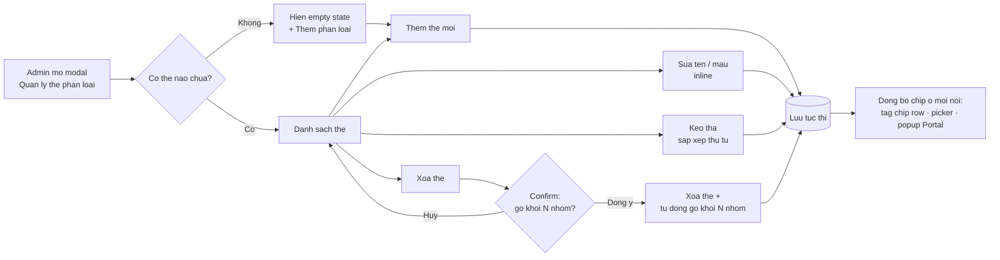

# #30 — Quản lý thẻ phân loại nhóm NCC

> **Trạng thái:** draft
> **Nguồn:** scope-and-features.md § F.30 · FSD-Admin-Site.md § 4 (modal cross-page `TagManagementModal`)

---

## 📌 Tóm tắt 1 dòng

Admin tạo / sửa / xóa / sắp xếp thứ tự danh sách thẻ phân loại nhóm NCC trong một modal dùng chung, để chuẩn hóa cách gắn nhãn và lọc nhóm nhà cung cấp ở mọi nơi.

---

## 🎯 Giá trị nghiệp vụ

Khi số lượng nhóm nhà cung cấp (NCC) tăng lên, việc tìm đúng nhóm theo loại hình kinh doanh (nhà sản xuất, nhà phân phối, dịch vụ…) trở nên chậm. Nếu mỗi nhân viên tự đặt nhãn tùy ý thì danh sách thẻ loạn, không lọc nhất quán được.

Tính năng này cho Admin một nơi tập trung duy nhất để **định nghĩa bộ thẻ phân loại chuẩn** — đặt tên, chọn màu, sắp xếp thứ tự ưu tiên. Bộ thẻ này được tiêu thụ ở mọi giao diện liên quan: hàng chip lọc trên trang Quản lý nhóm NCC, picker gắn thẻ cho từng nhóm, và popup lọc hội thoại trên Chat Portal (xem #31). Thứ tự thẻ do Admin sắp xếp quyết định trật tự hiển thị chip ở khắp nơi.

Điểm quan trọng về dữ liệu: xóa một thẻ sẽ **tự động gỡ thẻ đó khỏi mọi nhóm đang gắn**, nên modal phải cảnh báo rõ số nhóm bị ảnh hưởng trước khi Admin xác nhận.

**Lợi ích:**

- Bộ thẻ thống nhất toàn hệ thống → lọc nhóm/hội thoại nhất quán giữa Admin Site và Chat Portal.
- Admin tự chủ tạo/sửa/xóa/sắp xếp thẻ, không cần dev can thiệp.
- Thao tác lưu tức thì, phản ánh ngay lên mọi giao diện đang dùng thẻ.

---

## 👥 Vai trò liên quan

| Vai trò | Trách nhiệm |
| ------- | ----------- |
| **Admin** | Người duy nhất được tạo / sửa / xóa / sắp xếp thẻ phân loại trong modal. |
| **Hệ thống** | Pre-seed 5 thẻ mặc định khi khởi tạo lần đầu; tự động gỡ thẻ khỏi các nhóm khi thẻ bị xóa; đồng bộ tên/màu/thứ tự thẻ tới mọi giao diện tiêu thụ tức thì. |
| **Staff** | Không quản lý thẻ ở đây; chỉ tiêu thụ kết quả (gắn thẻ cho nhóm, lọc theo thẻ — xem #31). |

---

## 🔄 Dòng chảy nghiệp vụ

Admin mở modal **Quản lý thẻ phân loại** từ header trang Nhóm NCC (hoặc từ link nhanh ở Chat Portal), rồi thực hiện một trong các thao tác CRUD / sắp xếp. Mọi thao tác lưu tức thì, không cần nút "Lưu" tổng.



---

## ✅ Kịch bản chấp nhận

```gherkin
# language: vi
Tính năng: Quản lý thẻ phân loại nhóm NCC

  Bối cảnh:
    Biết người dùng có vai trò Admin
    Và Admin đang mở modal "Quản lý thẻ phân loại"

  # ===== Khởi tạo & hiển thị =====

  Tình huống: Hệ thống pre-seed 5 thẻ mặc định khi khởi tạo lần đầu
    Biết hệ thống chưa từng có thẻ phân loại nào
    Khi hệ thống khởi tạo bộ thẻ lần đầu
    Thì danh sách hiển thị đúng 5 thẻ mặc định theo thứ tự
    Và mỗi thẻ có màu tương ứng

  Khung tình huống: 5 thẻ mặc định và màu
    Thì thẻ "<tên>" có màu "<màu>"

    Dữ liệu:
      | tên           | màu        |
      | Nhà sản xuất  | đỏ         |
      | Nhà phân phối | cam        |
      | Nhà nhập khẩu | xanh dương |
      | Dịch vụ       | xanh lá    |
      | Thiết yếu     | tím        |

  Tình huống: Admin được phép sửa và xóa cả thẻ mặc định
    Biết danh sách đang có 5 thẻ mặc định
    Khi Admin sửa hoặc xóa một thẻ mặc định
    Thì hệ thống cho phép thao tác như với thẻ thường
    Và không có thẻ nào được bảo vệ khỏi chỉnh sửa

  # ===== Tạo thẻ (FR-TAG.1) =====

  Tình huống: Thêm thẻ mới
    Khi Admin nhấn "+ Thêm phân loại"
    Thì một row thẻ mới được thêm vào cuối danh sách
    Và row đó ở chế độ chỉnh sửa với ô nhập tên đang focus
    Và màu mặc định là màu đầu tiên trong bảng màu

  Tình huống: Lưu thẻ mới sau khi nhập tên
    Biết Admin vừa thêm một row thẻ mới đang ở chế độ chỉnh sửa
    Khi Admin nhập tên hợp lệ và nhấn "✓"
    Thì thẻ được lưu tức thì
    Và thẻ mới xuất hiện trong danh sách

  Tình huống: Hủy tạo thẻ mới
    Biết Admin vừa thêm một row thẻ mới đang ở chế độ chỉnh sửa
    Khi Admin nhấn "✕"
    Thì row thẻ mới bị loại bỏ
    Và danh sách trở về như trước khi thêm

  # ===== Sửa thẻ (FR-TAG.1, FR-TAG.5) =====

  Tình huống: Vào chế độ chỉnh sửa inline
    Biết Admin đang hover lên một row thẻ
    Khi Admin nhấn icon "✎"
    Thì row chuyển sang chế độ chỉnh sửa inline
    Và hiển thị ô nhập tên cùng bảng chọn màu

  Tình huống: Bảng màu chỉ có đúng 8 màu cố định
    Biết một row thẻ đang ở chế độ chỉnh sửa
    Khi Admin mở bảng chọn màu
    Thì hệ thống hiển thị đúng 8 màu cố định: đỏ, cam, vàng, xanh lá, xanh dương, tím, hồng, xám
    Và Admin không thể nhập mã màu HEX tự do

  Tình huống: Đổi tên và màu thẻ áp dụng tức thì lên mọi giao diện
    Biết thẻ "Dịch vụ" đang được hiển thị ở tag chip row và picker
    Khi Admin đổi tên thành "Dịch vụ logistics" và đổi màu rồi nhấn "✓"
    Thì chip thẻ cập nhật ngay trên tag chip row, picker và popup lọc Chat Portal

  # ===== Validation tên (FR-TAG.7) =====

  Tình huống: Không cho lưu thẻ với tên rỗng
    Biết một row thẻ đang ở chế độ chỉnh sửa
    Khi Admin để trống tên và cố lưu
    Thì hệ thống không cho lưu
    Và thẻ vẫn ở chế độ chỉnh sửa

  Tình huống: Tự cắt khoảng trắng thừa và giới hạn 30 ký tự
    Biết một row thẻ đang ở chế độ chỉnh sửa
    Khi Admin nhập tên có khoảng trắng đầu/cuối
    Thì hệ thống tự cắt khoảng trắng khi lưu
    Và giới hạn độ dài tên tối đa 30 ký tự

  Tình huống: Cho phép hai thẻ trùng tên
    Biết danh sách đã có thẻ "Dịch vụ"
    Khi Admin tạo một thẻ khác cũng tên "Dịch vụ"
    Thì hệ thống vẫn cho lưu
    Và không báo lỗi trùng tên

  # ===== Sắp xếp thứ tự (FR-TAG.2) =====

  Tình huống: Kéo thả sắp xếp lại thứ tự thẻ
    Biết danh sách có nhiều thẻ
    Khi Admin kéo drag handle "⋮⋮" của một thẻ và thả vào vị trí mới
    Thì thứ tự thẻ được cập nhật theo vị trí mới
    Và thứ tự chip cập nhật tương ứng ở tag chip row, picker và popup lọc Portal

  Tình huống: Phản hồi trực quan khi kéo thả
    Biết Admin đang kéo một row thẻ
    Khi row đang được kéo
    Thì row nguồn hiển thị mờ đi
    Và vị trí thả được tô nền nhấn mạnh

  Tình huống: Kéo thả khi chỉ có 1 thẻ không gây lỗi
    Biết danh sách chỉ có đúng 1 thẻ
    Khi Admin kéo thả thẻ đó
    Thì không có thay đổi nào xảy ra
    Và hệ thống không bị lỗi

  # ===== Gắn thẻ cho nhóm (FR-TAG.3) =====

  Tình huống: Mỗi nhóm chỉ gắn tối đa 1 thẻ
    Biết một nhóm NCC chưa gắn thẻ nào
    Khi Admin chọn một thẻ trong picker của nhóm
    Thì nhóm được gắn đúng thẻ đó
    Và nhóm không thể gắn thêm thẻ thứ hai cùng lúc

  Tình huống: Click lại thẻ đang gắn để bỏ thẻ
    Biết một nhóm NCC đang gắn thẻ "Nhà phân phối"
    Khi Admin click lại thẻ "Nhà phân phối" trong picker
    Thì thẻ bị gỡ khỏi nhóm
    Và nhóm trở về trạng thái chưa gắn thẻ

  # ===== Xóa thẻ & cascade (FR-TAG.4) — Trường hợp đặc biệt =====

  Tình huống: Cảnh báo số nhóm bị ảnh hưởng trước khi xóa
    Biết thẻ "Dịch vụ" đang được gắn cho 7 nhóm
    Khi Admin nhấn icon "🗑" trên row thẻ "Dịch vụ"
    Thì hệ thống hiện hộp xác nhận nêu rõ "Xóa thẻ này sẽ gỡ thẻ khỏi 7 nhóm đang gắn. Tiếp tục?"

  Tình huống: Xóa thẻ tự động gỡ khỏi tất cả nhóm đang gắn
    Biết thẻ "Dịch vụ" đang được gắn cho 7 nhóm
    Khi Admin xác nhận xóa thẻ "Dịch vụ"
    Thì thẻ "Dịch vụ" bị xóa khỏi danh sách
    Và cả 7 nhóm tự động được gỡ thẻ mà không cần xác nhận từng nhóm
    Và 7 nhóm đó trở về trạng thái chưa gắn thẻ

  Tình huống: Hủy xóa thẻ giữ nguyên mọi gán thẻ
    Biết thẻ "Dịch vụ" đang được gắn cho 7 nhóm
    Khi Admin nhấn "🗑" rồi chọn "Hủy" trong hộp xác nhận
    Thì thẻ "Dịch vụ" vẫn còn trong danh sách
    Và 7 nhóm vẫn giữ nguyên thẻ

  Tình huống: Xóa thẻ đang là filter active làm filter reset
    Biết thẻ "Dịch vụ" đang được chọn làm bộ lọc trên tag chip row
    Khi Admin xóa thẻ "Dịch vụ"
    Thì chip thẻ đó biến mất khỏi tag chip row
    Và bộ lọc tự động trở về "Tất cả"

  # ===== Empty state =====

  Tình huống: Modal mở khi chưa có thẻ nào
    Biết hệ thống hiện không còn thẻ phân loại nào
    Khi Admin mở modal "Quản lý thẻ phân loại"
    Thì modal hiển thị empty state "Chưa có thẻ phân loại. Nhấn '+ Thêm phân loại' để bắt đầu."

  Tình huống: Xóa thẻ cuối cùng hiển thị empty state
    Biết danh sách chỉ còn đúng 1 thẻ
    Khi Admin xóa thẻ đó
    Thì modal chuyển sang empty state
    Và tag chip row trên trang Nhóm NCC chỉ còn lại chip "Tất cả"
```

---

## 🎨 Mô tả giao diện

Modal `TagManagementModal` là modal cross-page — cùng một modal được mở từ cả Admin Site lẫn Chat Portal, dùng chung business logic.

### Cấu trúc modal

```
┌─────────────────────────────────────────────┐
│  Quản lý thẻ phân loại                    ✕  │
├─────────────────────────────────────────────┤
│  DANH SÁCH THẺ PHÂN LOẠI                     │
│                                             │
│  ⋮⋮  ● Nhà sản xuất            (hover: ✎ 🗑) │
│  ⋮⋮  ● Nhà phân phối           (hover: ✎ 🗑) │
│  ⋮⋮  ● Nhà nhập khẩu           (hover: ✎ 🗑) │
│  ⋮⋮  ● Dịch vụ                 (hover: ✎ 🗑) │
│  ⋮⋮  ● Thiết yếu               (hover: ✎ 🗑) │
│                                             │
│  + Thêm phân loại                           │
└─────────────────────────────────────────────┘
```

### Các thành phần

| Thành phần | Nội dung | Ghi chú |
| --- | --- | --- |
| Header | Tiêu đề "Quản lý thẻ phân loại" + nút ✕ đóng | — |
| Section label | "DANH SÁCH THẺ PHÂN LOẠI" (uppercase, font nhỏ) | — |
| Row thẻ | Drag handle ⋮⋮ + dot màu + tên thẻ | Icon ✎ Pencil + 🗑 Trash hiện khi hover |
| Footer | Text-link "+ Thêm phân loại" (màu xanh) | Append row mới ở cuối, vào edit mode ngay |

### Trạng thái của một row

| Trạng thái | Hiển thị |
| --- | --- |
| Mặc định | Drag handle + dot màu + tên |
| Hover | Hiện thêm icon ✎ và 🗑 ở cuối row |
| Inline edit | Ô nhập tên + mini color picker (8 màu) + nút ✓ lưu / ✕ huỷ |
| Đang kéo (drag source) | Row mờ đi (opacity giảm) |
| Drop target | Nền xanh nhạt + viền nhấn mạnh |

### Bảng màu (8 màu cố định)

```
● đỏ   ● cam   ● vàng   ● xanh lá   ● xanh dương   ● tím   ● hồng   ● xám
```

> Không cho Admin nhập mã màu HEX tự do — chỉ chọn trong 8 màu này.

### Các trạng thái đặc biệt

- **Empty state:** "Chưa có thẻ phân loại. Nhấn '+ Thêm phân loại' để bắt đầu."
- **Confirm dialog xóa:** "Xóa thẻ này sẽ gỡ thẻ khỏi N nhóm đang gắn. Tiếp tục?" (N = số nhóm đang gắn thẻ).

### Mockup tham chiếu

> ✅ **Đã có:** modal hiển thị 5 thẻ mặc định với drag handle + dot màu + tên + footer "+ Thêm phân loại".
> ⏳ **Cần BA bổ sung:** (1) state inline edit (ô nhập tên + mini color picker 8 màu), (2) state confirm dialog xóa thẻ với cảnh báo số nhóm bị ảnh hưởng.

---

## 🔗 Tham chiếu & Q&A

### Liên quan các phần khác

- **#31 Lọc hội thoại NCC theo thẻ (Chat Portal):** `31-loc-hoi-thoai-theo-the.md` — popup "Phân loại" trên sidebar có link nhanh mở chính modal này; xóa/sửa thẻ ở đây phản ánh ngay vào popup lọc.
- **#31a Lọc nhóm NCC theo thẻ (Admin Site):** `31a-loc-nhom-ncc-admin-site.md` — tag chip row ở đầu trang Nhóm NCC tiêu thụ danh sách + thứ tự thẻ; xóa thẻ đang active → filter reset về "Tất cả".
- **#22 Quản lý nhóm NCC:** `22-quan-ly-nhom-ncc.md` — header trang chứa nút "Quản lý thẻ phân loại" mở modal này; more menu (⋯) của từng row có picker gắn thẻ single-select.

### ⚠️ Q&A cần BA / PO làm rõ

1. **Màu của 2 thẻ mặc định "Nhà nhập khẩu" và "Dịch vụ" — nguồn nào đúng?**
   - `scope-and-features.md` § F.30 chỉ liệt kê tên 5 thẻ, **không** ghi màu.
   - `FSD-Admin-Site.md` § 4 (FR-TAG.6) ghi rõ: Nhà nhập khẩu = **xanh dương**, Dịch vụ = **xanh lá**.
   - **Pilot hiện đang theo:** bảng màu trong FSD-Admin-Site (đã dùng trong Gherkin & UI ở trên). Cần BA xác nhận đây là màu chốt.

2. **Số ký tự tối đa của tên thẻ — 30 ký tự có đủ không?**
   - FR-TAG.7 quy định tối đa 30 ký tự. Một số tên ngành nghề tiếng Việt có dấu có thể dài hơn (vd "Nhà cung cấp nguyên vật liệu thô").
   - **Pilot hiện đang theo:** giới hạn 30 ký tự. Cần BA xác nhận hoặc nâng giới hạn.

3. **Quyền truy cập modal — chỉ Admin hay Staff cũng mở được?**
   - Nguồn ghi Actors = Admin. Nhưng modal accessible từ Chat Portal (link nhanh trong popup lọc #31) mà Chat Portal có cả Staff sử dụng.
   - Phương án A: Staff mở được modal nhưng chỉ xem (read-only), không CRUD.
   - Phương án B: Staff không thấy link "Quản lý thẻ phân loại" trong popup; chỉ Admin thấy.
   - **Pilot hiện đang theo:** chưa quyết. Cần BA/PO xác nhận hành vi cho Staff khi mở từ Chat Portal.

4. **Drag-and-drop có cần hỗ trợ cảm ứng (touch / mobile) không?**
   - FR-TAG.2 chỉ yêu cầu reorder bằng chuột, không cần keyboard accessibility cho Phase 2.
   - **Pilot hiện đang theo:** chỉ hỗ trợ chuột (desktop). Cần BA xác nhận modal này không cần dùng trên mobile/tablet.
