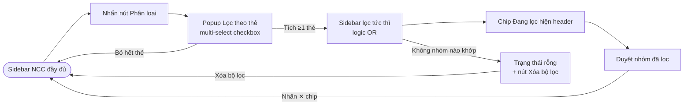

# #31 — Lọc hội thoại NCC theo thẻ phân loại (Chat Portal)

> **Trạng thái:** draft
> **Nguồn:** [`../scope-and-features.md § C (#31)`](../scope-and-features.md) (canonical) · [`../FSD-Chat-Portal.md § 4.6`](../FSD-Chat-Portal.md)
> **Liên quan:** [`#31a Lọc nhóm NCC theo thẻ phân loại (Admin Site)`](31a-loc-nhom-ncc-admin-site.md) · [`#30 Quản lý thẻ phân loại nhóm NCC`](../scope-and-features.md) · [`#12 Ghim hội thoại`](12-ghim-hoi-thoai.md) · [`#26 Đặt tên hiển thị nhóm`](26-dat-ten-hien-thi-nhom-chat.md)

---

## 📌 Tóm tắt 1 dòng

Nhân viên và Quản trị viên nhấn nút **"Phân loại"** trên sidebar Chat Portal để mở popup chọn nhiều thẻ cùng lúc, thu gọn danh sách nhóm NCC chỉ còn các nhóm thuộc phân khúc đang cần.

---

## 🎯 Giá trị nghiệp vụ

Khi số lượng nhóm NCC tăng lên (hàng chục đến hàng trăm nhóm), sidebar phẳng trở nên khó dùng — Nhân viên phải cuộn tìm đúng nhóm mình cần xử lý, dễ sót. Mỗi nhóm đã được gắn một thẻ phân loại thể hiện phân khúc nhà cung cấp (xem [`#30`](../scope-and-features.md)); tính năng này tận dụng thẻ đó làm bộ lọc tức thì ngay trên sidebar.

Nhân viên phụ trách nhóm "Dịch vụ" chỉ cần tích thẻ đó trong popup — sidebar thu gọn ngay lập tức, không cần tải lại trang. Vì bộ lọc hỗ trợ **multi-select OR**, Nhân viên kiêm nhiều phân khúc có thể chọn cùng lúc. Bộ lọc cũng tự đồng bộ khi Quản trị viên đổi tên/màu/xóa thẻ trong [`#30`](../scope-and-features.md) — không bao giờ "treo" bộ lọc cũ.

**Lợi ích:**

- Tìm đúng nhóm nhanh hơn trong danh sách dài, giảm thao tác cuộn.
- Multi-select OR phù hợp với Nhân viên kiêm nhiều phân khúc.
- Bộ lọc nhất quán với tập thẻ Admin quản lý tập trung.

---

## 👥 Vai trò liên quan

| Vai trò | Trách nhiệm |
| --- | --- |
| **Nhân viên (Staff)** | Mở popup "Phân loại", chọn một hoặc nhiều thẻ để lọc sidebar. Không thấy link "Quản lý thẻ phân loại". |
| **Quản trị (Admin)** | Dùng popup tương tự Staff. Thêm quyền thấy link nhanh "Quản lý thẻ phân loại" ở cuối popup để mở modal [`#30`](../scope-and-features.md). |
| **Hệ thống** | Hiển thị danh sách thẻ theo thứ tự Admin sắp xếp · Lọc sidebar theo thẻ đang chọn (OR) · Duy trì trạng thái bộ lọc per-user trong phiên làm việc · Cập nhật tức thì khi thẻ bị đổi tên/màu/xóa. |

---

## 🔄 Dòng chảy nghiệp vụ



---

## ✅ Kịch bản chấp nhận

```gherkin
# language: vi
Tính năng: Lọc hội thoại NCC theo thẻ phân loại trên Chat Portal

  Bối cảnh:
    Biết hệ thống đang có các thẻ phân loại do Quản trị viên định nghĩa
    Và mỗi nhóm NCC được gắn tối đa 1 thẻ tại một thời điểm
    Và người dùng đang ở tab NCC của sidebar Chat Portal

  # =====================================================
  # Mở popup "Phân loại"
  # =====================================================

  Tình huống: Sidebar NCC có nút "Phân loại" ở header
    Biết người dùng đang ở tab NCC
    Khi sidebar load xong
    Thì header sidebar hiển thị nút "Phân loại" kèm biểu tượng bộ lọc

  Tình huống: Mở popup "Lọc theo thẻ" liệt kê toàn bộ thẻ
    Khi người dùng nhấn nút "Phân loại"
    Thì popup "Lọc theo thẻ" mở ra
    Và liệt kê tất cả thẻ phân loại, mỗi dòng kèm checkbox, chấm màu và tên thẻ
    Và thứ tự thẻ theo đúng thứ tự Quản trị viên đã sắp xếp

  Tình huống: Admin thấy link nhanh "Quản lý thẻ phân loại" trong popup
    Biết popup "Lọc theo thẻ" đang mở
    Khi Quản trị viên xem popup
    Thì cuối popup hiển thị link "Quản lý thẻ phân loại"

  Tình huống: Nhân viên không thấy link "Quản lý thẻ phân loại"
    Biết popup "Lọc theo thẻ" đang mở
    Khi Nhân viên (không phải Quản trị viên) xem popup
    Thì popup không hiển thị link "Quản lý thẻ phân loại"

  # =====================================================
  # Logic lọc multi-select (OR)
  # =====================================================

  Tình huống: Chọn 1 thẻ lọc sidebar tức thì
    Biết popup "Lọc theo thẻ" đang mở
    Khi Nhân viên tích chọn thẻ "Dịch vụ"
    Thì sidebar chỉ hiển thị các nhóm được gắn thẻ "Dịch vụ"
    Và header sidebar hiển thị chip "Đang lọc: Dịch vụ ✕"

  Tình huống: Chọn nhiều thẻ áp dụng logic OR
    Biết Nhân viên đã chọn thẻ "Dịch vụ"
    Khi Nhân viên tích chọn thêm thẻ "Nhà sản xuất"
    Thì sidebar hiển thị các nhóm được gắn "Dịch vụ" hoặc "Nhà sản xuất"
    Và header sidebar hiển thị chip "Đang lọc: 2 thẻ ✕"

  Tình huống: Bỏ chọn một thẻ đang active
    Biết Nhân viên đang lọc theo "Dịch vụ" và "Nhà sản xuất"
    Khi Nhân viên bỏ tích thẻ "Nhà sản xuất"
    Thì sidebar chỉ còn hiển thị nhóm gắn thẻ "Dịch vụ"
    Và chip header chuyển về "Đang lọc: Dịch vụ ✕"

  Tình huống: Xóa toàn bộ bộ lọc bằng nút ✕ trên chip
    Biết sidebar đang lọc theo ít nhất 1 thẻ
    Khi Nhân viên nhấn ✕ trên chip "Đang lọc"
    Thì bộ lọc bị xóa hoàn toàn
    Và sidebar trở về danh sách nhóm đầy đủ

  Tình huống: Đóng popup vẫn giữ nguyên bộ lọc đang áp dụng
    Biết Nhân viên đã chọn thẻ "Dịch vụ" trong popup
    Khi Nhân viên đóng popup (nhấn ra ngoài hoặc nhấn lại "Phân loại")
    Thì bộ lọc theo "Dịch vụ" vẫn còn hiệu lực
    Và chip "Đang lọc: Dịch vụ ✕" vẫn hiển thị trên header

  Tình huống: Bộ lọc thẻ cũng áp dụng cho nhóm đã ghim
    Biết một nhóm đã ghim không được gắn thẻ "Dịch vụ"
    Và Nhân viên đang lọc theo "Dịch vụ"
    Khi sidebar cập nhật
    Thì nhóm đã ghim đó cũng bị ẩn dù nằm ở section "Đã ghim"

  # =====================================================
  # Lưu trạng thái bộ lọc
  # =====================================================

  Tình huống: Bộ lọc giữ nguyên khi tải lại trang trong cùng phiên
    Biết Nhân viên đang lọc theo "Dịch vụ"
    Khi Nhân viên nhấn F5 hoặc đóng và mở lại tab trong cùng phiên
    Thì bộ lọc theo "Dịch vụ" vẫn được giữ nguyên

  Tình huống: Bộ lọc reset khi mở lại sau khi đóng hẳn trình duyệt
    Biết Nhân viên đang lọc theo "Dịch vụ"
    Khi Nhân viên đóng hẳn trình duyệt rồi mở lại Chat Portal
    Thì bộ lọc trở về trạng thái không lọc (danh sách đầy đủ)

  # =====================================================
  # Đồng bộ khi thẻ thay đổi
  # =====================================================

  Khung tình huống: Bộ lọc cập nhật tức thì khi thẻ bị đổi tên hoặc màu
    Biết bộ lọc đang active theo một thẻ
    Khi Quản trị viên "<thay_doi>" thẻ đó trong modal Quản lý thẻ phân loại
    Thì nhãn/màu của thẻ trên chip "Đang lọc" và trong popup cập nhật tức thì

    Dữ liệu:
      | thay_doi |
      | đổi tên  |
      | đổi màu  |

  Tình huống: Xóa thẻ đang được lọc làm bộ lọc tự reset
    Biết bộ lọc đang active theo thẻ "Dịch vụ"
    Khi Quản trị viên xóa thẻ "Dịch vụ" trong modal Quản lý thẻ phân loại
    Thì bộ lọc tự động trở về trạng thái không lọc (danh sách đầy đủ)
    Và thẻ "Dịch vụ" biến mất khỏi popup

  # =====================================================
  # Trường hợp đặc biệt
  # =====================================================

  Tình huống: Hệ thống chưa có thẻ phân loại nào
    Biết hệ thống chưa có thẻ phân loại nào
    Khi Nhân viên mở popup "Lọc theo thẻ"
    Thì popup hiển thị trạng thái rỗng "Chưa có thẻ phân loại"
    Và chỉ Quản trị viên thấy link "Quản lý thẻ phân loại"

  Tình huống: Không có nhóm nào khớp bộ lọc
    Biết Nhân viên đang lọc theo một thẻ không nhóm nào gắn
    Khi sidebar cập nhật
    Thì sidebar hiển thị trạng thái rỗng "Không có hội thoại nào với các thẻ này"
    Và có nút "Xóa bộ lọc"

  Tình huống: Nhóm chưa gắn thẻ bị ẩn khi đang lọc
    Biết một nhóm chưa được gắn thẻ nào
    Và bộ lọc đang active theo một thẻ bất kỳ
    Khi sidebar cập nhật
    Thì nhóm chưa gắn thẻ đó không xuất hiện
    Nhưng vẫn xuất hiện trở lại khi bộ lọc về trạng thái không lọc

  Tình huống: Nhóm đang mở vẫn được giữ khi sau lọc không còn khớp
    Biết Nhân viên đang đọc một nhóm trong cửa sổ chat
    Khi Nhân viên áp dụng bộ lọc khiến nhóm đó không còn match
    Thì sidebar ẩn nhóm đó khỏi danh sách
    Nhưng cửa sổ chat vẫn giữ nguyên nhóm đang đọc, không bị đẩy ra
```

---

## 🎨 Mô tả giao diện

### Cấu trúc sidebar khi bộ lọc active

```
┌─ Sidebar NCC ───────────────────────────┐
│ [ Tìm kiếm hội thoại... ]   [Phân loại ▼]│   ← nút "Phân loại" ở header
│ Đang lọc: Dịch vụ ✕                      │   ← chip tóm tắt khi filter active
│ ── Đã ghim ──                            │
│   • NCC Vận Chuyển Phương Nam            │
│ ── Tất cả ──                             │
│   • NCC Thực Phẩm Sạch                   │
│   • ...                                  │
└──────────────────────────────────────────┘
```

### Popup "Lọc theo thẻ"

```
┌─ Lọc theo thẻ ──────────────┐
│ ☑ ● Dịch vụ                 │   ← checkbox multi-select + chấm màu
│ ☐ ● Nhà sản xuất            │
│ ☐ ● Nhà phân phối           │
│ ☐ ● Nhà nhập khẩu           │
│ ☐ ● Thiết yếu               │
│ ───────────────────         │
│ Quản lý thẻ phân loại  →    │   ← chỉ Admin thấy
└──────────────────────────────┘
```

| Thành phần | Mô tả |
| --- | --- |
| **Nút "Phân loại"** | Ở header sidebar tab NCC, kèm biểu tượng bộ lọc. Click → mở/đóng popup. |
| **Danh sách thẻ** | Mỗi dòng: checkbox + chấm màu + tên thẻ. **Multi-select**. Thứ tự theo sắp xếp của Admin. |
| **Chip "Đang lọc"** | Trên header sidebar khi có ≥ 1 thẻ active: "Đang lọc: [tên thẻ] ✕" (1 thẻ) hoặc "Đang lọc: N thẻ ✕" (nhiều thẻ). Nhấn ✕ → xóa toàn bộ bộ lọc. |
| **Link "Quản lý thẻ phân loại"** | Cuối popup, **chỉ Admin** thấy. Click → mở modal [`#30`](../scope-and-features.md). |
| **Cập nhật** | Real-time sau mỗi lần tích/bỏ tích — không cần nút "Áp dụng". |

### Mockup tham chiếu

> ✅ **Đã có (theo BA):**
> - Sidebar NCC với nút "Phân loại" ở header.
> - Popup "Lọc theo thẻ" liệt kê thẻ với checkbox multi-select + link Quản lý (chỉ Admin).
> - Chip "Đang lọc: [tên thẻ] ✕" / "Đang lọc: N thẻ ✕".
>
> ⏳ **Cần BA bổ sung:**
> - Trạng thái rỗng popup "Chưa có thẻ phân loại".
> - Trạng thái rỗng sidebar "Không có hội thoại nào với các thẻ này".

---

## 🔗 Tham chiếu & Q&A

### Liên quan các phần khác

- [`#31a Lọc nhóm NCC theo thẻ (Admin Site)`](31a-loc-nhom-ncc-admin-site.md): cùng nghiệp vụ lọc theo thẻ nhưng trên bề mặt Admin Site; dùng single-select chip thay vì multi-select popup.
- [`#30 Quản lý thẻ phân loại nhóm NCC`](../scope-and-features.md): nguồn tạo/sửa/xóa/sắp xếp thẻ. Tính năng #31 chỉ tiêu thụ tập thẻ này để lọc.
- [`#12 Ghim hội thoại`](12-ghim-hoi-thoai.md): bộ lọc thẻ áp dụng cho cả nhóm đã ghim — ghim không miễn trừ bộ lọc.
- [`#26 Đặt tên hiển thị nhóm`](26-dat-ten-hien-thi-nhom-chat.md): tên nhóm hiển thị trong sidebar đã lọc là tên override (nếu có).
- Chi tiết FR nguồn: [`../FSD-Chat-Portal.md § 4.6 (FR-31.1 → FR-31.8)`](../FSD-Chat-Portal.md).

### ⚠️ Q&A cần BA / PO làm rõ

1. **Vì sao Chat Portal cho phép multi-select còn Admin Site chỉ single-select?**
   - Mỗi nhóm chỉ gắn tối đa 1 thẻ (FR-TAG.3), nên multi-select OR ở Portal = "hiện nhóm thuộc bất kỳ thẻ nào trong các thẻ đã chọn". Admin Site giới hạn 1 thẻ → chỉ soi từng phân khúc/lần.
   - **Câu hỏi:** Đây là quyết định thiết kế có chủ đích (Portal cần gộp nhiều phân khúc, Admin chỉ soi từng phân khúc) hay là khác biệt vô tình? Nếu muốn nhất quán, nên thống nhất cả hai về cùng một kiểu chọn.
   - **Pilot hiện đang theo:** Giữ đúng từng tài liệu nguồn (Portal multi-select, Admin single-select). Cần BA/PO xác nhận.

2. **Có thẻ mặc định gắn sẵn khi nhóm mới đồng bộ không?**
   - Nguồn #30 nêu 5 thẻ mặc định của hệ thống nhưng đó là thẻ có sẵn để chọn, không có nghĩa nhóm mới được auto-gán.
   - **Pilot hiện đang theo:** Nhóm mới đồng bộ về chưa gắn thẻ → bị ẩn khi đang lọc, chỉ hiện khi không lọc. Cần BA/PO xác nhận không có auto-gán.
