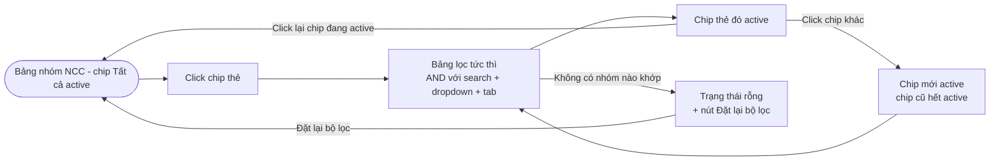

# #31a — Lọc nhóm NCC theo thẻ phân loại (Admin Site)

> **Trạng thái:** draft
> **Nguồn:** [`../scope-and-features.md § C (#31)`](../scope-and-features.md) (canonical) · [`../FSD-Admin-Site.md § 3.7`](../FSD-Admin-Site.md)
> **Liên quan:** [`#31 Lọc hội thoại NCC theo thẻ (Chat Portal)`](31-loc-hoi-thoai-theo-the.md) · [`#30 Quản lý thẻ phân loại nhóm NCC`](../scope-and-features.md)

---

## 📌 Tóm tắt 1 dòng

Quản trị viên click một chip thẻ trên hàng chip đầu trang "Quản lý nhóm NCC" (Admin Site) để lọc bảng chỉ còn các nhóm thuộc phân khúc cần rà soát.

---

## 🎯 Giá trị nghiệp vụ

Trang Quản lý nhóm NCC chứa danh sách toàn bộ nhóm của công ty. Khi số lượng nhóm lớn, Quản trị viên thường làm việc theo phân khúc: rà soát cấu hình ẩn SĐT cho tất cả nhóm "Nhà phân phối", hoặc kiểm tra quyền tải của nhóm "Thiết yếu". Cuộn và tìm kiếm từng nhóm riêng lẻ chậm và thiếu ngữ cảnh tổng thể.

Hàng chip thẻ ngay dưới tab ẩn SĐT cho phép thu gọn bảng về 1 phân khúc bằng một cú click. Bộ lọc này cộng dồn với ô tìm kiếm tên nhóm, dropdown tài khoản và tab ẩn SĐT — giúp khoanh vùng chính xác đến từng tổ hợp cần rà soát.

**Lợi ích:**

- Rà soát cấu hình theo phân khúc nhanh hơn, không bị lẫn nhóm không liên quan.
- Kết hợp được với các bộ lọc khác (search, tab ẩn SĐT) mà không cần tải lại trang.
- Đồng bộ tự động khi thẻ bị đổi tên/màu/xóa — chip luôn phản ánh đúng tập thẻ hiện tại.

---

## 👥 Vai trò liên quan

| Vai trò | Trách nhiệm |
| --- | --- |
| **Quản trị (Admin)** | Click chip thẻ để lọc bảng nhóm. Click lại chip đang active để về "Tất cả". Kết hợp với search và tab ẩn SĐT. |
| **Hệ thống** | Hiển thị hàng chip theo thứ tự Admin sắp xếp trong [`#30`](../scope-and-features.md) · Lọc bảng tức thì khi click · Cộng dồn AND với các bộ lọc khác trên trang · Cập nhật tên/màu chip khi thẻ được sửa · Tự về "Tất cả" khi thẻ đang active bị xóa. |

---

## 🔄 Dòng chảy nghiệp vụ



---

## ✅ Kịch bản chấp nhận

```gherkin
# language: vi
Tính năng: Lọc nhóm NCC theo thẻ phân loại trên Admin Site

  Bối cảnh:
    Biết Quản trị viên đã đăng nhập Admin Site
    Và Quản trị viên đang ở trang "Quản lý nhóm NCC"
    Và hệ thống đang có ít nhất một thẻ phân loại

  # =====================================================
  # Hiển thị hàng chip thẻ
  # =====================================================

  Tình huống: Trang Quản lý nhóm NCC hiển thị hàng chip thẻ
    Khi trang load xong
    Thì hàng chip thẻ hiển thị ngay dưới hàng tab ẩn SĐT
    Và chip đầu tiên là "Tất cả", đang active mặc định
    Và tiếp theo là từng chip thẻ phân loại kèm chấm màu và tên
    Và thứ tự chip theo đúng thứ tự Quản trị viên đã sắp xếp trong Quản lý thẻ phân loại

  # =====================================================
  # Logic lọc single-select
  # =====================================================

  Tình huống: Click một chip thẻ để lọc bảng
    Biết chip "Tất cả" đang active
    Khi Quản trị viên click chip "Nhà phân phối"
    Thì bảng chỉ hiển thị các nhóm được gắn thẻ "Nhà phân phối"
    Và chip "Nhà phân phối" chuyển sang trạng thái active (viền/nền nổi bật)
    Và chip "Tất cả" hết active

  Tình huống: Chỉ một thẻ được active tại một thời điểm
    Biết chip "Nhà phân phối" đang active
    Khi Quản trị viên click chip "Dịch vụ"
    Thì chip "Nhà phân phối" hết active
    Và chỉ chip "Dịch vụ" active
    Và bảng chỉ hiển thị nhóm gắn thẻ "Dịch vụ"

  Tình huống: Click lại chip đang active để bỏ lọc
    Biết chip "Dịch vụ" đang active
    Khi Quản trị viên click lại chip "Dịch vụ"
    Thì bộ lọc trở về "Tất cả"
    Và bảng hiển thị mọi nhóm
    Và chip "Tất cả" active trở lại

  # =====================================================
  # Cộng dồn với các bộ lọc khác
  # =====================================================

  Tình huống: Bộ lọc thẻ cộng dồn với tab ẩn SĐT
    Biết Quản trị viên đang ở tab "Đang ẩn SĐT"
    Khi Quản trị viên click chip thẻ "Dịch vụ"
    Thì bảng chỉ hiển thị nhóm vừa đang ẩn SĐT vừa gắn thẻ "Dịch vụ"

  Tình huống: Bộ lọc thẻ cộng dồn với ô tìm kiếm tên nhóm
    Biết Quản trị viên đã nhập "NCC Phương Nam" vào ô tìm kiếm
    Khi Quản trị viên click chip thẻ "Dịch vụ"
    Thì bảng chỉ hiển thị nhóm có tên chứa "NCC Phương Nam" và gắn thẻ "Dịch vụ"

  # =====================================================
  # Đồng bộ khi thẻ thay đổi
  # =====================================================

  Khung tình huống: Chip cập nhật tức thì khi thẻ bị đổi tên hoặc màu
    Biết chip thẻ đang hiển thị trong hàng chip
    Khi Quản trị viên "<thay_doi>" thẻ đó trong modal Quản lý thẻ phân loại
    Thì chip trong hàng cập nhật tức thì theo giá trị mới

    Dữ liệu:
      | thay_doi |
      | đổi tên  |
      | đổi màu  |

  Tình huống: Xóa thẻ đang active làm bộ lọc tự về "Tất cả"
    Biết chip "Dịch vụ" đang active
    Khi Quản trị viên xóa thẻ "Dịch vụ" trong modal Quản lý thẻ phân loại
    Thì bộ lọc tự động trở về "Tất cả"
    Và chip "Dịch vụ" biến mất khỏi hàng chip

  # =====================================================
  # Trường hợp đặc biệt
  # =====================================================

  Tình huống: Hệ thống chưa có thẻ phân loại nào
    Biết hệ thống chưa có thẻ phân loại nào
    Khi Quản trị viên mở trang "Quản lý nhóm NCC"
    Thì hàng chip chỉ còn chip "Tất cả"
    Và hiển thị link nhỏ "Quản lý thẻ phân loại" để Admin tạo thẻ đầu tiên

  Tình huống: Nhóm chưa gắn thẻ bị ẩn khi đang lọc theo thẻ
    Biết một nhóm chưa được gắn thẻ nào
    Và Quản trị viên đang lọc theo chip "Nhà sản xuất"
    Khi bảng cập nhật
    Thì nhóm chưa gắn thẻ đó không xuất hiện
    Nhưng vẫn xuất hiện trở lại khi chip "Tất cả" được chọn

  Tình huống: Không có nhóm nào khớp tổ hợp bộ lọc
    Biết Quản trị viên đang ở tab "Đang ẩn SĐT", đã nhập từ khóa tìm kiếm, và click chip thẻ
    Khi tổ hợp 3 điều kiện cho ra 0 kết quả
    Thì bảng hiển thị trạng thái rỗng "Không tìm thấy nhóm phù hợp với bộ lọc"
    Và có nút "Đặt lại bộ lọc"

  Tình huống: Nút "Đặt lại bộ lọc" xóa toàn bộ điều kiện
    Biết bảng đang ở trạng thái rỗng do tổ hợp bộ lọc quá chặt
    Khi Quản trị viên nhấn "Đặt lại bộ lọc"
    Thì tất cả bộ lọc được xóa (chip về "Tất cả", ô tìm kiếm xóa trắng, tab về "Tất cả nhóm")
    Và bảng hiển thị toàn bộ nhóm
```

---

## 🎨 Mô tả giao diện

### Cấu trúc trang Quản lý nhóm NCC

```
┌─ Quản lý nhóm NCC ─────────────────────────────────────┐
│ Nhóm NCC      [Quản lý thẻ phân loại]  N nhóm · M ẩn SĐT│
│ [search nhóm] [search nhân viên] [Tất cả tài khoản ▼]   │
│ Tất cả (N) · Đang ẩn SĐT (M) · Đang hiện SĐT (N–M)      │   ← tab ẩn SĐT
│ Tất cả · ●Nhà sản xuất · ●Dịch vụ · ●Thiết yếu · ...    │   ← hàng chip thẻ
│ ── Bảng nhóm NCC ──                                     │
└─────────────────────────────────────────────────────────┘
```

### Hàng chip thẻ

| Thành phần | Mô tả |
| --- | --- |
| **Chip "Tất cả"** | Chip đầu tiên, active mặc định. Khi không thẻ nào được chọn → "Tất cả" active. |
| **Chip thẻ** | Mỗi thẻ: chấm màu + tên. **Single-select** — chỉ 1 chip active tại 1 thời điểm. Click chip → lọc; click lại chip đang active → về "Tất cả". |
| **Vị trí** | Hàng ngang ngay dưới hàng tab ẩn SĐT. |
| **Kết hợp** | AND với ô search nhóm, dropdown tài khoản, tab ẩn SĐT. |
| **Link khi rỗng thẻ** | Khi hệ thống chưa có thẻ → hàng chip chỉ còn "Tất cả" + link nhỏ "Quản lý thẻ phân loại". |

### So sánh với Chat Portal (#31)

| Tiêu chí | **Chat Portal (#31) — popup** | **Admin Site (#31a) — chip row** |
| --- | --- | --- |
| Số thẻ chọn cùng lúc | Nhiều (multi-select) | 1 (single-select) |
| Logic khi chọn | OR — nhóm thuộc ≥ 1 thẻ | AND — nhóm thuộc đúng 1 thẻ đó |
| Kết hợp filter khác | Áp dụng cùng search sidebar + section ghim | AND với search + dropdown + tab ẩn SĐT |
| Lưu trạng thái | Per-user, per-session | Chưa spec persist — cần BA xác nhận |
| Đối tượng | Staff + Admin | Chỉ Admin |

### Mockup tham chiếu

> ✅ **Đã có (theo BA):**
> - Hàng chip thẻ Admin Site với chip "Tất cả" + các chip thẻ kèm chấm màu.
>
> ⏳ **Cần BA bổ sung:**
> - Trạng thái chip active (nền/viền nổi bật).
> - Trạng thái rỗng bảng "Không tìm thấy nhóm phù hợp với bộ lọc".
> - Hàng chip khi hệ thống chưa có thẻ (chỉ "Tất cả" + link).

---

## 🔗 Tham chiếu & Q&A

### Liên quan các phần khác

- [`#31 Lọc hội thoại NCC (Chat Portal)`](31-loc-hoi-thoai-theo-the.md): cùng nghiệp vụ lọc theo thẻ nhưng trên Chat Portal với multi-select popup.
- [`#30 Quản lý thẻ phân loại nhóm NCC`](../scope-and-features.md): nguồn tạo/sửa/xóa/sắp xếp thẻ; quy tắc mỗi nhóm gắn tối đa 1 thẻ.
- Chi tiết FR nguồn: [`../FSD-Admin-Site.md § 3.7 (FR-NHOM.25 → FR-NHOM.27)`](../FSD-Admin-Site.md).

### ⚠️ Q&A cần BA / PO làm rõ

1. **Bộ lọc chip có persist qua lần mở trang tiếp theo không?**
   - Chat Portal lưu per-user per-session ([FR-31.7](../FSD-Chat-Portal.md)). Admin Site nguồn gốc không đề cập.
   - **Phương án A:** Không persist — về "Tất cả" mỗi lần mở trang (đơn giản, nhất quán với session-only).
   - **Phương án B:** Persist per-user giống Chat Portal (tiện lợi khi rà soát theo phân khúc nhiều lần).
   - **Pilot hiện đang theo:** Phương án A (không persist). Cần BA/PO xác nhận.

2. **Vì sao Admin Site chỉ single-select trong khi Chat Portal cho phép multi-select?**
   - Xem phân tích tại [`#31 Q&A #1`](31-loc-hoi-thoai-theo-the.md). Cần BA xác nhận đây là quyết định thiết kế có chủ đích hay cần thống nhất về 1 kiểu.

3. **Có thẻ mặc định gắn sẵn khi nhóm mới đồng bộ không?**
   - Xem [`#31 Q&A #2`](31-loc-hoi-thoai-theo-the.md). Áp dụng chung cho cả hai bề mặt.
