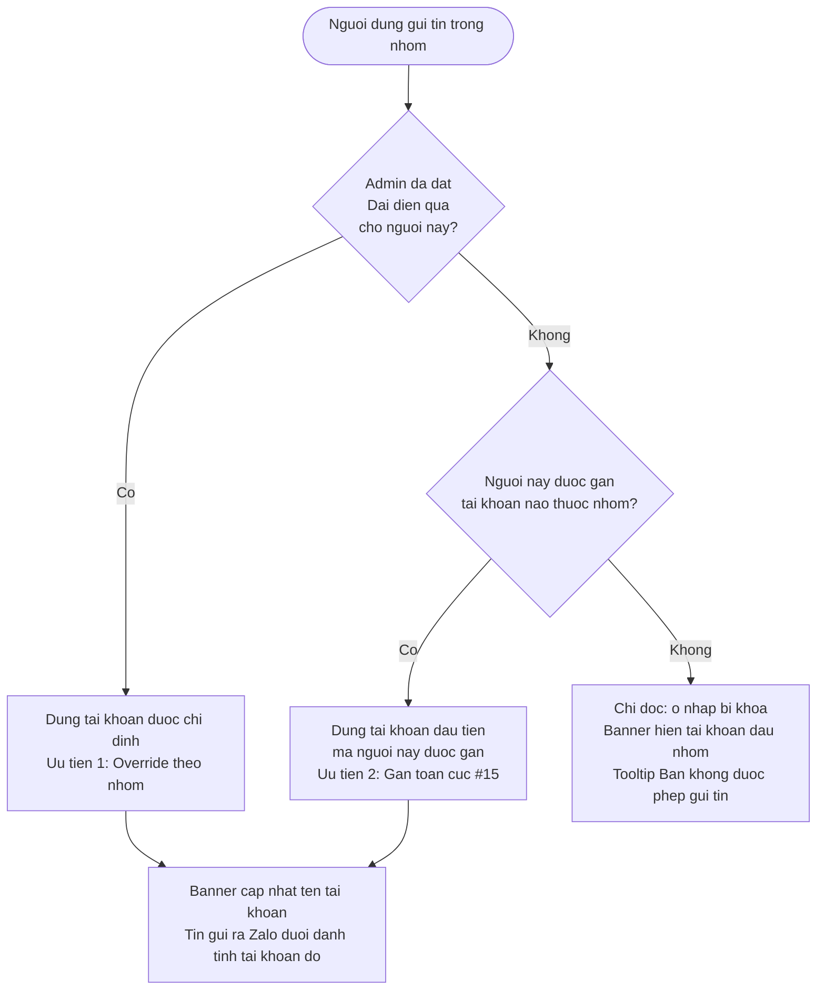

# #D.4 — [EXTRA] Multi-account cho 1 vendor group

> **Trạng thái:** draft
> **Nguồn:** [`../scope-and-features.md § D.4`](../scope-and-features.md) (canonical) · [`../FSD-Admin-Site.md § 3.4 + § 3.5`](../FSD-Admin-Site.md) (Đại diện qua + cột Tài khoản) · [`../FSD-Chat-Portal.md § 5.2 + § 5.3`](../FSD-Chat-Portal.md) (ZaloIdentityBar + Resolver)
> **Liên quan:** [`#15 Phân quyền tài khoản Zalo`](../scope-and-features.md) (§ D.1) · [`#16 Phân quyền nhóm chat`](../scope-and-features.md) (§ D.2) · `#2 Đồng bộ nhóm chat vendor` (dedupe group)

---

## 📌 Tóm tắt 1 dòng

Khi một nhóm NCC được đồng bộ qua nhiều tài khoản Zalo cùng lúc, Hệ thống tự gộp thành một nhóm duy nhất, để Admin chỉ định ai gửi tin "đại diện" cho tài khoản nào, và luôn cho Nhân viên thấy rõ mình đang gửi tin dưới danh tính tài khoản nào — nhằm tránh gửi nhầm danh tính ra Zalo.

---

## 🎯 Giá trị nghiệp vụ

> **[EXTRA]** — Tính năng này **không** nằm trong danh sách yêu cầu nghiệp vụ gốc của Phase 2. Tuy nhiên nó **bắt buộc phải có** để hệ thống chạy đúng: trong thực tế, một nhóm chat NCC trên Zalo thường có **nhiều tài khoản Zalo của công ty** cùng tham gia (ví dụ nhóm "Vận Chuyển Phương Nam" có cả "Quốc Nam - Vận Hành" và "Quốc Nam - Kho Hàng"). Nếu không xử lý, cùng một nhóm Zalo sẽ bị nhân đôi trong Portal, và khi Nhân viên gửi tin hệ thống sẽ không biết phải gửi đi dưới danh tính tài khoản nào. Vì vậy D.4 được bổ sung như một phần nền tảng của mô-đun phân quyền.

Vấn đề thực tế: mỗi tin Nhân viên gửi đi từ Portal đều xuất hiện trên Zalo dưới danh tính một **tài khoản Zalo** (đại diện công ty), chứ không phải tên Nhân viên. Khi một nhóm chỉ có 1 tài khoản thì không có gì phải băn khoăn. Nhưng khi nhóm có từ 2 tài khoản trở lên, cùng một Nhân viên có thể đủ điều kiện đại diện cho cả hai — và nếu gửi nhầm tài khoản, vendor sẽ thấy sai danh tính, gây nhầm lẫn trách nhiệm và khó truy vết.

Giải pháp gồm bốn phần. Thứ nhất, **gộp nhóm**: nhiều tài khoản cùng vào một nhóm Zalo (cùng mã nhóm) chỉ tạo ra **một** nhóm duy nhất trong Portal, danh sách tài khoản là hợp của tất cả. Thứ hai, **quy tắc chọn tài khoản đại diện** rõ ràng theo thứ tự ưu tiên, để mỗi tin luôn đi qua đúng một tài khoản. Thứ ba, **chỉ định riêng theo nhóm**: Admin có thể ấn định "trong nhóm X, Nhân viên Y luôn đại diện tài khoản Z". Thứ tư, **banner danh tính** ở đầu khung chat để Nhân viên luôn nhìn thấy mình đang đại diện tài khoản nào trước khi gõ.

**Lợi ích:**

- Một nhóm Zalo chỉ hiện một lần trong Portal dù nhiều tài khoản cùng đồng bộ — không trùng lặp, không rối.
- Mỗi tin gửi ra Zalo luôn đi qua đúng một danh tính tài khoản, có thể truy vết rõ ràng.
- Admin kiểm soát được "ai đại diện tài khoản nào trong nhóm nào" mà không cần can thiệp vào từng tin.
- Nhân viên không bao giờ gửi nhầm danh tính vì banner luôn hiển thị tài khoản đang đại diện.

---

## 👥 Vai trò liên quan

| Vai trò | Trách nhiệm |
| --- | --- |
| **Quản trị (Admin)** | Chỉ định "Đại diện qua" cho từng Nhân viên trong từng nhóm (override). Theo dõi nhóm đang được đồng bộ qua những tài khoản nào (cột "Tài khoản"). Khi áp dụng quy tắc gửi tin, Admin cũng được chọn tài khoản đại diện như Nhân viên (không có quyền vượt rào). |
| **Nhân viên (Staff)** | Gửi tin trong nhóm dưới danh tính tài khoản đại diện do hệ thống tự xác định. Nhìn banner đầu khung chat để biết đang đại diện tài khoản nào. **Không** có nút tự chọn tài khoản trong khung chat — việc đó thuộc quyền Admin. Nếu không được gán tài khoản nào trong nhóm → chỉ đọc. |
| **Vendor (phía Zalo)** | Chỉ thấy tin đến từ tên tài khoản Zalo đại diện, không thấy tên Nhân viên thật và không biết có nhiều tài khoản công ty trong nhóm. Việc gộp nhóm và banner danh tính là nội bộ Portal. |
| **Hệ thống** | Gộp các tài khoản cùng đồng bộ một nhóm Zalo thành một nhóm duy nhất · Loại trùng tin nhắn khi nhiều tài khoản cùng kéo về một tin · Xác định tài khoản đại diện theo thứ tự ưu tiên mỗi khi gửi tin · Cập nhật banner danh tính theo thời gian thực khi Admin đổi cấu hình · Xóa các chỉ định trỏ về tài khoản đã rời nhóm. |

---

## 🔄 Dòng chảy nghiệp vụ

Quy tắc xác định **tài khoản đại diện** mỗi khi một người (Nhân viên hoặc Admin) gửi tin trong nhóm có từ 2 tài khoản trở lên — 3 bước ưu tiên tuyến tính:



> Ghi chú: bước "Dự phòng" (Uu tien 3 trong tài liệu nguồn — tài khoản đầu tiên của nhóm) chỉ dùng để **hiển thị banner** cho trường hợp chỉ đọc; người dùng không thực sự gửi được tin ở trạng thái này.

---

## ✅ Kịch bản chấp nhận

```gherkin
# language: vi
Tính năng: Gộp nhóm đa tài khoản và xác định tài khoản đại diện khi gửi tin

  Bối cảnh:
    Biết nhóm "NCC Vận Chuyển Phương Nam" đang được đồng bộ qua 2 tài khoản Zalo "Quốc Nam - Vận Hành" và "Quốc Nam - Kho Hàng"
    Và hệ thống chỉ hiển thị nhóm này một lần duy nhất trong Portal

  # =====================================================
  # Gộp nhóm & loại trùng tin (scope § D.4 mô hình dữ liệu, § D.4(e))
  # =====================================================

  Tình huống: Nhiều tài khoản cùng đồng bộ một nhóm Zalo chỉ tạo một nhóm trong Portal
    Biết tài khoản "Quốc Nam - Vận Hành" và "Quốc Nam - Kho Hàng" cùng là thành viên của một nhóm chat Zalo
    Khi hệ thống đồng bộ nhóm đó về Portal
    Thì Portal chỉ hiển thị một nhóm NCC duy nhất
    Và danh sách tài khoản của nhóm là hợp của cả hai tài khoản

  Tình huống: Cùng một tin từ hai tài khoản chỉ hiện một lần
    Biết một tin của vendor được cả hai tài khoản đồng bộ kéo về
    Khi hệ thống xử lý tin đó
    Thì tin chỉ xuất hiện một lần trong khung chat
    Và không có bản trùng nào hiển thị cho người dùng

  # =====================================================
  # Quy tắc xác định tài khoản đại diện (§ D.4(a), FR-D.11→FR-D.15)
  # =====================================================

  Tình huống: Ưu tiên 1 — dùng tài khoản theo chỉ định "Đại diện qua"
    Biết Admin đã đặt "trong nhóm này, Nhân viên Lê Diễm Chi luôn đại diện Quốc Nam - Kho Hàng"
    Và Nhân viên Lê Diễm Chi cũng được gán cả tài khoản Quốc Nam - Vận Hành
    Khi Lê Diễm Chi gửi tin trong nhóm
    Thì tin đi ra Zalo dưới danh tính "Quốc Nam - Kho Hàng"

  Tình huống: Ưu tiên 2 — chưa có chỉ định thì dùng tài khoản được gán đầu tiên
    Biết Nhân viên Lê Diễm Chi chưa có chỉ định "Đại diện qua" trong nhóm
    Và Lê Diễm Chi được gán tài khoản "Quốc Nam - Vận Hành" (tài khoản đầu trong danh sách nhóm)
    Khi Lê Diễm Chi gửi tin trong nhóm
    Thì tin đi ra Zalo dưới danh tính "Quốc Nam - Vận Hành"

  Tình huống: Ưu tiên 3 / chỉ đọc — không được gán tài khoản nào trong nhóm
    Biết Nhân viên Tăng Thị Huyền không được gán bất kỳ tài khoản nào của nhóm
    Khi Tăng Thị Huyền mở nhóm
    Thì ô nhập tin bị khóa (read-only)
    Và banner hiển thị tài khoản đầu tiên của nhóm kèm nhãn "(chỉ đọc — bạn không được phép gửi tin)"
    Và khi rê chuột lên ô nhập hiện tooltip "Bạn không được phép gửi tin trong nhóm này. Liên hệ Admin."

  Tình huống: Người chỉ đọc vẫn xem và thao tác đọc được
    Biết Nhân viên đang ở trạng thái chỉ đọc trong nhóm
    Khi Nhân viên xem khung chat
    Thì Nhân viên vẫn đọc được tin, thả cảm xúc, đánh dấu và chuyển tin đến Admin
    Nhưng Nhân viên không gửi tin mới, không trả lời và không mention

  Tình huống: Admin cũng tuân theo quy tắc xác định tài khoản, không có quyền vượt rào
    Biết Admin không được gán tài khoản nào trong nhóm
    Khi Admin gửi tin trong nhóm
    Thì Admin cũng ở trạng thái chỉ đọc như Nhân viên
    Và Admin phải tự gán tài khoản cho mình mới gửi được

  # =====================================================
  # Chỉ định "Đại diện qua" per-group (§ D.4(b), FR-NHOM.14→FR-NHOM.17)
  # =====================================================

  Tình huống: Cột "Đại diện qua" chỉ xuất hiện ở nhóm có từ 2 tài khoản
    Biết Admin mở rộng dòng của một nhóm chỉ có 1 tài khoản trong trang Quản lý nhóm NCC
    Khi Admin xem phần mở rộng
    Thì cột "Đại diện qua" không hiển thị dropdown chọn tài khoản cho nhóm đó

  Khung tình huống: Hiển thị "Đại diện qua" theo số tài khoản Nhân viên đủ điều kiện
    Biết một Nhân viên trong nhóm có từ 2 tài khoản
    Và Nhân viên đó đủ điều kiện đại diện "<so_tai_khoan>" tài khoản
    Khi Admin xem cột "Đại diện qua" của Nhân viên đó
    Thì hệ thống hiển thị "<kieu_hien_thi>"

    Dữ liệu:
      | so_tai_khoan | kieu_hien_thi                                          |
      | 1            | badge tĩnh tên tài khoản (không cho chỉnh)             |
      | 2            | dropdown chọn tài khoản                                |

  Tình huống: Dropdown "Đại diện qua" có lựa chọn mặc định ở đầu
    Biết một Nhân viên đủ điều kiện đại diện 2 tài khoản trong nhóm
    Khi Admin mở dropdown "Đại diện qua" của Nhân viên đó
    Thì lựa chọn đầu tiên là "Mặc định (theo assignment global)"
    Và các lựa chọn còn lại là từng tài khoản cụ thể

  Tình huống: Admin chọn "Mặc định" để xóa chỉ định
    Biết một Nhân viên đang được chỉ định đại diện một tài khoản cụ thể trong nhóm
    Khi Admin chọn "Mặc định (theo assignment global)" trong dropdown
    Thì chỉ định bị xóa
    Và lần gửi tin sau của Nhân viên đó quay về quy tắc ưu tiên 2

  # =====================================================
  # Banner danh tính ZaloIdentityBar (§ D.4(d), FR-D.6→FR-D.10)
  # =====================================================

  Tình huống: Banner luôn hiển thị tài khoản đang đại diện ở đầu khung chat
    Biết Nhân viên mở một nhóm và đang đại diện "Quốc Nam - Vận Hành"
    Khi khung chat hiển thị
    Thì đầu khung chat luôn có banner "🟢 Đang đại diện tài khoản: Quốc Nam - Vận Hành"
    Và không có nút nào để tắt banner

  Tình huống: Nhân viên không có nút tự chọn tài khoản trong khung chat
    Biết Nhân viên đủ điều kiện đại diện 2 tài khoản trong nhóm
    Khi Nhân viên xem khung chat
    Thì banner chỉ hiển thị tài khoản do hệ thống xác định
    Và không có dropdown để Nhân viên tự đổi sang tài khoản khác

  Tình huống: Banner đổi theo nhóm khi Nhân viên chuyển nhóm
    Biết Nhân viên đang ở nhóm A và đại diện "Quốc Nam - Vận Hành"
    Khi Nhân viên mở nhóm B mà ở đó đại diện "Quốc Nam - Kho Hàng"
    Thì banner cập nhật thành "🟢 Đang đại diện tài khoản: Quốc Nam - Kho Hàng"

  Tình huống: Banner và quyền gửi cập nhật theo thời gian thực khi Admin đổi chỉ định
    Biết Nhân viên đang mở nhóm và đại diện "Quốc Nam - Vận Hành"
    Khi Admin đổi chỉ định "Đại diện qua" sang "Quốc Nam - Kho Hàng"
    Thì banner cập nhật ngay sang "Quốc Nam - Kho Hàng" mà không cần tải lại trang
    Và nội dung đang gõ dở của Nhân viên được giữ nguyên

  Khung tình huống: Style banner theo trạng thái kết nối của tài khoản đại diện
    Biết tài khoản đại diện của Nhân viên đang ở trạng thái "<trang_thai>"
    Khi Nhân viên mở nhóm
    Thì banner hiển thị "<mau_banner>"
    Và ô nhập tin "<hanh_vi_input>"

    Dữ liệu:
      | trang_thai   | mau_banner   | hanh_vi_input                          |
      | connected    | nền xanh     | cho phép gửi bình thường               |
      | unstable     | nền vàng     | vẫn cho gửi (có thể trễ)               |
      | disconnected | nền đỏ       | bị khóa, kèm nút "Thử lại kết nối"     |
      | expired      | nền đỏ       | bị khóa, kèm hướng dẫn liên hệ Admin   |

  # =====================================================
  # Rời tài khoản khỏi nhóm (§ D.4(c), FR-NHOM.18, FR-D.14)
  # =====================================================

  Tình huống: Không cho phép rời tài khoản cuối cùng của nhóm
    Biết một nhóm chỉ còn đúng 1 tài khoản đang đồng bộ
    Khi có thao tác đưa tài khoản cuối cùng đó rời nhóm
    Thì hệ thống chặn lại
    Và nhóm vẫn phải còn ít nhất 1 tài khoản

  Tình huống: Xóa chỉ định trỏ về tài khoản vừa rời nhóm
    Biết Nhân viên Lê Diễm Chi đang được chỉ định đại diện "Quốc Nam - Kho Hàng" trong nhóm
    Khi tài khoản "Quốc Nam - Kho Hàng" rời khỏi nhóm
    Thì chỉ định của Lê Diễm Chi tự động trở về "Mặc định"
    Và lần gửi tin sau của Lê Diễm Chi quay về quy tắc ưu tiên 2 hoặc 3

  Tình huống: Banner cập nhật khi tài khoản đang đại diện rời nhóm
    Biết Nhân viên đang mở nhóm và đại diện "Quốc Nam - Kho Hàng"
    Khi Admin đưa tài khoản "Quốc Nam - Kho Hàng" rời nhóm
    Thì banner của Nhân viên cập nhật sang tài khoản kế tiếp ngay theo thời gian thực

  # =====================================================
  # Hiển thị tài khoản trong Admin Site (§ D.4(f), FR-NHOM.19)
  # =====================================================

  Khung tình huống: Cột "Tài khoản" hiển thị badge theo số lượng tài khoản
    Biết một nhóm đang được đồng bộ qua "<so_tai_khoan>" tài khoản
    Khi Admin xem cột "Tài khoản" của nhóm đó trong trang Quản lý nhóm NCC
    Thì hệ thống hiển thị "<kieu_hien_thi>"

    Dữ liệu:
      | so_tai_khoan | kieu_hien_thi                                            |
      | 1            | hiện đầy đủ 1 badge                                      |
      | 2            | hiện đầy đủ 2 badge                                      |
      | 4            | hiện 2 badge đầu + chip "+2" có tooltip liệt kê còn lại  |

  # =====================================================
  # Trường hợp đặc biệt
  # =====================================================

  Tình huống: Tài khoản ưu tiên đang hết hạn — không tự nhảy sang tài khoản khác
    Biết Nhân viên được gán nhiều tài khoản và tài khoản đại diện đang ở trạng thái expired (hết hạn)
    Khi Nhân viên mở nhóm
    Thì banner hiển thị tài khoản đó ở trạng thái hết hạn và ô nhập bị khóa
    Và hệ thống không tự chuyển sang tài khoản khác
    Nhưng Admin có thể đặt chỉ định để Nhân viên tạm dùng tài khoản khác

  Tình huống: Chỉ định trỏ về tài khoản đang mất kết nối vẫn được giữ
    Biết Nhân viên được chỉ định đại diện một tài khoản đang ở trạng thái disconnected (mất kết nối)
    Khi Nhân viên mở nhóm
    Thì chỉ định vẫn được giữ nguyên (không tự xóa)
    Và banner hiển thị cảnh báo mất kết nối kèm nút "Thử lại kết nối"

  Tình huống: Tin đã gửi giữ nguyên danh tính tại thời điểm gửi
    Biết Nhân viên vừa gửi một tin dưới danh tính "Quốc Nam - Vận Hành"
    Khi Admin đổi chỉ định sang "Quốc Nam - Kho Hàng" ngay sau đó
    Thì tin đã gửi vẫn mang danh tính "Quốc Nam - Vận Hành"
    Và chỉ tin tiếp theo mới đi dưới danh tính "Quốc Nam - Kho Hàng"

  Tình huống: Nhân viên bị xóa khỏi nhóm thì mọi chỉ định trong nhóm bị hủy
    Biết Nhân viên Lê Diễm Chi đang có chỉ định "Đại diện qua" trong nhóm
    Khi Admin xóa Lê Diễm Chi khỏi nhóm
    Thì mọi chỉ định của Lê Diễm Chi trong nhóm đó bị hủy
    Và nếu được thêm lại sau này, Admin phải đặt chỉ định mới
```

---

## 🎨 Mô tả giao diện

### A. Banner danh tính đầu khung chat (Chat Portal — Nhân viên & Admin)

Banner một dòng nằm **dưới header nhóm**, **trên message list**, luôn hiển thị, không có nút tắt.

```
┌──────────────────────────────────────────────────────────┐
│  Header nhóm: NCC Vận Chuyển Phương Nam                   │
├──────────────────────────────────────────────────────────┤
│  🟢 Đang đại diện tài khoản: Quốc Nam - Vận Hành          │  ← ZaloIdentityBar
├──────────────────────────────────────────────────────────┤
│  (message list...)                                        │
└──────────────────────────────────────────────────────────┘
```

| Trạng thái tài khoản đại diện | Style banner | Ô nhập tin |
| --- | --- | --- |
| **connected** (kết nối tốt) | Nền xanh nhạt 🟢 + tên tài khoản | Cho gửi bình thường |
| **unstable** (chập chờn) | Nền vàng nhạt 🟡 + tên tài khoản + tooltip "Kết nối Zalo không ổn định" | Vẫn cho gửi (có thể trễ) |
| **disconnected** (mất kết nối) | Nền đỏ nhạt 🔴 + tên tài khoản + nút "Thử lại kết nối" | Bị khóa |
| **expired** (hết hạn) | Nền đỏ nhạt 🔴 + tên tài khoản + hướng dẫn liên hệ Admin | Bị khóa |
| **Chỉ đọc** (không được gán) | Tài khoản đầu nhóm + nhãn "(chỉ đọc — bạn không được phép gửi tin)" | Bị khóa + tooltip |

> Banner danh tính **thay thế** banner kết nối khi tài khoản có sự cố — không bao giờ hiển thị 2 banner cùng lúc. Nhóm chỉ có 1 tài khoản: banner vẫn hiển thị bình thường, chỉ không có gì để chọn.

### B. Cột "Đại diện qua" trong expand row (Admin Site — Quản lý nhóm NCC)

Khi Admin mở rộng (expand) dòng của một nhóm **có từ 2 tài khoản**, mỗi Nhân viên thuộc nhóm hiện một dòng kèm cột "Đại diện qua".

| Số tài khoản Nhân viên đủ điều kiện | Hiển thị cột "Đại diện qua" |
| --- | --- |
| 1 tài khoản | Badge tĩnh tên tài khoản — không có dropdown |
| ≥ 2 tài khoản | Dropdown: option đầu "Mặc định (theo assignment global)", sau đó từng tài khoản (avatar + tên) |

```
▼ NCC Vận Chuyển Phương Nam   [Tài khoản: Vận Hành] [Kho Hàng]
   ┌─────────────────────────────────────────────────────────┐
   │ Nhân viên        │ Đại diện qua                          │
   │ Lê Diễm Chi      │ [ Quốc Nam - Kho Hàng        ▾ ]      │
   │ Tăng Thị Huyền   │  Quốc Nam - Vận Hành  (badge tĩnh)    │
   └─────────────────────────────────────────────────────────┘
```

> Nhóm chỉ có 1 tài khoản: cột "Đại diện qua" không hiển thị dropdown (có thể ẩn hoặc chỉ hiện badge tĩnh).

### C. Cột "Tài khoản" trong bảng nhóm NCC (Admin Site — chỉ hiển thị)

Hiển thị các tài khoản đang đồng bộ nhóm dưới dạng badge.

| Số tài khoản | Hiển thị |
| --- | --- |
| 1–2 | Hiện đầy đủ các badge |
| ≥ 3 | Hiện 2 badge đầu + chip `+N` có tooltip liệt kê tên các tài khoản còn lại |

Badge tài khoản mất kết nối (`disconnected` / `expired`) hiển thị màu xám/đỏ kèm tooltip lý do.

### Mockup tham chiếu

> ⏳ **Cần BA bổ sung:**
> - Banner danh tính ở 5 trạng thái: connected (xanh), unstable (vàng), disconnected (đỏ + nút Thử lại), expired (đỏ + hướng dẫn), chỉ đọc (nhãn "chỉ đọc" + input khóa).
> - So sánh khung chat nhóm 1 tài khoản vs nhóm nhiều tài khoản (cùng style banner, khác tên).
> - Expand row "Đại diện qua": dropdown khi đủ ≥2 tài khoản vs badge tĩnh khi chỉ 1 tài khoản.
> - Cột "Tài khoản": trường hợp ≥3 tài khoản với chip `+N` và tooltip.

---

## 🔗 Tham chiếu & Q&A

### Liên quan các phần khác

- **#15 Phân quyền tài khoản Zalo** ([`../scope-and-features.md § D.1`](../scope-and-features.md)): nguồn của "gán tài khoản toàn cục" — quy tắc ưu tiên 2 dựa trên danh sách gán này.
- **#16 Phân quyền nhóm chat** ([`../scope-and-features.md § D.2`](../scope-and-features.md)): quyết định Nhân viên nào thuộc nhóm — chỉ Nhân viên thuộc nhóm mới hiện trong cột "Đại diện qua".
- **#2 Đồng bộ nhóm chat vendor** ([`../scope-and-features.md § A`](../scope-and-features.md)): cơ chế gộp nhóm theo mã nhóm Zalo (dedupe group) là tiền đề của mô hình đa tài khoản.
- **[EXTRA] @mention members** ([`../scope-and-features.md § B.mention`](../scope-and-features.md)): khi loại trừ "tài khoản đang đại diện" khỏi danh sách mention, chỉ loại tài khoản đang active cho nhóm hiện tại (theo quy tắc xác định ở D.4).
- **ZaloIdentityBar & Resolver** ([`../FSD-Chat-Portal.md § 5.2 / § 5.3`](../FSD-Chat-Portal.md)) · **Đại diện qua & cột Tài khoản** ([`../FSD-Admin-Site.md § 3.4 / § 3.5`](../FSD-Admin-Site.md)).

### ⚠️ Q&A cần BA / PO làm rõ

1. **Admin remove tài khoản khỏi nhóm bằng cách nào? — CONFLICT giữa scope và FSD-Admin-Site**
   - **Phương án A — có thao tác chủ động:** Admin remove tài khoản qua dropdown "Tài khoản Zalo" của dòng nhóm trong bảng NCC.
     - Nguồn: [`../scope-and-features.md § D.4(c)`](../scope-and-features.md) ("Admin có thể remove account khỏi group qua dropdown 'Tài khoản Zalo'").
   - **Phương án B — điều hành ngầm, không có thao tác:** Cột "Tài khoản" chỉ để xem; không có dropdown thêm/xóa. Một tài khoản tự vào/ra `zaloAccountIds` theo membership của nhóm Zalo (kết nối/ngắt ở tab Nhà Cung Cấp hoặc rời nhóm từ phía Zalo).
     - Nguồn: [`../FSD-Admin-Site.md § 3.5 FR-NHOM.20`](../FSD-Admin-Site.md) ("Không có dropdown thêm/xóa account ở cột này").
   - **Pilot hiện đang theo:** **chưa quyết** — Gherkin file này cố ý mô tả ràng buộc "không cho rời tài khoản cuối" và "xóa chỉ định khi tài khoản rời nhóm" ở mức **kết quả quan sát được**, không phụ thuộc cơ chế kích hoạt (chủ động hay ngầm). Cần BA/PO chốt cơ chế remove và đồng bộ lại 2 nguồn.

2. **Ràng buộc "không remove tài khoản cuối" áp dụng ra sao khi membership do Zalo điều khiển (Phương án B)?**
   - Nếu tài khoản vào/ra nhóm tự động theo membership Zalo, thì việc "không cho rời tài khoản cuối cùng" (§ D.4(c)) khó cưỡng chế — vì Admin không phải người chủ động remove. [`../FSD-Admin-Site.md § 3.5`](../FSD-Admin-Site.md) còn mô tả edge case "nhóm tạm thời không có tài khoản nào sync → backend dừng đồng bộ tin mới", tức là **chấp nhận** trạng thái 0 tài khoản tạm thời.
   - **Pilot hiện đang theo:** chưa quyết. Cần BA/PO làm rõ: ràng buộc ≥1 tài khoản là *bất biến cứng* (chặn thao tác) hay chỉ là *trạng thái mong muốn* (cho phép 0 tạm thời, dừng sync). Phụ thuộc kết luận Q&A #1.

3. **Tài khoản ưu tiên hết hạn (expired): chính sách "không tự fallback" có đúng kỳ vọng nghiệp vụ?**
   - [`../FSD-Chat-Portal.md § 5.3 Edge Cases`](../FSD-Chat-Portal.md) quy định: khi tài khoản đại diện hết hạn, hệ thống **không** tự chuyển sang tài khoản khác mà giữ nguyên (input bị khóa), buộc Admin đặt chỉ định tạm. Đây là chính sách giữ nhất quán danh tính, nhưng có thể gây gián đoạn gửi tin.
   - **Pilot hiện đang theo:** giữ nguyên không tự fallback (theo FSD-Chat-Portal). Cần BA/PO xác nhận đây là hành vi mong muốn, hay nên tự chuyển sang tài khoản còn kết nối khác mà Nhân viên cũng được gán.
