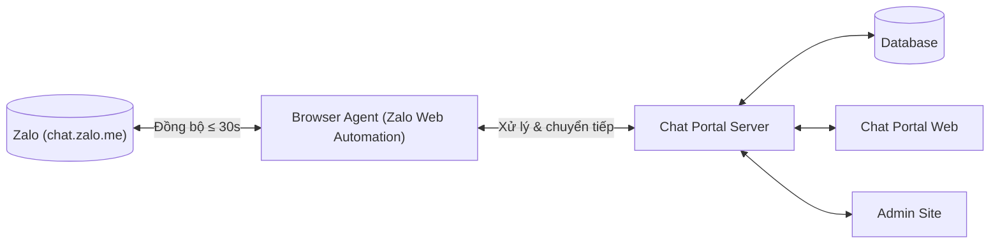
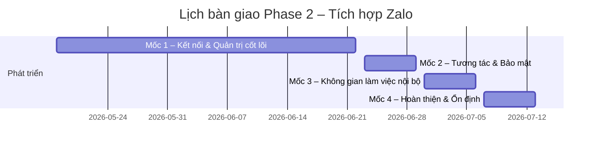

# QuocNam Web AI — Phase 2: Tích hợp Zalo Vendor
## Scope & Features cho Production Development

> **Tài liệu này dùng để phát triển bản production thật.** Demo hiện tại đã hiện thực hóa toàn bộ UI bằng mock data; production cần giữ nguyên scope và UX nhưng thay phần dữ liệu mock bằng dữ liệu thật.
>
> **Phiên bản:** 1.1.0 · **Cập nhật:** 2026-05-29

---

## Mục lục

1. [Tổng quan](#1-tổng-quan)
2. [Mục tiêu](#2-mục-tiêu)
3. [Kiến trúc tổng quan](#3-kiến-trúc-tổng-quan)
4. [Vai trò & Thuật ngữ](#4-vai-trò--thuật-ngữ)
5. [Danh sách tính năng](#5-danh-sách-tính-năng)
   - [A. Kết nối & Đồng bộ Zalo](#a-kết-nối--đồng-bộ-zalo-1-4-27)
   - [B. Nhắn tin & Tương tác](#b-nhắn-tin--tương-tác-5-11-25-extra-mention)
   - [C. Quản lý hội thoại](#c-quản-lý-hội-thoại-12-14-26-28-31)
   - [D. Phân quyền & Multi-account](#d-phân-quyền--multi-account-15-17-extras)
   - [E. Công việc nội bộ](#e-công-việc-nội-bộ-18-19)
   - [F. Admin Site](#f-admin-site-20-24-29-30)
   - [G. Khác (Portal-wide)](#g-khác-portal-wide)
6. [Quy tắc hiển thị tên người gửi (cross-cutting)](#6-quy-tắc-hiển-thị-tên-người-gửi-cross-cutting)
7. [Yêu cầu phi chức năng](#7-yêu-cầu-phi-chức-năng)
8. [Out of Scope](#8-out-of-scope)
9. [Lịch bàn giao & Tiêu chí nghiệm thu](#9-lịch-bàn-giao--tiêu-chí-nghiệm-thu)

---

## 1. Tổng quan

### 1.1 Bối cảnh nghiệp vụ

Trong vận hành thực tế, một số nhân viên được chỉ định làm đầu mối liên hệ với nhà cung cấp (NCC/vendor) qua các nhóm chat Zalo cá nhân. Cấu trúc nhóm chat thường bao gồm: NCC, tài khoản Zalo đại diện của công ty và tài khoản Zalo admin.

Yêu cầu đặt ra:

- **Nội bộ:** nhiều nhân viên có thể cùng điều phối và phản hồi một NCC thông qua một (hoặc một vài) tài khoản Zalo đại diện duy nhất.
- **Phía NCC:** chỉ thấy danh tính của tài khoản Zalo đại diện — đảm bảo nhất quán và bảo mật nội bộ.

Phase 2 tích hợp tất cả các nhóm chat NCC vào Chat Portal, đồng bộ dữ liệu, phân quyền linh hoạt và kiểm soát nội dung tập trung.

### 1.2 Phạm vi tổng thể

- **31 tính năng** chia 6 nhóm (A → F bên dưới).
- Một số mở rộng đã được hiện thực trong demo, đánh dấu **[EXTRA]** — không có trong tài liệu nghiệp vụ gốc nhưng cần thiết để hệ thống hoạt động đúng kỳ vọng.
- **Nền tảng:** Web (trình duyệt desktop). Không hỗ trợ mobile.
- **Quy mô:** 5–10 người dùng nội bộ, số lượng tài khoản Zalo tích hợp không giới hạn.

---

## 2. Mục tiêu

| Mục tiêu | Mô tả |
|---|---|
| Đồng bộ tin nhắn | Toàn bộ tin nhắn và nhóm chat vendor từ Zalo cá nhân được kéo về Portal và lưu trong DB |
| Điều phối nhân viên | Phân quyền linh hoạt: nhân viên nào được đại diện tài khoản Zalo nào, vào nhóm chat nào |
| Kiểm soát nội dung | Watermark hình ảnh, phân quyền tải tập tin, admin xem lại tin nhắn đã thu hồi |
| Workspace nội bộ | Giao việc, ghi chú, đánh dấu, forward — không hiển thị trên Zalo |

---

## 3. Kiến trúc tổng quan



- **Browser Agent:** chạy nền, đăng nhập `chat.zalo.me` bằng QR. Đồng bộ hai chiều với Portal.
- **Chat Portal Web:** giao diện nhân viên + admin nội bộ.
- **Admin Site:** giao diện quản trị tài khoản Zalo, nhóm NCC, quyền tải, thẻ phân loại, yêu cầu xem SĐT.

---

## 4. Vai trò & Thuật ngữ

| Vai trò | Mô tả |
|---|---|
| **Admin** | Quản trị hệ thống. Toàn quyền truy cập tất cả nhóm NCC. Xem được tin nhắn đã thu hồi, số điện thoại bị ẩn. |
| **Staff** | Nhân viên nội bộ. Chỉ thấy các nhóm NCC được admin gán. Có thể đại diện một hoặc nhiều tài khoản Zalo. |
| **Vendor** | Nhà cung cấp (NCC). Chỉ tương tác qua Zalo, không truy cập Portal. |

| Thuật ngữ | Định nghĩa |
|---|---|
| **Vendor Group** | Một nhóm chat NCC trên Zalo được đồng bộ vào Portal. Mỗi vendor group ánh xạ 1-1 với một `zaloGroupId`. |
| **Zalo Account** | Một tài khoản Zalo cá nhân đã liên kết vào hệ thống (qua QR). Đóng vai trò "đại diện công ty" trong các nhóm NCC. |
| **Acting As** | Khi một staff gửi tin trong một vendor group, hệ thống xác định staff đó đang "đại diện cho" tài khoản Zalo nào. Tin nhắn sẽ hiển thị trên Zalo dưới danh tính tài khoản đó. |
| **Origin** | Nguồn của một tin nhắn: `ZALO` (đồng bộ lên Zalo, vendor thấy) hoặc `INTERNAL` (chỉ trong Portal, vendor không thấy). |
| **Internal Type** | Phân loại tin nhắn nội bộ: `TASK`, `NOTE`, `FORWARD`, `PHONE_REVEAL_REQUEST`, `PHONE_REVEAL_APPROVED`, `PHONE_REVEAL_DENIED`, `PHONE_REVEAL_REVOKED`. |
| **DM** (Direct Message) | Kênh chat **1-1 nội bộ trong Portal** giữa hai user (ví dụ staff ↔ admin). **Không** đồng bộ lên Zalo, vendor không thấy. Dùng chủ yếu cho luồng Forward to Admin (#11) — staff forward tin từ vendor group vào DM riêng với admin. |

---

## 5. Danh sách tính năng

### A. Kết nối & Đồng bộ Zalo (#1–4, #27)

| # | Tên | Mô tả |
|---|---|---|
| **#1** | Kết nối tài khoản Zalo cá nhân | Admin quét QR từ `chat.zalo.me` để liên kết một tài khoản Zalo vào hệ thống. Thao tác chỉ trên **Admin Site**. |
| **#2** | Đồng bộ nhóm chat vendor | Tự động kéo về danh sách nhóm chat hiện có của tài khoản Zalo đã kết nối. Một nhóm Zalo cùng `zaloGroupId` đang được sync từ ≥2 tài khoản đã liên kết sẽ **dedupe thành 1 vendor group** trong Portal (xem [D.4](#d4-extra-multi-account-cho-1-vendor-group)). |
| **#3** | Đồng bộ tin nhắn gần thực | Tin nhắn mới từ Zalo cập nhật lên Portal **≤ 30 giây** (thường vài giây). Áp dụng cho tin từ vendor và từ các thành viên Zalo khác trong nhóm. |
| **#4** | Đồng bộ lịch sử chat | Khi liên kết tài khoản hoặc khi admin chạy sync thủ công, hệ thống đồng bộ toàn bộ lịch sử tin nhắn cũ hiển thị được trên `chat.zalo.me`. |
| **#27** | Kết nối lại & thử lại kết nối | Tự động reconnect khi mạng/agent gián đoạn (không cần thao tác thủ công). Khi auto-retry thất bại: cả Staff và Admin có nút **"Thử lại kết nối"** trên Portal (không cần QR). Khi phiên Zalo thực sự hết hạn: hệ thống thông báo rõ và chỉ Admin được phép quét QR mới trên Admin Site. |

**Trạng thái kết nối:** mỗi tài khoản Zalo có một trong các trạng thái: `connected` / `unstable` / `disconnected` / `expired`. UI hiển thị badge tương ứng trên Admin Site và banner cảnh báo trên Portal khi `unstable` hoặc `disconnected`.

---

### B. Nhắn tin & Tương tác (#5–11, #25, [EXTRA] mention)

| # | Tên | Mô tả | Lên Zalo |
|---|---|---|:---:|
| **#5** | Gửi/nhận TXT | Nhân viên gửi tin từ Portal, hiển thị trên Zalo dưới danh tính tài khoản Zalo đại diện | ✅ |
| **#6** | Gửi/nhận IMG / FILE / VID | Hỗ trợ tất cả định dạng, **không giới hạn kích thước**. Video > 300MB: hiển thị **cảnh báo nội bộ** trong cửa sổ chat (tag/badge bên cạnh tin) để admin theo dõi. Thời gian đồng bộ video phụ thuộc kích thước, có thể lâu hơn 30s | ✅ |
| **#7** | Reply (quote) | Trích dẫn và trả lời một tin cụ thể. Quote hiển thị: tên người gửi gốc, snippet content, thumbnail/file-name nếu là media | ✅ |
| **#8** | Thả cảm xúc | Chỉ hỗ trợ 2 emoji: **❤️** và **👍**. Toggle (đã thả thì nhấn lại để bỏ). Đồng bộ hai chiều với Zalo | ✅ |
| **#9** | Thu hồi tin nhắn | Nhân viên hay vendor thu hồi tin đã gửi. Vendor/nhân viên thấy "Tin nhắn đã thu hồi". **Admin (vai trò) vẫn thấy nội dung gốc** kèm strikethrough + timestamp thu hồi. Staff không thấy nội dung gốc | ✅ |
| **#10** | Ghim tin nhắn | Pin một tin trong nhóm. Hiển thị thanh ghim phía trên message list (top N tin pinned). Đồng bộ thao tác ghim lên Zalo. Mỗi lần pin/unpin sinh system message `PIN_NOTIFICATION` trong timeline — xem [G.2](#g2-pinnotificationbubble) | ✅ |
| **#11** | Forward tin nhắn đến Admin | Staff chọn một tin → mở modal "Forward to Admin" → có thể kèm comment → tin được chuyển vào **DM giữa người forward và admin**. Vendor không thấy. Tin forward trong DM **clickable**: admin nhấn vào sẽ điều hướng về vendor group và cuộn (scroll-to) đúng tin gốc đã được forward. Xem [B.11](#b11-deep-dive-forward-to-admin) | ❌ |
| **#25** | Đánh dấu tin nhắn | Star/bookmark. Chỉ hiển thị nội bộ trong Portal cho người đánh dấu (per-user). Không đồng bộ lên Zalo | ❌ |
| **[EXTRA]** | @mention members trong vendor group | Gõ `@` trong input → hiện danh sách bao gồm **`@all`** + **toàn bộ thành viên thực tế của nhóm chat Zalo** (vendor + staff Portal đang sync nhóm này), **loại trừ chính tài khoản Zalo mà nhân viên đang đại diện (acting-as)** để tránh tự mention bản thân. Chọn → highlight trong tin. Áp dụng cho cả tin `ZALO` (đồng bộ lên Zalo cả 2 chiều — mention vendor lẫn mention staff đều sync) và `INTERNAL` (chỉ trong Portal). Xem [B.mention](#bmention-deep-dive-mention-members) | ✅ |

#### B.11 Deep dive: Forward to Admin

**Business flow:**
1. Staff (hoặc admin) hover/right-click một tin trong vendor group → chọn **"Forward đến Admin"**.
2. Modal mở: hiển thị preview tin gốc + textarea nhập comment kèm (optional).
3. Submit:
   - Tin gốc trong vendor group được đánh dấu `isForwardedToAdmin = true` (chỉ hiện badge "Đã chuyển Admin" cho người forward và admin, không cho vendor).
   - Một bản sao tin được tạo trong **DM giữa người forward và admin** (1-1 conversation), kèm bar metadata gồm: nguồn nhóm, người forward, comment đính kèm, và **reference tới tin gốc** (`sourceGroupId` + `sourceMessageId`).
4. Admin nhận notification trong DM. **Click vào tin được forward (hoặc bar metadata)** → navigate về vendor group tương ứng, **cuộn (scroll-to) đúng tin gốc** mà nhân viên đã forward, và **highlight tạm thời** (~2s) để dễ nhận diện. Nếu tin gốc đã bị thu hồi/xóa khỏi nhóm, admin vẫn có thể thấy tin nhắn đó như đã mô tả #9.
5. **DM admin tổng hợp:** Trong DM, các tin được forward hiển thị với một thanh tóm tắt (DmForwardedBar) ở trên đầu — admin có thể nhanh chóng filter/duyệt qua các tin forward gần đây. Mỗi mục trong DmForwardedBar cũng dùng cơ chế jump-to giống bước 4.

**Data shape gợi ý (DM forward message):**
```ts
{
  internalType: 'FORWARD'
  forwardRef: {
    sourceGroupId: string
    sourceMessageId: string
    forwardedBy: string         // internalUserId của người forward
    comment: string | null
  }
}
```

**Edge cases:**
- Forward một tin đã thu hồi: vẫn forward được, nhưng nội dung trong DM ghi nhận trạng thái thu hồi tại thời điểm forward.
- Forward một tin có media: thumbnail/file metadata copy sang DM; URL trỏ về resource gốc (không duplicate file).

#### B.mention Deep dive: @mention members

**Behavior:**

- **Mention trong tin `ZALO`:** đồng bộ lên Zalo cả 2 chiều — mention staff hay mention vendor đều giữ nguyên khi sync. Khi vendor mention staff từ Zalo → Portal nhận và highlight đúng staff. Khi staff mention vendor từ Portal → tin gửi lên Zalo giữ nguyên @tag.
- **Mention trong tin `INTERNAL`:** chỉ tồn tại trong Portal, không có vế Zalo.
- **Picker (nguồn dữ liệu):** gõ `@` trong input → dropdown hiện danh sách members **lấy từ nhóm chat Zalo thực tế** (snapshot member list mới nhất do Browser Agent đồng bộ về), bao gồm:
  - **`@all`** ở đầu danh sách (mention toàn bộ thành viên nhóm — đồng bộ thành mention all bên Zalo).
  - **Toàn bộ vendor members** trong nhóm Zalo (NCC, hiển thị Zalo display name + avatar).
  - **Toàn bộ staff/admin Portal** đang sync nhóm này (hiển thị tên + role badge).
  - **Loại trừ tài khoản Zalo mà người gõ đang đại diện (acting-as)** — staff không tự mention chính identity Zalo của mình. Nếu cùng staff đại diện cho nhiều Zalo accounts khác nhau, chỉ loại trừ account đang active cho nhóm hiện tại (xem [D.4](#d4-deep-dive-multi-account-per-group)).
- **Sort & search:** mặc định gần đây trước; có search box filter theo tên/Zalo name. `@all` luôn pin top khi không có search query.
- **Notification:** member được mention nhận notification trong Portal (kèm context group + snippet tin). `@all` thông báo cho toàn bộ thành viên nhóm.
- **Render:** mention chuyển thành chip có background nhẹ, link clickable mở profile/info member. `@all` hiển thị chip đặc biệt (màu khác) để dễ nhận diện.

**Data shape (suggested):**

Lưu mention dưới dạng tokens trong content hoặc array `mentions[]` riêng:
```ts
mentions: Array<{
  type: 'ALL' | 'STAFF' | 'VENDOR'
  targetId: string | null   // internalUserId hoặc zaloUserId; null khi type='ALL'
  startOffset: number       // vị trí trong content text
  length: number
}>
```
Production có thể chọn embedded markup (ví dụ `<@u_123>`) hoặc array — quan trọng là round-trip với Zalo phải không mất thông tin.

---

### C. Quản lý hội thoại (#12–14, #26, #28, #31)

| # | Tên | Mô tả |
|---|---|---|
| **#12** | Ghim hội thoại | Nhân viên ghim vendor group lên đầu sidebar danh sách hội thoại NCC. Per-user setting. |
| **#13** | Watermark hình ảnh | Tự động gắn watermark lên hình ảnh khi xem preview trong Portal. Watermark có thể bật/tắt theo nhóm (admin cấu hình). Nội dung watermark: tên tài khoản người xem + timestamp. Không sửa file gốc, render overlay client-side hoặc dynamic image. |
| **#14** | Phân quyền tải tập tin | Admin cấu hình quyền tải **theo từng nhóm chat × từng staff × từng loại file** (image / file / video). Khi quyền tắt: nút download bị disabled với tooltip lý do. **File video > 300MB:** vẫn hiển thị cảnh báo dung lượng trước khi tải (confirm dialog), không giới hạn kích thước. Xem [F.23](#23-cập-nhật-quyền-tải-xuống-theo-nhóm-chat) cho phía admin. |
| **#26** | Đặt tên hiển thị nhóm chat | Admin đặt lại tên hiển thị nhóm trong Portal (Admin Site hoặc Chat Portal). **Tên gốc trên Zalo giữ nguyên** — thay đổi này không đồng bộ lên Zalo. Lưu dưới dạng override `groupDisplayNames[groupId]`; khi override null → fallback về tên gốc Zalo. |
| **#28** | Ẩn/hiện số điện thoại theo nhóm NCC | Xem [C.28 deep dive](#c28-deep-dive-ẩnhiện-số-điện-thoại) |
| **#31** | Lọc hội thoại NCC theo thẻ phân loại | Trên **Chat Portal** sidebar tab NCC: nút "Phân loại" → popup hiện danh sách thẻ → chọn thẻ → filter danh sách hội thoại. Có link nhanh **"Quản lý thẻ phân loại"** trong popup mở modal quản lý thẻ (xem [F.30](#30-quản-lý-thẻ-phân-loại-nhóm-ncc)). Trên **Admin Site** trang Quản lý nhóm NCC: filter chips ở đầu trang hiển thị tên + màu thẻ, click để filter bảng. |

#### C.28 Deep dive: Ẩn/hiện số điện thoại

**Mục đích:** trong một số nhóm NCC, thông tin số điện thoại nhạy cảm cần được bảo vệ khỏi truy cập tự do của staff. Admin có thể bật chế độ ẩn theo từng nhóm; staff cần yêu cầu để xem.

**Business flow:**

1. **Admin bật chế độ ẩn cho nhóm:**
   - Vào Admin Site → trang **Quản lý nhóm NCC** → tìm nhóm → toggle **"Ẩn số điện thoại"** = ON.
   - State lưu: `phoneHidden[groupId] = true`.

2. **Hệ thống auto-mask trong cửa sổ chat:**
   - Khi staff (vai trò STAFF) xem tin nhắn trong nhóm có `phoneHidden = true`:
     - Hệ thống detect số điện thoại VN trong content (regex match mobile 09xx/08xx/07xx/05xx/03xx, hotline, fixed-line).
     - Mỗi số được render thành span riêng dạng `XX****` (giữ 2 chữ số đầu).
     - Cạnh số ẩn có icon mắt (👁) — click để gửi yêu cầu xem.
   - **Admin (vai trò ADMIN) luôn thấy số thật**, kèm label/badge nhỏ **"Đang ẩn với nhóm"** ngay cạnh số để biết.

3. **Staff yêu cầu xem số:**
   - Click icon mắt cạnh số ẩn → mở popup confirm/lý do (optional).
   - Submit → tạo một `PhoneRevealRequest`:
     ```
     { id, groupId, messageId, staffId, requestedAt, status: 'pending', reason?, phoneFingerprint }
     ```
   - Hệ thống tạo **system message internal-only** trong nhóm với `internalType = PHONE_REVEAL_REQUEST` ghi nhận yêu cầu (Vendor không thấy; chỉ admin và staff trong nhóm thấy).
   - Icon mắt hiển thị spinner "đang chờ duyệt".

4. **Admin duyệt yêu cầu (trên Admin Site):**
   - Trang **"Yêu cầu xem SĐT"** liệt kê tất cả request (tabs: all / pending / approved / denied / revoked).
   - Mỗi row: nhóm, staff, số (đã ẩn để admin xem qua đại diện), thời điểm yêu cầu, lý do.
   - Admin chọn **Duyệt** hoặc **Từ chối**.
     - **Duyệt:** status = `approved`; staff thấy số thật của số đó với **highlight cam** trong tin nhắn liên quan. System message `PHONE_REVEAL_APPROVED` được tạo.
     - **Từ chối:** status = `denied`; số vẫn ẩn. System message `PHONE_REVEAL_DENIED`.
   - Admin có thể **thu hồi** quyền đã cấp sau đó: status = `revoked`; số bị ẩn lại; system message `PHONE_REVEAL_REVOKED`.

5. **Phạm vi của approved (group-wide):**
   - Khi admin duyệt 1 yêu cầu xem số `X` trong group `G` → **toàn bộ staff thuộc group `G`** đều thấy số `X` thật (mọi xuất hiện của số đó trong nhóm) từ thời điểm approve.
   - Tức scope key là `(groupId, phoneFingerprint)`, **không** phải `(groupId, staffId, phoneFingerprint)`.
   - Staff B chưa từng request số `X` nhưng staff A đã được approve trước đó → staff B vẫn thấy số `X` thật khi mở các tin chứa nó.
   - Tương tự, **revoke** cũng có hiệu lực group-wide: admin thu hồi 1 lần → mọi staff trong nhóm đều thấy số đó bị ẩn trở lại.
   - Khi staff mới được thêm vào nhóm: tự động thừa hưởng tất cả các số đã được approve trong nhóm (status `approved`).
   - Khi staff bị remove khỏi nhóm: chỉ ảnh hưởng staff đó (mất quyền truy cập nhóm); các số đã approve cho nhóm vẫn còn hiệu lực cho staff khác.

**Audit trail:**
- Mỗi thao tác duyệt/từ chối/thu hồi đều tạo system message với metadata: ai, khi nào, lý do. Phục vụ truy vết sau này.
- System messages thuộc loại `PHONE_REVEAL_*` hiển thị trong message list của nhóm với style đặc biệt (bar nhỏ màu xám/cam, icon khóa).

**Edge cases:**
- Số xuất hiện trong attachment (ví dụ ảnh chứa số): không thể auto-mask, chỉ áp dụng cho text content.
- Số xuất hiện trong reply quote: cũng được mask theo state hiện tại của nhóm.
- Staff bị remove khỏi nhóm sau khi đã approved: revoke tự động.

---

### D. Phân quyền & Multi-account (#15–17, [EXTRAS])

#### D.1 #15 — Phân quyền tài khoản Zalo

Admin gán **danh sách staff** cho **mỗi tài khoản Zalo đã liên kết** — staff trong danh sách đó được phép "đại diện" tài khoản này khi gửi tin trong vendor group.

- Một staff có thể được gán nhiều tài khoản Zalo.
- Một tài khoản Zalo có thể được gán cho nhiều staff (use case: nhiều nhân viên cùng dùng chung 1 account đại diện).
- Cấu hình tại: Admin Site → Nhà cung cấp → tab "Liên kết tài khoản" → mỗi tài khoản có dropdown chọn staff.

#### D.2 #16 — Phân quyền nhóm chat

Admin gán **danh sách staff** cho **mỗi vendor group** — staff trong danh sách được quyền truy cập group đó.

- Cấu hình tại: Admin Site → **Quản lý nhóm NCC** → mỗi row có dropdown thêm/xóa staff.
- Staff không có quyền truy cập group → group không hiện trong sidebar NCC của staff đó.

#### D.3 #17 — Cấu trúc vai trò trong nhóm

Chỉ 3 vai trò: **Admin** (quản trị nội bộ), **Staff** (nhân viên nội bộ), **Vendor** (NCC). Không có Leader/Trưởng phòng trong context vendor group.

#### D.4 [EXTRA] Multi-account cho 1 vendor group

> **Tình huống:** một nhóm chat Zalo có thể chứa **nhiều** tài khoản Zalo cá nhân đã liên kết với hệ thống (ví dụ: nhóm "Vận Chuyển Phương Nam" có cả tài khoản `za_001 — Quốc Nam Vận Hành` và `za_002 — Quốc Nam Kho Hàng`).

**Mô hình dữ liệu:**

```
VendorGroup.zaloAccountIds: string[]     // không còn là single account
```

Một vendor group có ≥1 tài khoản Zalo đang sync nó. Khi nhiều tài khoản đã liên kết cùng có quyền vào một nhóm Zalo (cùng `zaloGroupId`), hệ thống dedupe thành **một** vendor group duy nhất với `zaloAccountIds` là union.

**Các quy tắc xử lý:**

##### (a) Khi staff gửi tin trong group có ≥2 accounts

Hệ thống cần resolve **một** tài khoản đại diện duy nhất cho mỗi tin gửi. Quy trình resolve, theo thứ tự ưu tiên:

1. **Per-group override:** nếu admin đã set `groupStaffAccountOverride[groupId][staffId]` cho staff này trong group này → dùng account đó.
2. **Global account assignment:** lấy account đầu tiên trong `zaloAccountIds` của group mà staff này có trong `zaloAccountAssignments[accountId]`.
3. **Fallback:** account đầu tiên trong `zaloAccountIds`.

Nếu staff không thuộc bất kỳ assignment nào của các accounts trong group → **read-only** (input bị disabled, tooltip "Bạn không được phép gửi tin trong nhóm này").

##### (b) Staff-Account Override per Group (mới)

> Admin có thể chỉ định "trong group X, staff Y luôn đại diện account Z" — override global assignment.

- UI: Admin Site → Quản lý nhóm NCC → mở row của group → trong expanded view, cột **"Đại diện qua"** hiển thị mỗi staff thuộc group với dropdown chọn account.
  - Nếu staff chỉ eligible 1 account: hiển thị badge tĩnh (no override possible).
  - Nếu eligible ≥2 accounts: dropdown với các tùy chọn. Option đầu là "Mặc định (theo assignment global)"; các option còn lại là từng account cụ thể.
- State: `groupStaffAccountOverride[groupId][staffId] = accountId`. Khi `null` → fallback resolver.

##### (c) Khi remove account khỏi group

- Admin có thể remove account khỏi group qua dropdown "Tài khoản Zalo" của row trong NhomNCC table.
- **Constraint:** không cho phép remove account cuối cùng (group phải có ≥1 account).
- Khi remove: tất cả `groupStaffAccountOverride` trỏ vào account này được clear → fallback resolver tự dùng account khác.

##### (d) UI cho staff: ZaloIdentityBar [EXTRA]

Trong cửa sổ chat của vendor group, **đầu khung chat luôn hiển thị banner xanh**:
```
🟢 Đang đại diện tài khoản: Quốc Nam - Vận Hành
```
- Banner cập nhật khi: vào group khác, hoặc admin thay đổi override/assignment.
- Banner cần thiết để staff luôn biết tin mình gửi sẽ xuất hiện dưới danh tính nào trên Zalo — đặc biệt khi có override.

##### (e) Đồng bộ tin nhắn từ Zalo (dedupe)

- Khi 2 accounts cùng sync một group, tin nhắn cũ có thể bị fetch 2 lần.
- **Strategy:** dedupe by `zaloMessageId` ở backend trước khi persist. UI luôn nhận 1 record duy nhất.

##### (f) Hiển thị accounts trong Admin Site

- Trang **Quản lý nhóm NCC** có cột **"Tài khoản"** hiển thị badges các account đang sync:
  - 1–2 accounts: hiện đầy đủ.
  - ≥3 accounts: hiện 2 đầu + chip `+N` có tooltip liệt kê còn lại.

---

### E. Công việc nội bộ (#18–19)

> Tin nhắn TASK/NOTE và task management **không hiển thị trên Zalo** — chỉ tồn tại trong workspace nội bộ của Portal.

#### #18 Giao việc nội bộ trong nhóm

- Bất kỳ Staff hoặc Admin nào trong vendor group đều có thể **tạo task** và **giao cho** một thành viên nội bộ khác trong group.
- Task có thể được tạo từ:
  - Nút "Giao việc" trên header chat.
  - Hoặc từ một tin nhắn (right-click → "Tạo task từ tin này") — task sẽ liên kết `sourceMessageId`.
- Task fields:
  - `title` (required), `description`, `assignToId`, `dueDate` (optional), `checklist[]`, `status` (`todo` / `doing` / `finished`).
- Khi task được tạo: một **internal message** loại `TASK` xuất hiện trong nhóm với link tới task. Toàn bộ thành viên Portal trong nhóm đều thấy. Vendor không thấy.

#### #19 Nhật ký công việc

- Mỗi task có thread **logs** — comment dạng timeline.
- Bất kỳ thành viên nội bộ trong nhóm có thể comment vào log của task.
- Log fields: `senderId`, `senderName`, `content`, `sentAt`.
- Status changes của task (todo → doing → finished) cũng tự sinh entry trong log.
- UI: VendorTaskLogSheet — side drawer mở từ task card, hiển thị log như timeline + input để comment.

**Task banner:** trong vendor group có task pending (todo + doing), header chat hiển thị banner đếm số task pending + link mở task list.

---

### F. Admin Site (#20–24, #29–30)

Menu sidebar Admin Site bổ sung group **"Quản Lý NCC"** chứa 3 mục:
- **Nhà cung cấp** (gồm 3 tab: Liên kết tài khoản · Đồng bộ dữ liệu · Theo dõi file lớn)
- **Quản lý nhóm NCC** (page riêng)
- **Yêu cầu xem SĐT** (page riêng)

#### #20 Liên kết tài khoản Zalo *(Nhà cung cấp → tab 1)*

- Admin quét QR từ `chat.zalo.me` để thêm tài khoản Zalo cá nhân.
- Với mỗi tài khoản đã liên kết, hiển thị:
  - Avatar + display name + phone (nếu có) + thời điểm liên kết.
  - Trạng thái: connected / unstable / disconnected / expired.
  - Dropdown chọn danh sách staff được phép đại diện (#15).
  - Nút **Ngắt kết nối** (confirm dialog).

#### #21 Đồng bộ dữ liệu *(Nhà cung cấp → tab 2)*

- Admin kích hoạt sync thủ công: chọn account → nhấn "Đồng bộ ngay" → progress bar.
- Sau khi hoàn tất, hiển thị **báo cáo tóm tắt**:
  - Tổng số tin nhắn đã sync.
  - Số hình ảnh, tài liệu, video.
  - Tổng dung lượng ước tính.
  - **Số file video > 300MB** (link tới tab Theo dõi file lớn).
- Lịch sử sync hiển thị bên dưới (mỗi lần sync 1 row).

#### #22 Quản lý nhóm NCC *(page riêng)*

Bảng danh sách tất cả vendor groups đã đồng bộ. Mỗi row:

| Cột | Nội dung |
|---|---|
| Tên nhóm | Tên hiển thị (đã rename nếu có) + tên gốc trong tooltip |
| Thành viên | Số lượng + dropdown thêm/xóa staff (#16) |
| Tài khoản | Badges các account đang sync (xem [D.4(f)](#f-hiển-thị-accounts-trong-admin-site)) + dropdown checkbox để thêm/xóa account |
| Thẻ phân loại | Chip thẻ hiện tại (single-select) + click để mở picker |
| Ẩn SĐT | Toggle (#28) |
| Filter chips theo thẻ (header trên bảng) | Click chip để filter (#31) |

**Expanded row:** click row → mở phần mở rộng hiển thị:
- Danh sách staff trong nhóm + cột "Đại diện qua" (per-staff override — xem [D.4(b)](#b-staff-account-override-per-group-mới)).
- Toggle "Ẩn số điện thoại" với explanation.
- Nút "Đổi tên hiển thị" (#26).

#### #23 Cập nhật quyền tải xuống theo nhóm chat

- Trong form **"Chỉnh sửa quyền tải xuống"** của một staff (truy cập từ trang quản lý user):
  - Khi toggle "Quyền tải xuống" = ON → hiển thị thêm bảng các vendor groups staff đó đang assign.
  - Mỗi row có 3 toggle: Hình ảnh / Tài liệu / Video.
- Lưu dưới dạng: `downloadPermissions[staffId][groupId] = { canDownloadImages, canDownloadFiles, canDownloadVideos }`.

#### #24 Theo dõi file lớn *(Nhà cung cấp → tab 3 hoặc trong Quản lý nhóm NCC)*

- Bảng liệt kê tất cả file video > 300MB đã được đồng bộ.
- Cột: tên file, dung lượng, nhóm chat, người gửi, thời điểm nhận.
- Sort default: mới nhất trước.
- Filter theo nhóm / khoảng thời gian.

#### #29 Duyệt yêu cầu xem số điện thoại *(Yêu cầu xem SĐT page)*

Xem flow chi tiết tại [C.28](#c28-deep-dive-ẩnhiện-số-điện-thoại).

- Tabs: **Tất cả** / **Chờ duyệt** / **Đã duyệt** / **Đã từ chối** / **Đã thu hồi**.
- Mỗi row: nhóm, staff yêu cầu, số ẩn (hiện full nhưng được masked giống staff thấy), thời điểm, lý do (nếu có), trạng thái.
- Actions theo trạng thái: Duyệt / Từ chối (pending), Thu hồi (approved).
- Mỗi thao tác tạo system message tương ứng trong nhóm.

#### #30 Quản lý thẻ phân loại nhóm NCC

> Truy cập: Trang **Quản lý nhóm NCC** → nút **"Quản lý thẻ phân loại"** ở header. Cũng accessible từ Chat Portal (link nhanh trong filter popup, xem [#31](#c-quản-lý-hội-thoại-12-14-26-28-31)).

**Modal TagManagementModal:**

- Liệt kê tất cả thẻ với:
  - Tên thẻ (editable inline).
  - Màu sắc (8 màu fixed palette — picker).
  - Drag handle để sắp xếp thứ tự.
  - Nút xóa.
- Nút "+ Thêm thẻ" để tạo mới.

**5 thẻ mặc định** (system seeded, có thể sửa/xóa):
- Nhà sản xuất
- Nhà phân phối
- Nhà nhập khẩu
- Dịch vụ
- Thiết yếu

**Constraints:**
- Mỗi nhóm gắn được **tối đa 1 thẻ tại một thời điểm** (single-select).
- Click lại thẻ đang gắn → bỏ thẻ.
- Khi xóa một thẻ: hệ thống **tự động gỡ thẻ đó khỏi tất cả nhóm** đang gắn (không cần confirm per-group, nhưng modal xóa thẻ phải warning rõ số nhóm bị ảnh hưởng).
- Thứ tự thẻ ảnh hưởng đến thứ tự hiển thị trong picker + filter chips.

**Data:**
```
Tag { id, name, color, order, isDefault, createdAt }
groupTagIds[groupId] = tagId | null
```

---

### G. Khác (Portal-wide)

#### G.1 Floating Admin Button (demo-only — bỏ trong production)

Demo có nút ⚙️ floating bottom-right trên Portal để mở Admin Site nhanh. **Production:** thay bằng menu user/avatar dropdown thông thường (Admin click avatar → "Vào Admin Site").

#### G.2 PinNotificationBubble (áp dụng cả nhóm thường lẫn vendor group)

Khi một tin nhắn được **pin** (hoặc **unpin**), hệ thống tự động insert một **system message** `PIN_NOTIFICATION` vào timeline để thông báo cho mọi thành viên.

**Áp dụng:**
- Nhóm chat nội bộ thường (department, work-type group).
- Vendor group (#10) — system message sync lên Zalo cùng với thao tác pin để vendor cũng thấy thông báo "X đã ghim một tin nhắn" trong nhóm chat Zalo.

**Bubble fields:**
- `pinnedMessageId` (link nhảy về tin gốc).
- `pinnedBy` (tên người pin) — trong vendor group dùng cùng quy tắc hiển thị tên ở [Section 6](#6-quy-tắc-hiển-thị-tên-người-gửi-cross-cutting): nếu staff pin trong vendor group thì hiển thị `ZaloAccount.displayName (StaffName)` cho nội bộ, `ZaloAccount.displayName` cho vendor.
- `pinnedAt`.
- `messageSnippet` (preview ngắn của tin được pin).
- `action`: `'PIN'` | `'UNPIN'`.

**UX:**
- Click bubble → scroll-to message gốc + highlight tạm vài giây.
- Style: full-width tinted bar màu nhạt (khác bubble tin thường), icon ghim ở đầu, font nhỏ hơn tin nhắn thông thường.

---

## 6. Quy tắc hiển thị tên người gửi (cross-cutting)

> **Quan trọng:** vì vendor group có 3 nguồn tin (vendor / staff acting as Zalo account / internal system), quy tắc hiển thị tên người gửi phải nhất quán để:
> - **Phía NCC (Zalo):** chỉ thấy một danh tính nhất quán cho cùng một tài khoản đại diện (bảo mật nội bộ).
> - **Phía nội bộ (Portal):** luôn biết được tin do AI thực sự gửi (audit, quy trách nhiệm).

### Ma trận hiển thị

| Loại tin | Người gửi thực | Hiển thị cho Vendor (trên Zalo) | Hiển thị cho Staff / Admin (trên Portal) |
|---|---|---|---|
| `ZALO` TXT/IMG/FILE/VID | Vendor (NCC) | (chính họ) | `vendor.zaloDisplayName` |
| `ZALO` TXT/IMG/FILE/VID | Staff đại diện account `Z` | `Z.displayName` | `Z.displayName (StaffName)` |
| `ZALO` TXT/IMG/FILE/VID | Admin đại diện account `Z` | `Z.displayName` | `Z.displayName (AdminName)` + role badge |
| `INTERNAL TASK` / `NOTE` / `FORWARD` | Staff | (không thấy) | `StaffName` |
| `INTERNAL TASK` / `NOTE` / `FORWARD` | Admin | (không thấy) | `AdminName` + role badge |
| `INTERNAL PHONE_REVEAL_*` | System (đại diện cho user gây ra action) | (không thấy) | Format: "Hệ thống · [Action]: requested by StaffName" hoặc "approved by AdminName" |

### Quy tắc cụ thể

#### 6.1 Format `Z.displayName (StaffName)` cho tin ZALO từ staff

- Chỉ hiển thị **trên Portal**. Trên Zalo, vendor và các thành viên khác trong nhóm Zalo chỉ thấy `Z.displayName`.
- Tên người dùng nội bộ luôn nằm trong dấu ngoặc đơn `(...)`, font nhỏ hơn hoặc opacity thấp hơn so với tên account.
- Khi cùng một tin xuất hiện trong reply quote ở tin khác → áp dụng cùng quy tắc.
- Khi tin cũ được forward đến admin → format giữ nguyên trong DM admin.

#### 6.2 Phân biệt tin đã thu hồi

- Tin `isRecalled = true`:
  - **Staff thấy:** placeholder "Tin nhắn đã thu hồi" — không có content, không có format author detail.
  - **Admin thấy:** vẫn theo quy tắc 6.1, nhưng content có strikethrough + label "(đã thu hồi lúc HH:mm)".

#### 6.3 Tin nhắn nội bộ — không có account context

- Internal messages không có `actingAsZaloAccountId` → tên hiển thị thuần `StaffName` (không trong ngoặc).
- Style khác biệt: bar màu (amber cho TASK, green cho FORWARD, gray cho NOTE) full-width, icon đặc trưng (lock cho INTERNAL, arrow cho FORWARD).

#### 6.4 System messages (PHONE_REVEAL_*)

- Không có author thật — hiển thị "Hệ thống" với icon system.
- Trong body có nêu rõ chủ thể action: "Huyền đã yêu cầu xem số điện thoại trong tin nhắn từ Phương Nam" / "Admin đã duyệt yêu cầu của Huyền lúc 10:23".
- Vendor không thấy (origin = INTERNAL).

#### 6.5 Edge case: staff đã rời công ty

- Tin cũ hiển thị `Z.displayName (StaffName — đã rời)` — label kèm trạng thái.
- Tin mới: staff đó không còn đại diện cho bất kỳ account nào.

---

## 7. Yêu cầu phi chức năng

| Yêu cầu | Thông số |
|---|---|
| Tần suất đồng bộ tin nhắn mới | ≤ 30 giây (thường < 10s) |
| Tần suất đồng bộ video | Phụ thuộc kích thước; > 300MB có thể lâu hơn 30s — luôn kèm cảnh báo nội bộ |
| Nền tảng | Web (desktop browser): Chrome, Edge, Firefox bản mới |
| Bảo mật hình ảnh | Watermark dynamic khi preview |
| Bảo mật tin đã thu hồi | Admin xem lại được nội dung gốc; Staff không |
| Phân quyền | Enforce ở backend (không trust client) cho: truy cập group, tải file, xem SĐT, mọi action Admin Site |
| Auth Zalo | QR từ `chat.zalo.me`, browser-agent session do hệ thống quản lý |
| Reconnect | Auto-retry transparent; manual retry button cho cả Staff & Admin; chỉ Admin được quét QR mới |
| Audit trail | Mọi action liên quan SĐT (request/approve/deny/revoke) lưu permanent system message |

---

## 8. Out of Scope

Các hạng mục **không thuộc phạm vi** Phase 2:

| Hạng mục | Ghi chú |
|---|---|
| Zalo Official Account (OA) | Chỉ tích hợp Zalo cá nhân |
| Ứng dụng Mobile | Chỉ Web desktop |
| Tích hợp CRM / ERP / hệ thống bên thứ 3 | Không có |
| Cung cấp API public cho bên thứ 3 | Không mở API ra ngoài |
| Sync nhóm chat KHÔNG phải NCC từ Zalo cá nhân | Chỉ sync các nhóm được đánh dấu/cấu hình là vendor group |
| Voice / call audio qua Zalo | Không hỗ trợ |
| Sticker, GIF, location share | Không nằm trong scope đảm bảo (best-effort nếu Zalo API trả về) |

---

## 9. Lịch bàn giao & Tiêu chí nghiệm thu

**Thời gian thực hiện:** 18/05/2026 – 16/07/2026 (8 tuần)



| Mốc | Giai đoạn | Thời gian thực hiện | Ngày bàn giao |
|---|---|---|---|
| **Mốc 1** | Kết nối & Quản trị cốt lõi | 18/05 – 22/06/2026 (5 tuần) | **22/06/2026** |
| **Mốc 2** | Tương tác & Bảo mật | 23/06 – 29/06/2026 (1 tuần) | **29/06/2026** |
| **Mốc 3** | Không gian làm việc nội bộ | 30/06 – 06/07/2026 (1 tuần) | **06/07/2026** |
| **Mốc 4** | Hoàn thiện & Ổn định | 07/07 – 13/07/2026 (1 tuần) | **13/07/2026** |

---

### Mốc 1 — 22/06/2026: Kết nối & Quản trị cốt lõi

**Tiêu chí nghiệm thu:** Bên B bàn giao và Bên A xác nhận hoàn thành toàn bộ các chức năng sau trên môi trường staging trước ngày nghiệm thu.

**Kết nối và đồng bộ Zalo**
- [**#1**] Kết nối tài khoản Zalo cá nhân thành công bằng mã QR
- [**#2**] Danh sách nhóm chat vendor từ Zalo được đồng bộ đầy đủ về Chat Portal
- [**#3**] Tin nhắn mới từ Zalo cập nhật lên Chat Portal trong vòng ≤ 30 giây
- [**#4**] Lịch sử tin nhắn cũ trước ngày kết nối được đồng bộ và hiển thị đúng theo từng nhóm chat

**Nhắn tin cơ bản**
- [**#5**] Gửi và nhận tin nhắn văn bản qua Chat Portal; tin hiển thị đúng danh tính tài khoản Zalo đại diện trên Zalo
- [**#6**] Gửi và nhận hình ảnh, tập tin và video hai chiều; file video vượt 300MB hiển thị cảnh báo nội bộ trong cửa sổ chat

**Phân quyền và vai trò**
- [**#15**] Nhiều nhân viên cùng đại diện một tài khoản Zalo; phân quyền hoạt động chính xác theo từng người
- [**#16**] Admin gán và thu hồi quyền truy cập nhóm chat theo từng nhân viên
- [**#17**] Hệ thống phân biệt đúng 3 vai trò: Admin, Staff, Vendor

**Admin Site — Quản trị Nhà cung cấp**
- [**#20**] Liên kết tài khoản Zalo: Admin quét mã QR thêm tài khoản, gán nhân viên đại diện và ngắt kết nối hoạt động đúng
- [**#21**] Đồng bộ dữ liệu thủ công: Admin kích hoạt đồng bộ; hệ thống kéo về đầy đủ danh sách nhóm chat và lịch sử tin nhắn cũ; báo cáo tóm tắt sau đồng bộ hiển thị đúng (số lượng, dung lượng, file video > 300MB)
- [**#22**] Quản lý nhóm NCC: Danh sách nhóm đã đồng bộ hiển thị đúng; thao tác thêm và xóa nhân viên khỏi nhóm hoạt động chính xác

**Kết nối và khôi phục**
- [**#27**] Hệ thống tự động kết nối lại khi mất kết nối; nút "Thử lại kết nối" hoạt động cho cả Staff và Admin trên Chat Portal; thông báo rõ lý do khi cần quét QR mới

---

### Mốc 2 — 29/06/2026: Tương tác & Bảo mật

**Tiêu chí nghiệm thu:** Bên B bàn giao và Bên A xác nhận hoàn thành toàn bộ các chức năng sau:

**Tương tác tin nhắn nâng cao**
- [**#7**] Reply tin nhắn: trích dẫn và phản hồi đúng luồng, đồng bộ lên Zalo
- [**#8**] Thả cảm xúc (❤️ Like, 👍 Tim) đồng bộ lên Zalo, hiển thị đúng trên Chat Portal
- [**#9**] Thu hồi tin nhắn: nhân viên thu hồi được; Admin xem lại được nội dung đã thu hồi
- [**#10**] Ghim tin nhắn trong nhóm và đồng bộ thao tác ghim lên Zalo

**Quản lý hội thoại và bảo mật nội dung**
- [**#12**] Ghim hội thoại: nhân viên ghim nhóm chat vendor lên đầu danh sách
- [**#13**] Watermark tự động được gắn lên hình ảnh khi xem ở chế độ preview trong hệ thống
- [**#14**] Phân quyền tải tập tin theo nhóm chat (hình ảnh, tài liệu, video); file video > 300MB hiển thị cảnh báo kèm dung lượng trước khi tải
- [**#26**] Đặt tên hiển thị nhóm chat: Admin đổi tên thành công trong Chat Portal và Admin Site; tên gốc trên Zalo không thay đổi

**Admin Site — Quyền tải xuống và theo dõi file lớn**
- [**#23**] Form "Chỉnh sửa quyền tải xuống": khi quyền tải xuống được Bật, hiển thị danh sách nhóm chat Zalo của nhân viên; Admin Bật/Tắt quyền tải xuống riêng cho từng nhóm
- [**#24**] Danh sách file video vượt 300MB hiển thị đúng (tên file, dung lượng, nhóm chat, thời điểm nhận); Admin theo dõi và quản lý được

---

### Mốc 3 — 06/07/2026: Không gian làm việc nội bộ

**Tiêu chí nghiệm thu:** Bên B bàn giao và Bên A xác nhận hoàn thành toàn bộ các chức năng sau:

- [**#11**] Forward tin nhắn đến Admin: nội dung chuyển tiếp chính xác, admin click tin được forward điều hướng về đúng tin gốc trong vendor group; không hiển thị trên Zalo
- [**#18**] Giao việc nội bộ trong nhóm chat: nhân viên và Admin tạo và giao việc cho bất kỳ thành viên nào trong nhóm, không hiển thị trên Zalo
- [**#19**] Nhật ký công việc: ghi chú gắn đúng với từng công việc, hỗ trợ theo dõi tiến độ nội bộ
- [**#25**] Đánh dấu tin nhắn: nhân viên đánh dấu và xem lại tin nhắn quan trọng; chỉ hiển thị nội bộ, không lên Zalo
- [**#28**] Ẩn số điện thoại theo nhóm NCC: Admin bật/tắt per-group; Staff thấy số bị ẩn và gửi yêu cầu xem; Admin duyệt/từ chối; audit trail system messages hoạt động đúng
- [**#29**] Trang duyệt yêu cầu xem SĐT trên Admin Site: tabs trạng thái, duyệt/từ chối/thu hồi hoạt động chính xác; system message được tạo cho từng thao tác
- [**#30**] Quản lý thẻ phân loại: Admin tạo, sửa, xóa, sắp xếp thẻ; gắn thẻ cho nhóm NCC (single-select); xóa thẻ tự động gỡ khỏi tất cả nhóm
- [**#31**] Lọc hội thoại NCC theo thẻ: nút Phân loại trên sidebar Chat Portal + filter chips trên Admin Site hoạt động đúng

---

### Mốc 4 — 13/07/2026: Hoàn thiện & Bàn giao chính thức

**Tiêu chí nghiệm thu:**

- Toàn bộ 31 tính năng từ Mốc 1 đến Mốc 3 hoạt động ổn định trên môi trường production
- Không còn lỗi nghiêm trọng (Critical) hoặc lỗi cao (High) chưa được xử lý
- Bàn giao đầy đủ: tài liệu hướng dẫn sử dụng dành cho nhân viên và Admin; thông tin thiết lập, cấu hình và truy cập hệ thống

---

